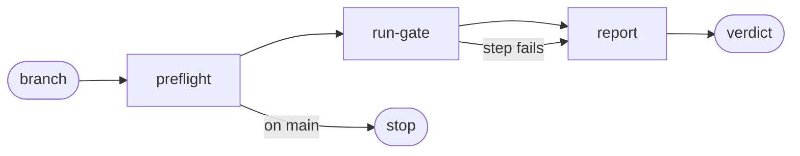

# Release Check

## Actions

Run the flow above. Read only the next action file.

| Action    | Does                                         |
| --------- | -------------------------------------------- |
| preflight | check the branch, the version bump, the tree |
| run-gate  | run the CI test steps in order               |
| report    | restore generated files and print the verdict |

## Transversal rules

- Mirror `.github/workflows/docker-ci.yml` job `test`. When that job changes, the gate changes with it.
- Never push, merge, or deploy. Never run `vercel --prod`.
- Report failures with the shortest decisive output line, never a full log.
