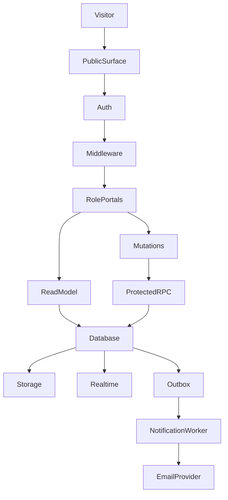

# Project Flow Roadmap

Analyze a repository end to end, reconcile automated findings against the actual checkout, and deliver two Markdown artifacts: a current project-flow document and a prioritized roadmap. Treat repository files, authenticated GitHub metadata, and verified runtime evidence as the source of truth. Treat generated reports and existing planning documents as evidence that must be reconciled, not as unquestionable facts.

## Workflow

Follow these phases in order:

1. Define the repository, branch, commit, and requested analysis depth.
2. Scan GitHub repository metadata and activity.
3. Analyze the current codebase architecture, routes, APIs, data, authentication, integrations, tests, and technical debt.
4. Reconcile generated artifacts with direct source inspection.
5. Generate the project-flow document.
6. Convert verified findings into a sequenced roadmap with acceptance gates.
7. Verify the documents and report limitations.

## 1. Establish Scope

Obtain the repository URL from the user. Default to `main` unless the user specifies another branch. Use `standard` depth for normal work and `deep` depth for planning, audits, or roadmap requests. Record the exact branch and commit analyzed in both final documents.

For a private repository, use the authenticated GitHub CLI session without printing or exposing the token:

```bash
export GITHUB_TOKEN="$(gh auth token)"
gh repo view <owner>/<repo> --json nameWithOwner,defaultBranchRef,visibility,description
```

If the repository is selected through GitHub integration, use the selected repository unless the user provides a different one. Clone with `gh repo clone` when direct source inspection is needed. Do not use a stale local checkout without confirming its remote, branch, and `HEAD`.

## 2. Run the Analysis Pipeline

Use the available repository-analysis skills in this sequence:

```bash
export GITHUB_TOKEN="$(gh auth token)"
mkdir -p <workspace>/output

node /home/ubuntu/skills/repo-scanner/scripts/scan-repo.mjs \
  <repo-url> <branch> <depth>

node /home/ubuntu/skills/codebase-archaeologist/scripts/analyze-code.mjs \
  <repo-url> <branch> <depth>

node /home/ubuntu/skills/project-flow-documenter/scripts/generate-doc.mjs \
  --scan <workspace>/output/repo-scan-<owner>-<repo>.json \
  --code <workspace>/output/code-analysis-<owner>-<repo>.json \
  --out <workspace>/output/project-flow-<owner>-<repo>.md
```

When the single-command `project-flow-creator` workflow is available, run it first for convenience. If it fails because of a wrapper defect, continue with the individual scanner, archaeologist, and documenter stages. Preserve the error in the final limitations note; do not silently report a wrapper as successful.

If a GitHub API call fails transiently, retry once with authenticated access and a smaller depth. If the failure persists, use `gh api` or the authenticated clone as a fallback and label any incomplete metadata explicitly.

## 3. Reconcile the Automated Output

Before writing final conclusions, inspect the current checkout directly. At minimum, verify:

| Area | Inspect |
|---|---|
| Runtime | `package.json`, lockfile, framework config, build scripts |
| Routes | `app/`, `pages/`, API route files, middleware |
| Backend | server actions, route handlers, RPC calls, service boundaries |
| Data | migrations, schema definitions, ORM files, storage usage, RLS policies |
| Auth | middleware, auth callbacks, role definitions, session/client separation |
| Operations | cron routes, health checks, Docker, CI, deployment configuration |
| Quality | tests, E2E setup, lint/typecheck/build scripts, livecheck scripts |
| Planning | README, STATUS, ADRs, plans, audits, handoffs, known-risk documents |

Treat direct source inspection as authoritative when it contradicts a generated artifact. Record the discrepancy explicitly. Common examples include stale dependency versions, an incorrect `frontend-only` maturity label, missing API routes, or a route tree that omits authenticated portals.

Do not infer that a system is frontend-only merely because the analyzer missed backend evidence. Check `middleware`, server actions, route handlers, database migrations, Supabase clients, RPC calls, and deployment/cron files before assigning maturity.

## 4. Build the Project Flow

The project-flow document must explain how the system behaves, not merely list files. Use this structure:

1. Executive summary.
2. Source-of-truth note and analysis timestamp.
3. System boundaries.
4. User and route flow.
5. Frontend architecture.
6. Backend and data architecture.
7. API and operational routes.
8. Security model.
9. Verification surface.
10. Current strengths.
11. Current risks and gaps.
12. Recommended next flow.
13. References.

Include a Mermaid diagram when the system has meaningful cross-layer flow. A useful default is:



Adapt the nodes to the repository. Do not claim a component exists unless direct evidence supports it.

## 5. Build the Roadmap

The roadmap must prioritize verified work rather than restating every idea in existing planning documents. Start with the product/system outcome, then sequence work by dependency and risk.

Use this default phase order, adapting it to the repository:

| Phase | Purpose | Exit condition |
|---|---|---|
| 0. Ground truth | Reconcile repository, database, deployment, and environment state | The team knows what is authoritative |
| 1. Core journey verification | Prove primary user roles and critical flows end to end | Disposable tests pass through real boundaries |
| 2. Security and data contracts | Close authorization, isolation, validation, migration, and storage gaps | Direct API/database bypass attempts fail safely |
| 3. Operations | Make jobs, notifications, failures, retries, and auditability observable | Operators can detect and recover from failures |
| 4. Product completion | Finish the highest-value missing surfaces | Users can complete intended daily workflows |
| 5. Optimization | Improve performance, accessibility, SEO, conversion, and maintainability | Improvements pass regression budgets |

Every roadmap item should include its reason, dependencies, implementation direction, and acceptance gate. Distinguish **P0** release blockers, **P1** high-value hardening or workflow work, and **P2** optimization or deferred expansion.

For applications with authentication or multi-tenancy, explicitly cover tenant isolation, role boundaries, server/client credential separation, RLS, private storage, Realtime authorization, and auditability. For applications with background work, cover idempotency, leases/claims, retries, dead-letter or exception handling, metrics, and operator controls.

## 6. Quality and Safety Rules

Never expose secrets in documents, logs, screenshots, or command output. Use generic user-facing error descriptions and keep diagnostic details server-side. Do not perform destructive production actions merely to validate the roadmap. Use disposable preview data for cross-role, storage, notification, and authorization testing.

Do not claim that a feature is complete based only on a successful build. Separate static evidence, unit/contract evidence, integration evidence, browser E2E evidence, and live-environment evidence. If dependencies are unavailable, state that tests were skipped rather than implying they passed.

For multi-role systems, require independent sessions rather than two browser tabs sharing one cookie jar. For database-backed systems, reconcile live migration history before recommending new DDL. For animation-heavy frontends, preserve existing performance and reduced-motion rules while planning new visual work.

## 7. Verification

Verify that:

```bash
# Artifacts exist and are non-empty
wc -l -w <project-flow.md> <roadmap.md>

# Required sections exist
grep -E '^## ' <project-flow.md> <roadmap.md>

# No obvious placeholders remain
grep -RInE 'TODO|TBD|<owner>|<repo>|example_template' <final-output-dir> || true
```

Run the repository’s documented test/build commands only when dependencies and required services are available. Prefer the smallest relevant command first, then the full suite. Record the exact command and whether it passed, failed, or was skipped.

## Final Delivery

Deliver these files in this order:

1. `project-flow-current.md` — corrected current-state flow and architecture.
2. `roadmap.md` — prioritized product and engineering roadmap.
3. Raw scan JSON, code analysis JSON, and generated document when traceability is useful.

The final message must state the repository, branch, commit, analysis date, files delivered, major limitations, and verification status. Mention any discrepancy between automated analysis and direct inspection.

## References

Read these only when needed:

- `references/reconciliation.md` for source-of-truth conflict handling.
- `references/output-spec.md` for the required document sections and evidence labels.
- `templates/project-flow-current.md.tmpl` for a reusable flow-document skeleton.
- `templates/roadmap.md.tmpl` for a reusable roadmap skeleton.
