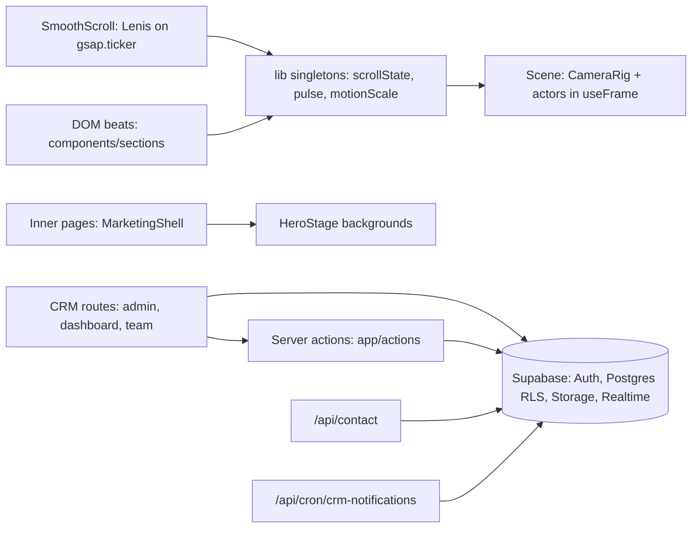
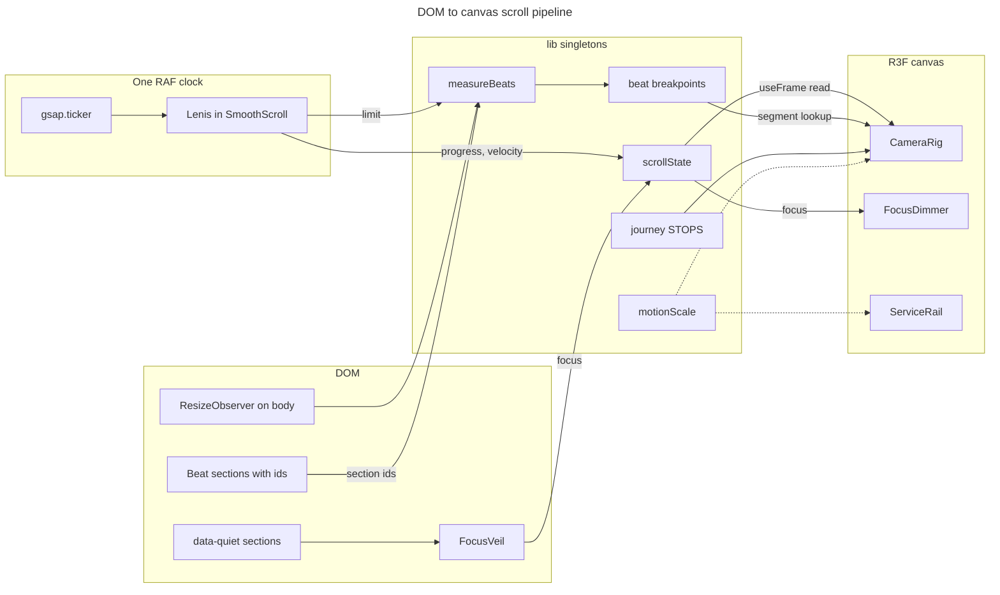

# Architecture

## Stack

- Next.js App Router with React, plain JSX. No TypeScript, no Tailwind: global CSS with design tokens.
- React Three Fiber and drei for the WebGL stage, GSAP with ScrollTrigger for choreography, Lenis for smooth scroll, SplitType for text effects.
- Supabase for Auth, Postgres, Storage, Realtime and RLS. It is the whole CRM backend.
- Sentry for errors; pnpm only.

## How it fits together

## Scroll pipeline

## Key decisions

- There is one RAF clock. Lenis is driven by `gsap.ticker` in `components/SmoothScroll.jsx`, and new per-frame work hooks into that ticker.
- Per-frame values live in module-level singletons (`lib/scrollState.js`, `lib/pulse.js`, `lib/motionScale.js`, `lib/motionFlight.mjs`), never in React state or context.
- DOM sections talk to the canvas only through those singletons or ScrollTrigger, never through props.
- Camera segments use measured DOM breakpoints (`lib/beatProgress.js`), not uniform splits.
- Adding or reordering a beat moves four things together: `STOPS`/`CLUSTERS` in `lib/journey.js`, `BEAT_IDS` in `lib/beatProgress.js`, the section's DOM `id`, and its actor in `components/Scene.jsx`.
- Marketing visuals are procedural (canvas, SVG, shaders). Do not add decorative binary media.
- `reactStrictMode: false` is intentional, so the WebGL context is never double-created.

## Gotchas

- `useFrame` must not allocate. Pre-allocate vectors outside the component.
- Damping is `1 - Math.exp(-dt * k)`, never a fixed lerp factor.
- Every animation `useEffect` returns a teardown.
- A `try/catch` around `redirect()` must re-throw errors whose `digest` starts with `NEXT_REDIRECT`.
