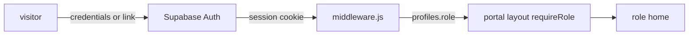

# Auth

## Authentication

- Supabase Auth using `@supabase/ssr` cookie sessions. Magic links and invites go through `/auth/verify`, and OAuth or PKCE codes through `/auth/callback`.
- Signup, resend and password-reset actions are rate-limited in `app/auth/actions.js`.

## Authorization

- Roles: `client` (home `/dashboard`), `project_manager` (`/team`), `admin` (`/admin`). They are defined in `lib/auth/roles.mjs`, and a role must match exactly.
- There are two gates. `middleware.js` redirects by role, and each portal layout calls `requireRole` from `lib/auth/require-role.js`. Data access is enforced again by RLS.
- The database assigns roles. `handle_new_user()` makes every account `client`. Choosing "employee" at signup only raises `requested_staff_access`, which an admin resolves with `admin_resolve_staff_request()`.
- `admin` is pinned to one address by `public.pinned_admin_email()` and a trigger. No UI may offer `admin` as an assignable role.
- `lib/crmFlag.js` (`NEXT_PUBLIC_CRM_ENABLED`) can hide every CRM and auth route and the login links.

## Sessions

- Sessions are refreshed through the server client's cookie handlers. An invited user whose password is still unset is sent to `/auth/reset-password?reason=invite`.
- Redirect targets are sanitised by `safeNextForPortal` / `safeAuthNext`.
