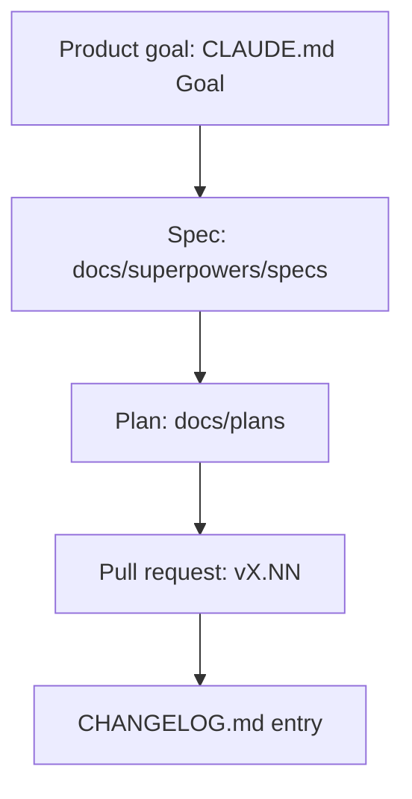

# Backlog

## Supports

| Support | Authority for | Role |
| --- | --- | --- |
| `CHANGELOG.md` | shipped work | Highest authority on whether something is done |
| `docs/plans/` | plans and their status table | Source of truth for planned and in-flight work (`docs/plans/README.md`) |
| `docs/superpowers/specs/` | brainstorm specs | Design specs before a plan is written |
| `docs/reports/` | audit and verification reports | Evidence behind a status |
| GitHub pull requests | in-flight changes | One PR per unit of work, titled `vX.NN — …` |

## Structure

## Representation

| Artifact | Support | Native representation |
| --- | --- | --- |
| spec | `docs/superpowers/specs/` | Markdown file per design |
| plan | `docs/plans/` | `YYYY-MM-DD-<slug>.md` or `feature-*` / `refactor-*-N.md`, listed in the README status table |
| unit of work | GitHub | Pull request |
| release | `CHANGELOG.md`, `VERSION` | `vX.NN` entry |

## Workflow

| Support | Native status | Meaning |
| --- | --- | --- |
| `docs/plans/README.md` | status column | Planned, in progress or done |
| GitHub | open PR | Awaiting review; merging it deploys |
| `CHANGELOG.md` | entry present | Shipped to production |

## Planning

- Priority: set by the owner per session. There is no priority field.
- Estimation: none.
- Iteration: none. Work ships per PR.
- Milestone: none. Each `vX.NN` is a production release.

## Relations

- Parent: a plan cites its spec.
- Dependency: a plan names prerequisite plans or migrations inline.
- Cross-support: authority order `CHANGELOG.md` > `docs/reports/` > `docs/plans/`. Re-verify every cited `file:line` before editing.
