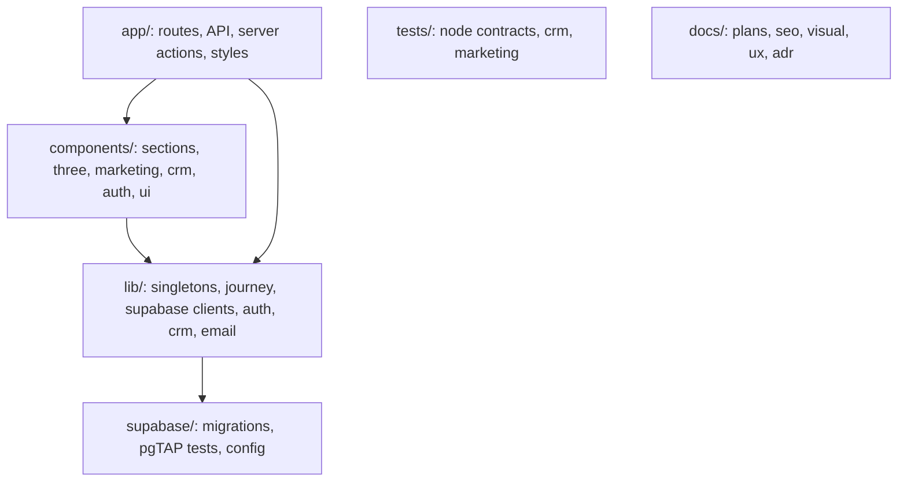

# Codebase Map

## Areas

- `app/`: App Router pages, `app/api/*` routes, `app/actions/*` server actions, `app/auth/*`, and CSS partials in `app/styles/` imported by `app/globals.css`.
- `components/`: the homepage beats (`sections/`), the R3F actors (`three/`), the inner-page shell (`marketing/`), the CRM UI (`crm/`), and procedural backgrounds (`ui/*-background.jsx`).
- `lib/`: per-frame singletons, camera journey data, Supabase clients (`lib/supabase/`), role helpers (`lib/auth/`), the project read model (`lib/crm/`), email (`lib/email/`), rate limiting, SEO origin (`lib/seo.mjs`).
- `supabase/`: sequential SQL migrations and pgTAP tests. This is the canonical schema.
- `scripts/`: livecheck, CRM test-user provisioning, preview authorization checks.
- `docs/`: plans, SEO strategy, visual and accessibility audits, UX specs, ADRs.

## Entry points

- `app/page.jsx`, which renders `components/Experience.jsx` over `components/Scene.jsx`.
- `middleware.js`: the CRM and auth route gate.
- `app/api/*/route.js`: the HTTP endpoints.
- `instrumentation.js` and `instrumentation-client.js`: Sentry.
