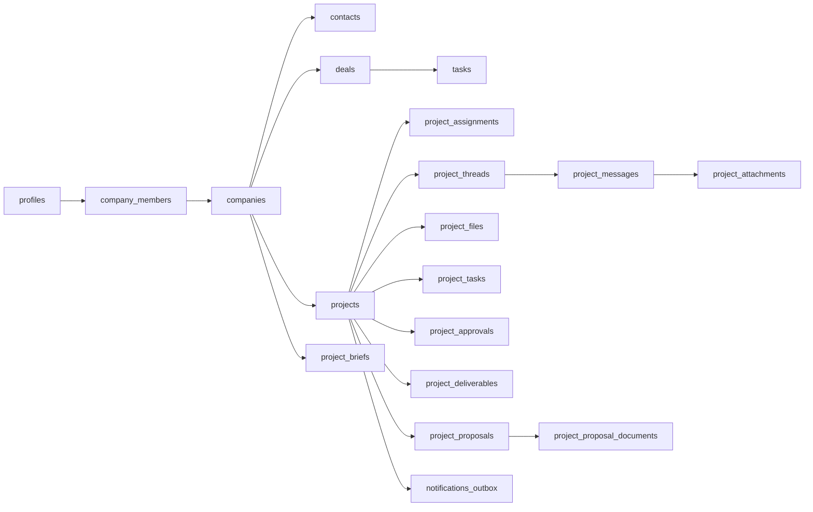

# Database

## Setup

- Supabase Postgres, accessed through `@supabase/supabase-js`. There is no ORM.
- The canonical schema is `supabase/migrations/`, numbered sequentially. Check the directory for the head.
- Local stack config is `supabase/config.toml`.

## Main entities

## Conventions

- Project delivery writes go through SECURITY DEFINER RPCs (`create_project`, `post_project_message`, `transition_project_status`, …). The RPCs are called from server actions, and reads go through `lib/crm/projects.js`.
- Companies, contacts, deals, tasks and users are queried directly from client components with the browser client, and RLS scopes them.
- RLS helpers live in the `private` schema with a pinned `search_path`. Execute is revoked from `public`/`anon` and granted to `authenticated`.
- Files live in the private `project-files` bucket, using reserve-then-finalize uploads.
- Proposals (0051) write only through RPCs that require `private.can_view_internal` (admin or the assigned project manager); a client reads only a posted proposal's current document.
- Never schema-qualify `coalesce` or `nullif`.
- A migration that adds an audit event type widens `audit_events_event_type_check` in the same file.
- Sender names showing "Unknown" point at `profiles` RLS: check `private.shares_project_with()`.
