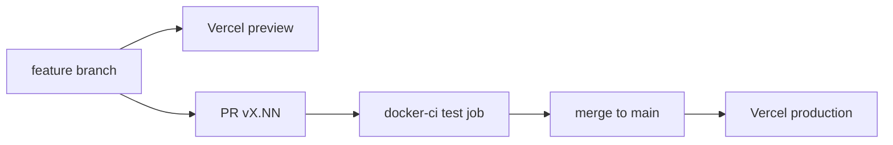

# Deployment

## Pipeline

- GitHub Actions `docker-ci.yml` runs the `test` job as the merge gate: `pnpm test`, `pnpm test:components`, `pnpm build`.
- Vercel's Git integration deploys. Every push gets a preview behind Vercel Authentication, and a merge into `main` deploys production.
- `seo-publish-blog.yml` publishes blog posts on its own workflow.

## Environments

- Production: `https://www.cdsportswearinc.com`. The apex redirects to `www`.
- Preview: a per-branch Vercel URL.
- Local: `pnpm dev`. The local build needs the CI placeholder env vars and `NODE_ENV=production`.

## Release

- Each merge is a release named `vX.NN`, recorded in `VERSION` and `CHANGELOG.md`.
- Roll back by reverting the PR on `main` or promoting a previous deployment in Vercel. Dashboard changes belong to the owner.
- Never deploy with `vercel --prod`.

## Monitoring

- Sentry covers server, edge and client, with session replay on error.
- `pnpm livecheck` smoke-checks a running deployment. `/api/health` serves liveness.
