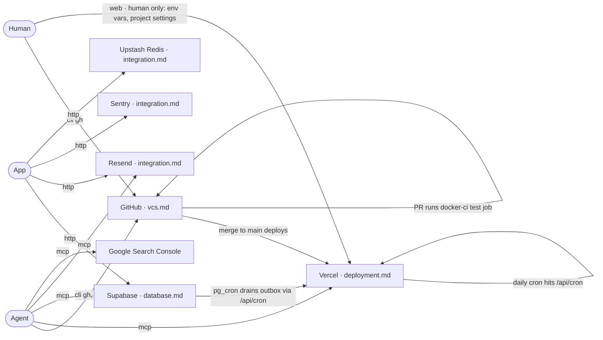

# Ecosystem

```mermaid
flowchart LR
  Human([Human])
  Agent([Agent])
  App([App])
  GitHub["GitHub · vcs.md"]
  Vercel["Vercel · deployment.md"]
  Supabase["Supabase · database.md"]
  Resend["Resend · integration.md"]
  Sentry["Sentry · integration.md"]
  Upstash["Upstash Redis · integration.md"]
  GSC["Google Search Console"]

  Agent -- "cli gh, mcp" --> GitHub
  Agent -- mcp --> Vercel
  Agent -- mcp --> Supabase
  Agent -- mcp --> Resend
  Agent -- mcp --> GSC
  Human -- "cli gh" --> GitHub
  Human -- "web · human only: env vars, project settings" --> Vercel
  App -- http --> Supabase
  App -- http --> Resend
  App -- http --> Sentry
  App -- http --> Upstash

  GitHub -- "merge to main deploys" --> Vercel
  GitHub -- "PR runs docker-ci test job" --> GitHub
  Supabase -- "pg_cron drains outbox via /api/cron" --> Vercel
  Vercel -- "daily cron hits /api/cron" --> Vercel
```
