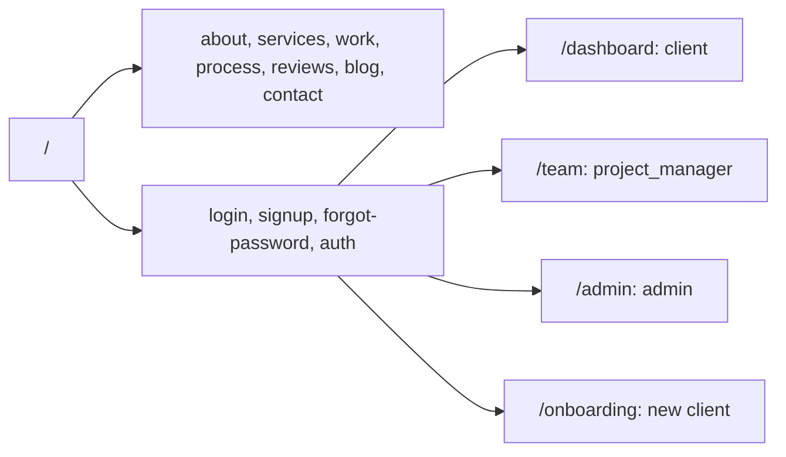

# Navigation

## Routing

- App Router with flat top-level folders and no route groups.
- Public marketing pages render through `components/marketing/MarketingShell.jsx`. The homepage is the only one that uses `Experience` + `Scene`.
- Protected CRM routes are gated by `middleware.js` and each portal layout's `requireRole`. Portal pages are `noindex`.
- `components/Nav.jsx`, `components/Menu.jsx` and `components/JourneyNav.jsx` handle homepage navigation, and `SubpageNav` handles inner pages.

## Structure

