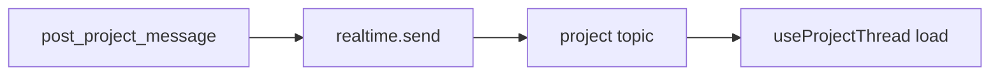

# Realtime

## Transport

- Supabase Realtime broadcast, sent from Postgres triggers through `realtime.send(...)`. It is not `postgres_changes`.
- The client subscribes in `components/crm/useProjectThread.js`.

## Channels

- `project:<projectId>:shared` carries message events every participant may see.
- `project:<projectId>:internal` carries staff-only events. Clients never subscribe to it.
- The events are `project_message_created` and `project_message_updated`. Payloads carry identifiers only.

## Conventions

- Realtime is an acceleration layer. Every event triggers a re-read through the visibility-filtered read model and never trusts the payload.
- Topic access is an RLS policy on `realtime.messages` using `private.can_subscribe_project_topic`.
- The triggers send private broadcasts. They reach only channels created with `{ config: { private: true } }` on a realtime client authed as the user.

