# 01 Data dictionary: tables, columns, keys, triggers

Final database schema after migrations 0001 to 0050 (0051 is out of scope here). Written against branch commit 1c17666 plus the in-flight working-tree fixes noted inline. Companion chapters: [01b-database-logic.md](01b-database-logic.md) covers functions, RLS policies, storage, realtime, pg_cron and Vault; [SCHEMA.md](SCHEMA.md) defines the node ids used below and in `data/db.json`. Nothing here was checked against a live database: it is derived from SQL text and application code.

## 1. How to read this chapter

| Item | Meaning |
| --- | --- |
| Section 2 | One section per table: purpose, a column table, keys and indexes, edge cases. 21 `public` tables, plus the two foreign tables the schema touches (`auth.users`, `storage.objects`). |
| Section 3 | Foreign keys with ON DELETE behaviour, delete blast radius per parent, and soft (non-FK) references. |
| Section 4 | The 16 triggers and exactly what each writes, blocks or broadcasts. |
| Section 5 | Status and enum columns, with where each value set is enforced. |
| Section 6 | ER diagram (keys only). Section 7 lists objects in other schemas and live-only objects. Section 8 lists what is unverified. |
| `written by` column | Node ids that insert, update or delete the column: SQL functions and triggers (`fn:`, `trigger:`), server actions and route handlers (`action:`, `route:`), browser pages and components that query the table directly (`page:`, `component:`), and scripts (`script:`). A SQL function is followed by `(from ...)`: the server actions or functions that call it. `none` means no writer exists in the repo. |
| `read by` column | Same id types, for selects. Whole-row readers (`select *`, row locks) are listed once above each table instead of in every cell. |
| Source cites | `0009:60` means line 60 of `supabase/migrations/0009_project_realtime_crm.sql`; the key-to-file legend is below. App code is cited as `path#symbol` inside node ids. |
| Edge | Each item labelled **Edge:** gives the trigger condition and the concrete consequence. |

Counts: 21 public tables with 218 columns, 2 foreign tables with 10 columns listed, 51 foreign keys, 16 triggers.

### 1.1 Apply order and drift caveats (read before trusting a replay)

| # | Fact | Evidence |
| --- | --- | --- |
| 1 | `0009b` drops the old `project_files` and `project_messages` with CASCADE. In plain file-name order `0009_project_realtime_crm.sql` sorts before `0009b_...` ("_" is 0x5F, "b" is 0x62), so a literal ordered apply would run `0009b` after `0009` created the new `project_messages`, drop that table, and `0015` would then fail at its `alter table public.project_messages`. | 0009b:15, 0009:90, 0015:221 |
| 2 | Live ran `0009b` first, as an ad hoc fix on 2026-08-01, so live has no legacy tables. `0009` was rewritten with an existence-safe guard: where the old tables exist it revokes access and renames them to `legacy_project_messages` and `legacy_project_files`; where they are gone it does nothing. | 0009b:3, 0009:13-41, STATUS.md:583-587 |
| 3 | A database built from the chain therefore keeps two empty `legacy_*` tables (their FKs: `deal_id` to deals CASCADE, `sender_id` and `uploaded_by` to auth.users NO ACTION) that live does not have. They are listed under `dropped.tables` in the manifest and not documented as live tables. | 0009:25, 0009:38, 0003:58 |
| 4 | The Supabase CLI is believed to skip migration files whose name is not `<digits>_name.sql`, which would skip `0009b` and `0014b` on `supabase start` and `supabase db reset`. **UNVERIFIED**: `supabase` is a dev dependency but `node_modules/supabase` is not installed in this checkout, so it was not run. | package.json:52 |
| 5 | `0014b` repeats `handle_new_user()` with the same logic as `0014` (only the dollar-quote tag differs), so behaviour is identical whether it is applied or skipped. `0014b` also ran live directly after `0014` without a repo file at the time. | 0014:83, 0014b:17 |
| 6 | There is no `0024`. `0007` is absent from the live ledger and superseded by `0008`, which drops and recreates every notes policy `0007` made. `0030` records a function that was already live. | docs/CRM-OPERATIONS.md:113, 0008:486 |
| 7 | `0027` was edited in place after it shipped (guarded revokes), so its line numbers can differ from what a database applied earlier ran. `0036`, `0037` and `0050` record changes already made live (`0049` is explicitly not applied yet); `0050` states the live ledger stopped at 0045 when it was written. Whether 0046 to 0050 are applied live is **UNVERIFIED**. | 0027:86, 0050:5 |
| 8 | Objects that exist only live: `public.rls_auto_enable()` and a Stripe foreign table `public."Payments"` (the migrations only revoke on them, guarded), and a public Storage bucket `SEO` that docs/seo/OPERATIONS-MANUAL.md:270 says exists next to `project-files`. Their definitions are **UNVERIFIED**. | 0027:90, 0027:101 |
| 9 | `supabase/seed.sql` inserts two `auth.users` rows and then updates their profiles; it relies on trigger `on_auth_user_created` and runs as the migration owner, which the profile guard allows. | supabase/seed.sql:20-72 |

Migration key:

| Key | File |
| --- | --- |
| 0001 | supabase/migrations/0001_crm_schema.sql |
| 0002 | supabase/migrations/0002_crm_security_hardening.sql |
| 0003 | supabase/migrations/0003_project_delivery.sql |
| 0004 | supabase/migrations/0004_project_manager_role.sql |
| 0005 | supabase/migrations/0005_pm_scoping_and_project_type.sql |
| 0006 | supabase/migrations/0006_admin_only_company_contact_creation.sql |
| 0007 | supabase/migrations/0007_notes_creation_scoping.sql |
| 0008 | supabase/migrations/0008_auth_rbac_repair.sql |
| 0009 | supabase/migrations/0009_project_realtime_crm.sql |
| 0009b | supabase/migrations/0009b_drop_legacy_project_message_tables.sql |
| 0010 | supabase/migrations/0010_project_workspace.sql |
| 0011 | supabase/migrations/0011_workspace_hardening_from_main.sql |
| 0012 | supabase/migrations/0012_project_task_update_fixes.sql |
| 0013 | supabase/migrations/0013_project_notes_and_deliverables.sql |
| 0014 | supabase/migrations/0014_signup_account_type_and_single_admin.sql |
| 0014b | supabase/migrations/0014b_fix_handle_new_user_coalesce.sql |
| 0015 | supabase/migrations/0015_project_notifications_and_message_editing.sql |
| 0016 | supabase/migrations/0016_fix_pg_catalog_coalesce_syntax.sql |
| 0017 | supabase/migrations/0017_add_message_edited_audit_event_type.sql |
| 0018 | supabase/migrations/0018_profiles_shared_project_visibility.sql |
| 0019 | supabase/migrations/0019_task_priority_and_client_visible.sql |
| 0020 | supabase/migrations/0020_project_delivered_notification.sql |
| 0021 | supabase/migrations/0021_restore_create_project_task_acl.sql |
| 0022 | supabase/migrations/0022_tighten_task_priority_to_three_tiers.sql |
| 0023 | supabase/migrations/0023_visibility_aware_notification_recipients.sql |
| 0025 | supabase/migrations/0025_schedule_notification_drain.sql |
| 0026 | supabase/migrations/0026_create_lead_from_contact.sql |
| 0027 | supabase/migrations/0027_security_and_notification_hardening.sql |
| 0028 | supabase/migrations/0028_notification_read_grant_hardening.sql |
| 0029 | supabase/migrations/0029_lead_capture_review_followups.sql |
| 0030 | supabase/migrations/0030_transition_status_visibility_recipients.sql |
| 0031 | supabase/migrations/0031_idempotent_client_project_intake.sql |
| 0032 | supabase/migrations/0032_project_asset_lifecycle_hardening.sql |
| 0033 | supabase/migrations/0033_notification_claim_leases.sql |
| 0034 | supabase/migrations/0034_notification_attachment_cleanup_rpc.sql |
| 0035 | supabase/migrations/0035_blog_posts.sql |
| 0036 | supabase/migrations/0036_blog_taxonomy.sql |
| 0037 | supabase/migrations/0037_blog_posts_anon_write_revoke.sql |
| 0038 | supabase/migrations/0038_cron_attachment_cleanup_storage_api.sql |
| 0039 | supabase/migrations/0039_must_set_password_gate.sql |
| 0040 | supabase/migrations/0040_restore_shares_project_with_grant.sql |
| 0041 | supabase/migrations/0041_client_read_scope_hardening.sql |
| 0042 | supabase/migrations/0042_repoint_cron_and_pinned_admin.sql |
| 0043 | supabase/migrations/0043_project_briefs.sql |
| 0044 | supabase/migrations/0044_pin_admin_to_moiz.sql |
| 0045 | supabase/migrations/0045_fix_outbox_mark_coalesce.sql |
| 0046 | supabase/migrations/0046_client_notifications_and_hardening.sql |
| 0047 | supabase/migrations/0047_staff_only_task_and_deliverable_rpcs.sql |
| 0048 | supabase/migrations/0048_durable_attachment_cleanup.sql |
| 0049 | supabase/migrations/0049_project_manager_names.sql |
| 0050 | supabase/migrations/0050_realtime_project_updates_and_presence.sql |

## 2. Tables

### 2.0 Table index and write call chains

| # | Table | Created | Columns | Writers (kinds) | RLS | Section |
| --- | --- | --- | --- | --- | --- | --- |
| 1 | `auth.users` | external | 7 | action, script, one-off 0005, supabase/seed.sql | n/a | 2.1 |
| 2 | `storage.objects` | external | 3 | component, route, script | n/a | 2.2 |
| 3 | `public.profiles` | 0001 | 8 | trigger, fn, one-off DO blocks 0042, script | ENABLE, not FORCE | 2.3 |
| 4 | `public.companies` | 0001 | 10 | page, fn, trigger | ENABLE, not FORCE | 2.4 |
| 5 | `public.contacts` | 0001 | 12 | page, fn, trigger | ENABLE, not FORCE | 2.5 |
| 6 | `public.deals` | 0001 | 14 | page, fn, trigger | ENABLE, not FORCE | 2.6 |
| 7 | `public.tasks` | 0001 | 13 | page, trigger | ENABLE, not FORCE | 2.7 |
| 8 | `public.notes` | 0001 | 9 | component, fn, trigger | ENABLE, not FORCE | 2.8 |
| 9 | `public.company_members` | 0001 | 5 | fn | ENABLE, not FORCE | 2.9 |
| 10 | `public.projects` | 0009 | 14 | fn | ENABLE + FORCE | 2.10 |
| 11 | `public.project_threads` | 0009 | 3 | fn | ENABLE + FORCE | 2.11 |
| 12 | `public.project_assignments` | 0009 | 5 | fn | ENABLE + FORCE | 2.12 |
| 13 | `public.project_messages` | 0009 | 9 | fn | ENABLE + FORCE | 2.13 |
| 14 | `public.project_attachments` | 0009 | 11 | fn | ENABLE + FORCE | 2.14 |
| 15 | `public.project_status_history` | 0009 | 8 | fn | ENABLE + FORCE | 2.15 |
| 16 | `public.audit_events` | 0009 | 7 | fn | ENABLE + FORCE | 2.16 |
| 17 | `public.project_tasks` | 0010 | 13 | fn | ENABLE + FORCE | 2.17 |
| 18 | `public.project_deliverables` | 0010 | 13 | fn | ENABLE + FORCE | 2.18 |
| 19 | `public.project_approvals` | 0010 | 9 | fn | ENABLE + FORCE | 2.19 |
| 20 | `public.notifications_outbox` | 0010 | 19 | fn | ENABLE + FORCE | 2.20 |
| 21 | `public.blog_posts` | 0035 | 16 | action, script, trigger | ENABLE, not FORCE | 2.21 |
| 22 | `public.project_briefs` | 0043 | 12 | action, fn, trigger | ENABLE + FORCE | 2.22 |
| 23 | `public.project_attachment_cleanup` | 0048 | 8 | fn | ENABLE, not FORCE, no policies | 2.23 |

Write call chains. Every project, brief, lead and role write goes UI to server action to SQL function to table. UI callers were found by grepping `app/` and `components/` for each action name.

| SQL function | Called by (server action, route or function) and the UI that calls that action |
| --- | --- |
| `fn:public.create_project` | `action:app/actions/project-actions.js#createProject` <- `component:components/crm/BriefSubmissionForm.jsx` (mounted by page:/dashboard) `fn:public.submit_project_brief` |
| `fn:public.submit_project_brief` | `action:app/actions/brief-actions.js#submitBrief` <- `component:components/crm/BriefWizard.jsx` |
| `fn:public.assign_project_user` | `action:app/actions/assignment-actions.js#setLeadProjectManager` <- `component:components/crm/LeadManagerCard.jsx` `action:app/actions/project-actions.js#assignProject` <- none (no caller in app/ or components/) |
| `fn:public.remove_project_assignment` | `action:app/actions/assignment-actions.js#setLeadProjectManager` <- `component:components/crm/LeadManagerCard.jsx` `action:app/actions/project-actions.js#removeProjectAssignment` <- `component:components/crm/LeadManagerCard.jsx` |
| `fn:public.transition_project_status` | `action:app/actions/project-actions.js#transitionProject` <- `page:/admin/projects/[id]`, `page:/team/projects/[id]` `action:app/actions/assignment-actions.js#setLeadProjectManager` <- `component:components/crm/LeadManagerCard.jsx` |
| `fn:public.reserve_project_attachment` | `action:app/actions/project-actions.js#reserveAttachment` <- `component:components/crm/useProjectThread.js` |
| `fn:public.finalize_project_attachment` | `action:app/actions/project-actions.js#finalizeAttachment` <- `component:components/crm/useProjectThread.js` |
| `fn:public.post_project_message` | `action:app/actions/project-actions.js#postProjectMessage` <- `component:components/crm/useProjectThread.js` |
| `fn:public.update_project_message` | `action:app/actions/project-actions.js#editProjectMessage` <- `component:components/crm/useProjectThread.js` |
| `fn:public.post_project_note` | `action:app/actions/project-actions.js#postProjectNote` <- `component:components/crm/NotesPanel.jsx` |
| `fn:public.create_project_task` | `action:app/actions/project-actions.js#createProjectTask` <- `page:/team/projects/[id]` |
| `fn:public.update_project_task` | `action:app/actions/project-actions.js#updateProjectTask` <- none (no caller in app/ or components/) |
| `fn:public.create_project_approval` | `action:app/actions/project-actions.js#createProjectApproval` <- none (no caller in app/ or components/) |
| `fn:public.update_project_approval` | `action:app/actions/project-actions.js#updateProjectApproval` <- `component:components/crm/ProjectApprovals.jsx` |
| `fn:public.create_project_deliverable` | `action:app/actions/project-actions.js#createProjectDeliverable` <- `component:components/crm/ProjectFiles.jsx` |
| `fn:public.publish_project_deliverable` | `action:app/actions/project-actions.js#publishDeliverable` <- `component:components/crm/ProjectFiles.jsx` |
| `fn:public.enqueue_project_notification` | `action:app/actions/project-actions.js#enqueueNotification` <- none (no caller in app/ or components/) |
| `fn:public.mark_notifications_read` | `action:app/actions/project-actions.js#markNotificationsRead` <- `page:/dashboard/projects/[id]`, `component:components/crm/NotificationsPanel.jsx` |
| `fn:public.claim_notification_email_batch` | `route:GET /api/cron/crm-notifications` `route:POST /api/cron/crm-notifications` |
| `fn:public.mark_notification_email_sent` | `route:GET /api/cron/crm-notifications` `route:POST /api/cron/crm-notifications` |
| `fn:public.mark_notification_email_failed` | `route:GET /api/cron/crm-notifications` `route:POST /api/cron/crm-notifications` |
| `fn:public.claim_attachment_cleanup` | `route:GET /api/cron/crm-notifications` `route:POST /api/cron/crm-notifications` |
| `fn:public.complete_attachment_cleanup` | `route:GET /api/cron/crm-notifications` `route:POST /api/cron/crm-notifications` |
| `fn:public.fail_attachment_cleanup` | `route:GET /api/cron/crm-notifications` `route:POST /api/cron/crm-notifications` |
| `fn:public.cleanup_stale_project_attachments` | `route:GET /api/cron/crm-notifications` `route:POST /api/cron/crm-notifications` |
| `fn:public.create_lead_from_contact` | `route:POST /api/contact` |
| `fn:public.onboard_client_company` | `action:app/actions/onboarding-actions.js#onboardClientCompany` <- `component:components/crm/ClientOnboardingForm.jsx` (mounted by page:/onboarding) |
| `fn:public.admin_set_user_role` | `action:app/admin/users/actions.js#changeUserRole` <- `page:/admin/users` `action:app/admin/users/actions.js#inviteUser` <- `page:/admin/users/invite` |
| `fn:public.admin_resolve_staff_request` | `action:app/admin/users/actions.js#resolveStaffRequest` <- `page:/admin/users` |
| `fn:public.project_manager_names` | `lib:lib/crm/projects.js#getProjectManagerNames` |
| `fn:public.current_user_must_set_password` | `middleware:middleware.js` |

Actions that write through `.from(...)` instead of an RPC, and their UI callers:

| Action | Table | UI caller |
| --- | --- | --- |
| `action:app/actions/blog-actions.js#createPostAction` | blog_posts | `page:/admin/blog/new` |
| `action:app/actions/blog-actions.js#updatePostAction` | blog_posts | `page:/admin/blog/[id]` |
| `action:app/actions/blog-actions.js#setPostStatusAction` | blog_posts | `component:app/admin/blog/PostRowActions.jsx` |
| `action:app/actions/blog-actions.js#deletePostAction` | blog_posts | `component:app/admin/blog/PostRowActions.jsx` |
| `action:app/actions/brief-actions.js#startBrief` | project_briefs | `page:/dashboard`, `component:components/crm/ProjectBriefs.jsx` |
| `action:app/actions/brief-actions.js#saveBriefDraft` | project_briefs | `component:components/crm/BriefWizard.jsx` |
| `action:app/actions/brief-actions.js#deleteBriefDraft` | project_briefs | `page:/dashboard` |
| `action:app/actions/brief-actions.js#submitBrief` | project_briefs (retarget update before the RPC) | `component:components/crm/BriefWizard.jsx` |

Read model call chains:

| Read function | Page or component callers |
| --- | --- |
| `lib:lib/crm/projects.js#getProjectWorkspace` | page:/admin/projects/[id], page:/team/projects/[id], page:/dashboard/projects/[id] |
| `lib:lib/crm/projects.js#listProjectsForViewer` | page:/admin, page:/admin/projects, page:/team, page:/dashboard, page:/dashboard/briefs/[id] |
| `lib:lib/crm/projects.js#listProjectMessages` | component:components/crm/useProjectThread.js (ProjectThread, mounted by page:/admin/projects/[id], page:/team/projects/[id], page:/dashboard/projects/[id], page:/admin/deals/[id]) |
| `lib:lib/crm/projects.js#listNotifications` | page:/dashboard, page:/dashboard/projects/[id] |
| `lib:lib/crm/projects.js#getProjectManagerNames` | page:/dashboard, page:/dashboard/projects/[id] |
| `lib:lib/crm/projects.js#listProjectTasks`, `lib:lib/crm/projects.js#listProjectApprovals`, `lib:lib/crm/projects.js#listProjectDeliverables` | none in app/ or components/ (tests only) |
| `lib:lib/crm/briefs.js#listDraftBriefs`, `lib:lib/crm/briefs.js#submittedBriefTypesByProject` | page:/dashboard |
| `lib:lib/crm/briefs.js#getBrief` | page:/dashboard/briefs/[id] |
| `lib:lib/crm/briefs.js#listProjectBriefs` | component:components/crm/ProjectBriefs.jsx (mounted by page:/admin/projects/[id], page:/team/projects/[id], page:/dashboard/projects/[id]) |
| `lib:lib/crm/blog.js#listPublishedPosts` | page:/blog, page:/blog/[slug] |
| `lib:lib/crm/blog.js#getPublishedPost` | page:/blog/[slug] |
| `lib:lib/crm/blog.js#listPublishedSlugs` | page:/sitemap.xml (app/sitemap.js; cookieless anon client) |
| `lib:lib/crm/blog.js#listAllPosts` | page:/admin/blog |
| `lib:lib/crm/blog.js#getPostById` | page:/admin/blog/[id] |

### 2.1 auth.users

**Purpose:** Supabase Auth account store (GoTrue-owned, not created by this repo). The CRM reads email, password state and sign-up metadata, and a trigger creates the matching profile.

**Defined by:** not created by this repo (auth schema). First touched at 0001:267. Only the columns this repo reads or writes are listed. Types follow the standard GoTrue schema and are UNVERIFIED here because no migration defines the table.

| column | type | null | default / check / enum | written by | read by |
| --- | --- | --- | --- | --- | --- |
| `id` | uuid | no | PK; parent of 10 FKs: 3 CASCADE (profiles.id, company_members.user_id, project_briefs.created_by), 6 NO ACTION (companies.created_by, contacts.created_by, deals.owner_id, tasks.assigned_to, tasks.created_by, notes.created_by), 1 SET NULL (blog_posts.author_id). Source: 0001:267 | `action:app/auth/actions.js#signUp` `action:app/admin/users/actions.js#inviteUser` `script:scripts/provision-crm-test-users.mjs` supabase/seed.sql:20-60 | `trigger:auth.users.on_auth_user_created` `fn:public.create_lead_from_contact` `fn:public.current_user_must_set_password` `action:app/auth/actions.js#signIn` |
| `email` | text | yes | UNVERIFIED column type; GoTrue enforces uniqueness. Source: 0014:64 | `action:app/auth/actions.js#signUp` `action:app/admin/users/actions.js#inviteUser` `script:scripts/provision-crm-test-users.mjs` one-off 0005:24 and 0042:97-101 supabase/seed.sql:20-60 | `fn:public.onboard_client_company` `fn:public.create_lead_from_contact` `fn:public.enforce_pinned_admin` `route:GET /api/cron/crm-notifications` `route:POST /api/cron/crm-notifications` |
| `encrypted_password` | text | yes | '' on older GoTrue schemas and NULL on newer ones both mean no password set. Source: 0039:28 | `action:app/auth/actions.js#signUp` `action:app/auth/actions.js#updatePassword` supabase/seed.sql:20-60 | `fn:public.current_user_must_set_password` `action:app/auth/actions.js#signIn` |
| `raw_user_meta_data` | jsonb | yes | keys read by the CRM: full_name, account_type. Source: 0014:96 | `action:app/auth/actions.js#signUp` `action:app/admin/users/actions.js#inviteUser` `script:scripts/provision-crm-test-users.mjs` supabase/seed.sql:20-60 | `trigger:auth.users.on_auth_user_created` |
| `raw_app_meta_data` | jsonb | yes | 'role' key was synced once by 0005 and is not authoritative since 0008. Source: 0005:11 | one-off 0005:24 and 0042:97-101 supabase/seed.sql:20-60 | none |
| `created_at` | timestamptz | yes | read by the notification worker for client context emails. Source: 0001:267 | `action:app/auth/actions.js#signUp` `action:app/admin/users/actions.js#inviteUser` supabase/seed.sql:20-60 | `route:GET /api/cron/crm-notifications` `route:POST /api/cron/crm-notifications` |
| `updated_at` | timestamptz | yes | written by the 0042 email rename. Source: 0042:100 | `action:app/auth/actions.js#signUp` `action:app/admin/users/actions.js#inviteUser` `action:app/auth/actions.js#updatePassword` one-off 0005:24 and 0042:97-101 supabase/seed.sql:20-60 | none |

**Writers in detail:**

| writer | columns written | operation and notes |
| --- | --- | --- |
| `action:app/auth/actions.js#signUp` | `id`, `email`, `encrypted_password`, `raw_user_meta_data`, `created_at`, `updated_at` | GoTrue admin generateLink(type signup) creates the row with full_name and account_type in user metadata. |
| `action:app/admin/users/actions.js#inviteUser` | `id`, `email`, `raw_user_meta_data`, `created_at`, `updated_at` | generateLink(type invite) creates the row; auth.admin.deleteUser removes it when role assignment or the email fails. |
| `action:app/auth/actions.js#updatePassword` | `encrypted_password`, `updated_at` | auth.updateUser({ password }). |
| `script:scripts/provision-crm-test-users.mjs` | `id`, `email`, `raw_user_meta_data` | auth.admin.createUser for test accounts. |
| one-off 0005:24 and 0042:97-101 | `raw_app_meta_data`, `email`, `updated_at` | 0005 synced raw_app_meta_data.role once; 0042 renamed one admin email in place. |
| supabase/seed.sql:20-60 | `id`, `email`, `encrypted_password`, `raw_user_meta_data`, `raw_app_meta_data`, `created_at`, `updated_at` | local-only fixtures. |

**Edge:** `signUp` creates the auth user through GoTrue before it sends the confirmation email. If Resend fails after `generateLink` succeeds, the unconfirmed user and its client profile stay and the action returns "Account created, but the confirmation email failed to send"; the visitor must use Resend confirmation (action:app/auth/actions.js#signUp, action:app/auth/actions.js#resendConfirmationEmail).

**Edge:** If `handle_new_user` raises while the trigger runs (for example a failed profiles check), the auth insert rolls back, `generateLink` returns an error and no half-account exists (0014b:29).

**Edge:** `inviteUser` creates the account first, then calls `admin_set_user_role` with the admin's session, then sends the email. A failure at either step calls `auth.admin.deleteUser(...).catch(() => null)`; if that delete itself fails the error is swallowed and a client-role orphan profile remains (action:app/admin/users/actions.js#inviteUser).

**Edge:** 0042 renamed the pinned admin's auth email in place (0042:99). `companies.email` and `contacts.email` copies keep the old address, and `enforce_pinned_admin_trigger` fires only on `UPDATE OF role` (0014:78), so an auth email change never re-checks the admin role.

### 2.2 storage.objects

**Purpose:** Supabase Storage object index. The CRM stores every attachment and deliverable in the private bucket project-files.

**Defined by:** not created by this repo (storage schema). First touched at 0003:110. Only the columns this repo reads or writes are listed. Not created by this repo; types UNVERIFIED.

| column | type | null | default / check / enum | written by | read by |
| --- | --- | --- | --- | --- | --- |
| `bucket_id` | text | yes | project-files for CRM files (bucket created 0003:106-108, set private 0009:1168-1171). Source: 0009:1103 | `component:components/crm/useProjectThread.js` `component:components/crm/ProjectFiles.jsx` `route:GET /api/cron/crm-notifications` `route:POST /api/cron/crm-notifications` | `action:app/actions/project-actions.js#createAttachmentDownloadUrl` `fn:public.finalize_project_attachment` |
| `name` | text | yes | object key `{project_id}/{row_id}/{safe_file_name}`; policies require exactly 2 folder segments. Source: 0009:1179 | `component:components/crm/useProjectThread.js` `component:components/crm/ProjectFiles.jsx` `route:GET /api/cron/crm-notifications` `route:POST /api/cron/crm-notifications` | `action:app/actions/project-actions.js#createAttachmentDownloadUrl` `fn:public.finalize_project_attachment` |
| `owner_id` | text | yes | finalize_project_attachment requires owner_id = uploader uuid::text. Source: 0009:1105 | `component:components/crm/useProjectThread.js` `component:components/crm/ProjectFiles.jsx` | `fn:public.finalize_project_attachment` |

**Writers in detail:**

| writer | columns written | operation and notes |
| --- | --- | --- |
| `component:components/crm/useProjectThread.js` | `bucket_id`, `name`, `owner_id` | browser upload of message attachments to the reserved path. |
| `component:components/crm/ProjectFiles.jsx` | `bucket_id`, `name`, `owner_id` | browser upload of deliverables to the reserved path. |
| `route:GET /api/cron/crm-notifications` | `bucket_id`, `name` | storage.from(project-files).remove(paths) after stale-attachment claims (delete). |
| `route:POST /api/cron/crm-notifications` | `bucket_id`, `name` | same handler as GET. |
| `script:scripts/seo/publish-blog-drafts.mjs` | none (other bucket) | uploads covers to bucket blog-covers, not project-files; no CRM column. |

**Edge:** Authenticated users have no UPDATE or DELETE policy on project-files (0009:1173, 0013:307), so a client or staff member cannot replace or remove an object. Removal is service-role only, through the cron route. Uploads use `upsert: false`, so a retry after a partial success fails with "already exists" and the UI tracks an `uploaded` flag to skip the re-upload (component:components/crm/useProjectThread.js).

**Edge:** Attachment and deliverable keys share the shape `{project_id}/{row_id}/{safe_name}` (0009:908, 0047:219). Uniqueness is enforced per table only; the row ids are random uuids, so a collision is not expected.

**Edge:** Deleting a project (service role) leaves its objects in the bucket: no trigger removes them, and the cleanup queue (0048) only receives stale pending attachments (0048:73).

### 2.3 public.profiles

**Purpose:** One row per auth user: role, display name, company link and the staff-access request flag. The single source of truth for roles since 0008.

**Created:** 0001:12 (0001_crm_schema.sql). **RLS:** ENABLE, not FORCE (0001:123). **Direct API access:** SELECT own row (0001:150), admin (0008:370), owners of deals the viewer can access (0008:372-380), co-participants through private.shares_project_with (0018:61-64). UPDATE own row (0001:156, no WITH CHECK; the column guard is a trigger). No INSERT or DELETE policy: rows come only from the auth trigger.

**Whole-row readers** (select every column; they count as readers of each column below): `page:/admin/deals/[id]` (owner full_name, and the viewer row passed to ProjectThread); `page:/admin/projects`; `page:/admin/projects/[id]`; `page:/team/projects/[id]`; `page:/dashboard`; `page:/dashboard/projects/[id]`; `fn:public.admin_set_user_role` (SELECT ... FOR UPDATE and admin count).

**Pages and components that reach this table only through the lib read models above:** `page:/team`, `page:/onboarding`, `page:/admin/blog`, `page:/admin/blog/new`, `page:/admin/blog/[id]`, `page:/admin/projects/[id]`, `page:/team/projects/[id]`, `page:/dashboard/projects/[id]`, `page:/admin`, `page:/admin/projects`, `page:/dashboard`, `page:/dashboard/briefs/[id]`, `component:components/crm/useProjectThread.js`.

| column | type | null | default / check / enum | written by | read by |
| --- | --- | --- | --- | --- | --- |
| `id` | uuid | no | PK; FK auth.users(id) ON DELETE CASCADE. Source: 0001:13 | `trigger:auth.users.on_auth_user_created` (runs `fn:public.handle_new_user`) `script:scripts/provision-crm-test-users.mjs` | `middleware:middleware.js` `lib:lib/auth/require-role.js#requireRole` `lib:lib/auth/require-role.js#getAuthenticatedProfile` `action:app/auth/actions.js#signIn` `lib:lib/crm/projects.js#getProjectWorkspace` `lib:lib/crm/projects.js#listProjectsForViewer` `lib:lib/crm/projects.js#listProjectMessages` `lib:lib/crm/projects.js#listProjectTasks` (tests only) `lib:lib/crm/projects.js#listProjectApprovals` (tests only) `lib:lib/crm/projects.js#listProjectDeliverables` (tests only) `action:app/actions/assignment-actions.js#listProjectManagerCandidates` `action:app/actions/assignment-actions.js#setLeadProjectManager` `route:GET /api/cron/crm-notifications` `route:POST /api/cron/crm-notifications` `page:/admin` `page:/admin/users` `page:/admin/deals/[id]/edit` `page:/dashboard/briefs/[id]` `component:components/crm/EntityNotes.jsx` `component:components/crm/NotesPanel.jsx` `fn:public.current_profile_role` `fn:private.current_profile_role` `fn:private.current_profile_company_id` `fn:private.can_access_project` `fn:private.shares_project_with` `fn:private.project_notification_recipients` `fn:public.create_project` `fn:public.submit_project_brief` `fn:public.onboard_client_company` `fn:public.assign_project_user` `fn:public.enqueue_project_notification` `fn:public.post_project_message` `fn:public.update_project_message` `fn:public.transition_project_status` `fn:public.project_manager_names` plus whole-row readers listed above |
| `role` | public.user_role | no | default `'client'`; profiles_role_allowed_check: role::text IN (client, project_manager, admin); the enum also contains 'staff' (0001:9), which the check rejects. Source: 0001:14, 0008:360 | `trigger:auth.users.on_auth_user_created` (runs `fn:public.handle_new_user`) `fn:public.admin_set_user_role` (from `action:app/admin/users/actions.js#changeUserRole`, `action:app/admin/users/actions.js#inviteUser`) `fn:public.admin_resolve_staff_request` (from `action:app/admin/users/actions.js#resolveStaffRequest`) one-off DO blocks 0042:121 and 0044:45 `script:scripts/provision-crm-test-users.mjs` | `middleware:middleware.js` `lib:lib/auth/require-role.js#requireRole` `lib:lib/auth/require-role.js#getAuthenticatedProfile` `action:app/auth/actions.js#signIn` `action:app/auth/actions.js#updatePassword` `lib:lib/useUserRole.js#useUserRole` `action:app/actions/assignment-actions.js#listProjectManagerCandidates` `action:app/actions/assignment-actions.js#setLeadProjectManager` `route:GET /api/cron/crm-notifications` `route:POST /api/cron/crm-notifications` `page:/admin` `page:/admin/users` `page:/admin/deals/[id]/edit` `page:/dashboard/briefs/[id]` `fn:public.current_profile_role` `fn:private.current_profile_role` `fn:private.project_notification_recipients` `fn:public.create_project` `fn:public.submit_project_brief` `fn:public.onboard_client_company` `fn:public.assign_project_user` `fn:public.enqueue_project_notification` `fn:public.project_manager_names` plus whole-row readers listed above |
| `full_name` | text | yes | no default or check. Source: 0001:15 | `trigger:auth.users.on_auth_user_created` (runs `fn:public.handle_new_user`) `script:scripts/provision-crm-test-users.mjs` | `middleware:middleware.js` `lib:lib/auth/require-role.js#requireRole` `lib:lib/auth/require-role.js#getAuthenticatedProfile` `action:app/auth/actions.js#signIn` `lib:lib/crm/projects.js#getProjectWorkspace` `lib:lib/crm/projects.js#listProjectsForViewer` `lib:lib/crm/projects.js#listProjectMessages` `lib:lib/crm/projects.js#listProjectTasks` (tests only) `lib:lib/crm/projects.js#listProjectApprovals` (tests only) `lib:lib/crm/projects.js#listProjectDeliverables` (tests only) `action:app/actions/assignment-actions.js#listProjectManagerCandidates` `action:app/actions/assignment-actions.js#setLeadProjectManager` `route:GET /api/cron/crm-notifications` `route:POST /api/cron/crm-notifications` `page:/admin/users` `page:/admin/deals/[id]/edit` `component:components/crm/EntityNotes.jsx` `component:components/crm/NotesPanel.jsx` `fn:public.post_project_message` `fn:public.update_project_message` `fn:public.project_manager_names` plus whole-row readers listed above |
| `company_id` | uuid | yes | no FK (soft reference to companies.id); changes blocked outside validated commands. Source: 0001:16 | `fn:public.onboard_client_company` (from `action:app/actions/onboarding-actions.js#onboardClientCompany`) | `middleware:middleware.js` `lib:lib/auth/require-role.js#requireRole` `lib:lib/auth/require-role.js#getAuthenticatedProfile` `action:app/auth/actions.js#signIn` `page:/admin` `page:/admin/users` `page:/dashboard/briefs/[id]` `fn:private.current_profile_company_id` `fn:private.can_access_project` `fn:private.shares_project_with` `fn:private.project_notification_recipients` `fn:public.create_project` `fn:public.submit_project_brief` `fn:public.onboard_client_company` `fn:public.enqueue_project_notification` `fn:public.transition_project_status` plus whole-row readers listed above |
| `avatar_url` | text | yes | no default or check. Source: 0001:17 | none | `lib:lib/crm/projects.js#getProjectWorkspace` `lib:lib/crm/projects.js#listProjectsForViewer` `lib:lib/crm/projects.js#listProjectMessages` `lib:lib/crm/projects.js#listProjectTasks` (tests only) `lib:lib/crm/projects.js#listProjectApprovals` (tests only) `lib:lib/crm/projects.js#listProjectDeliverables` (tests only) plus whole-row readers listed above |
| `created_at` | timestamptz | yes | default `now()`; nullable; changes blocked outside validated commands since 0046. Source: 0001:18, 0046:397 | `trigger:auth.users.on_auth_user_created` (runs `fn:public.handle_new_user`) `script:scripts/provision-crm-test-users.mjs` | `page:/admin/users` plus whole-row readers listed above |
| `updated_at` | timestamptz | yes | default `now()`; stamped by on_profile_updated. Source: 0001:19 | `trigger:auth.users.on_auth_user_created` (runs `fn:public.handle_new_user`) `trigger:public.profiles.on_profile_updated` (runs `fn:public.handle_profile_updated`) `script:scripts/provision-crm-test-users.mjs` | plus whole-row readers listed above |
| `requested_staff_access` | boolean | no | default `false`; request flag only; confers no privilege. Source: 0014:21 | `trigger:auth.users.on_auth_user_created` (runs `fn:public.handle_new_user`) `fn:public.admin_resolve_staff_request` (from `action:app/admin/users/actions.js#resolveStaffRequest`) `script:scripts/provision-crm-test-users.mjs` | `page:/admin/users` plus whole-row readers listed above |

**Writers in detail:**

| writer | columns written | operation and notes |
| --- | --- | --- |
| `trigger:auth.users.on_auth_user_created` (runs `fn:public.handle_new_user`) | `id`, `role`, `full_name`, `requested_staff_access`, `created_at`, `updated_at` | INSERT; role is hard-coded 'client'; full_name and account_type come from the signup metadata. |
| `fn:public.onboard_client_company` | `company_id` | UPDATE after creating company, contact and company_members. Called from `action:app/actions/onboarding-actions.js#onboardClientCompany`. |
| `fn:public.admin_set_user_role` | `role` | UPDATE; no audit row. Called from `action:app/admin/users/actions.js#changeUserRole`, `action:app/admin/users/actions.js#inviteUser`. |
| `fn:public.admin_resolve_staff_request` | `role`, `requested_staff_access` | UPDATE; approval sets project_manager; no audit row. Called from `action:app/admin/users/actions.js#resolveStaffRequest`. |
| `trigger:public.profiles.on_profile_updated` (runs `fn:public.handle_profile_updated`) | `updated_at` | BEFORE UPDATE stamp. |
| one-off DO blocks 0042:121 and 0044:45 | `role` | demote any other admin, then promote the pinned address. |
| `script:scripts/provision-crm-test-users.mjs` | `id`, `role`, `full_name` | service-role upsert in setProfileRole; role changes may hit on_profile_role_change_guard (UNVERIFIED). |

**Keys and indexes:**

| kind | definition | source |
| --- | --- | --- |
| PK | id | 0001:13 |
| index | idx_profiles_company_id (company_id), idx_profiles_role (role) | 0001:108 |
| partial index | profiles_pending_staff_requests_idx (created_at DESC) WHERE requested_staff_access | 0014:27 |
| **unique, idempotency-like** | profiles_single_admin_idx UNIQUE ((role)) WHERE role = admin: at most one admin row, ever | 0014:46 |

**Edge:** Any UPDATE that changes `role`, `company_id`, `requested_staff_access` or `created_at` is rejected with 42501 unless `current_user` is the owner of `admin_set_user_role(uuid,text)` (0046:403). A PostgREST session runs as `authenticated` or `service_role`, neither of which owns it, so only SECURITY DEFINER functions and migrations can change those columns. `setProfileRole` in script:scripts/provision-crm-test-users.mjs upserts `role` with a service-role client and is therefore expected to fail whenever it changes a role. UNVERIFIED: no database was available.

**Edge:** One admin row at most (0014:46) and only for the address returned by `pinned_admin_email()` (0044:20). Promoting a second account fails 23505; promoting any other address fails 42501. Admin changes after that happen only in migration DO blocks (0042:121, 0044:45).

**Edge:** `admin_resolve_staff_request` has no self-change or last-admin guard (0014:112), unlike `admin_set_user_role` (0008:177, 0008:187). If the pinned admin's own `requested_staff_access` is true and they approve it, the role becomes project_manager and no admin remains; only a migration can restore one. UNVERIFIED whether the live admin's flag is set.

**Edge:** Deleting a company leaves `profiles.company_id` pointing at nothing (no FK). The client is then stuck: `onboard_client_company` refuses with "You are already linked to a company" (0046:308), `create_project` raises "Company not found" (0031:85), and `startBrief` fails on the `project_briefs.company_id` FK (action:app/actions/brief-actions.js#startBrief). Re-pointing needs a validated command or a migration.

**Edge:** Role changes touch only `profiles.role` (0008:192). Assignments, `company_id` and `company_members` remain. `project_notification_recipients` has no role filter (0046:58), so a demoted project manager keeps receiving in-app and email notifications with message excerpts for projects they can no longer open. The cron route's live-assignment check applies only to recipients whose current role is project_manager (route:GET /api/cron/crm-notifications). No role change writes an audit row.

**Edge:** The enum `user_role` still contains `staff` (0001:9) but `profiles_role_allowed_check` rejects it (0008:360); the value can never be stored.

**Edge:** Trigger order on UPDATE is alphabetical: `enforce_pinned_admin_trigger`, `on_profile_role_change_guard`, `on_profile_updated`. A role change to admin by a non-owner session therefore fails on the pinned-address message before the guard message.

**Edge:** `avatar_url` has no writer in the repo (the own-row UPDATE policy would allow one) and no screen renders it; `publicProfile` returns it (lib:lib/crm/projects.js#getProjectWorkspace). `profiles` has no email column: addresses come from `auth.users` through the admin API (route:GET /api/cron/crm-notifications).

### 2.4 public.companies

**Purpose:** A client or lead organisation. Created by admins, by client onboarding and by the contact-form lead RPC.

**Created:** 0001:23 (0001_crm_schema.sql). **RLS:** ENABLE, not FORCE (0001:124). **Direct API access:** SELECT admin (0008:392-393), project managers who own a deal on the company (0008:394-403), client company members (0008:404-405). INSERT admin with created_by = caller (0008:390-391). UPDATE admin (0008:406-407). DELETE admin (0005:144).

**Whole-row readers** (select every column; they count as readers of each column below): `page:/admin/companies`; `page:/admin/companies/[id]`; `page:/admin/companies/[id]/edit`.

**Pages and components that reach this table only through the lib read models above:** `page:/admin`, `page:/admin/projects`, `page:/team`, `page:/dashboard`, `page:/dashboard/briefs/[id]`, `page:/admin/projects/[id]`, `page:/team/projects/[id]`, `page:/dashboard/projects/[id]`.

| column | type | null | default / check / enum | written by | read by |
| --- | --- | --- | --- | --- | --- |
| `id` | uuid | no | default `uuid_generate_v4()`; PK. Source: 0001:24 | `page:/admin/companies/new` `page:/admin/companies/[id]` `fn:public.onboard_client_company` (from `action:app/actions/onboarding-actions.js#onboardClientCompany`) `fn:public.create_lead_from_contact` (from `route:POST /api/contact`) | `page:/admin/contacts/new` `page:/admin/contacts/[id]/edit` `page:/admin/deals/new` `page:/admin/deals/[id]/edit` `page:/admin/tasks/new` `page:/admin/tasks/[id]/edit` `page:/admin` `action:app/actions/brief-actions.js#startBrief` `lib:lib/crm/projects.js#listProjectsForViewer` `lib:lib/crm/projects.js#getProjectWorkspace` `route:GET /api/cron/crm-notifications` `route:POST /api/cron/crm-notifications` `fn:public.create_project` `fn:public.create_lead_from_contact` plus whole-row readers listed above |
| `name` | text | no | no unique, no length check. Source: 0001:25 | `page:/admin/companies/new` `page:/admin/companies/[id]/edit` `fn:public.onboard_client_company` (from `action:app/actions/onboarding-actions.js#onboardClientCompany`) `fn:public.create_lead_from_contact` (from `route:POST /api/contact`) | `page:/admin/contacts` `page:/admin/contacts/[id]` `page:/admin/contacts/new` `page:/admin/contacts/[id]/edit` `page:/admin/deals` `page:/admin/deals/pipeline` `page:/admin/deals/[id]` `page:/admin/deals/new` `page:/admin/deals/[id]/edit` `page:/admin/tasks` `page:/admin/tasks/[id]` `page:/admin/tasks/new` `page:/admin/tasks/[id]/edit` `action:app/actions/brief-actions.js#startBrief` `lib:lib/crm/projects.js#listProjectsForViewer` `lib:lib/crm/projects.js#getProjectWorkspace` `route:GET /api/cron/crm-notifications` `route:POST /api/cron/crm-notifications` `fn:public.create_lead_from_contact` plus whole-row readers listed above |
| `email` | text | no | no unique; a copy of an email at creation time, never re-synced. Source: 0001:26 | `page:/admin/companies/new` `page:/admin/companies/[id]/edit` `fn:public.onboard_client_company` (from `action:app/actions/onboarding-actions.js#onboardClientCompany`) `fn:public.create_lead_from_contact` (from `route:POST /api/contact`) | `fn:public.create_lead_from_contact` plus whole-row readers listed above |
| `phone` | text | yes | no default or check. Source: 0001:27 | `page:/admin/companies/new` `page:/admin/companies/[id]/edit` `fn:public.onboard_client_company` (from `action:app/actions/onboarding-actions.js#onboardClientCompany`) | plus whole-row readers listed above |
| `website` | text | yes | no default or check. Source: 0001:28 | `page:/admin/companies/new` `page:/admin/companies/[id]/edit` | `action:app/actions/brief-actions.js#startBrief` plus whole-row readers listed above |
| `industry` | text | yes | no default or check. Source: 0001:29 | `page:/admin/companies/new` `page:/admin/companies/[id]/edit` | `action:app/actions/brief-actions.js#startBrief` plus whole-row readers listed above |
| `employee_count` | integer | yes | no bound. Source: 0001:30 | `page:/admin/companies/new` `page:/admin/companies/[id]/edit` | plus whole-row readers listed above |
| `created_by` | uuid | no | FK auth.users(id) NO ACTION. Source: 0001:31 | `page:/admin/companies/new` `fn:public.onboard_client_company` (from `action:app/actions/onboarding-actions.js#onboardClientCompany`) `fn:public.create_lead_from_contact` (from `route:POST /api/contact`) | plus whole-row readers listed above |
| `created_at` | timestamptz | yes | default `now()`. Source: 0001:32 | `page:/admin/companies/new` `fn:public.onboard_client_company` (from `action:app/actions/onboarding-actions.js#onboardClientCompany`) `fn:public.create_lead_from_contact` (from `route:POST /api/contact`) | plus whole-row readers listed above |
| `updated_at` | timestamptz | yes | default `now()`; stamped by on_companies_updated. Source: 0001:33 | `page:/admin/companies/new` `fn:public.onboard_client_company` (from `action:app/actions/onboarding-actions.js#onboardClientCompany`) `fn:public.create_lead_from_contact` (from `route:POST /api/contact`) `trigger:public.companies.on_companies_updated` (runs `fn:public.handle_profile_updated`) | plus whole-row readers listed above |

**Writers in detail:**

| writer | columns written | operation and notes |
| --- | --- | --- |
| `page:/admin/companies/new` | `name`, `email`, `phone`, `website`, `industry`, `employee_count`, `created_by` | browser insert. |
| `page:/admin/companies/[id]/edit` | `name`, `email`, `phone`, `website`, `industry`, `employee_count` | browser update. |
| `page:/admin/companies/[id]` | `id` | browser delete. |
| `fn:public.onboard_client_company` | `name`, `email`, `phone`, `created_by` | email is the auth email at that moment. Called from `action:app/actions/onboarding-actions.js#onboardClientCompany`. |
| `fn:public.create_lead_from_contact` | `name`, `email`, `created_by` | created_by is the pinned admin. Called from `route:POST /api/contact`. |
| `trigger:public.companies.on_companies_updated` (runs `fn:public.handle_profile_updated`) | `updated_at` | BEFORE UPDATE stamp. |

**Keys and indexes:**

| kind | definition | source |
| --- | --- | --- |
| PK | id | 0001:24 |
| **no unique key** | name and email are not unique, so the lead RPC matches by lower(name) or email domain with LIMIT 1 and no ORDER BY | 0029:142 |

**Edge:** The contact-form RPC matches a company by `lower(name)` (0029:142) or, with no company text, by email domain (0029:153), using LIMIT 1 with no ORDER BY and no unique key. A visitor who types an existing client's company name, or uses an address on that client's domain, gets a contact attached to the client's company, and every client member of that company can then read it (0008:431). The free-mail exclusion list has 13 domains (0029:83).

**Edge:** Deleting a company that has any project fails with 23503 (`projects.company_id` is NO ACTION, 0009:45) and the admin page shows the raw error text (page:/admin/companies/[id]). A company with no projects deletes and cascades contacts, deals, tasks, notes, company_members and project_briefs, and leaves `profiles.company_id` dangling.

**Edge:** `email` is a copy taken at creation (onboarding: the auth email; lead: the visitor's address) and is never re-synced, so it drifts after an auth email change.

### 2.5 public.contacts

**Purpose:** A person at a company: sales contacts, website leads and the onboarded client user.

**Created:** 0001:37 (0001_crm_schema.sql). **RLS:** ENABLE, not FORCE (0001:125). **Direct API access:** SELECT admin (0008:419-420), project managers who own a deal on the company (0008:421-430), every client member of the company (0008:431-432). INSERT admin (0008:417-418). UPDATE admin (0008:433-434). DELETE admin (0005:146).

**Whole-row readers** (select every column; they count as readers of each column below): `page:/admin/contacts`; `page:/admin/contacts/[id]`; `page:/admin/contacts/[id]/edit`.

| column | type | null | default / check / enum | written by | read by |
| --- | --- | --- | --- | --- | --- |
| `id` | uuid | no | default `uuid_generate_v4()`; PK. Source: 0001:38 | `page:/admin/contacts/new` `page:/admin/contacts/[id]` `fn:public.onboard_client_company` (from `action:app/actions/onboarding-actions.js#onboardClientCompany`) `fn:public.create_lead_from_contact` (from `route:POST /api/contact`) | `page:/admin/deals/new` `page:/admin/deals/[id]/edit` `page:/admin/tasks/new` `page:/admin/tasks/[id]/edit` `page:/admin` `fn:public.create_lead_from_contact` plus whole-row readers listed above |
| `company_id` | uuid | no | FK companies(id) ON DELETE CASCADE. Source: 0001:39 | `page:/admin/contacts/new` `page:/admin/contacts/[id]/edit` `fn:public.onboard_client_company` (from `action:app/actions/onboarding-actions.js#onboardClientCompany`) `fn:public.create_lead_from_contact` (from `route:POST /api/contact`) | `page:/admin/deals/new` `page:/admin/deals/[id]/edit` `page:/admin/tasks/new` `page:/admin/tasks/[id]/edit` `fn:public.create_lead_from_contact` plus whole-row readers listed above |
| `first_name` | text | no | no default or check. Source: 0001:40 | `page:/admin/contacts/new` `page:/admin/contacts/[id]/edit` `fn:public.onboard_client_company` (from `action:app/actions/onboarding-actions.js#onboardClientCompany`) `fn:public.create_lead_from_contact` (from `route:POST /api/contact`) | `page:/admin/deals/new` `page:/admin/deals/[id]/edit` `page:/admin/deals/[id]` `page:/admin/tasks/new` `page:/admin/tasks/[id]/edit` `page:/admin/tasks/[id]` plus whole-row readers listed above |
| `last_name` | text | no | '' is written for onboarding and single-word lead names. Source: 0001:41 | `page:/admin/contacts/new` `page:/admin/contacts/[id]/edit` `fn:public.onboard_client_company` (from `action:app/actions/onboarding-actions.js#onboardClientCompany`) `fn:public.create_lead_from_contact` (from `route:POST /api/contact`) | `page:/admin/deals/new` `page:/admin/deals/[id]/edit` `page:/admin/deals/[id]` `page:/admin/tasks/new` `page:/admin/tasks/[id]/edit` `page:/admin/tasks/[id]` plus whole-row readers listed above |
| `email` | text | yes | nullable since 0008:5-6; UNIQUE on lower(email) WHERE email IS NOT NULL, across all companies (contacts_lower_email_unique_idx). Source: 0001:42, 0008:6, 0029:42 | `page:/admin/contacts/new` `page:/admin/contacts/[id]/edit` `fn:public.onboard_client_company` (from `action:app/actions/onboarding-actions.js#onboardClientCompany`) `fn:public.create_lead_from_contact` (from `route:POST /api/contact`) | `fn:public.create_lead_from_contact` plus whole-row readers listed above |
| `phone` | text | yes | no default or check. Source: 0001:43 | `page:/admin/contacts/new` `page:/admin/contacts/[id]/edit` `fn:public.onboard_client_company` (from `action:app/actions/onboarding-actions.js#onboardClientCompany`) | plus whole-row readers listed above |
| `title` | text | yes | no default or check. Source: 0001:44 | `page:/admin/contacts/new` `page:/admin/contacts/[id]/edit` | plus whole-row readers listed above |
| `linkedin_url` | text | yes | no default or check. Source: 0001:45 | `page:/admin/contacts/new` `page:/admin/contacts/[id]/edit` | plus whole-row readers listed above |
| `status` | text | yes | default `'lead'`; no check; the admin forms offer lead, prospect, customer, inactive; onboarding writes 'client'. Source: 0001:46 | `page:/admin/contacts/new` `page:/admin/contacts/[id]/edit` `fn:public.onboard_client_company` (from `action:app/actions/onboarding-actions.js#onboardClientCompany`) `fn:public.create_lead_from_contact` (from `route:POST /api/contact`) | plus whole-row readers listed above |
| `created_by` | uuid | no | FK auth.users(id) NO ACTION. Source: 0001:47 | `page:/admin/contacts/new` `fn:public.onboard_client_company` (from `action:app/actions/onboarding-actions.js#onboardClientCompany`) `fn:public.create_lead_from_contact` (from `route:POST /api/contact`) | plus whole-row readers listed above |
| `created_at` | timestamptz | yes | default `now()`. Source: 0001:48 | `page:/admin/contacts/new` `fn:public.onboard_client_company` (from `action:app/actions/onboarding-actions.js#onboardClientCompany`) `fn:public.create_lead_from_contact` (from `route:POST /api/contact`) | plus whole-row readers listed above |
| `updated_at` | timestamptz | yes | default `now()`; stamped by on_contacts_updated. Source: 0001:49 | `page:/admin/contacts/new` `fn:public.onboard_client_company` (from `action:app/actions/onboarding-actions.js#onboardClientCompany`) `fn:public.create_lead_from_contact` (from `route:POST /api/contact`) `trigger:public.contacts.on_contacts_updated` (runs `fn:public.handle_profile_updated`) | plus whole-row readers listed above |

**Writers in detail:**

| writer | columns written | operation and notes |
| --- | --- | --- |
| `page:/admin/contacts/new` | `company_id`, `first_name`, `last_name`, `email`, `phone`, `title`, `linkedin_url`, `status`, `created_by` |  |
| `page:/admin/contacts/[id]/edit` | `company_id`, `first_name`, `last_name`, `email`, `phone`, `title`, `linkedin_url`, `status` |  |
| `page:/admin/contacts/[id]` | `id` | browser delete. |
| `fn:public.onboard_client_company` | `company_id`, `first_name`, `last_name`, `email`, `phone`, `status`, `created_by` | last_name '' and status 'client'. Called from `action:app/actions/onboarding-actions.js#onboardClientCompany`. |
| `fn:public.create_lead_from_contact` | `company_id`, `first_name`, `last_name`, `email`, `created_by` | only when no contact has that lower(email). Called from `route:POST /api/contact`. |
| `trigger:public.contacts.on_contacts_updated` (runs `fn:public.handle_profile_updated`) | `updated_at` | BEFORE UPDATE stamp. |

**Keys and indexes:**

| kind | definition | source |
| --- | --- | --- |
| PK | id | 0001:38 |
| **unique, idempotency** | contacts_lower_email_unique_idx UNIQUE (lower(email)) WHERE email IS NOT NULL: the lead dedupe key; two concurrent contact-form posts for one address collide here | 0029:42 |
| index | idx_contacts_company_id (company_id), idx_contacts_email (email) | 0001:110 |

**Edge:** The unique index on `lower(email)` spans all companies (0029:42). A person who first used the contact form, or was added by an admin, and later completes onboarding makes `onboard_client_company` insert a contact with the same address: 23505, the whole function rolls back (no company is created) and `onboardClientCompany` returns the generic "Unable to complete onboarding. Please try again." (action:app/actions/onboarding-actions.js#onboardClientCompany). It repeats until the old contact is deleted or its email changed.

**Edge:** Onboarding writes `status = 'client'` (0046:347) but the admin forms offer only lead, prospect, customer, inactive (page:/admin/contacts/[id]/edit). The select cannot show `client`; a browser falls back to displaying the first option while the form state still holds `client` until the admin changes it (browser behaviour, not tested here).

**Edge:** Changing a contact's email to one that exists anywhere fails with 23505; the admin pages print the raw database message (page:/admin/contacts/[id]/edit, page:/admin/contacts/new).

### 2.6 public.deals

**Purpose:** Sales pipeline record. Created by admins and by the contact-form lead RPC. project_status and the project link are legacy.

**Created:** 0001:53 (0001_crm_schema.sql). **RLS:** ENABLE, not FORCE (0001:126). **Direct API access:** SELECT admin (0005:75-76) and the owning project manager (0005:77-78). INSERT admin (0005:70-71). UPDATE admin (0008:439-440). DELETE admin (0005:148). The client read and insert policies were dropped in 0041:101-102.

**Whole-row readers** (select every column; they count as readers of each column below): `page:/admin/deals`; `page:/admin/deals/pipeline`; `page:/admin/deals/[id]`; `page:/admin/deals/[id]/edit`.

| column | type | null | default / check / enum | written by | read by |
| --- | --- | --- | --- | --- | --- |
| `id` | uuid | no | default `uuid_generate_v4()`; PK. Source: 0001:54 | `page:/admin/deals/new` `page:/admin/deals/[id]` `fn:public.create_lead_from_contact` (from `route:POST /api/contact`) | `page:/admin/tasks/new` `page:/admin/tasks/[id]/edit` `page:/admin` `fn:public.create_lead_from_contact` `fn:public.create_project` `fn:public.can_access_deal` plus whole-row readers listed above |
| `company_id` | uuid | no | FK companies(id) ON DELETE CASCADE. Source: 0001:55 | `page:/admin/deals/new` `page:/admin/deals/[id]/edit` `fn:public.create_lead_from_contact` (from `route:POST /api/contact`) | `page:/admin/tasks/new` `page:/admin/tasks/[id]/edit` `fn:public.create_project` `fn:public.can_access_deal` plus whole-row readers listed above |
| `contact_id` | uuid | yes | FK contacts(id) ON DELETE SET NULL. Source: 0001:56 | `page:/admin/deals/new` `page:/admin/deals/[id]/edit` `fn:public.create_lead_from_contact` (from `route:POST /api/contact`) | `fn:public.create_lead_from_contact` plus whole-row readers listed above |
| `title` | text | no | no default or check. Source: 0001:57 | `page:/admin/deals/new` `page:/admin/deals/[id]/edit` `fn:public.create_lead_from_contact` (from `route:POST /api/contact`) | `page:/admin/tasks/new` `page:/admin/tasks/[id]/edit` `page:/admin/tasks/[id]` plus whole-row readers listed above |
| `description` | text | yes | no default or check. Source: 0001:58 | `page:/admin/deals/new` `page:/admin/deals/[id]/edit` `fn:public.create_lead_from_contact` (from `route:POST /api/contact`) | plus whole-row readers listed above |
| `value` | numeric(15,2) | yes | no default or check. Source: 0001:59 | `page:/admin/deals/new` `page:/admin/deals/[id]/edit` | plus whole-row readers listed above |
| `stage` | text | yes | default `'prospecting'`; no check. App vocabulary: prospecting, qualification, proposal, negotiation, closed_won, closed_lost. Source: 0001:60 | `page:/admin/deals/new` `page:/admin/deals/[id]/edit` `page:/admin/deals/pipeline` `fn:public.create_lead_from_contact` (from `route:POST /api/contact`) | `fn:public.create_lead_from_contact` plus whole-row readers listed above |
| `probability` | integer | yes | default `0`; no 0-100 bound. Source: 0001:61 | `page:/admin/deals/new` `page:/admin/deals/[id]/edit` `fn:public.create_lead_from_contact` (from `route:POST /api/contact`) | plus whole-row readers listed above |
| `expected_close_date` | date | yes | no default or check. Source: 0001:62 | `page:/admin/deals/new` `page:/admin/deals/[id]/edit` | plus whole-row readers listed above |
| `owner_id` | uuid | no | FK auth.users(id) NO ACTION. Source: 0001:63 | `page:/admin/deals/new` `page:/admin/deals/[id]/edit` `fn:public.create_lead_from_contact` (from `route:POST /api/contact`) | `fn:public.can_access_deal` plus whole-row readers listed above |
| `created_at` | timestamptz | yes | default `now()`. Source: 0001:64 | `page:/admin/deals/new` `fn:public.create_lead_from_contact` (from `route:POST /api/contact`) | `fn:public.create_lead_from_contact` plus whole-row readers listed above |
| `updated_at` | timestamptz | yes | default `now()`; stamped by on_deals_updated. Source: 0001:65 | `page:/admin/deals/new` `fn:public.create_lead_from_contact` (from `route:POST /api/contact`) `trigger:public.deals.on_deals_updated` (runs `fn:public.handle_profile_updated`) | plus whole-row readers listed above |
| `project_status` | text | no | default `'brief_submitted'`; deals_project_status_check IN (brief_submitted, in_progress, in_review, delivered). LEGACY: nothing writes or reads it after 0003. Source: 0003:25, 0003:28 | `page:/admin/deals/new` `fn:public.create_lead_from_contact` (from `route:POST /api/contact`) | plus whole-row readers listed above |
| `project_type` | text | yes | deals_project_type_check IN (logo, web, seo, smm, ai_automation, google_ads, branding); NULL passes. Source: 0005:164, 0005:165 | `page:/admin/deals/new` `page:/admin/deals/[id]/edit` | plus whole-row readers listed above |

**Writers in detail:**

| writer | columns written | operation and notes |
| --- | --- | --- |
| `page:/admin/deals/new` | `company_id`, `contact_id`, `title`, `description`, `value`, `stage`, `probability`, `expected_close_date`, `project_type`, `owner_id` |  |
| `page:/admin/deals/[id]/edit` | `company_id`, `contact_id`, `title`, `description`, `value`, `stage`, `probability`, `expected_close_date`, `owner_id`, `project_type` |  |
| `page:/admin/deals/pipeline` | `stage` | optimistic stage change. |
| `page:/admin/deals/[id]` | `id` | browser delete. |
| `fn:public.create_lead_from_contact` | `company_id`, `contact_id`, `title`, `description`, `owner_id`, `stage` | stage 'prospecting', owner is the pinned admin; skipped when an open deal exists. Called from `route:POST /api/contact`. |
| `trigger:public.deals.on_deals_updated` (runs `fn:public.handle_profile_updated`) | `updated_at` | BEFORE UPDATE stamp. |

**Keys and indexes:**

| kind | definition | source |
| --- | --- | --- |
| PK | id | 0001:54 |
| index | idx_deals_company_id, idx_deals_stage, idx_deals_owner_id | 0001:112 |
| index | idx_deals_project_status (0003:31), idx_deals_project_type (0005:167) | 0003:31 |

**Edge:** No app path sets `projects.source_deal_id`: `createProject` passes `p_source_deal_id: null` and `submit_project_brief` passes null. `page:/admin/deals/[id]` looks up the linked project by that column (action:app/actions/project-actions.js#createProject), so for web-created projects it finds none and never renders the conversation or notes panel.

**Edge:** Open-deal dedupe in the lead RPC is `stage NOT IN ('closed_won','closed_lost')` (0029:191). A deal whose `stage` is NULL evaluates to NULL and is skipped, so a repeat lead creates a second deal. The admin forms always write a stage; only direct writes produce NULL.

**Edge:** `project_status` is NOT NULL with a check (0003:28) but nothing writes or reads it after 0003; it is a dead column that still defaults to brief_submitted on every insert.

**Edge:** A deal whose lead owner is the pinned admin is found by auth email at call time (0029:110). With no such account the RPC raises P0002; `createLeadBestEffort` logs it and the visitor still gets the emails, but no CRM row exists (route:POST /api/contact).

### 2.7 public.tasks

**Purpose:** Legacy CRM to-do list attached to a company, deal or contact. Separate from project_tasks.

**Created:** 0001:69 (0001_crm_schema.sql). **RLS:** ENABLE, not FORCE (0001:127). **Direct API access:** SELECT admin (0008:447-448), project managers for tasks on deals they own (0008:449-460), every client member of the company (0008:461-473). INSERT admin (0005:120-121). UPDATE admin (0008:478-479). DELETE admin (0005:150). The assignee policies from 0001 were dropped in 0008:443 and 0008:476.

**Whole-row readers** (select every column; they count as readers of each column below): `page:/admin/tasks`; `page:/admin/tasks/[id]`; `page:/admin/tasks/[id]/edit`.

| column | type | null | default / check / enum | written by | read by |
| --- | --- | --- | --- | --- | --- |
| `id` | uuid | no | default `uuid_generate_v4()`; PK. Source: 0001:70 | `page:/admin/tasks/new` `page:/admin/tasks/[id]` | `page:/admin` plus whole-row readers listed above |
| `company_id` | uuid | no | FK companies(id) ON DELETE CASCADE. Source: 0001:71 | `page:/admin/tasks/new` `page:/admin/tasks/[id]/edit` | plus whole-row readers listed above |
| `deal_id` | uuid | yes | FK deals(id) ON DELETE SET NULL. Source: 0001:72 | `page:/admin/tasks/new` `page:/admin/tasks/[id]/edit` | plus whole-row readers listed above |
| `contact_id` | uuid | yes | FK contacts(id) ON DELETE SET NULL. Source: 0001:73 | `page:/admin/tasks/new` `page:/admin/tasks/[id]/edit` | plus whole-row readers listed above |
| `title` | text | no | no default or check. Source: 0001:74 | `page:/admin/tasks/new` `page:/admin/tasks/[id]/edit` | plus whole-row readers listed above |
| `description` | text | yes | no default or check. Source: 0001:75 | `page:/admin/tasks/new` `page:/admin/tasks/[id]/edit` | plus whole-row readers listed above |
| `status` | text | yes | default `'open'`; no check. Forms offer todo, in_progress, review, done, blocked; legacy rows hold open and completed. Source: 0001:76 | `page:/admin/tasks/new` `page:/admin/tasks/[id]/edit` | plus whole-row readers listed above |
| `priority` | text | yes | default `'medium'`; no check; forms offer low, medium, high. Source: 0001:77 | `page:/admin/tasks/new` `page:/admin/tasks/[id]/edit` | plus whole-row readers listed above |
| `assigned_to` | uuid | no | FK auth.users(id) NO ACTION; the admin form always sets the creator. Source: 0001:78 | `page:/admin/tasks/new` | plus whole-row readers listed above |
| `due_date` | date | yes | no default or check. Source: 0001:79 | `page:/admin/tasks/new` `page:/admin/tasks/[id]/edit` | plus whole-row readers listed above |
| `created_by` | uuid | no | FK auth.users(id) NO ACTION. Source: 0001:80 | `page:/admin/tasks/new` | plus whole-row readers listed above |
| `created_at` | timestamptz | yes | default `now()`. Source: 0001:81 | `page:/admin/tasks/new` | plus whole-row readers listed above |
| `updated_at` | timestamptz | yes | default `now()`; stamped by on_tasks_updated. Source: 0001:82 | `page:/admin/tasks/new` `trigger:public.tasks.on_tasks_updated` (runs `fn:public.handle_profile_updated`) | plus whole-row readers listed above |

**Writers in detail:**

| writer | columns written | operation and notes |
| --- | --- | --- |
| `page:/admin/tasks/new` | `company_id`, `deal_id`, `contact_id`, `title`, `description`, `status`, `priority`, `due_date`, `assigned_to`, `created_by` |  |
| `page:/admin/tasks/[id]/edit` | `company_id`, `deal_id`, `contact_id`, `title`, `description`, `status`, `priority`, `due_date` |  |
| `page:/admin/tasks/[id]` | `id` | browser delete. |
| `trigger:public.tasks.on_tasks_updated` (runs `fn:public.handle_profile_updated`) | `updated_at` | BEFORE UPDATE stamp. |

**Keys and indexes:**

| kind | definition | source |
| --- | --- | --- |
| PK | id | 0001:70 |
| index | idx_tasks_company_id, idx_tasks_assigned_to, idx_tasks_status | 0001:115 |

**Edge:** A client who belongs to the company can SELECT every legacy task of that company through the API, including internal descriptions (0008:461). The table has no visibility column and no screen shows it to clients.

**Edge:** At 1c17666 the new-task form initialised `status: 'open'`, a value its own select does not offer, and the list treated only `completed` as closed, so rows hold `open`, `completed` and the project-task vocabulary (todo, in_progress, review, done, blocked) side by side; `done` rows showed as overdue. The working tree carries a fix (taskUtils.mjs maps open to todo and completed to done); existing rows are not rewritten.

**Edge:** `assigned_to` is always the creator (page:/admin/tasks/new has no assignee picker). Since 0008 dropped the assignee policies (0008:443), assignment grants no access.

### 2.8 public.notes

**Purpose:** Free-text CRM notes on a company or contact. Immutable through the API (no UPDATE policy).

**Created:** 0001:86 (0001_crm_schema.sql). **RLS:** ENABLE, not FORCE (0001:128). **Direct API access:** SELECT admin (0008:494-495), project managers for companies where they own a deal (0008:502-512), clients for visibility = 'client' (0008:496-501). INSERT admin (0008:513-527), project manager (0008:528-544), client with visibility 'client' (0008:545-561). No UPDATE policy. DELETE admin (0005:152).

**Whole-row readers** (select every column; they count as readers of each column below): `component:components/crm/EntityNotes.jsx` (filters company_id and contact_id (IS NULL on the company page)).

| column | type | null | default / check / enum | written by | read by |
| --- | --- | --- | --- | --- | --- |
| `id` | uuid | no | default `uuid_generate_v4()`; PK. Source: 0001:87 | `component:components/crm/EntityNotes.jsx` `fn:public.create_lead_from_contact` (from `route:POST /api/contact`) | plus whole-row readers listed above |
| `company_id` | uuid | no | FK companies(id) ON DELETE CASCADE. Source: 0001:88 | `component:components/crm/EntityNotes.jsx` `fn:public.create_lead_from_contact` (from `route:POST /api/contact`) | plus whole-row readers listed above |
| `contact_id` | uuid | yes | FK contacts(id) ON DELETE SET NULL. Source: 0001:89 | `component:components/crm/EntityNotes.jsx` `fn:public.create_lead_from_contact` (from `route:POST /api/contact`) | plus whole-row readers listed above |
| `deal_id` | uuid | yes | FK deals(id) ON DELETE SET NULL. Source: 0001:90 | `fn:public.create_lead_from_contact` (from `route:POST /api/contact`) | plus whole-row readers listed above |
| `content` | text | no | no length bound. Source: 0001:91 | `component:components/crm/EntityNotes.jsx` `fn:public.create_lead_from_contact` (from `route:POST /api/contact`) | plus whole-row readers listed above |
| `created_by` | uuid | no | FK auth.users(id) NO ACTION. Source: 0001:92 | `component:components/crm/EntityNotes.jsx` `fn:public.create_lead_from_contact` (from `route:POST /api/contact`) | plus whole-row readers listed above |
| `created_at` | timestamptz | yes | default `now()`. Source: 0001:93 | `component:components/crm/EntityNotes.jsx` `fn:public.create_lead_from_contact` (from `route:POST /api/contact`) | plus whole-row readers listed above |
| `updated_at` | timestamptz | yes | default `now()`; stamped by on_notes_updated (no UPDATE policy, so only privileged writers reach it). Source: 0001:94 | `component:components/crm/EntityNotes.jsx` `fn:public.create_lead_from_contact` (from `route:POST /api/contact`) `trigger:public.notes.on_notes_updated` (runs `fn:public.handle_profile_updated`) | plus whole-row readers listed above |
| `visibility` | text | no | default `'internal'`; notes_visibility_check IN ('internal', 'client'); differs from the project tables' 'shared'. Source: 0008:9, 0008:28 | `component:components/crm/EntityNotes.jsx` `fn:public.create_lead_from_contact` (from `route:POST /api/contact`) | plus whole-row readers listed above |

**Writers in detail:**

| writer | columns written | operation and notes |
| --- | --- | --- |
| `component:components/crm/EntityNotes.jsx` | `company_id`, `contact_id`, `content`, `visibility`, `created_by` | always visibility 'internal'; mounted by page:/admin/companies/[id] and page:/admin/contacts/[id]. |
| `fn:public.create_lead_from_contact` | `company_id`, `contact_id`, `deal_id`, `content`, `created_by`, `visibility` | appends 'New website inquiry' to an existing open deal, visibility internal. Called from `route:POST /api/contact`. |
| `trigger:public.notes.on_notes_updated` (runs `fn:public.handle_profile_updated`) | `updated_at` | BEFORE UPDATE stamp (no UPDATE policy, so only privileged writers reach it). |

**Keys and indexes:**

| kind | definition | source |
| --- | --- | --- |
| PK | id | 0001:87 |
| index | idx_notes_company_id (company_id) | 0001:118 |

**Edge:** `visibility` here is internal or client; the project tables use shared or internal (0008:29). No screen writes a `client` note, so the client branch of the policies is unused.

**Edge:** Lead notes appended to an existing open deal carry both `deal_id` and `contact_id` (0029:202). No screen lists notes by `deal_id`, and the company page filters `contact_id IS NULL` (component:components/crm/EntityNotes.jsx), so these notes appear only on the contact page.

**Edge:** Notes are immutable through the API: no UPDATE policy exists, so a typo can only be fixed by delete (admin) and re-add.

### 2.9 public.company_members

**Purpose:** Second company-membership list, used only by the legacy CRM policies (is_company_member). Written only by client onboarding.

**Created:** 0001:98 (0001_crm_schema.sql). **RLS:** ENABLE, not FORCE (0001:129). **Direct API access:** SELECT admin (0008:567-568) and client members of the company (0008:569-570). INSERT admin (0005:62-63). UPDATE admin (0005:65-66). DELETE admin (0005:154).

| column | type | null | default / check / enum | written by | read by |
| --- | --- | --- | --- | --- | --- |
| `id` | uuid | no | default `uuid_generate_v4()`; PK. Source: 0001:99 | `fn:public.onboard_client_company` (from `action:app/actions/onboarding-actions.js#onboardClientCompany`) | none |
| `company_id` | uuid | no | FK companies(id) ON DELETE CASCADE. Source: 0001:100 | `fn:public.onboard_client_company` (from `action:app/actions/onboarding-actions.js#onboardClientCompany`) | `fn:public.is_company_member` |
| `user_id` | uuid | no | FK auth.users(id) ON DELETE CASCADE. Source: 0001:101 | `fn:public.onboard_client_company` (from `action:app/actions/onboarding-actions.js#onboardClientCompany`) | `fn:public.is_company_member` |
| `role` | text | yes | default `'member'`; no check; 'owner' is written by onboarding. Source: 0001:102 | `fn:public.onboard_client_company` (from `action:app/actions/onboarding-actions.js#onboardClientCompany`) | none |
| `created_at` | timestamptz | yes | default `now()`; no updated_at and no trigger on this table. Source: 0001:103 | `fn:public.onboard_client_company` (from `action:app/actions/onboarding-actions.js#onboardClientCompany`) | none |

**Writers in detail:**

| writer | columns written | operation and notes |
| --- | --- | --- |
| `fn:public.onboard_client_company` | `company_id`, `user_id`, `role` | role 'owner'. Called from `action:app/actions/onboarding-actions.js#onboardClientCompany`. |

**Keys and indexes:**

| kind | definition | source |
| --- | --- | --- |
| PK | id | 0001:99 |
| **unique** | UNIQUE (company_id, user_id) | 0001:104 |
| index | idx_company_members_company_id, idx_company_members_user_id | 0001:119 |

**Edge:** Two membership sources exist. Legacy policies check `company_members` through `is_company_member`; project access checks `profiles.company_id`. Only `onboard_client_company` writes both (0046:351), and no screen edits either, so a manual correction of one leaves the other stale.

### 2.10 public.projects

**Purpose:** The project aggregate: one row per client project, with a nine-state status machine driven only by transition_project_status.

**Created:** 0009:43 (0009_project_realtime_crm.sql). **RLS:** ENABLE + FORCE (0009:243). **Direct API access:** SELECT through private.can_access_project (0009:349-353). INSERT, UPDATE and DELETE are revoked from authenticated (0009:445-453): every write goes through a SECURITY DEFINER RPC. No delete path exists except service_role.

**Whole-row readers** (select every column; they count as readers of each column below): `fn:public.transition_project_status` (SELECT ... FOR UPDATE).

**Pages and components that reach this table only through the lib read models above:** `page:/admin/projects/[id]`, `page:/team/projects/[id]`, `page:/dashboard/projects/[id]`, `page:/admin`, `page:/admin/projects`, `page:/team`, `page:/dashboard`, `page:/dashboard/briefs/[id]`, `component:components/crm/useProjectThread.js`.

| column | type | null | default / check / enum | written by | read by |
| --- | --- | --- | --- | --- | --- |
| `id` | uuid | no | default `gen_random_uuid()`; PK. Source: 0009:44 | `fn:public.create_project` (from `action:app/actions/project-actions.js#createProject`, `fn:public.submit_project_brief`) | `lib:lib/crm/projects.js#getProjectWorkspace` `lib:lib/crm/projects.js#listProjectsForViewer` `lib:lib/crm/projects.js#listProjectMessages` `lib:lib/crm/projects.js#listProjectTasks` (tests only) `script:scripts/verify-crm-preview-authorization.mjs` `action:app/actions/assignment-actions.js#setLeadProjectManager` `action:app/actions/assignment-actions.js#listProjectManagerCandidates` `page:/admin/deals/[id]` `route:GET /api/cron/crm-notifications` `route:POST /api/cron/crm-notifications` `fn:private.can_access_project` `fn:private.shares_project_with` `fn:private.project_notification_recipients` `fn:public.create_project` `fn:public.submit_project_brief` `fn:public.assign_project_user` `fn:public.remove_project_assignment` `fn:public.reserve_project_attachment` `fn:public.finalize_project_attachment` `fn:public.post_project_message` `fn:public.post_project_note` `fn:public.create_project_deliverable` `fn:public.enqueue_project_notification` plus whole-row readers listed above |
| `company_id` | uuid | no | FK companies(id) NO ACTION. Source: 0009:45 | `fn:public.create_project` (from `action:app/actions/project-actions.js#createProject`, `fn:public.submit_project_brief`) | `lib:lib/crm/projects.js#getProjectWorkspace` `lib:lib/crm/projects.js#listProjectsForViewer` `lib:lib/crm/projects.js#listProjectMessages` `lib:lib/crm/projects.js#listProjectTasks` (tests only) `route:GET /api/cron/crm-notifications` `route:POST /api/cron/crm-notifications` `fn:private.can_access_project` `fn:private.shares_project_with` `fn:private.project_notification_recipients` `fn:public.submit_project_brief` `fn:public.assign_project_user` `fn:public.remove_project_assignment` `fn:public.reserve_project_attachment` `fn:public.finalize_project_attachment` `fn:public.post_project_message` `fn:public.post_project_note` `fn:public.create_project_deliverable` `fn:public.enqueue_project_notification` plus whole-row readers listed above |
| `source_deal_id` | uuid | yes | UNIQUE; FK deals(id) NO ACTION. Source: 0009:46 | `fn:public.create_project` (from `action:app/actions/project-actions.js#createProject`, `fn:public.submit_project_brief`) | `lib:lib/crm/projects.js#getProjectWorkspace` `lib:lib/crm/projects.js#listProjectsForViewer` `lib:lib/crm/projects.js#listProjectMessages` `lib:lib/crm/projects.js#listProjectTasks` (tests only) `page:/admin/deals/[id]` plus whole-row readers listed above |
| `category` | text | no | projects_category_check IN (web_design, logo_creation, branding, marketing, ai_automation). Source: 0009:47, 0009:55 | `fn:public.create_project` (from `action:app/actions/project-actions.js#createProject`, `fn:public.submit_project_brief`) | `lib:lib/crm/projects.js#getProjectWorkspace` `lib:lib/crm/projects.js#listProjectsForViewer` `lib:lib/crm/projects.js#listProjectMessages` `lib:lib/crm/projects.js#listProjectTasks` (tests only) plus whole-row readers listed above |
| `title` | text | no | projects_title_check: char_length(btrim(title)) 3..120. Source: 0009:48, 0009:58 | `fn:public.create_project` (from `action:app/actions/project-actions.js#createProject`, `fn:public.submit_project_brief`) | `lib:lib/crm/projects.js#getProjectWorkspace` `lib:lib/crm/projects.js#listProjectsForViewer` `lib:lib/crm/projects.js#listProjectMessages` `lib:lib/crm/projects.js#listProjectTasks` (tests only) `route:GET /api/cron/crm-notifications` `route:POST /api/cron/crm-notifications` plus whole-row readers listed above |
| `brief` | text | no | projects_brief_check: char_length(btrim(brief)) 1..10000 (app caps createProject at 5000). Source: 0009:49, 0009:59 | `fn:public.create_project` (from `action:app/actions/project-actions.js#createProject`, `fn:public.submit_project_brief`) | `lib:lib/crm/projects.js#getProjectWorkspace` `lib:lib/crm/projects.js#listProjectsForViewer` `lib:lib/crm/projects.js#listProjectMessages` `lib:lib/crm/projects.js#listProjectTasks` (tests only) plus whole-row readers listed above |
| `status` | text | no | default `'brief_submitted'`; projects_status_check: brief_submitted, planned, in_progress, client_review, changes_requested, approved, delivered, on_hold, cancelled. Source: 0009:50, 0009:60 | `fn:public.create_project` (from `action:app/actions/project-actions.js#createProject`, `fn:public.submit_project_brief`) `fn:public.transition_project_status` (from `action:app/actions/project-actions.js#transitionProject`, `action:app/actions/assignment-actions.js#setLeadProjectManager`) | `lib:lib/crm/projects.js#getProjectWorkspace` `lib:lib/crm/projects.js#listProjectsForViewer` `lib:lib/crm/projects.js#listProjectMessages` `lib:lib/crm/projects.js#listProjectTasks` (tests only) `action:app/actions/assignment-actions.js#setLeadProjectManager` `action:app/actions/assignment-actions.js#listProjectManagerCandidates` `fn:public.submit_project_brief` `fn:public.post_project_note` plus whole-row readers listed above |
| `target_date` | date | yes | no default or check. Source: 0009:51 | `fn:public.create_project` (from `action:app/actions/project-actions.js#createProject`, `fn:public.submit_project_brief`) | `lib:lib/crm/projects.js#getProjectWorkspace` `lib:lib/crm/projects.js#listProjectsForViewer` `lib:lib/crm/projects.js#listProjectMessages` `lib:lib/crm/projects.js#listProjectTasks` (tests only) `route:GET /api/cron/crm-notifications` `route:POST /api/cron/crm-notifications` plus whole-row readers listed above |
| `created_by` | uuid | no | FK profiles(id) NO ACTION. Source: 0009:52 | `fn:public.create_project` (from `action:app/actions/project-actions.js#createProject`, `fn:public.submit_project_brief`) | `lib:lib/crm/projects.js#getProjectWorkspace` `lib:lib/crm/projects.js#listProjectsForViewer` `lib:lib/crm/projects.js#listProjectMessages` `lib:lib/crm/projects.js#listProjectTasks` (tests only) `route:GET /api/cron/crm-notifications` `route:POST /api/cron/crm-notifications` `fn:public.create_project` `fn:public.submit_project_brief` plus whole-row readers listed above |
| `created_at` | timestamptz | no | default `now()`. Source: 0009:53 | `fn:public.create_project` (from `action:app/actions/project-actions.js#createProject`, `fn:public.submit_project_brief`) | `lib:lib/crm/projects.js#getProjectWorkspace` `lib:lib/crm/projects.js#listProjectsForViewer` `lib:lib/crm/projects.js#listProjectMessages` `lib:lib/crm/projects.js#listProjectTasks` (tests only) plus whole-row readers listed above |
| `updated_at` | timestamptz | no | default `now()`; no trigger; only transition_project_status bumps it. Source: 0009:54 | `fn:public.create_project` (from `action:app/actions/project-actions.js#createProject`, `fn:public.submit_project_brief`) `fn:public.transition_project_status` (from `action:app/actions/project-actions.js#transitionProject`, `action:app/actions/assignment-actions.js#setLeadProjectManager`) | `lib:lib/crm/projects.js#getProjectWorkspace` `lib:lib/crm/projects.js#listProjectsForViewer` `lib:lib/crm/projects.js#listProjectMessages` `lib:lib/crm/projects.js#listProjectTasks` (tests only) plus whole-row readers listed above |
| `budget_amount` | numeric(15,2) | yes | projects_budget_amount_check: NULL or >= 0. Source: 0011:32, 0011:36 | none | `lib:lib/crm/projects.js#getProjectWorkspace` `lib:lib/crm/projects.js#listProjectsForViewer` `lib:lib/crm/projects.js#listProjectMessages` `lib:lib/crm/projects.js#listProjectTasks` (tests only) plus whole-row readers listed above |
| `currency` | text | no | default `'USD'`; projects_currency_check: char_length(btrim(currency)) 0..8, so '' is allowed. Source: 0011:32, 0011:37 | `fn:public.create_project` (from `action:app/actions/project-actions.js#createProject`, `fn:public.submit_project_brief`) | `lib:lib/crm/projects.js#getProjectWorkspace` `lib:lib/crm/projects.js#listProjectsForViewer` `lib:lib/crm/projects.js#listProjectMessages` `lib:lib/crm/projects.js#listProjectTasks` (tests only) plus whole-row readers listed above |
| `client_generated_id` | uuid | yes | idempotency key; equals project_briefs.id for brief-created projects. Source: 0031:10 | `fn:public.create_project` (from `action:app/actions/project-actions.js#createProject`, `fn:public.submit_project_brief`) | `fn:public.create_project` `fn:public.submit_project_brief` plus whole-row readers listed above |

**Writers in detail:**

| writer | columns written | operation and notes |
| --- | --- | --- |
| `fn:public.create_project` | `id`, `company_id`, `source_deal_id`, `category`, `title`, `brief`, `status`, `target_date`, `created_by`, `created_at`, `updated_at`, `currency`, `client_generated_id` | status, currency and the timestamps come from column defaults; budget_amount is never written; source_deal_id is always NULL from the app. Called from `action:app/actions/project-actions.js#createProject`, `fn:public.submit_project_brief`. |
| `fn:public.transition_project_status` | `status`, `updated_at` | the only status writer. Called from `action:app/actions/project-actions.js#transitionProject`, `action:app/actions/assignment-actions.js#setLeadProjectManager`. |

**Keys and indexes:**

| kind | definition | source |
| --- | --- | --- |
| PK | id | 0009:44 |
| **unique** | source_deal_id UNIQUE: a deal converts into at most one project | 0009:46 |
| **unique, idempotency** | projects_client_generated_idx UNIQUE (created_by, client_generated_id) WHERE client_generated_id IS NOT NULL: a retried brief submission returns the existing project | 0031:12 |
| index | projects_company_created_idx (company_id, created_at DESC), projects_status_created_idx (status, created_at DESC), projects_source_deal_idx (partial), projects_created_by_idx | 0009:207-214 |

**Edge:** `createProject` (the free-text form) passes no `p_client_generated_id`, so a double submit creates two projects. Only the brief path is idempotent, keyed on (created_by, brief id) (0031:12).

**Edge:** `updated_at` moves only inside `transition_project_status` (0030:96). New messages, tasks and files do not touch it.

**Edge:** `create_project` omits `budget_amount` and `currency`, so `budget_amount` is always NULL and `currency` is only ever the default 'USD'; no code can set either, although `ProjectOverview` renders them when present (component:components/crm/ProjectOverview.jsx). `currency` also allows '' (0011:37).

**Edge:** The status machine lives only in `transition_project_status` (0030:77). No trigger guards the column, so a service-role UPDATE can set any status. `delivered` and `cancelled` are terminal; leaving on_hold cannot reach client_review or approved.

**Edge:** The 0050 trigger broadcasts status changes with no `auth.uid()` guard, so a service-role or SQL status update also notifies open browser sessions (0050:191).

**Edge:** There is no delete path for projects (no policy, RPC or screen). A service-role delete cascades the thread, messages, files, tasks, approvals, deliverables, assignments, history, outbox rows and briefs (section 3.2).

### 2.11 public.project_threads

**Purpose:** The single conversation container of a project. Exists so messages hang off a thread id instead of the project id.

**Created:** 0009:75 (0009_project_realtime_crm.sql). **RLS:** ENABLE + FORCE (0009:245). **Direct API access:** SELECT through private.can_access_project (0009:355-359). No write grants.

**Pages and components that reach this table only through the lib read models above:** `page:/admin/projects/[id]`, `page:/team/projects/[id]`, `page:/dashboard/projects/[id]`, `component:components/crm/useProjectThread.js`.

| column | type | null | default / check / enum | written by | read by |
| --- | --- | --- | --- | --- | --- |
| `id` | uuid | no | default `gen_random_uuid()`; PK. Source: 0009:76 | `fn:public.create_project` (from `action:app/actions/project-actions.js#createProject`, `fn:public.submit_project_brief`) | `lib:lib/crm/projects.js#getProjectWorkspace` `lib:lib/crm/projects.js#listProjectMessages` `fn:public.post_project_message` `fn:public.update_project_message` `fn:private.broadcast_project_message` `fn:private.broadcast_project_message_updated` |
| `project_id` | uuid | no | UNIQUE; FK projects(id) ON DELETE CASCADE (1:1). Source: 0009:77 | `fn:public.create_project` (from `action:app/actions/project-actions.js#createProject`, `fn:public.submit_project_brief`) | `lib:lib/crm/projects.js#getProjectWorkspace` `lib:lib/crm/projects.js#listProjectMessages` `fn:public.post_project_message` `fn:public.update_project_message` `fn:private.broadcast_project_message` `fn:private.broadcast_project_message_updated` `fn:public.create_project` |
| `created_at` | timestamptz | no | default `now()`. Source: 0009:78 | `fn:public.create_project` (from `action:app/actions/project-actions.js#createProject`, `fn:public.submit_project_brief`) | `lib:lib/crm/projects.js#getProjectWorkspace` `lib:lib/crm/projects.js#listProjectMessages` |

**Writers in detail:**

| writer | columns written | operation and notes |
| --- | --- | --- |
| `fn:public.create_project` | `project_id`, `id`, `created_at` | Called from `action:app/actions/project-actions.js#createProject`, `fn:public.submit_project_brief`. |

**Keys and indexes:**

| kind | definition | source |
| --- | --- | --- |
| PK | id | 0009:76 |
| **unique** | project_id UNIQUE: one thread per project; create_project returns early when the thread exists | 0009:77 |

**Edge:** `getProjectWorkspace` and `listProjectMessages` throw "Unable to load this project" when a project has no thread (lib:lib/crm/projects.js#getProjectWorkspace). `create_project` always inserts one, so only a project row inserted by SQL without a thread breaks the whole workspace page.

### 2.12 public.project_assignments

**Purpose:** Which staff are assigned to which project. Drives staff access, the lead project manager and notification recipients.

**Created:** 0009:81 (0009_project_realtime_crm.sql). **RLS:** ENABLE + FORCE (0009:247). **Direct API access:** SELECT only for staff who can view internal records of the project (0009:361-365). No write grants.

**Pages and components that reach this table only through the lib read models above:** `page:/admin/projects/[id]`, `page:/team/projects/[id]`, `page:/dashboard/projects/[id]`, `page:/admin`, `page:/admin/projects`, `page:/team`, `page:/dashboard`, `page:/dashboard/briefs/[id]`.

| column | type | null | default / check / enum | written by | read by |
| --- | --- | --- | --- | --- | --- |
| `id` | uuid | no | default `gen_random_uuid()`; PK. Source: 0009:82 | `fn:public.assign_project_user` (from `action:app/actions/assignment-actions.js#setLeadProjectManager`, `action:app/actions/project-actions.js#assignProject`) `fn:public.remove_project_assignment` (from `action:app/actions/assignment-actions.js#setLeadProjectManager`, `action:app/actions/project-actions.js#removeProjectAssignment`) | `lib:lib/crm/projects.js#getProjectWorkspace` `action:app/actions/assignment-actions.js#setLeadProjectManager` `fn:public.project_manager_names` |
| `project_id` | uuid | no | FK projects(id) ON DELETE CASCADE. Source: 0009:83 | `fn:public.assign_project_user` (from `action:app/actions/assignment-actions.js#setLeadProjectManager`, `action:app/actions/project-actions.js#assignProject`) | `lib:lib/crm/projects.js#getProjectWorkspace` `lib:lib/crm/projects.js#listProjectsForViewer` `action:app/actions/assignment-actions.js#listProjectManagerCandidates` `route:GET /api/cron/crm-notifications` `route:POST /api/cron/crm-notifications` `fn:private.can_access_project` `fn:private.can_view_internal` `fn:private.shares_project_with` `fn:private.project_notification_recipients` `fn:public.post_project_note` `fn:public.submit_project_brief` `fn:public.enqueue_project_notification` `fn:public.project_manager_names` |
| `user_id` | uuid | no | FK profiles(id) NO ACTION; role checked only when assigned (project_manager or admin). Source: 0009:84 | `fn:public.assign_project_user` (from `action:app/actions/assignment-actions.js#setLeadProjectManager`, `action:app/actions/project-actions.js#assignProject`) | `lib:lib/crm/projects.js#getProjectWorkspace` `lib:lib/crm/projects.js#listProjectsForViewer` `action:app/actions/assignment-actions.js#setLeadProjectManager` `action:app/actions/assignment-actions.js#listProjectManagerCandidates` `route:GET /api/cron/crm-notifications` `route:POST /api/cron/crm-notifications` `fn:private.can_access_project` `fn:private.can_view_internal` `fn:private.shares_project_with` `fn:private.project_notification_recipients` `fn:public.post_project_note` `fn:public.submit_project_brief` `fn:public.enqueue_project_notification` `fn:public.project_manager_names` |
| `assigned_by` | uuid | no | FK profiles(id) NO ACTION; overwritten on re-assignment. Source: 0009:85 | `fn:public.assign_project_user` (from `action:app/actions/assignment-actions.js#setLeadProjectManager`, `action:app/actions/project-actions.js#assignProject`) | `lib:lib/crm/projects.js#getProjectWorkspace` |
| `created_at` | timestamptz | no | default `now()`; the earliest created_at per project defines the lead; kept on re-assignment. Source: 0009:86 | `fn:public.assign_project_user` (from `action:app/actions/assignment-actions.js#setLeadProjectManager`, `action:app/actions/project-actions.js#assignProject`) | `lib:lib/crm/projects.js#getProjectWorkspace` `lib:lib/crm/projects.js#listProjectsForViewer` `action:app/actions/assignment-actions.js#setLeadProjectManager` `route:GET /api/cron/crm-notifications` `route:POST /api/cron/crm-notifications` `fn:public.project_manager_names` |

**Writers in detail:**

| writer | columns written | operation and notes |
| --- | --- | --- |
| `fn:public.assign_project_user` | `project_id`, `user_id`, `assigned_by` | upsert on (project_id, user_id): ON CONFLICT updates only assigned_by. Called from `action:app/actions/assignment-actions.js#setLeadProjectManager`, `action:app/actions/project-actions.js#assignProject`. |
| `fn:public.remove_project_assignment` | `id` | delete. Called from `action:app/actions/assignment-actions.js#setLeadProjectManager`, `action:app/actions/project-actions.js#removeProjectAssignment`. |

**Keys and indexes:**

| kind | definition | source |
| --- | --- | --- |
| PK | id | 0009:82 |
| **unique, idempotency** | UNIQUE (project_id, user_id): assign_project_user upserts on it, so re-assigning never duplicates | 0009:87 |
| index | project_assignments_user_project_idx, project_assignments_project_idx, project_assignments_assigned_by_idx | 0009:215-220 |

**Edge:** "One lead per project" is an app rule, not a constraint. `setLeadProjectManager` assigns the chosen manager, then removes the others one by one (action:app/actions/assignment-actions.js#setLeadProjectManager). The lead is the earliest `created_at`, so if removing the previous lead fails, that previous manager stays lead although the admin chose someone else; the action only returns a warning.

**Edge:** Re-assigning an existing pair upserts and rewrites only `assigned_by` (0015:662); `created_at` is kept, so the lead does not change, but the audit row and both notification channels are written again.

**Edge:** `assign_project_user` accepts admin as well as project_manager (0015:646). `loadPrimaryAssignees` takes the earliest assignment of any role, while `project_manager_names` filters `role = 'project_manager'` before taking the earliest (0049:35). When an admin was assigned first, the admin screens name the admin and the client portal names the manager.

**Edge:** The assignment row of a demoted user is not removed, and it still counts as "someone is assigned": the admin fallback in `project_notification_recipients` applies only when the project has no assignment rows (0046:70). On a project whose only assignment is that demoted user's, a client message notifies that user and the other company members but never the admin.

### 2.13 public.project_messages

**Purpose:** Chat messages in a project thread, with shared or internal visibility. Edits are in place; there is no delete.

**Created:** 0009:90 (0009_project_realtime_crm.sql). **RLS:** ENABLE + FORCE (0009:249). **Direct API access:** SELECT shared rows for project participants (0009:367-379) and internal rows for staff who can view internal records (0009:381-393). No write grants; also a member of publication supabase_realtime (0015:700).

**Whole-row readers** (select every column; they count as readers of each column below): `fn:public.update_project_message` (SELECT ... FOR UPDATE).

**Pages and components that reach this table only through the lib read models above:** `component:components/crm/useProjectThread.js`.

| column | type | null | default / check / enum | written by | read by |
| --- | --- | --- | --- | --- | --- |
| `id` | uuid | no | default `gen_random_uuid()`; PK. Source: 0009:91 | `fn:public.post_project_message` (from `action:app/actions/project-actions.js#postProjectMessage`) | `lib:lib/crm/projects.js#listProjectMessages` `component:components/crm/useProjectThread.js` `script:scripts/verify-crm-preview-authorization.mjs` `fn:public.post_project_message` plus whole-row readers listed above |
| `thread_id` | uuid | no | FK project_threads(id) ON DELETE CASCADE. There is no project_id column: the project is reached through the thread. Source: 0009:92 | `fn:public.post_project_message` (from `action:app/actions/project-actions.js#postProjectMessage`) | `lib:lib/crm/projects.js#listProjectMessages` `component:components/crm/useProjectThread.js` `script:scripts/verify-crm-preview-authorization.mjs` `fn:public.post_project_message` plus whole-row readers listed above |
| `sender_id` | uuid | no | FK profiles(id) NO ACTION. Source: 0009:93 | `fn:public.post_project_message` (from `action:app/actions/project-actions.js#postProjectMessage`) | `lib:lib/crm/projects.js#listProjectMessages` `component:components/crm/useProjectThread.js` `fn:public.post_project_message` plus whole-row readers listed above |
| `visibility` | text | no | default `'shared'`; project_messages_visibility_check IN ('shared', 'internal'); immutable (no RPC changes it). Source: 0009:94, 0009:99 | `fn:public.post_project_message` (from `action:app/actions/project-actions.js#postProjectMessage`) | `lib:lib/crm/projects.js#listProjectMessages` `component:components/crm/useProjectThread.js` `script:scripts/verify-crm-preview-authorization.mjs` plus whole-row readers listed above |
| `body` | text | no | project_messages_body_check: char_length(btrim(body)) 1..10000. Source: 0009:95, 0009:102 | `fn:public.post_project_message` (from `action:app/actions/project-actions.js#postProjectMessage`) `fn:public.update_project_message` (from `action:app/actions/project-actions.js#editProjectMessage`) | `lib:lib/crm/projects.js#listProjectMessages` `component:components/crm/useProjectThread.js` plus whole-row readers listed above |
| `client_generated_id` | uuid | no | idempotency key, unique per sender. Source: 0009:96 | `fn:public.post_project_message` (from `action:app/actions/project-actions.js#postProjectMessage`) | `lib:lib/crm/projects.js#listProjectMessages` `component:components/crm/useProjectThread.js` `fn:public.post_project_message` plus whole-row readers listed above |
| `created_at` | timestamptz | no | default `now()`. Source: 0009:97 | `fn:public.post_project_message` (from `action:app/actions/project-actions.js#postProjectMessage`) | `lib:lib/crm/projects.js#listProjectMessages` `component:components/crm/useProjectThread.js` plus whole-row readers listed above |
| `edited_at` | timestamptz | yes | no default or check. Source: 0015:222 | `fn:public.update_project_message` (from `action:app/actions/project-actions.js#editProjectMessage`) | `lib:lib/crm/projects.js#listProjectMessages` `component:components/crm/useProjectThread.js` plus whole-row readers listed above |
| `edited_by` | uuid | yes | FK profiles(id) NO ACTION (no index). Source: 0015:222 | `fn:public.update_project_message` (from `action:app/actions/project-actions.js#editProjectMessage`) | `lib:lib/crm/projects.js#listProjectMessages` `component:components/crm/useProjectThread.js` plus whole-row readers listed above |

**Writers in detail:**

| writer | columns written | operation and notes |
| --- | --- | --- |
| `fn:public.post_project_message` | `thread_id`, `sender_id`, `visibility`, `body`, `client_generated_id`, `id`, `created_at` | ON CONFLICT (sender_id, client_generated_id) DO NOTHING. Called from `action:app/actions/project-actions.js#postProjectMessage`. |
| `fn:public.update_project_message` | `body`, `edited_at`, `edited_by` | sender only. Called from `action:app/actions/project-actions.js#editProjectMessage`. |

**Keys and indexes:**

| kind | definition | source |
| --- | --- | --- |
| PK | id | 0009:91 |
| **unique, idempotency** | UNIQUE (sender_id, client_generated_id): post_project_message uses ON CONFLICT DO NOTHING on it, so a retried send returns the first message | 0009:98 |
| index | project_messages_thread_created_idx (thread_id, created_at, id), project_messages_sender_idx | 0009:221-224 |

**Edge:** A retried send with the same (sender_id, client_generated_id) hits `ON CONFLICT DO NOTHING` and returns the first message id without comparing body or attachments (0032:129). If the first attempt committed but its response was lost and the user then edits the draft, the old text stands and the edit is silently dropped.

**Edge:** The same key sent for a different project raises 42501 "Message attempt belongs to another project" (0032:141).

**Edge:** Inserts by a service-role session, or by any uid other than `sender_id`, emit no `project_message_created` broadcast (0009:1224). Open browsers miss the message until they re-read or resync.

**Edge:** The table is in publication `supabase_realtime` (0015:700) but no code subscribes to postgres_changes (the app uses private broadcasts through lib:lib/crm/projectRealtime.js); the membership appears to be unused overhead. UNVERIFIED for Realtime dashboards.

**Edge:** Edits overwrite `body` and set `edited_at`/`edited_by`; the old text is not kept. There is no delete path, and `visibility` never changes after insert.

### 2.14 public.project_attachments

**Purpose:** Files attached to chat messages, reserved first, uploaded to storage, then finalized and linked to a message.

**Created:** 0009:107 (0009_project_realtime_crm.sql). **RLS:** ENABLE + FORCE (0009:251). **Direct API access:** SELECT shared rows for participants (0009:395-402) and internal rows for staff (0009:404-411). No write grants.

**Whole-row readers** (select every column; they count as readers of each column below): `fn:public.finalize_project_attachment` (SELECT ... FOR UPDATE).

**Pages and components that reach this table only through the lib read models above:** `page:/admin/projects/[id]`, `page:/team/projects/[id]`, `page:/dashboard/projects/[id]`, `component:components/crm/useProjectThread.js`.

| column | type | null | default / check / enum | written by | read by |
| --- | --- | --- | --- | --- | --- |
| `id` | uuid | no | default `gen_random_uuid()`; PK. Source: 0009:108 | `fn:public.reserve_project_attachment` (from `action:app/actions/project-actions.js#reserveAttachment`) `fn:public.claim_attachment_cleanup` (from `route:GET /api/cron/crm-notifications`, `route:POST /api/cron/crm-notifications`) `fn:public.cleanup_stale_project_attachments` (from `route:GET /api/cron/crm-notifications`, `route:POST /api/cron/crm-notifications`) | `lib:lib/crm/projects.js#getProjectWorkspace` `lib:lib/crm/projects.js#listProjectMessages` `action:app/actions/project-actions.js#createAttachmentDownloadUrl` `fn:public.post_project_message` `fn:public.claim_attachment_cleanup` plus whole-row readers listed above |
| `project_id` | uuid | no | FK projects(id) ON DELETE CASCADE. Source: 0009:109 | `fn:public.reserve_project_attachment` (from `action:app/actions/project-actions.js#reserveAttachment`) | `lib:lib/crm/projects.js#getProjectWorkspace` `lib:lib/crm/projects.js#listProjectMessages` `action:app/actions/project-actions.js#createAttachmentDownloadUrl` `fn:public.post_project_message` `fn:public.claim_attachment_cleanup` plus whole-row readers listed above |
| `message_id` | uuid | yes | FK project_messages(id) ON DELETE CASCADE; NULL until the message is posted. Source: 0009:110 | `fn:public.post_project_message` (from `action:app/actions/project-actions.js#postProjectMessage`) | `lib:lib/crm/projects.js#getProjectWorkspace` `lib:lib/crm/projects.js#listProjectMessages` `fn:public.post_project_message` `fn:public.claim_attachment_cleanup` plus whole-row readers listed above |
| `uploaded_by` | uuid | no | FK profiles(id) NO ACTION. Source: 0009:111 | `fn:public.reserve_project_attachment` (from `action:app/actions/project-actions.js#reserveAttachment`) | `lib:lib/crm/projects.js#getProjectWorkspace` `lib:lib/crm/projects.js#listProjectMessages` `fn:public.post_project_message` plus whole-row readers listed above |
| `visibility` | text | no | default `'shared'`; IN ('shared', 'internal'); must equal the message's visibility when linked. Source: 0009:112, 0009:119 | `fn:public.reserve_project_attachment` (from `action:app/actions/project-actions.js#reserveAttachment`) | `lib:lib/crm/projects.js#getProjectWorkspace` `lib:lib/crm/projects.js#listProjectMessages` `fn:public.post_project_message` plus whole-row readers listed above |
| `file_name` | text | no | char_length(btrim) 1..255. Source: 0009:113, 0009:122 | `fn:public.reserve_project_attachment` (from `action:app/actions/project-actions.js#reserveAttachment`) | `lib:lib/crm/projects.js#getProjectWorkspace` `lib:lib/crm/projects.js#listProjectMessages` plus whole-row readers listed above |
| `storage_path` | text | no | UNIQUE; length 1..1024; format `{project_id}/{attachment_id}/{safe_name}` (0009:908). Source: 0009:114, 0009:125 | `fn:public.reserve_project_attachment` (from `action:app/actions/project-actions.js#reserveAttachment`) | `action:app/actions/project-actions.js#createAttachmentDownloadUrl` `fn:public.claim_attachment_cleanup` plus whole-row readers listed above |
| `mime_type` | text | no | char_length(btrim) 1..255; free text claimed by the uploader. Source: 0009:115, 0009:128 | `fn:public.reserve_project_attachment` (from `action:app/actions/project-actions.js#reserveAttachment`) | `lib:lib/crm/projects.js#getProjectWorkspace` `lib:lib/crm/projects.js#listProjectMessages` plus whole-row readers listed above |
| `size_bytes` | bigint | no | size_bytes > 0 and <= 52428800 (50 MiB); the app caps uploads at 10 MiB. Source: 0009:116, 0009:131 | `fn:public.reserve_project_attachment` (from `action:app/actions/project-actions.js#reserveAttachment`) | `lib:lib/crm/projects.js#getProjectWorkspace` `lib:lib/crm/projects.js#listProjectMessages` plus whole-row readers listed above |
| `status` | text | no | default `'pending'`; IN ('pending', 'ready'). Source: 0009:117, 0009:134 | `fn:public.reserve_project_attachment` (from `action:app/actions/project-actions.js#reserveAttachment`) `fn:public.finalize_project_attachment` (from `action:app/actions/project-actions.js#finalizeAttachment`) | `lib:lib/crm/projects.js#getProjectWorkspace` `lib:lib/crm/projects.js#listProjectMessages` `action:app/actions/project-actions.js#createAttachmentDownloadUrl` `fn:public.post_project_message` `fn:public.claim_attachment_cleanup` plus whole-row readers listed above |
| `created_at` | timestamptz | no | default `now()`; drives the 24 h stale-upload cleanup. Source: 0009:118 | `fn:public.reserve_project_attachment` (from `action:app/actions/project-actions.js#reserveAttachment`) | `lib:lib/crm/projects.js#getProjectWorkspace` `lib:lib/crm/projects.js#listProjectMessages` `fn:public.claim_attachment_cleanup` plus whole-row readers listed above |

**Writers in detail:**

| writer | columns written | operation and notes |
| --- | --- | --- |
| `fn:public.reserve_project_attachment` | `id`, `project_id`, `uploaded_by`, `visibility`, `file_name`, `storage_path`, `mime_type`, `size_bytes`, `status`, `created_at` | Called from `action:app/actions/project-actions.js#reserveAttachment`. |
| `fn:public.finalize_project_attachment` | `status` | pending to ready after the storage object exists. Called from `action:app/actions/project-actions.js#finalizeAttachment`. |
| `fn:public.post_project_message` | `message_id` | links ready, caller-owned, same-visibility attachments. Called from `action:app/actions/project-actions.js#postProjectMessage`. |
| `fn:public.claim_attachment_cleanup` | `id` | deletes stale pending, unlinked rows into project_attachment_cleanup. Called from `route:GET /api/cron/crm-notifications`, `route:POST /api/cron/crm-notifications`. |
| `fn:public.cleanup_stale_project_attachments` | `id` | legacy fallback: deletes stale rows and returns paths. Called from `route:GET /api/cron/crm-notifications`, `route:POST /api/cron/crm-notifications`. |

**Keys and indexes:**

| kind | definition | source |
| --- | --- | --- |
| PK | id | 0009:108 |
| **unique** | storage_path UNIQUE: one row per storage object key | 0009:114 |
| index | project_attachments_project_status_idx, _message_idx (partial), _uploaded_by_idx (0009:225-230); project_attachments_project_message_idx (0027:108-109) | 0009:225-230 |

**Edge:** A `pending` row with no message older than 24 h is removed by the cron claim (0048:73). A `ready` row that is never linked to a message (finalized, message never sent) is never cleaned up and stays listed in the project files (lib:lib/crm/projects.js#getProjectWorkspace filters status = ready only).

**Edge:** The database allows 50 MiB and any mime string; the app caps uploads at 10 MiB and five types (action:app/actions/project-actions.js#reserveAttachment). A direct RPC call can reserve up to 50 MiB, and `mime_type` is the uploader's claim, never checked against the stored object.

**Edge:** `post_project_message` links an attachment only when it is ready, owned by the caller, in the same project, unlinked and of the same visibility as the message (0032:162); otherwise the whole message insert rolls back with 42501.

### 2.15 public.project_status_history

**Purpose:** Status timeline of a project. Also stores free-standing project notes, as rows whose from_status equals to_status.

**Created:** 0009:139 (0009_project_realtime_crm.sql). **RLS:** ENABLE + FORCE (0009:253). **Direct API access:** SELECT shared rows for participants (0009:413-420) and internal rows for staff (0009:422-429). No write grants.

**Whole-row readers** (select every column; they count as readers of each column below): `component:components/crm/NotesPanel.jsx` (browser select * with profiles(full_name) embed).

**Pages and components that reach this table only through the lib read models above:** `page:/admin/projects/[id]`, `page:/team/projects/[id]`, `page:/dashboard/projects/[id]`.

| column | type | null | default / check / enum | written by | read by |
| --- | --- | --- | --- | --- | --- |
| `id` | uuid | no | default `gen_random_uuid()`; PK. Source: 0009:140 | `fn:public.create_project` (from `action:app/actions/project-actions.js#createProject`, `fn:public.submit_project_brief`) `fn:public.transition_project_status` (from `action:app/actions/project-actions.js#transitionProject`, `action:app/actions/assignment-actions.js#setLeadProjectManager`) `fn:public.post_project_note` (from `action:app/actions/project-actions.js#postProjectNote`) | `lib:lib/crm/projects.js#getProjectWorkspace` plus whole-row readers listed above |
| `project_id` | uuid | no | FK projects(id) ON DELETE CASCADE. Source: 0009:141 | `fn:public.create_project` (from `action:app/actions/project-actions.js#createProject`, `fn:public.submit_project_brief`) `fn:public.transition_project_status` (from `action:app/actions/project-actions.js#transitionProject`, `action:app/actions/assignment-actions.js#setLeadProjectManager`) `fn:public.post_project_note` (from `action:app/actions/project-actions.js#postProjectNote`) | `lib:lib/crm/projects.js#getProjectWorkspace` plus whole-row readers listed above |
| `from_status` | text | yes | NULL or one of the nine project statuses; NULL on the first row; equals to_status on a note row. Source: 0009:142, 0009:148 | `fn:public.create_project` (from `action:app/actions/project-actions.js#createProject`, `fn:public.submit_project_brief`) `fn:public.transition_project_status` (from `action:app/actions/project-actions.js#transitionProject`, `action:app/actions/assignment-actions.js#setLeadProjectManager`) `fn:public.post_project_note` (from `action:app/actions/project-actions.js#postProjectNote`) | `lib:lib/crm/projects.js#getProjectWorkspace` plus whole-row readers listed above |
| `to_status` | text | no | one of the nine project statuses. Source: 0009:143, 0009:162 | `fn:public.create_project` (from `action:app/actions/project-actions.js#createProject`, `fn:public.submit_project_brief`) `fn:public.transition_project_status` (from `action:app/actions/project-actions.js#transitionProject`, `action:app/actions/assignment-actions.js#setLeadProjectManager`) `fn:public.post_project_note` (from `action:app/actions/project-actions.js#postProjectNote`) | `lib:lib/crm/projects.js#getProjectWorkspace` plus whole-row readers listed above |
| `note` | text | yes | NULL or <= 2000 characters. Source: 0009:144, 0009:175 | `fn:public.transition_project_status` (from `action:app/actions/project-actions.js#transitionProject`, `action:app/actions/assignment-actions.js#setLeadProjectManager`) `fn:public.post_project_note` (from `action:app/actions/project-actions.js#postProjectNote`) | `lib:lib/crm/projects.js#getProjectWorkspace` plus whole-row readers listed above |
| `visibility` | text | no | default `'shared'`; IN ('shared', 'internal'). Source: 0009:145, 0009:178 | `fn:public.create_project` (from `action:app/actions/project-actions.js#createProject`, `fn:public.submit_project_brief`) `fn:public.transition_project_status` (from `action:app/actions/project-actions.js#transitionProject`, `action:app/actions/assignment-actions.js#setLeadProjectManager`) `fn:public.post_project_note` (from `action:app/actions/project-actions.js#postProjectNote`) | `lib:lib/crm/projects.js#getProjectWorkspace` plus whole-row readers listed above |
| `changed_by` | uuid | no | FK profiles(id) NO ACTION. Source: 0009:146 | `fn:public.create_project` (from `action:app/actions/project-actions.js#createProject`, `fn:public.submit_project_brief`) `fn:public.transition_project_status` (from `action:app/actions/project-actions.js#transitionProject`, `action:app/actions/assignment-actions.js#setLeadProjectManager`) `fn:public.post_project_note` (from `action:app/actions/project-actions.js#postProjectNote`) | `lib:lib/crm/projects.js#getProjectWorkspace` plus whole-row readers listed above |
| `created_at` | timestamptz | no | default `now()`. Source: 0009:147 | `fn:public.create_project` (from `action:app/actions/project-actions.js#createProject`, `fn:public.submit_project_brief`) `fn:public.transition_project_status` (from `action:app/actions/project-actions.js#transitionProject`, `action:app/actions/assignment-actions.js#setLeadProjectManager`) `fn:public.post_project_note` (from `action:app/actions/project-actions.js#postProjectNote`) | `lib:lib/crm/projects.js#getProjectWorkspace` plus whole-row readers listed above |

**Writers in detail:**

| writer | columns written | operation and notes |
| --- | --- | --- |
| `fn:public.create_project` | `project_id`, `from_status`, `to_status`, `visibility`, `changed_by` | first row: from NULL to brief_submitted. Called from `action:app/actions/project-actions.js#createProject`, `fn:public.submit_project_brief`. |
| `fn:public.transition_project_status` | `project_id`, `from_status`, `to_status`, `note`, `visibility`, `changed_by` | Called from `action:app/actions/project-actions.js#transitionProject`, `action:app/actions/assignment-actions.js#setLeadProjectManager`. |
| `fn:public.post_project_note` | `project_id`, `from_status`, `to_status`, `note`, `visibility`, `changed_by` | from_status = to_status = current status. Called from `action:app/actions/project-actions.js#postProjectNote`. |

**Keys and indexes:**

| kind | definition | source |
| --- | --- | --- |
| PK | id | 0009:140 |
| index | project_status_history_project_created_idx (project_id, created_at, id), project_status_history_changed_by_idx | 0009:231-234 |

**Edge:** `post_project_note` stores a note as a row with `from_status = to_status = current status` (0013:99-115). `ProjectTimeline` renders every row as a status badge plus "from <status>", so a note reads "In progress from In progress" followed by the note text (component:components/crm/ProjectTimeline.jsx).

**Edge:** The first row of every project has `from_status = NULL` (0031:167), written by `create_project`.

### 2.16 public.audit_events

**Purpose:** Append-only log of project actions written by the RPCs. No screen reads it.

**Created:** 0009:183 (0009_project_realtime_crm.sql). **RLS:** ENABLE + FORCE (0009:255). **Direct API access:** SELECT admin only (0009:431-435). Append-only: no UPDATE or DELETE path.

**Readers:** No app, lib, component or script code selects from audit_events; only the admin SELECT policy exists.

| column | type | null | default / check / enum | written by | read by |
| --- | --- | --- | --- | --- | --- |
| `id` | uuid | no | default `gen_random_uuid()`; PK. Source: 0009:184 | `fn:public.create_project` (from `action:app/actions/project-actions.js#createProject`, `fn:public.submit_project_brief`) `fn:public.submit_project_brief` (from `action:app/actions/brief-actions.js#submitBrief`) `fn:public.assign_project_user` (from `action:app/actions/assignment-actions.js#setLeadProjectManager`, `action:app/actions/project-actions.js#assignProject`) `fn:public.remove_project_assignment` (from `action:app/actions/assignment-actions.js#setLeadProjectManager`, `action:app/actions/project-actions.js#removeProjectAssignment`) `fn:public.transition_project_status` (from `action:app/actions/project-actions.js#transitionProject`, `action:app/actions/assignment-actions.js#setLeadProjectManager`) `fn:public.reserve_project_attachment` (from `action:app/actions/project-actions.js#reserveAttachment`) `fn:public.finalize_project_attachment` (from `action:app/actions/project-actions.js#finalizeAttachment`) `fn:public.post_project_message` (from `action:app/actions/project-actions.js#postProjectMessage`) `fn:public.update_project_message` (from `action:app/actions/project-actions.js#editProjectMessage`) `fn:public.post_project_note` (from `action:app/actions/project-actions.js#postProjectNote`) `fn:public.create_project_task` (from `action:app/actions/project-actions.js#createProjectTask`) `fn:public.update_project_task` (from `action:app/actions/project-actions.js#updateProjectTask`) `fn:public.create_project_approval` (from `action:app/actions/project-actions.js#createProjectApproval`) `fn:public.update_project_approval` (from `action:app/actions/project-actions.js#updateProjectApproval`) `fn:public.create_project_deliverable` (from `action:app/actions/project-actions.js#createProjectDeliverable`) `fn:public.publish_project_deliverable` (from `action:app/actions/project-actions.js#publishDeliverable`) `fn:public.enqueue_project_notification` (from `action:app/actions/project-actions.js#enqueueNotification`) | none |
| `actor_id` | uuid | no | FK profiles(id) NO ACTION; NOT NULL, so service-role flows (leads, onboarding, cleanup) write no audit row. Source: 0009:185 | `fn:public.create_project` (from `action:app/actions/project-actions.js#createProject`, `fn:public.submit_project_brief`) `fn:public.submit_project_brief` (from `action:app/actions/brief-actions.js#submitBrief`) `fn:public.assign_project_user` (from `action:app/actions/assignment-actions.js#setLeadProjectManager`, `action:app/actions/project-actions.js#assignProject`) `fn:public.remove_project_assignment` (from `action:app/actions/assignment-actions.js#setLeadProjectManager`, `action:app/actions/project-actions.js#removeProjectAssignment`) `fn:public.transition_project_status` (from `action:app/actions/project-actions.js#transitionProject`, `action:app/actions/assignment-actions.js#setLeadProjectManager`) `fn:public.reserve_project_attachment` (from `action:app/actions/project-actions.js#reserveAttachment`) `fn:public.finalize_project_attachment` (from `action:app/actions/project-actions.js#finalizeAttachment`) `fn:public.post_project_message` (from `action:app/actions/project-actions.js#postProjectMessage`) `fn:public.update_project_message` (from `action:app/actions/project-actions.js#editProjectMessage`) `fn:public.post_project_note` (from `action:app/actions/project-actions.js#postProjectNote`) `fn:public.create_project_task` (from `action:app/actions/project-actions.js#createProjectTask`) `fn:public.update_project_task` (from `action:app/actions/project-actions.js#updateProjectTask`) `fn:public.create_project_approval` (from `action:app/actions/project-actions.js#createProjectApproval`) `fn:public.update_project_approval` (from `action:app/actions/project-actions.js#updateProjectApproval`) `fn:public.create_project_deliverable` (from `action:app/actions/project-actions.js#createProjectDeliverable`) `fn:public.publish_project_deliverable` (from `action:app/actions/project-actions.js#publishDeliverable`) `fn:public.enqueue_project_notification` (from `action:app/actions/project-actions.js#enqueueNotification`) | none |
| `project_id` | uuid | yes | FK projects(id) ON DELETE SET NULL. Source: 0009:186 | `fn:public.create_project` (from `action:app/actions/project-actions.js#createProject`, `fn:public.submit_project_brief`) `fn:public.submit_project_brief` (from `action:app/actions/brief-actions.js#submitBrief`) `fn:public.assign_project_user` (from `action:app/actions/assignment-actions.js#setLeadProjectManager`, `action:app/actions/project-actions.js#assignProject`) `fn:public.remove_project_assignment` (from `action:app/actions/assignment-actions.js#setLeadProjectManager`, `action:app/actions/project-actions.js#removeProjectAssignment`) `fn:public.transition_project_status` (from `action:app/actions/project-actions.js#transitionProject`, `action:app/actions/assignment-actions.js#setLeadProjectManager`) `fn:public.reserve_project_attachment` (from `action:app/actions/project-actions.js#reserveAttachment`) `fn:public.finalize_project_attachment` (from `action:app/actions/project-actions.js#finalizeAttachment`) `fn:public.post_project_message` (from `action:app/actions/project-actions.js#postProjectMessage`) `fn:public.update_project_message` (from `action:app/actions/project-actions.js#editProjectMessage`) `fn:public.post_project_note` (from `action:app/actions/project-actions.js#postProjectNote`) `fn:public.create_project_task` (from `action:app/actions/project-actions.js#createProjectTask`) `fn:public.update_project_task` (from `action:app/actions/project-actions.js#updateProjectTask`) `fn:public.create_project_approval` (from `action:app/actions/project-actions.js#createProjectApproval`) `fn:public.update_project_approval` (from `action:app/actions/project-actions.js#updateProjectApproval`) `fn:public.create_project_deliverable` (from `action:app/actions/project-actions.js#createProjectDeliverable`) `fn:public.publish_project_deliverable` (from `action:app/actions/project-actions.js#publishDeliverable`) `fn:public.enqueue_project_notification` (from `action:app/actions/project-actions.js#enqueueNotification`) | none |
| `company_id` | uuid | yes | FK companies(id) ON DELETE SET NULL; filled only by some RPCs. Source: 0009:187 | `fn:public.create_project` (from `action:app/actions/project-actions.js#createProject`, `fn:public.submit_project_brief`) `fn:public.submit_project_brief` (from `action:app/actions/brief-actions.js#submitBrief`) `fn:public.assign_project_user` (from `action:app/actions/assignment-actions.js#setLeadProjectManager`, `action:app/actions/project-actions.js#assignProject`) `fn:public.remove_project_assignment` (from `action:app/actions/assignment-actions.js#setLeadProjectManager`, `action:app/actions/project-actions.js#removeProjectAssignment`) `fn:public.transition_project_status` (from `action:app/actions/project-actions.js#transitionProject`, `action:app/actions/assignment-actions.js#setLeadProjectManager`) `fn:public.reserve_project_attachment` (from `action:app/actions/project-actions.js#reserveAttachment`) `fn:public.finalize_project_attachment` (from `action:app/actions/project-actions.js#finalizeAttachment`) `fn:public.post_project_message` (from `action:app/actions/project-actions.js#postProjectMessage`) `fn:public.post_project_note` (from `action:app/actions/project-actions.js#postProjectNote`) `fn:public.create_project_deliverable` (from `action:app/actions/project-actions.js#createProjectDeliverable`) | none |
| `event_type` | text | no | audit_events_event_type_check: 17 values (section 5); last widened in 0043. Source: 0009:188, 0043:185 | `fn:public.create_project` (from `action:app/actions/project-actions.js#createProject`, `fn:public.submit_project_brief`) `fn:public.submit_project_brief` (from `action:app/actions/brief-actions.js#submitBrief`) `fn:public.assign_project_user` (from `action:app/actions/assignment-actions.js#setLeadProjectManager`, `action:app/actions/project-actions.js#assignProject`) `fn:public.remove_project_assignment` (from `action:app/actions/assignment-actions.js#setLeadProjectManager`, `action:app/actions/project-actions.js#removeProjectAssignment`) `fn:public.transition_project_status` (from `action:app/actions/project-actions.js#transitionProject`, `action:app/actions/assignment-actions.js#setLeadProjectManager`) `fn:public.reserve_project_attachment` (from `action:app/actions/project-actions.js#reserveAttachment`) `fn:public.finalize_project_attachment` (from `action:app/actions/project-actions.js#finalizeAttachment`) `fn:public.post_project_message` (from `action:app/actions/project-actions.js#postProjectMessage`) `fn:public.update_project_message` (from `action:app/actions/project-actions.js#editProjectMessage`) `fn:public.post_project_note` (from `action:app/actions/project-actions.js#postProjectNote`) `fn:public.create_project_task` (from `action:app/actions/project-actions.js#createProjectTask`) `fn:public.update_project_task` (from `action:app/actions/project-actions.js#updateProjectTask`) `fn:public.create_project_approval` (from `action:app/actions/project-actions.js#createProjectApproval`) `fn:public.update_project_approval` (from `action:app/actions/project-actions.js#updateProjectApproval`) `fn:public.create_project_deliverable` (from `action:app/actions/project-actions.js#createProjectDeliverable`) `fn:public.publish_project_deliverable` (from `action:app/actions/project-actions.js#publishDeliverable`) `fn:public.enqueue_project_notification` (from `action:app/actions/project-actions.js#enqueueNotification`) | none |
| `metadata` | jsonb | no | default `'{}'::jsonb`; audit_events_metadata_object_check: jsonb_typeof = 'object'. Source: 0009:189, 0009:202 | `fn:public.create_project` (from `action:app/actions/project-actions.js#createProject`, `fn:public.submit_project_brief`) `fn:public.submit_project_brief` (from `action:app/actions/brief-actions.js#submitBrief`) `fn:public.assign_project_user` (from `action:app/actions/assignment-actions.js#setLeadProjectManager`, `action:app/actions/project-actions.js#assignProject`) `fn:public.remove_project_assignment` (from `action:app/actions/assignment-actions.js#setLeadProjectManager`, `action:app/actions/project-actions.js#removeProjectAssignment`) `fn:public.transition_project_status` (from `action:app/actions/project-actions.js#transitionProject`, `action:app/actions/assignment-actions.js#setLeadProjectManager`) `fn:public.reserve_project_attachment` (from `action:app/actions/project-actions.js#reserveAttachment`) `fn:public.finalize_project_attachment` (from `action:app/actions/project-actions.js#finalizeAttachment`) `fn:public.post_project_message` (from `action:app/actions/project-actions.js#postProjectMessage`) `fn:public.update_project_message` (from `action:app/actions/project-actions.js#editProjectMessage`) `fn:public.post_project_note` (from `action:app/actions/project-actions.js#postProjectNote`) `fn:public.create_project_task` (from `action:app/actions/project-actions.js#createProjectTask`) `fn:public.update_project_task` (from `action:app/actions/project-actions.js#updateProjectTask`) `fn:public.create_project_approval` (from `action:app/actions/project-actions.js#createProjectApproval`) `fn:public.update_project_approval` (from `action:app/actions/project-actions.js#updateProjectApproval`) `fn:public.create_project_deliverable` (from `action:app/actions/project-actions.js#createProjectDeliverable`) `fn:public.publish_project_deliverable` (from `action:app/actions/project-actions.js#publishDeliverable`) `fn:public.enqueue_project_notification` (from `action:app/actions/project-actions.js#enqueueNotification`) | none |
| `created_at` | timestamptz | no | default `now()`. Source: 0009:190 | `fn:public.create_project` (from `action:app/actions/project-actions.js#createProject`, `fn:public.submit_project_brief`) `fn:public.submit_project_brief` (from `action:app/actions/brief-actions.js#submitBrief`) `fn:public.assign_project_user` (from `action:app/actions/assignment-actions.js#setLeadProjectManager`, `action:app/actions/project-actions.js#assignProject`) `fn:public.remove_project_assignment` (from `action:app/actions/assignment-actions.js#setLeadProjectManager`, `action:app/actions/project-actions.js#removeProjectAssignment`) `fn:public.transition_project_status` (from `action:app/actions/project-actions.js#transitionProject`, `action:app/actions/assignment-actions.js#setLeadProjectManager`) `fn:public.reserve_project_attachment` (from `action:app/actions/project-actions.js#reserveAttachment`) `fn:public.finalize_project_attachment` (from `action:app/actions/project-actions.js#finalizeAttachment`) `fn:public.post_project_message` (from `action:app/actions/project-actions.js#postProjectMessage`) `fn:public.update_project_message` (from `action:app/actions/project-actions.js#editProjectMessage`) `fn:public.post_project_note` (from `action:app/actions/project-actions.js#postProjectNote`) `fn:public.create_project_task` (from `action:app/actions/project-actions.js#createProjectTask`) `fn:public.update_project_task` (from `action:app/actions/project-actions.js#updateProjectTask`) `fn:public.create_project_approval` (from `action:app/actions/project-actions.js#createProjectApproval`) `fn:public.update_project_approval` (from `action:app/actions/project-actions.js#updateProjectApproval`) `fn:public.create_project_deliverable` (from `action:app/actions/project-actions.js#createProjectDeliverable`) `fn:public.publish_project_deliverable` (from `action:app/actions/project-actions.js#publishDeliverable`) `fn:public.enqueue_project_notification` (from `action:app/actions/project-actions.js#enqueueNotification`) | none |

**Writers in detail:**

| writer | columns written | operation and notes |
| --- | --- | --- |
| `fn:public.create_project` | `actor_id`, `project_id`, `company_id`, `event_type`, `metadata` | project.created. Called from `action:app/actions/project-actions.js#createProject`, `fn:public.submit_project_brief`. |
| `fn:public.submit_project_brief` | `actor_id`, `project_id`, `company_id`, `event_type`, `metadata` | project.brief_submitted. Called from `action:app/actions/brief-actions.js#submitBrief`. |
| `fn:public.assign_project_user` | `actor_id`, `project_id`, `company_id`, `event_type`, `metadata` | project.user_assigned. Called from `action:app/actions/assignment-actions.js#setLeadProjectManager`, `action:app/actions/project-actions.js#assignProject`. |
| `fn:public.remove_project_assignment` | `actor_id`, `project_id`, `company_id`, `event_type`, `metadata` | project.assignment_removed. Called from `action:app/actions/assignment-actions.js#setLeadProjectManager`, `action:app/actions/project-actions.js#removeProjectAssignment`. |
| `fn:public.transition_project_status` | `actor_id`, `project_id`, `company_id`, `event_type`, `metadata` | project.status_transitioned. Called from `action:app/actions/project-actions.js#transitionProject`, `action:app/actions/assignment-actions.js#setLeadProjectManager`. |
| `fn:public.reserve_project_attachment` | `actor_id`, `project_id`, `company_id`, `event_type`, `metadata` | project.attachment_reserved. Called from `action:app/actions/project-actions.js#reserveAttachment`. |
| `fn:public.finalize_project_attachment` | `actor_id`, `project_id`, `company_id`, `event_type`, `metadata` | project.attachment_finalized. Called from `action:app/actions/project-actions.js#finalizeAttachment`. |
| `fn:public.post_project_message` | `actor_id`, `project_id`, `company_id`, `event_type`, `metadata` | project.message_posted. Called from `action:app/actions/project-actions.js#postProjectMessage`. |
| `fn:public.update_project_message` | `actor_id`, `project_id`, `event_type`, `metadata` | project.message_edited; company_id left NULL. Called from `action:app/actions/project-actions.js#editProjectMessage`. |
| `fn:public.post_project_note` | `actor_id`, `project_id`, `company_id`, `event_type`, `metadata` | project.note_posted. Called from `action:app/actions/project-actions.js#postProjectNote`. |
| `fn:public.create_project_task` | `actor_id`, `project_id`, `event_type`, `metadata` | project.task_created; company_id left NULL. Called from `action:app/actions/project-actions.js#createProjectTask`. |
| `fn:public.update_project_task` | `actor_id`, `project_id`, `event_type`, `metadata` | project.task_updated; company_id left NULL. Called from `action:app/actions/project-actions.js#updateProjectTask`. |
| `fn:public.create_project_approval` | `actor_id`, `project_id`, `event_type`, `metadata` | project.approval_requested; company_id left NULL. Called from `action:app/actions/project-actions.js#createProjectApproval`. |
| `fn:public.update_project_approval` | `actor_id`, `project_id`, `event_type`, `metadata` | project.approval_updated; company_id left NULL. Called from `action:app/actions/project-actions.js#updateProjectApproval`. |
| `fn:public.create_project_deliverable` | `actor_id`, `project_id`, `company_id`, `event_type`, `metadata` | project.deliverable_created. Called from `action:app/actions/project-actions.js#createProjectDeliverable`. |
| `fn:public.publish_project_deliverable` | `actor_id`, `project_id`, `event_type`, `metadata` | project.deliverable_published; company_id left NULL. Called from `action:app/actions/project-actions.js#publishDeliverable`. |
| `fn:public.enqueue_project_notification` | `actor_id`, `project_id`, `event_type`, `metadata` | project.notification_enqueued; company_id left NULL. Called from `action:app/actions/project-actions.js#enqueueNotification`. |

**Keys and indexes:**

| kind | definition | source |
| --- | --- | --- |
| PK | id | 0009:184 |
| index | audit_events_project_created_idx, audit_events_company_idx, audit_events_actor_idx | 0009:235-240 |

**Edge:** Every new RPC event type must widen `audit_events_event_type_check` in the same migration. `update_project_message` (0015) wrote `project.message_edited`, which the list lacked, so every edit failed with 23514 on its own audit insert until 0017 (0017:3); 0017's header says 0010 had the same class of bug. The latest list is 0043's 17 values.

**Edge:** `actor_id` is NOT NULL, so flows that run without a user (lead capture, onboarding, cleanup, role changes by migration) write no audit row. `admin_set_user_role` and `admin_resolve_staff_request` write none either.

**Edge:** `company_id` is filled only by some RPCs and is NULL for task, approval, deliverable_published, message_edited and notification_enqueued events, so company-scoped audit queries undercount.

**Edge:** No screen, lib function or script reads this table. Only the admin SELECT policy exists.

### 2.17 public.project_tasks

**Purpose:** Per-project task list worked by staff, optionally visible to the client.

**Created:** 0010:4 (0010_project_workspace.sql). **RLS:** ENABLE + FORCE (0010:115). **Direct API access:** SELECT for participants only when client_visible, otherwise staff only (0027:10-20). The 0010 UPDATE policy is dead: UPDATE is revoked from authenticated (0010:173-178). Writes go through RPCs.

**Whole-row readers** (select every column; they count as readers of each column below): `fn:public.update_project_task` (SELECT ... FOR UPDATE).

**Pages and components that reach this table only through the lib read models above:** `page:/admin/projects/[id]`, `page:/team/projects/[id]`, `page:/dashboard/projects/[id]`.

| column | type | null | default / check / enum | written by | read by |
| --- | --- | --- | --- | --- | --- |
| `id` | uuid | no | default `gen_random_uuid()`; PK. Source: 0010:5 | `fn:public.create_project_task` (from `action:app/actions/project-actions.js#createProjectTask`) | `lib:lib/crm/projects.js#getProjectWorkspace` `lib:lib/crm/projects.js#listProjectTasks` (tests only) `script:scripts/verify-crm-preview-authorization.mjs` `fn:private.broadcast_project_task_change` plus whole-row readers listed above |
| `project_id` | uuid | no | FK projects(id) ON DELETE CASCADE. Source: 0010:6 | `fn:public.create_project_task` (from `action:app/actions/project-actions.js#createProjectTask`) | `lib:lib/crm/projects.js#getProjectWorkspace` `lib:lib/crm/projects.js#listProjectTasks` (tests only) `script:scripts/verify-crm-preview-authorization.mjs` `fn:private.broadcast_project_task_change` plus whole-row readers listed above |
| `title` | text | no | char_length(btrim) 1..255. Source: 0010:7, 0010:18 | `fn:public.create_project_task` (from `action:app/actions/project-actions.js#createProjectTask`) `fn:public.update_project_task` (from `action:app/actions/project-actions.js#updateProjectTask`) | `lib:lib/crm/projects.js#getProjectWorkspace` `lib:lib/crm/projects.js#listProjectTasks` (tests only) plus whole-row readers listed above |
| `description` | text | no | default `''`; char_length <= 10000. Source: 0010:8, 0010:19 | `fn:public.create_project_task` (from `action:app/actions/project-actions.js#createProjectTask`) `fn:public.update_project_task` (from `action:app/actions/project-actions.js#updateProjectTask`) | `lib:lib/crm/projects.js#getProjectWorkspace` `lib:lib/crm/projects.js#listProjectTasks` (tests only) plus whole-row readers listed above |
| `status` | text | no | default `'todo'`; project_tasks_status_check IN (todo, in_progress, review, done, blocked). Source: 0010:9, 0010:15 | `fn:public.create_project_task` (from `action:app/actions/project-actions.js#createProjectTask`) `fn:public.update_project_task` (from `action:app/actions/project-actions.js#updateProjectTask`) | `lib:lib/crm/projects.js#getProjectWorkspace` `lib:lib/crm/projects.js#listProjectTasks` (tests only) plus whole-row readers listed above |
| `assignee_id` | uuid | yes | FK profiles(id) ON DELETE SET NULL; not validated as a project participant. Source: 0010:10 | `fn:public.create_project_task` (from `action:app/actions/project-actions.js#createProjectTask`) `fn:public.update_project_task` (from `action:app/actions/project-actions.js#updateProjectTask`) | `lib:lib/crm/projects.js#getProjectWorkspace` `lib:lib/crm/projects.js#listProjectTasks` (tests only) plus whole-row readers listed above |
| `created_by` | uuid | no | FK profiles(id) NO ACTION. Source: 0010:11 | `fn:public.create_project_task` (from `action:app/actions/project-actions.js#createProjectTask`) | `lib:lib/crm/projects.js#getProjectWorkspace` `lib:lib/crm/projects.js#listProjectTasks` (tests only) plus whole-row readers listed above |
| `due_date` | date | yes | no default or check. Source: 0010:12 | `fn:public.create_project_task` (from `action:app/actions/project-actions.js#createProjectTask`) `fn:public.update_project_task` (from `action:app/actions/project-actions.js#updateProjectTask`) | `lib:lib/crm/projects.js#getProjectWorkspace` `lib:lib/crm/projects.js#listProjectTasks` (tests only) plus whole-row readers listed above |
| `created_at` | timestamptz | no | default `now()`. Source: 0010:13 | `fn:public.create_project_task` (from `action:app/actions/project-actions.js#createProjectTask`) | `lib:lib/crm/projects.js#getProjectWorkspace` `lib:lib/crm/projects.js#listProjectTasks` (tests only) plus whole-row readers listed above |
| `updated_at` | timestamptz | no | default `now()`; no trigger; set by the RPCs. Source: 0010:14 | `fn:public.create_project_task` (from `action:app/actions/project-actions.js#createProjectTask`) `fn:public.update_project_task` (from `action:app/actions/project-actions.js#updateProjectTask`) | `lib:lib/crm/projects.js#getProjectWorkspace` `lib:lib/crm/projects.js#listProjectTasks` (tests only) plus whole-row readers listed above |
| `priority` | text | no | default `'medium'`; project_tasks_priority_check IN (low, medium, high); 'urgent' was removed in 0022. Source: 0011:40, 0022:35 | `fn:public.create_project_task` (from `action:app/actions/project-actions.js#createProjectTask`) | `lib:lib/crm/projects.js#getProjectWorkspace` `lib:lib/crm/projects.js#listProjectTasks` (tests only) plus whole-row readers listed above |
| `client_visible` | boolean | no | default `false`; rows that existed in 0019 were backfilled to true; no RPC changes it after creation. Source: 0011:40, 0019:25 | `fn:public.create_project_task` (from `action:app/actions/project-actions.js#createProjectTask`) | `lib:lib/crm/projects.js#getProjectWorkspace` `lib:lib/crm/projects.js#listProjectTasks` (tests only) `script:scripts/verify-crm-preview-authorization.mjs` `fn:private.broadcast_project_task_change` plus whole-row readers listed above |
| `completed_at` | timestamptz | yes | NOT maintained: the final update_project_task (0012) omits it, so it is always NULL. Source: 0011:40 | none | `lib:lib/crm/projects.js#getProjectWorkspace` `lib:lib/crm/projects.js#listProjectTasks` (tests only) plus whole-row readers listed above |

**Writers in detail:**

| writer | columns written | operation and notes |
| --- | --- | --- |
| `fn:public.create_project_task` | `project_id`, `title`, `description`, `status`, `assignee_id`, `created_by`, `due_date`, `priority`, `client_visible`, `id`, `created_at`, `updated_at` | staff only since 0047. Called from `action:app/actions/project-actions.js#createProjectTask`. |
| `fn:public.update_project_task` | `title`, `description`, `status`, `assignee_id`, `due_date`, `updated_at` | null means no change, so assignee and due date can never be cleared; completed_at is not touched. Called from `action:app/actions/project-actions.js#updateProjectTask`. |

**Keys and indexes:**

| kind | definition | source |
| --- | --- | --- |
| PK | id | 0010:5 |
| index | project_tasks_project_idx, project_tasks_assignee_idx, project_tasks_project_status_idx (0010:104-106); project_tasks_project_visibility_idx (0027:111-112) | 0010:104-106 |

**Edge:** `completed_at` is never set: 0011 maintained it (0011:132) but the final `update_project_task` (0012) omits it (0012:85).

**Edge:** No screen changes a task after creation: `updateProjectTask` has no caller, `ProjectTasks` is read-only for every role (component:components/crm/ProjectTasks.jsx), and only `page:/team/projects/[id]` creates tasks (action:app/actions/project-actions.js#createProjectTask). Tasks stay at their creation status unless someone calls the RPC directly.

**Edge:** `update_project_task` lets any project participant, clients included, update an unassigned task (0012:46), staff-only ones too if they know the id. A NULL argument means "no change", so assignee and due date can never be cleared. The assignee is not checked to be on the project.

**Edge:** Every INSERT, UPDATE or DELETE broadcasts `project_task_changed` (0050), including updates that only touch `updated_at`; `shared` gets it only for client-visible tasks. A cascade delete of a project sends one broadcast per task.

### 2.18 public.project_deliverables

**Purpose:** Files the studio delivers to the client: reserved as draft, uploaded, then published as submitted.

**Created:** 0010:22 (0010_project_workspace.sql). **RLS:** ENABLE + FORCE (0010:119). **Direct API access:** SELECT shared rows for participants (0010:144-151) and internal rows for staff (0010:153-160). No write grants.

**Whole-row readers** (select every column; they count as readers of each column below): `fn:public.publish_project_deliverable` (SELECT ... FOR UPDATE).

**Pages and components that reach this table only through the lib read models above:** `page:/admin/projects/[id]`, `page:/team/projects/[id]`, `page:/dashboard/projects/[id]`.

| column | type | null | default / check / enum | written by | read by |
| --- | --- | --- | --- | --- | --- |
| `id` | uuid | no | default `gen_random_uuid()`; PK. Source: 0010:23 | `fn:public.create_project_deliverable` (from `action:app/actions/project-actions.js#createProjectDeliverable`) | `lib:lib/crm/projects.js#getProjectWorkspace` `lib:lib/crm/projects.js#listProjectDeliverables` (tests only) `action:app/actions/project-actions.js#createAttachmentDownloadUrl` `fn:public.create_project_approval` `fn:private.broadcast_project_approval_change` plus whole-row readers listed above |
| `project_id` | uuid | no | FK projects(id) ON DELETE CASCADE. Source: 0010:24 | `fn:public.create_project_deliverable` (from `action:app/actions/project-actions.js#createProjectDeliverable`) | `lib:lib/crm/projects.js#getProjectWorkspace` `lib:lib/crm/projects.js#listProjectDeliverables` (tests only) `action:app/actions/project-actions.js#createAttachmentDownloadUrl` `fn:public.create_project_approval` plus whole-row readers listed above |
| `title` | text | no | char_length(btrim) 1..255. Source: 0010:25, 0010:41 | `fn:public.create_project_deliverable` (from `action:app/actions/project-actions.js#createProjectDeliverable`) | `lib:lib/crm/projects.js#getProjectWorkspace` `lib:lib/crm/projects.js#listProjectDeliverables` (tests only) plus whole-row readers listed above |
| `description` | text | no | default `''`; no column check; the create RPC limits it to 10000. Source: 0010:26 | `fn:public.create_project_deliverable` (from `action:app/actions/project-actions.js#createProjectDeliverable`) | `lib:lib/crm/projects.js#getProjectWorkspace` `lib:lib/crm/projects.js#listProjectDeliverables` (tests only) plus whole-row readers listed above |
| `file_name` | text | no | char_length(btrim) 1..255. Source: 0010:27, 0010:42 | `fn:public.create_project_deliverable` (from `action:app/actions/project-actions.js#createProjectDeliverable`) | `lib:lib/crm/projects.js#getProjectWorkspace` `lib:lib/crm/projects.js#listProjectDeliverables` (tests only) plus whole-row readers listed above |
| `storage_path` | text | no | UNIQUE; length 1..1024; format `{project_id}/{deliverable_id}/{safe_name}` (0047:219). Source: 0010:28, 0010:43 | `fn:public.create_project_deliverable` (from `action:app/actions/project-actions.js#createProjectDeliverable`) | `action:app/actions/project-actions.js#createAttachmentDownloadUrl` plus whole-row readers listed above |
| `mime_type` | text | no | char_length(btrim) 1..255. Source: 0010:29, 0010:44 | `fn:public.create_project_deliverable` (from `action:app/actions/project-actions.js#createProjectDeliverable`) | `lib:lib/crm/projects.js#getProjectWorkspace` `lib:lib/crm/projects.js#listProjectDeliverables` (tests only) plus whole-row readers listed above |
| `size_bytes` | bigint | no | size_bytes > 0 and <= 52428800. Source: 0010:30, 0010:45 | `fn:public.create_project_deliverable` (from `action:app/actions/project-actions.js#createProjectDeliverable`) | `lib:lib/crm/projects.js#getProjectWorkspace` `lib:lib/crm/projects.js#listProjectDeliverables` (tests only) plus whole-row readers listed above |
| `status` | text | no | default `'draft'`; IN (draft, submitted, approved, rejected). Source: 0010:31, 0010:35 | `fn:public.create_project_deliverable` (from `action:app/actions/project-actions.js#createProjectDeliverable`) `fn:public.publish_project_deliverable` (from `action:app/actions/project-actions.js#publishDeliverable`) | `lib:lib/crm/projects.js#getProjectWorkspace` `lib:lib/crm/projects.js#listProjectDeliverables` (tests only) `action:app/actions/project-actions.js#createAttachmentDownloadUrl` plus whole-row readers listed above |
| `visibility` | text | no | default `'shared'`; IN ('shared', 'internal'). Source: 0010:32, 0010:38 | `fn:public.create_project_deliverable` (from `action:app/actions/project-actions.js#createProjectDeliverable`) | `lib:lib/crm/projects.js#getProjectWorkspace` `lib:lib/crm/projects.js#listProjectDeliverables` (tests only) `fn:private.broadcast_project_approval_change` plus whole-row readers listed above |
| `created_by` | uuid | no | FK profiles(id) NO ACTION; only the creator may publish. Source: 0010:33 | `fn:public.create_project_deliverable` (from `action:app/actions/project-actions.js#createProjectDeliverable`) | `lib:lib/crm/projects.js#getProjectWorkspace` `lib:lib/crm/projects.js#listProjectDeliverables` (tests only) plus whole-row readers listed above |
| `created_at` | timestamptz | no | default `now()`; there is no updated_at column. Source: 0010:34 | `fn:public.create_project_deliverable` (from `action:app/actions/project-actions.js#createProjectDeliverable`) | `lib:lib/crm/projects.js#getProjectWorkspace` `lib:lib/crm/projects.js#listProjectDeliverables` (tests only) plus whole-row readers listed above |
| `version` | text | no | default `'1'`; char_length(btrim) 1..32. Source: 0011:48, 0011:51 | `fn:public.create_project_deliverable` (from `action:app/actions/project-actions.js#createProjectDeliverable`) | `lib:lib/crm/projects.js#getProjectWorkspace` `lib:lib/crm/projects.js#listProjectDeliverables` (tests only) plus whole-row readers listed above |

**Writers in detail:**

| writer | columns written | operation and notes |
| --- | --- | --- |
| `fn:public.create_project_deliverable` | `id`, `project_id`, `title`, `description`, `file_name`, `storage_path`, `mime_type`, `size_bytes`, `status`, `visibility`, `version`, `created_by`, `created_at` | staff only since 0047; status draft. Called from `action:app/actions/project-actions.js#createProjectDeliverable`. |
| `fn:public.publish_project_deliverable` | `status` | creator only; any state to submitted, approved or rejected. Called from `action:app/actions/project-actions.js#publishDeliverable`. |

**Keys and indexes:**

| kind | definition | source |
| --- | --- | --- |
| PK | id | 0010:23 |
| **unique** | storage_path UNIQUE | 0010:28 |
| index | project_deliverables_project_idx, project_deliverables_project_status_idx | 0010:109-110 |

**Edge:** The upload flow is reserve, upload, publish (component:components/crm/ProjectFiles.jsx). If the upload or publish fails, the `draft` row and its reserved path stay: the cleanup queue handles attachments only. Each retry creates a new deliverable row.

**Edge:** `publish_project_deliverable` never checks that the storage object exists (compare 0009:1107 for attachments). A submitted deliverable without a file makes `createAttachmentDownloadUrl` fail with "Unable to create this download."

**Edge:** Publishing sets submitted, approved or rejected from any state (0047:272) and notifies everyone each time. Only the creator may publish (0047:293), so another staff member or the admin cannot. Deliverable status and `project_approvals.status` are never synced.

**Edge:** The UI never sets `version` (action:app/actions/project-actions.js#createProjectDeliverable defaults it to '1'), so every deliverable shows version 1.

### 2.19 public.project_approvals

**Purpose:** Approval requests on a project or one of its deliverables, decided once by staff.

**Created:** 0010:48 (0010_project_workspace.sql). **RLS:** ENABLE + FORCE (0010:117). **Direct API access:** SELECT for participants, but approvals on internal deliverables are staff-only (0041:59-74). No write grants.

**Whole-row readers** (select every column; they count as readers of each column below): `fn:public.update_project_approval` (SELECT ... FOR UPDATE; the pre-update note goes into the notification payload).

**Pages and components that reach this table only through the lib read models above:** `page:/admin/projects/[id]`, `page:/team/projects/[id]`, `page:/dashboard/projects/[id]`.

| column | type | null | default / check / enum | written by | read by |
| --- | --- | --- | --- | --- | --- |
| `id` | uuid | no | default `gen_random_uuid()`; PK. Source: 0010:49 | `fn:public.create_project_approval` (from `action:app/actions/project-actions.js#createProjectApproval`) | `lib:lib/crm/projects.js#getProjectWorkspace` `lib:lib/crm/projects.js#listProjectApprovals` (tests only) plus whole-row readers listed above |
| `project_id` | uuid | no | FK projects(id) ON DELETE CASCADE. Source: 0010:50 | `fn:public.create_project_approval` (from `action:app/actions/project-actions.js#createProjectApproval`) | `lib:lib/crm/projects.js#getProjectWorkspace` `lib:lib/crm/projects.js#listProjectApprovals` (tests only) plus whole-row readers listed above |
| `deliverable_id` | uuid | yes | FK project_deliverables(id) ON DELETE SET NULL; NULL means project-level (and is client-visible). Source: 0010:51 | `fn:public.create_project_approval` (from `action:app/actions/project-actions.js#createProjectApproval`) | `lib:lib/crm/projects.js#getProjectWorkspace` `lib:lib/crm/projects.js#listProjectApprovals` (tests only) plus whole-row readers listed above |
| `status` | text | no | default `'pending'`; IN (pending, approved, rejected). Source: 0010:52, 0010:58 | `fn:public.create_project_approval` (from `action:app/actions/project-actions.js#createProjectApproval`) `fn:public.update_project_approval` (from `action:app/actions/project-actions.js#updateProjectApproval`) | `lib:lib/crm/projects.js#getProjectWorkspace` `lib:lib/crm/projects.js#listProjectApprovals` (tests only) plus whole-row readers listed above |
| `requested_by` | uuid | no | FK profiles(id) NO ACTION. Source: 0010:53 | `fn:public.create_project_approval` (from `action:app/actions/project-actions.js#createProjectApproval`) | `lib:lib/crm/projects.js#getProjectWorkspace` `lib:lib/crm/projects.js#listProjectApprovals` (tests only) plus whole-row readers listed above |
| `reviewed_by` | uuid | yes | FK profiles(id) ON DELETE SET NULL. Source: 0010:54 | `fn:public.update_project_approval` (from `action:app/actions/project-actions.js#updateProjectApproval`) | `lib:lib/crm/projects.js#getProjectWorkspace` `lib:lib/crm/projects.js#listProjectApprovals` (tests only) plus whole-row readers listed above |
| `note` | text | yes | NULL or <= 2000; the RPCs write '' instead of NULL. Source: 0010:55, 0010:61 | `fn:public.create_project_approval` (from `action:app/actions/project-actions.js#createProjectApproval`) `fn:public.update_project_approval` (from `action:app/actions/project-actions.js#updateProjectApproval`) | `lib:lib/crm/projects.js#getProjectWorkspace` `lib:lib/crm/projects.js#listProjectApprovals` (tests only) plus whole-row readers listed above |
| `created_at` | timestamptz | no | default `now()`. Source: 0010:56 | `fn:public.create_project_approval` (from `action:app/actions/project-actions.js#createProjectApproval`) | `lib:lib/crm/projects.js#getProjectWorkspace` `lib:lib/crm/projects.js#listProjectApprovals` (tests only) plus whole-row readers listed above |
| `updated_at` | timestamptz | no | default `now()`; no trigger; set by update_project_approval. Source: 0010:57 | `fn:public.create_project_approval` (from `action:app/actions/project-actions.js#createProjectApproval`) `fn:public.update_project_approval` (from `action:app/actions/project-actions.js#updateProjectApproval`) | `lib:lib/crm/projects.js#getProjectWorkspace` `lib:lib/crm/projects.js#listProjectApprovals` (tests only) plus whole-row readers listed above |

**Writers in detail:**

| writer | columns written | operation and notes |
| --- | --- | --- |
| `fn:public.create_project_approval` | `id`, `project_id`, `deliverable_id`, `requested_by`, `note`, `status`, `created_at`, `updated_at` | any participant, clients included. Called from `action:app/actions/project-actions.js#createProjectApproval`. |
| `fn:public.update_project_approval` | `status`, `reviewed_by`, `note`, `updated_at` | staff only; pending to approved or rejected once. Called from `action:app/actions/project-actions.js#updateProjectApproval`. |

**Keys and indexes:**

| kind | definition | source |
| --- | --- | --- |
| PK | id | 0010:49 |
| **no unique key** | several pending approvals may exist for one deliverable | 0010:48-62 |
| index | project_approvals_project_idx, project_approvals_deliverable_idx | 0010:107-108 |

**Edge:** No screen creates an approval: `createProjectApproval` has no caller and `ProjectApprovals` only decides existing ones (component:components/crm/ProjectApprovals.jsx). Rows appear only through a direct RPC call. UNVERIFIED how many exist live.

**Edge:** `update_project_approval` calls the recipient helper with its default visibility 'shared' (0015:516), so clients are notified about approvals on internal deliverables that RLS hides from them, and the payload `note` is the requester's pre-update note (0015:515), not the reviewer's.

**Edge:** Deleting a deliverable sets `deliverable_id` NULL, which turns the approval into a project-level one that the 0041 policy shows to clients, note included (0041:66); the 0050 trigger then broadcasts the change to the shared topic.

**Edge:** There is no unique key, so several pending approvals may exist for one deliverable; each is decided once.

### 2.20 public.notifications_outbox

**Purpose:** Queue of email and in-app notifications. SQL RPCs insert rows; the cron route drains email rows; the dashboards list in-app rows.

**Created:** 0010:64 (0010_project_workspace.sql). **RLS:** ENABLE + FORCE (0010:121). **Direct API access:** SELECT only the recipient's own in_app rows (0041:88-95). No write grants: writes happen in SECURITY DEFINER functions and, for the email worker, as service_role.

**Pages and components that reach this table only through the lib read models above:** `page:/dashboard`, `page:/dashboard/projects/[id]`.

| column | type | null | default / check / enum | written by | read by |
| --- | --- | --- | --- | --- | --- |
| `id` | uuid | no | default `gen_random_uuid()`; PK. Source: 0010:65 | `fn:public.transition_project_status` (from `action:app/actions/project-actions.js#transitionProject`, `action:app/actions/assignment-actions.js#setLeadProjectManager`) `fn:public.post_project_message` (from `action:app/actions/project-actions.js#postProjectMessage`) `fn:public.update_project_message` (from `action:app/actions/project-actions.js#editProjectMessage`) `fn:public.post_project_note` (from `action:app/actions/project-actions.js#postProjectNote`) `fn:public.assign_project_user` (from `action:app/actions/assignment-actions.js#setLeadProjectManager`, `action:app/actions/project-actions.js#assignProject`) `fn:public.update_project_approval` (from `action:app/actions/project-actions.js#updateProjectApproval`) `fn:public.publish_project_deliverable` (from `action:app/actions/project-actions.js#publishDeliverable`) `fn:public.submit_project_brief` (from `action:app/actions/brief-actions.js#submitBrief`) `fn:public.onboard_client_company` (from `action:app/actions/onboarding-actions.js#onboardClientCompany`) `fn:public.create_lead_from_contact` (from `route:POST /api/contact`) `fn:public.enqueue_project_notification` (from `action:app/actions/project-actions.js#enqueueNotification`) | `lib:lib/crm/projects.js#listNotifications` `fn:public.claim_notification_email_batch` |
| `project_id` | uuid | yes | FK projects(id) ON DELETE CASCADE; NULL for lead.created and client.onboarded. Source: 0010:66 | `fn:public.transition_project_status` (from `action:app/actions/project-actions.js#transitionProject`, `action:app/actions/assignment-actions.js#setLeadProjectManager`) `fn:public.post_project_message` (from `action:app/actions/project-actions.js#postProjectMessage`) `fn:public.update_project_message` (from `action:app/actions/project-actions.js#editProjectMessage`) `fn:public.post_project_note` (from `action:app/actions/project-actions.js#postProjectNote`) `fn:public.assign_project_user` (from `action:app/actions/assignment-actions.js#setLeadProjectManager`, `action:app/actions/project-actions.js#assignProject`) `fn:public.update_project_approval` (from `action:app/actions/project-actions.js#updateProjectApproval`) `fn:public.publish_project_deliverable` (from `action:app/actions/project-actions.js#publishDeliverable`) `fn:public.submit_project_brief` (from `action:app/actions/brief-actions.js#submitBrief`) `fn:public.onboard_client_company` (from `action:app/actions/onboarding-actions.js#onboardClientCompany`) `fn:public.create_lead_from_contact` (from `route:POST /api/contact`) `fn:public.enqueue_project_notification` (from `action:app/actions/project-actions.js#enqueueNotification`) | `lib:lib/crm/projects.js#listNotifications` |
| `user_id` | uuid | yes | FK profiles(id) ON DELETE SET NULL (recipient). Source: 0010:67 | `fn:public.transition_project_status` (from `action:app/actions/project-actions.js#transitionProject`, `action:app/actions/assignment-actions.js#setLeadProjectManager`) `fn:public.post_project_message` (from `action:app/actions/project-actions.js#postProjectMessage`) `fn:public.update_project_message` (from `action:app/actions/project-actions.js#editProjectMessage`) `fn:public.post_project_note` (from `action:app/actions/project-actions.js#postProjectNote`) `fn:public.assign_project_user` (from `action:app/actions/assignment-actions.js#setLeadProjectManager`, `action:app/actions/project-actions.js#assignProject`) `fn:public.update_project_approval` (from `action:app/actions/project-actions.js#updateProjectApproval`) `fn:public.publish_project_deliverable` (from `action:app/actions/project-actions.js#publishDeliverable`) `fn:public.submit_project_brief` (from `action:app/actions/brief-actions.js#submitBrief`) `fn:public.onboard_client_company` (from `action:app/actions/onboarding-actions.js#onboardClientCompany`) `fn:public.create_lead_from_contact` (from `route:POST /api/contact`) `fn:public.enqueue_project_notification` (from `action:app/actions/project-actions.js#enqueueNotification`) | `lib:lib/crm/projects.js#listNotifications` |
| `channel` | text | no | IN ('email', 'in_app', 'realtime'). Source: 0010:68, 0010:73 | `fn:public.transition_project_status` (from `action:app/actions/project-actions.js#transitionProject`, `action:app/actions/assignment-actions.js#setLeadProjectManager`) `fn:public.post_project_message` (from `action:app/actions/project-actions.js#postProjectMessage`) `fn:public.update_project_message` (from `action:app/actions/project-actions.js#editProjectMessage`) `fn:public.post_project_note` (from `action:app/actions/project-actions.js#postProjectNote`) `fn:public.assign_project_user` (from `action:app/actions/assignment-actions.js#setLeadProjectManager`, `action:app/actions/project-actions.js#assignProject`) `fn:public.update_project_approval` (from `action:app/actions/project-actions.js#updateProjectApproval`) `fn:public.publish_project_deliverable` (from `action:app/actions/project-actions.js#publishDeliverable`) `fn:public.submit_project_brief` (from `action:app/actions/brief-actions.js#submitBrief`) `fn:public.onboard_client_company` (from `action:app/actions/onboarding-actions.js#onboardClientCompany`) `fn:public.create_lead_from_contact` (from `route:POST /api/contact`) `fn:public.enqueue_project_notification` (from `action:app/actions/project-actions.js#enqueueNotification`) | `lib:lib/crm/projects.js#listNotifications` `fn:public.claim_notification_email_batch` `route:GET /api/cron/crm-notifications` `route:POST /api/cron/crm-notifications` |
| `event_type` | text | no | free text, char_length(btrim) 1..120 (not an enum). Source: 0010:69, 0010:76 | `fn:public.transition_project_status` (from `action:app/actions/project-actions.js#transitionProject`, `action:app/actions/assignment-actions.js#setLeadProjectManager`) `fn:public.post_project_message` (from `action:app/actions/project-actions.js#postProjectMessage`) `fn:public.update_project_message` (from `action:app/actions/project-actions.js#editProjectMessage`) `fn:public.post_project_note` (from `action:app/actions/project-actions.js#postProjectNote`) `fn:public.assign_project_user` (from `action:app/actions/assignment-actions.js#setLeadProjectManager`, `action:app/actions/project-actions.js#assignProject`) `fn:public.update_project_approval` (from `action:app/actions/project-actions.js#updateProjectApproval`) `fn:public.publish_project_deliverable` (from `action:app/actions/project-actions.js#publishDeliverable`) `fn:public.submit_project_brief` (from `action:app/actions/brief-actions.js#submitBrief`) `fn:public.onboard_client_company` (from `action:app/actions/onboarding-actions.js#onboardClientCompany`) `fn:public.create_lead_from_contact` (from `route:POST /api/contact`) `fn:public.enqueue_project_notification` (from `action:app/actions/project-actions.js#enqueueNotification`) | `lib:lib/crm/projects.js#listNotifications` |
| `payload` | jsonb | no | default `'{}'::jsonb`; jsonb_typeof = 'object'; keys per event_type in section 3.3. Source: 0010:70, 0010:77 | `fn:public.transition_project_status` (from `action:app/actions/project-actions.js#transitionProject`, `action:app/actions/assignment-actions.js#setLeadProjectManager`) `fn:public.post_project_message` (from `action:app/actions/project-actions.js#postProjectMessage`) `fn:public.update_project_message` (from `action:app/actions/project-actions.js#editProjectMessage`) `fn:public.post_project_note` (from `action:app/actions/project-actions.js#postProjectNote`) `fn:public.assign_project_user` (from `action:app/actions/assignment-actions.js#setLeadProjectManager`, `action:app/actions/project-actions.js#assignProject`) `fn:public.update_project_approval` (from `action:app/actions/project-actions.js#updateProjectApproval`) `fn:public.publish_project_deliverable` (from `action:app/actions/project-actions.js#publishDeliverable`) `fn:public.submit_project_brief` (from `action:app/actions/brief-actions.js#submitBrief`) `fn:public.onboard_client_company` (from `action:app/actions/onboarding-actions.js#onboardClientCompany`) `fn:public.create_lead_from_contact` (from `route:POST /api/contact`) `fn:public.enqueue_project_notification` (from `action:app/actions/project-actions.js#enqueueNotification`) | `lib:lib/crm/projects.js#listNotifications` |
| `sent_at` | timestamptz | yes | set by mark_notification_email_sent. Source: 0010:71 | `fn:public.mark_notification_email_sent` (from `route:GET /api/cron/crm-notifications`, `route:POST /api/cron/crm-notifications`) | `lib:lib/crm/projects.js#listNotifications` |
| `created_at` | timestamptz | no | default `now()`. Source: 0010:72 | `fn:public.transition_project_status` (from `action:app/actions/project-actions.js#transitionProject`, `action:app/actions/assignment-actions.js#setLeadProjectManager`) `fn:public.post_project_message` (from `action:app/actions/project-actions.js#postProjectMessage`) `fn:public.update_project_message` (from `action:app/actions/project-actions.js#editProjectMessage`) `fn:public.post_project_note` (from `action:app/actions/project-actions.js#postProjectNote`) `fn:public.assign_project_user` (from `action:app/actions/assignment-actions.js#setLeadProjectManager`, `action:app/actions/project-actions.js#assignProject`) `fn:public.update_project_approval` (from `action:app/actions/project-actions.js#updateProjectApproval`) `fn:public.publish_project_deliverable` (from `action:app/actions/project-actions.js#publishDeliverable`) `fn:public.submit_project_brief` (from `action:app/actions/brief-actions.js#submitBrief`) `fn:public.onboard_client_company` (from `action:app/actions/onboarding-actions.js#onboardClientCompany`) `fn:public.create_lead_from_contact` (from `route:POST /api/contact`) `fn:public.enqueue_project_notification` (from `action:app/actions/project-actions.js#enqueueNotification`) | `lib:lib/crm/projects.js#listNotifications` `fn:public.claim_notification_email_batch` |
| `status` | text | no | default `'pending'`; IN ('pending', 'sent', 'failed'); only email rows ever leave pending. Source: 0011:54, 0011:60 | `fn:public.transition_project_status` (from `action:app/actions/project-actions.js#transitionProject`, `action:app/actions/assignment-actions.js#setLeadProjectManager`) `fn:public.post_project_message` (from `action:app/actions/project-actions.js#postProjectMessage`) `fn:public.update_project_message` (from `action:app/actions/project-actions.js#editProjectMessage`) `fn:public.post_project_note` (from `action:app/actions/project-actions.js#postProjectNote`) `fn:public.assign_project_user` (from `action:app/actions/assignment-actions.js#setLeadProjectManager`, `action:app/actions/project-actions.js#assignProject`) `fn:public.update_project_approval` (from `action:app/actions/project-actions.js#updateProjectApproval`) `fn:public.publish_project_deliverable` (from `action:app/actions/project-actions.js#publishDeliverable`) `fn:public.submit_project_brief` (from `action:app/actions/brief-actions.js#submitBrief`) `fn:public.onboard_client_company` (from `action:app/actions/onboarding-actions.js#onboardClientCompany`) `fn:public.create_lead_from_contact` (from `route:POST /api/contact`) `fn:public.enqueue_project_notification` (from `action:app/actions/project-actions.js#enqueueNotification`) `fn:public.mark_notification_email_sent` (from `route:GET /api/cron/crm-notifications`, `route:POST /api/cron/crm-notifications`) `fn:public.mark_notification_email_failed` (from `route:GET /api/cron/crm-notifications`, `route:POST /api/cron/crm-notifications`) | `lib:lib/crm/projects.js#listNotifications` `fn:public.claim_notification_email_batch` `route:GET /api/cron/crm-notifications` `route:POST /api/cron/crm-notifications` |
| `attempts` | integer | no | default `0`; attempts >= 0 and <= 25; each claim adds 1. Source: 0011:54, 0011:61 | `fn:public.transition_project_status` (from `action:app/actions/project-actions.js#transitionProject`, `action:app/actions/assignment-actions.js#setLeadProjectManager`) `fn:public.post_project_message` (from `action:app/actions/project-actions.js#postProjectMessage`) `fn:public.update_project_message` (from `action:app/actions/project-actions.js#editProjectMessage`) `fn:public.post_project_note` (from `action:app/actions/project-actions.js#postProjectNote`) `fn:public.assign_project_user` (from `action:app/actions/assignment-actions.js#setLeadProjectManager`, `action:app/actions/project-actions.js#assignProject`) `fn:public.update_project_approval` (from `action:app/actions/project-actions.js#updateProjectApproval`) `fn:public.publish_project_deliverable` (from `action:app/actions/project-actions.js#publishDeliverable`) `fn:public.submit_project_brief` (from `action:app/actions/brief-actions.js#submitBrief`) `fn:public.onboard_client_company` (from `action:app/actions/onboarding-actions.js#onboardClientCompany`) `fn:public.create_lead_from_contact` (from `route:POST /api/contact`) `fn:public.enqueue_project_notification` (from `action:app/actions/project-actions.js#enqueueNotification`) `fn:public.claim_notification_email_batch` (from `route:GET /api/cron/crm-notifications`, `route:POST /api/cron/crm-notifications`) | `fn:public.claim_notification_email_batch` `route:GET /api/cron/crm-notifications` `route:POST /api/cron/crm-notifications` |
| `available_at` | timestamptz | no | default `now()`; earliest time a claim may take the row. Source: 0011:54 | `fn:public.transition_project_status` (from `action:app/actions/project-actions.js#transitionProject`, `action:app/actions/assignment-actions.js#setLeadProjectManager`) `fn:public.post_project_message` (from `action:app/actions/project-actions.js#postProjectMessage`) `fn:public.update_project_message` (from `action:app/actions/project-actions.js#editProjectMessage`) `fn:public.post_project_note` (from `action:app/actions/project-actions.js#postProjectNote`) `fn:public.assign_project_user` (from `action:app/actions/assignment-actions.js#setLeadProjectManager`, `action:app/actions/project-actions.js#assignProject`) `fn:public.update_project_approval` (from `action:app/actions/project-actions.js#updateProjectApproval`) `fn:public.publish_project_deliverable` (from `action:app/actions/project-actions.js#publishDeliverable`) `fn:public.submit_project_brief` (from `action:app/actions/brief-actions.js#submitBrief`) `fn:public.onboard_client_company` (from `action:app/actions/onboarding-actions.js#onboardClientCompany`) `fn:public.create_lead_from_contact` (from `route:POST /api/contact`) `fn:public.enqueue_project_notification` (from `action:app/actions/project-actions.js#enqueueNotification`) `fn:public.mark_notification_email_failed` (from `route:GET /api/cron/crm-notifications`, `route:POST /api/cron/crm-notifications`) | `fn:public.claim_notification_email_batch` `route:GET /api/cron/crm-notifications` `route:POST /api/cron/crm-notifications` |
| `last_error` | text | yes | no column bound; the RPCs truncate to 500. Source: 0011:54 | `fn:public.claim_notification_email_batch` (from `route:GET /api/cron/crm-notifications`, `route:POST /api/cron/crm-notifications`) `fn:public.mark_notification_email_sent` (from `route:GET /api/cron/crm-notifications`, `route:POST /api/cron/crm-notifications`) `fn:public.mark_notification_email_failed` (from `route:GET /api/cron/crm-notifications`, `route:POST /api/cron/crm-notifications`) | none |
| `read_at` | timestamptz | yes | in-app read state. Source: 0027:24 | `fn:public.mark_notifications_read` (from `action:app/actions/project-actions.js#markNotificationsRead`) | `lib:lib/crm/projects.js#listNotifications` |
| `lease_id` | uuid | yes | notifications_outbox_lease_window_check: lease_id, lease_acquired_at, lease_expires_at all NULL or all set with expires >= acquired. Source: 0033:9, 0033:22 | `fn:public.claim_notification_email_batch` (from `route:GET /api/cron/crm-notifications`, `route:POST /api/cron/crm-notifications`) `fn:public.mark_notification_email_sent` (from `route:GET /api/cron/crm-notifications`, `route:POST /api/cron/crm-notifications`) `fn:public.mark_notification_email_failed` (from `route:GET /api/cron/crm-notifications`, `route:POST /api/cron/crm-notifications`) | `fn:public.claim_notification_email_batch` |
| `lease_acquired_at` | timestamptz | yes | part of lease_window_check. Source: 0033:10 | `fn:public.claim_notification_email_batch` (from `route:GET /api/cron/crm-notifications`, `route:POST /api/cron/crm-notifications`) `fn:public.mark_notification_email_sent` (from `route:GET /api/cron/crm-notifications`, `route:POST /api/cron/crm-notifications`) `fn:public.mark_notification_email_failed` (from `route:GET /api/cron/crm-notifications`, `route:POST /api/cron/crm-notifications`) | none |
| `lease_expires_at` | timestamptz | yes | part of lease_window_check. Source: 0033:11 | `fn:public.claim_notification_email_batch` (from `route:GET /api/cron/crm-notifications`, `route:POST /api/cron/crm-notifications`) `fn:public.mark_notification_email_sent` (from `route:GET /api/cron/crm-notifications`, `route:POST /api/cron/crm-notifications`) `fn:public.mark_notification_email_failed` (from `route:GET /api/cron/crm-notifications`, `route:POST /api/cron/crm-notifications`) | `fn:public.claim_notification_email_batch` |
| `last_attempt_at` | timestamptz | yes | no default or check. Source: 0033:12 | `fn:public.claim_notification_email_batch` (from `route:GET /api/cron/crm-notifications`, `route:POST /api/cron/crm-notifications`) | none |
| `failure_code` | text | yes | notifications_outbox_failure_code_check IN (missing_recipient, missing_template, provider_retryable, provider_terminal, lease_conflict, unknown). Source: 0033:13, 0033:41 | `fn:public.claim_notification_email_batch` (from `route:GET /api/cron/crm-notifications`, `route:POST /api/cron/crm-notifications`) `fn:public.mark_notification_email_sent` (from `route:GET /api/cron/crm-notifications`, `route:POST /api/cron/crm-notifications`) `fn:public.mark_notification_email_failed` (from `route:GET /api/cron/crm-notifications`, `route:POST /api/cron/crm-notifications`) | none |
| `failed_at` | timestamptz | yes | no default or check. Source: 0033:14 | `fn:public.claim_notification_email_batch` (from `route:GET /api/cron/crm-notifications`, `route:POST /api/cron/crm-notifications`) `fn:public.mark_notification_email_sent` (from `route:GET /api/cron/crm-notifications`, `route:POST /api/cron/crm-notifications`) `fn:public.mark_notification_email_failed` (from `route:GET /api/cron/crm-notifications`, `route:POST /api/cron/crm-notifications`) | none |

**Writers in detail:**

| writer | columns written | operation and notes |
| --- | --- | --- |
| `fn:public.transition_project_status` | `project_id`, `user_id`, `channel`, `event_type`, `payload` | project.status_transitioned x2 channels; project.delivered email on delivery. Called from `action:app/actions/project-actions.js#transitionProject`, `action:app/actions/assignment-actions.js#setLeadProjectManager`. |
| `fn:public.post_project_message` | `project_id`, `user_id`, `channel`, `event_type`, `payload` | project.message_posted x2 channels. Called from `action:app/actions/project-actions.js#postProjectMessage`. |
| `fn:public.update_project_message` | `project_id`, `user_id`, `channel`, `event_type`, `payload` | project.message_edited x2 channels. Called from `action:app/actions/project-actions.js#editProjectMessage`. |
| `fn:public.post_project_note` | `project_id`, `user_id`, `channel`, `event_type`, `payload` | project.note_posted in_app only, assigned staff only. Called from `action:app/actions/project-actions.js#postProjectNote`. |
| `fn:public.assign_project_user` | `project_id`, `user_id`, `channel`, `event_type`, `payload` | project.user_assigned x2 channels. Called from `action:app/actions/assignment-actions.js#setLeadProjectManager`, `action:app/actions/project-actions.js#assignProject`. |
| `fn:public.update_project_approval` | `project_id`, `user_id`, `channel`, `event_type`, `payload` | project.approval_updated x2 channels. Called from `action:app/actions/project-actions.js#updateProjectApproval`. |
| `fn:public.publish_project_deliverable` | `project_id`, `user_id`, `channel`, `event_type`, `payload` | project.deliverable_published x2 channels. Called from `action:app/actions/project-actions.js#publishDeliverable`. |
| `fn:public.submit_project_brief` | `project_id`, `user_id`, `channel`, `event_type`, `payload` | project.brief_submitted to admins and assigned staff; project.brief_received to the submitter. Called from `action:app/actions/brief-actions.js#submitBrief`. |
| `fn:public.onboard_client_company` | `project_id`, `user_id`, `channel`, `event_type`, `payload` | client.onboarded email to every admin, project_id NULL. Called from `action:app/actions/onboarding-actions.js#onboardClientCompany`. |
| `fn:public.create_lead_from_contact` | `project_id`, `user_id`, `channel`, `event_type`, `payload` | lead.created email to the pinned admin, project_id NULL. Called from `route:POST /api/contact`. |
| `fn:public.enqueue_project_notification` | `project_id`, `user_id`, `channel`, `event_type`, `payload` | staff-chosen event, channel and payload. Called from `action:app/actions/project-actions.js#enqueueNotification`. |
| `fn:public.mark_notifications_read` | `read_at` | in_app rows of the caller only. Called from `action:app/actions/project-actions.js#markNotificationsRead`. |
| `fn:public.claim_notification_email_batch` | `lease_id`, `lease_acquired_at`, `lease_expires_at`, `last_attempt_at`, `failure_code`, `failed_at`, `last_error`, `attempts` | email rows only. Called from `route:GET /api/cron/crm-notifications`, `route:POST /api/cron/crm-notifications`. |
| `fn:public.mark_notification_email_sent` | `status`, `sent_at`, `last_error`, `failure_code`, `failed_at`, `lease_id`, `lease_acquired_at`, `lease_expires_at` | Called from `route:GET /api/cron/crm-notifications`, `route:POST /api/cron/crm-notifications`. |
| `fn:public.mark_notification_email_failed` | `status`, `available_at`, `last_error`, `failure_code`, `failed_at`, `lease_id`, `lease_acquired_at`, `lease_expires_at` | retryable and attempts < 5 returns the row to pending. Called from `route:GET /api/cron/crm-notifications`, `route:POST /api/cron/crm-notifications`. |

**Keys and indexes:**

| kind | definition | source |
| --- | --- | --- |
| PK | id | 0010:65 |
| **no dedupe or unique key** | the same event can be queued twice; Resend de-duplicates sends with the idempotency key outbox-{id} for 24 h only | 0010:64-78 |
| index | notifications_outbox_project_created_idx, notifications_outbox_user_created_idx (0010:111-112); notifications_outbox_recipient_read_idx, notifications_outbox_delivery_idx (0027:26-30) | 0010:111-112 |
| partial index | notifications_outbox_email_claim_idx (available_at, lease_expires_at, created_at, id) WHERE channel = email AND status = pending | 0033:60 |

**Edge:** Only email rows are claimed (0033:94). `in_app` and `realtime` rows stay `pending` forever, and nothing consumes `realtime`. The dashboards read in_app rows by recipient (lib:lib/crm/projects.js#listNotifications).

**Edge:** A claim adds 1 to `attempts` and requires `attempts < 25` (0033:97). A row whose lease expires at attempts = 25 is never claimed again and never marked failed. 0045 records four `lead.created` rows in that state (0045:21); the watchdog counts them as `exhausted`.

**Edge:** There is no dedupe key. Queuing the same event twice sends two emails; Resend's idempotency key `outbox-{id}` differs per row (route:GET /api/cron/crm-notifications).

**Edge:** `user_id` becomes NULL when the profile is deleted (SET NULL), and `enqueue_project_notification` accepts a NULL recipient. The worker marks such rows failed with `missing_recipient`, as it does for a recipient without an auth email. An unknown `event_type` (free text) is marked failed with `missing_template`.

**Edge:** `project.delivered` emails go to every profile with the project's `company_id`, whatever its role and whatever visibility the transition used (0030:156).

**Edge:** Payloads hold snapshots with personal data (lead_email, lead_name, client_email, phone, 200-character message excerpts, author_name; section 3.3) and no TTL removes them. They go away only with a project delete (CASCADE) or never, for rows with NULL `project_id`.

**Edge:** If a lease expires while the worker is still sending, `mark_notification_email_sent` matches no row (it requires the lease id) and the worker records a lease conflict; the next claim sends again, protected only by Resend's 24 h idempotency key (route:GET /api/cron/crm-notifications).

### 2.21 public.blog_posts

**Purpose:** Blog content for /blog, authored in /admin/blog or upserted as drafts from docs/seo/drafts/blog by a CI script.

**Created:** 0035:50 (0035_blog_posts.sql). **RLS:** ENABLE, not FORCE (0035:149). **Direct API access:** SELECT published posts with published_at <= now() for anon and authenticated (0035:153-159); every post for admin or project manager (0035:176-178). INSERT, UPDATE, DELETE admin only (0035:180-191). Grants: anon SELECT only (0037:9-10), authenticated SELECT, INSERT, UPDATE, DELETE (0035:197).

**Pages and components that reach this table only through the lib read models above:** `page:/blog`, `page:/blog/[slug]`, `page:/sitemap.xml`, `page:/admin/blog`, `page:/admin/blog/[id]`.

| column | type | null | default / check / enum | written by | read by |
| --- | --- | --- | --- | --- | --- |
| `id` | uuid | no | default `uuid_generate_v4()`; PK. Source: 0035:51 | `action:app/actions/blog-actions.js#createPostAction` `action:app/actions/blog-actions.js#deletePostAction` `script:scripts/seo/publish-blog-drafts.mjs` | `lib:lib/crm/blog.js#listPublishedPosts` `lib:lib/crm/blog.js#getPublishedPost` `lib:lib/crm/blog.js#listAllPosts` `lib:lib/crm/blog.js#getPostById` `script:scripts/seo/publish-blog-drafts.mjs` |
| `slug` | text | no | blog_posts_slug_format_check: ^[a-z0-9]+(-[a-z0-9]+)*$ and length 1..80; UNIQUE index. Source: 0035:52, 0035:73, 0035:112 | `action:app/actions/blog-actions.js#createPostAction` `action:app/actions/blog-actions.js#updatePostAction` `script:scripts/seo/publish-blog-drafts.mjs` | `lib:lib/crm/blog.js#listPublishedPosts` `lib:lib/crm/blog.js#getPublishedPost` `lib:lib/crm/blog.js#listPublishedSlugs` `lib:lib/crm/blog.js#listAllPosts` `lib:lib/crm/blog.js#getPostById` `action:app/actions/blog-actions.js#updatePostAction` `script:scripts/seo/publish-blog-drafts.mjs` |
| `title` | text | no | char_length(btrim) 1..200. Source: 0035:53, 0035:77 | `action:app/actions/blog-actions.js#createPostAction` `action:app/actions/blog-actions.js#updatePostAction` `script:scripts/seo/publish-blog-drafts.mjs` | `lib:lib/crm/blog.js#listPublishedPosts` `lib:lib/crm/blog.js#getPublishedPost` `lib:lib/crm/blog.js#listAllPosts` `lib:lib/crm/blog.js#getPostById` |
| `excerpt` | text | yes | NULL or <= 320. Source: 0035:54, 0035:81 | `action:app/actions/blog-actions.js#createPostAction` `action:app/actions/blog-actions.js#updatePostAction` `script:scripts/seo/publish-blog-drafts.mjs` | `lib:lib/crm/blog.js#listPublishedPosts` `lib:lib/crm/blog.js#getPublishedPost` `lib:lib/crm/blog.js#listAllPosts` `lib:lib/crm/blog.js#getPostById` |
| `body` | text | no | char_length(btrim) 1..100000. Source: 0035:55, 0035:85 | `action:app/actions/blog-actions.js#createPostAction` `action:app/actions/blog-actions.js#updatePostAction` `script:scripts/seo/publish-blog-drafts.mjs` | `lib:lib/crm/blog.js#getPublishedPost` `lib:lib/crm/blog.js#getPostById` |
| `cover_image_url` | text | yes | no check in SQL; the app validator requires https. Source: 0035:56 | `action:app/actions/blog-actions.js#createPostAction` `action:app/actions/blog-actions.js#updatePostAction` `script:scripts/seo/publish-blog-drafts.mjs` | `lib:lib/crm/blog.js#listPublishedPosts` `lib:lib/crm/blog.js#getPublishedPost` `lib:lib/crm/blog.js#listAllPosts` `lib:lib/crm/blog.js#getPostById` |
| `seo_title` | text | yes | NULL or <= 70. Source: 0035:59, 0035:89 | `action:app/actions/blog-actions.js#createPostAction` `action:app/actions/blog-actions.js#updatePostAction` `script:scripts/seo/publish-blog-drafts.mjs` | `lib:lib/crm/blog.js#getPublishedPost` `lib:lib/crm/blog.js#getPostById` |
| `seo_description` | text | yes | NULL or <= 200. Source: 0035:60, 0035:93 | `action:app/actions/blog-actions.js#createPostAction` `action:app/actions/blog-actions.js#updatePostAction` `script:scripts/seo/publish-blog-drafts.mjs` | `lib:lib/crm/blog.js#getPublishedPost` `lib:lib/crm/blog.js#getPostById` |
| `status` | text | no | default `'draft'`; IN ('draft', 'published'). Source: 0035:61, 0035:97 | `action:app/actions/blog-actions.js#createPostAction` `action:app/actions/blog-actions.js#updatePostAction` `action:app/actions/blog-actions.js#setPostStatusAction` `script:scripts/seo/publish-blog-drafts.mjs` | `lib:lib/crm/blog.js#listPublishedPosts` `lib:lib/crm/blog.js#getPublishedPost` `lib:lib/crm/blog.js#listPublishedSlugs` `lib:lib/crm/blog.js#listAllPosts` `lib:lib/crm/blog.js#getPostById` `script:scripts/seo/publish-blog-drafts.mjs` |
| `published_at` | timestamptz | yes | published_at_consistency_check: published <=> NOT NULL, draft <=> NULL; a future value is a scheduled post. Source: 0035:62, 0035:105 | `trigger:public.blog_posts.blog_posts_maintain_timestamps_trigger` (runs `fn:public.blog_posts_maintain_timestamps`) | `lib:lib/crm/blog.js#listPublishedPosts` `lib:lib/crm/blog.js#getPublishedPost` `lib:lib/crm/blog.js#listPublishedSlugs` `lib:lib/crm/blog.js#listAllPosts` `lib:lib/crm/blog.js#getPostById` |
| `author_id` | uuid | yes | FK auth.users(id) ON DELETE SET NULL. Source: 0035:63 | `action:app/actions/blog-actions.js#createPostAction` | `lib:lib/crm/blog.js#getPublishedPost` `lib:lib/crm/blog.js#getPostById` |
| `created_at` | timestamptz | no | default `now()`. Source: 0035:64 | `action:app/actions/blog-actions.js#createPostAction` `script:scripts/seo/publish-blog-drafts.mjs` | `lib:lib/crm/blog.js#getPublishedPost` `lib:lib/crm/blog.js#getPostById` |
| `updated_at` | timestamptz | no | default `now()`; set by blog_posts_maintain_timestamps_trigger. Source: 0035:65 | `action:app/actions/blog-actions.js#createPostAction` `script:scripts/seo/publish-blog-drafts.mjs` `trigger:public.blog_posts.blog_posts_maintain_timestamps_trigger` (runs `fn:public.blog_posts_maintain_timestamps`) | `lib:lib/crm/blog.js#listPublishedPosts` `lib:lib/crm/blog.js#getPublishedPost` `lib:lib/crm/blog.js#listPublishedSlugs` `lib:lib/crm/blog.js#listAllPosts` `lib:lib/crm/blog.js#getPostById` |
| `category` | text | yes | slug format, length 1..40; no writer in the repo. Source: 0036:12, 0036:45 | none | none |
| `tags` | text[] | no | default `'{}'::text[]`; blog_tags_are_valid(tags): <= 8, unique, slug format, <= 40 chars each; no code sets it, so only the default is ever stored. Source: 0036:12, 0036:76 | `action:app/actions/blog-actions.js#createPostAction` `script:scripts/seo/publish-blog-drafts.mjs` | none |
| `author_name` | text | yes | NULL or btrim length 1..80; denormalised display name; no writer in the repo. Source: 0036:12, 0036:62 | none | none |

**Writers in detail:**

| writer | columns written | operation and notes |
| --- | --- | --- |
| `action:app/actions/blog-actions.js#createPostAction` | `title`, `slug`, `body`, `excerpt`, `seo_title`, `seo_description`, `cover_image_url`, `status`, `author_id` | admin only; published_at comes from the trigger. |
| `action:app/actions/blog-actions.js#updatePostAction` | `title`, `slug`, `body`, `excerpt`, `seo_title`, `seo_description`, `cover_image_url`, `status` | admin only; author_id is not updated. |
| `action:app/actions/blog-actions.js#setPostStatusAction` | `status` |  |
| `action:app/actions/blog-actions.js#deletePostAction` | `id` | delete. |
| `script:scripts/seo/publish-blog-drafts.mjs` | `title`, `slug`, `body`, `excerpt`, `seo_title`, `seo_description`, `cover_image_url`, `status` | service role from workflow:.github/workflows/seo-publish-blog.yml; always 'draft'; leaves author_id NULL. |
| `trigger:public.blog_posts.blog_posts_maintain_timestamps_trigger` (runs `fn:public.blog_posts_maintain_timestamps`) | `updated_at`, `published_at` | BEFORE INSERT OR UPDATE: stamps published_at on publish, clears it on draft. |

**Keys and indexes:**

| kind | definition | source |
| --- | --- | --- |
| PK | id | 0035:51 |
| **unique** | blog_posts_slug_unique_idx UNIQUE (slug): the URL routing invariant; the admin form maps 23505 to "slug already taken" | 0035:112 |
| partial index | idx_blog_posts_published (published_at DESC) WHERE status = published (0035:115-117); idx_blog_posts_category_published (0036:85-87); GIN idx_blog_posts_tags (0036:89-90) | 0035:115 |

**Edge:** `blog_posts_maintain_timestamps_trigger` clears `published_at` on every draft write (0035:130). Unpublishing and republishing therefore gives the post a new date. A future `published_at` (set directly) hides the post from anon until then, through the policy's `published_at <= now()` (0035:158).

**Edge:** `category`, `tags` and `author_name` have no writer or reader anywhere in the repo; the authoring form, the CI script and every read model ignore them.

**Edge:** `createPostAction` sets `author_id`; `updatePostAction` does not change it; the CI script leaves it NULL; deleting the author sets it NULL (action:app/actions/blog-actions.js#createPostAction).

**Edge:** Renaming a slug in `updatePostAction` revalidates the old path but keeps no redirect, so the old URL returns 404 (action:app/actions/blog-actions.js#updatePostAction).

### 2.22 public.project_briefs

**Purpose:** Structured client briefs (logo, website, SEO, PPC): a private draft with autosave, then submitted into a new or existing project.

**Created:** 0043:42 (0043_project_briefs.sql). **RLS:** ENABLE + FORCE (0043:111). **Direct API access:** SELECT the author, or project participants once submitted (0043:115-126). INSERT, UPDATE, DELETE only the author's own drafts (0043:130-171). Grants SELECT, INSERT, UPDATE, DELETE to authenticated (0043:175).

**Whole-row readers** (select every column; they count as readers of each column below): `lib:lib/crm/briefs.js#listDraftBriefs` (page:/dashboard); `lib:lib/crm/briefs.js#getBrief` (page:/dashboard/briefs/[id]); `lib:lib/crm/briefs.js#listProjectBriefs` (component:components/crm/ProjectBriefs.jsx); `fn:public.submit_project_brief` (SELECT ... FOR UPDATE).

**Pages and components that reach this table only through the lib read models above:** `page:/dashboard`, `page:/dashboard/briefs/[id]`, `component:components/crm/ProjectBriefs.jsx`.

| column | type | null | default / check / enum | written by | read by |
| --- | --- | --- | --- | --- | --- |
| `id` | uuid | no | default `gen_random_uuid()`; PK; immutable (trigger); doubles as projects.client_generated_id. Source: 0043:43 | `action:app/actions/brief-actions.js#startBrief` `action:app/actions/brief-actions.js#deleteBriefDraft` `trigger:public.project_briefs.project_briefs_touch` (runs `fn:private.touch_project_brief`) | `action:app/actions/brief-actions.js#saveBriefDraft` `action:app/actions/brief-actions.js#deleteBriefDraft` `action:app/actions/brief-actions.js#submitBrief` plus whole-row readers listed above |
| `company_id` | uuid | no | FK companies(id) ON DELETE CASCADE. Source: 0043:44 | `action:app/actions/brief-actions.js#startBrief` | plus whole-row readers listed above |
| `project_id` | uuid | yes | FK projects(id) ON DELETE CASCADE; NULL on drafts not yet pointed at a project. Source: 0043:45 | `action:app/actions/brief-actions.js#startBrief` `action:app/actions/brief-actions.js#submitBrief` `fn:public.submit_project_brief` (from `action:app/actions/brief-actions.js#submitBrief`) | `lib:lib/crm/briefs.js#submittedBriefTypesByProject` `action:app/actions/brief-actions.js#saveBriefDraft` `action:app/actions/brief-actions.js#submitBrief` plus whole-row readers listed above |
| `created_by` | uuid | no | FK auth.users(id) ON DELETE CASCADE (other project tables reference profiles). Source: 0043:46 | `action:app/actions/brief-actions.js#startBrief` | plus whole-row readers listed above |
| `brief_type` | text | no | project_briefs_type_check IN ('logo', 'website', 'seo', 'ppc'). Source: 0043:47, 0043:55 | `action:app/actions/brief-actions.js#startBrief` | `lib:lib/crm/briefs.js#submittedBriefTypesByProject` `action:app/actions/brief-actions.js#saveBriefDraft` `action:app/actions/brief-actions.js#submitBrief` plus whole-row readers listed above |
| `title` | text | no | default `''`; char_length(title) <= 120 (no minimum). Source: 0043:48, 0043:59 | `action:app/actions/brief-actions.js#startBrief` `action:app/actions/brief-actions.js#saveBriefDraft` | `action:app/actions/brief-actions.js#saveBriefDraft` `action:app/actions/brief-actions.js#submitBrief` plus whole-row readers listed above |
| `answers` | jsonb | no | default `'{}'::jsonb`; jsonb_typeof = 'object' and octet_length(answers::text) <= 60000 (the app caps its JSON at 56000 bytes). Source: 0043:49, 0043:61, 0043:63 | `action:app/actions/brief-actions.js#startBrief` `action:app/actions/brief-actions.js#saveBriefDraft` | `action:app/actions/brief-actions.js#saveBriefDraft` `action:app/actions/brief-actions.js#submitBrief` plus whole-row readers listed above |
| `status` | text | no | default `'draft'`; IN ('draft', 'submitted'). Source: 0043:50, 0043:57 | `action:app/actions/brief-actions.js#startBrief` `fn:public.submit_project_brief` (from `action:app/actions/brief-actions.js#submitBrief`) | `lib:lib/crm/briefs.js#submittedBriefTypesByProject` `action:app/actions/brief-actions.js#saveBriefDraft` `action:app/actions/brief-actions.js#deleteBriefDraft` `action:app/actions/brief-actions.js#submitBrief` plus whole-row readers listed above |
| `template_version` | integer | no | default `1`; between 1 and 1000. Source: 0043:51, 0043:65 | `action:app/actions/brief-actions.js#startBrief` | plus whole-row readers listed above |
| `submitted_at` | timestamptz | yes | project_briefs_submission_state_check: submitted needs submitted_at and project_id; draft needs submitted_at NULL. Source: 0043:52, 0043:69 | `fn:public.submit_project_brief` (from `action:app/actions/brief-actions.js#submitBrief`) | plus whole-row readers listed above |
| `created_at` | timestamptz | no | default `now()`; pinned by project_briefs_touch. Source: 0043:53 | `action:app/actions/brief-actions.js#startBrief` `trigger:public.project_briefs.project_briefs_touch` (runs `fn:private.touch_project_brief`) | plus whole-row readers listed above |
| `updated_at` | timestamptz | no | default `now()`; set by project_briefs_touch. Source: 0043:54 | `action:app/actions/brief-actions.js#startBrief` `trigger:public.project_briefs.project_briefs_touch` (runs `fn:private.touch_project_brief`) | plus whole-row readers listed above |

**Writers in detail:**

| writer | columns written | operation and notes |
| --- | --- | --- |
| `action:app/actions/brief-actions.js#startBrief` | `company_id`, `created_by`, `project_id`, `brief_type`, `title`, `answers`, `template_version` | server action insert through the caller's session, so RLS applies. |
| `action:app/actions/brief-actions.js#saveBriefDraft` | `answers`, `title` | update WHERE status = 'draft'. |
| `action:app/actions/brief-actions.js#deleteBriefDraft` | `id` | delete WHERE status = 'draft'. |
| `action:app/actions/brief-actions.js#submitBrief` | `project_id` | re-points a draft before the RPC. |
| `fn:public.submit_project_brief` | `status`, `submitted_at`, `project_id` | the only draft to submitted path. Called from `action:app/actions/brief-actions.js#submitBrief`. |
| `trigger:public.project_briefs.project_briefs_touch` (runs `fn:private.touch_project_brief`) | `id`, `created_at`, `updated_at` | BEFORE UPDATE: pins id and created_at, stamps updated_at. |

**Keys and indexes:**

| kind | definition | source |
| --- | --- | --- |
| PK | id | 0043:43 |
| **idempotency role** | the id is the create_project idempotency key; the trigger pins it so a client cannot re-key a draft | 0043:94 |
| index | project_briefs_project_idx (project_id, submitted_at DESC) partial; project_briefs_author_idx (created_by, status, updated_at DESC); project_briefs_company_idx | 0043:76-84 |

**Edge:** `created_by` references auth.users with CASCADE (0043:46), unlike the other project tables (profiles, NO ACTION). Deleting an auth user would delete their submitted briefs, but the profile delete is normally blocked first (section 3.2).

**Edge:** `submit_project_brief` is idempotent: a brief already submitted returns its project id with no new rows or notifications (0046:137). A draft whose id already equals a project's `client_generated_id` is refused with 22023 (0046:171).

**Edge:** The trigger pins only `id` and `created_at` (0043:95); `company_id`, `brief_type` and `created_by` on a draft are protected by RLS WITH CHECK alone (0043:158).

**Edge:** The brief's own `title` may be '' (no minimum) but `create_project` requires a 3 to 120 character project title, supplied separately at submit time. `seo` and `ppc` briefs both become category `marketing` (0046:157).

**Edge:** `submitBrief` may re-point a draft's `project_id` before calling the RPC; RLS accepts only a project the client can access, and a failure returns the "no longer available" message (action:app/actions/brief-actions.js#submitBrief).

### 2.23 public.project_attachment_cleanup

**Purpose:** Durable queue of storage objects whose attachment rows were removed as stale uploads and still need deleting from storage.

**Created:** 0048:36 (0048_durable_attachment_cleanup.sql). **RLS:** ENABLE, not FORCE, no policies (0048:50). **Direct API access:** No policies; all privileges revoked from public, anon, authenticated (0048:51); service_role only (0048:52).

| column | type | null | default / check / enum | written by | read by |
| --- | --- | --- | --- | --- | --- |
| `storage_path` | text | no | PK: the queue dedupe key. Source: 0048:37 | `fn:public.claim_attachment_cleanup` (from `route:GET /api/cron/crm-notifications`, `route:POST /api/cron/crm-notifications`) `fn:public.complete_attachment_cleanup` (from `route:GET /api/cron/crm-notifications`, `route:POST /api/cron/crm-notifications`) | `fn:public.claim_attachment_cleanup` |
| `attachment_id` | uuid | no | no FK: points at an attachment row that was deleted on purpose. Source: 0048:38 | `fn:public.claim_attachment_cleanup` (from `route:GET /api/cron/crm-notifications`, `route:POST /api/cron/crm-notifications`) | none |
| `project_id` | uuid | yes | no FK. Source: 0048:39 | `fn:public.claim_attachment_cleanup` (from `route:GET /api/cron/crm-notifications`, `route:POST /api/cron/crm-notifications`) | none |
| `queued_at` | timestamptz | no | default `now()`. Source: 0048:40 | `fn:public.claim_attachment_cleanup` (from `route:GET /api/cron/crm-notifications`, `route:POST /api/cron/crm-notifications`) | none |
| `attempts` | integer | no | default `0`; attempts >= 0. Source: 0048:41 | `fn:public.claim_attachment_cleanup` (from `route:GET /api/cron/crm-notifications`, `route:POST /api/cron/crm-notifications`) `fn:public.fail_attachment_cleanup` (from `route:GET /api/cron/crm-notifications`, `route:POST /api/cron/crm-notifications`) | `fn:public.claim_attachment_cleanup` |
| `last_attempt_at` | timestamptz | yes | no default or check. Source: 0048:42 | `fn:public.fail_attachment_cleanup` (from `route:GET /api/cron/crm-notifications`, `route:POST /api/cron/crm-notifications`) | none |
| `last_error` | text | yes | NULL or <= 500 characters. Source: 0048:43 | `fn:public.fail_attachment_cleanup` (from `route:GET /api/cron/crm-notifications`, `route:POST /api/cron/crm-notifications`) | none |
| `next_attempt_at` | timestamptz | no | default `now()`; lease and backoff: claim pushes it forward by the lease; failure by 2^attempts minutes capped at 24 h. Source: 0048:44 | `fn:public.claim_attachment_cleanup` (from `route:GET /api/cron/crm-notifications`, `route:POST /api/cron/crm-notifications`) `fn:public.fail_attachment_cleanup` (from `route:GET /api/cron/crm-notifications`, `route:POST /api/cron/crm-notifications`) | `fn:public.claim_attachment_cleanup` |

**Writers in detail:**

| writer | columns written | operation and notes |
| --- | --- | --- |
| `fn:public.claim_attachment_cleanup` | `storage_path`, `attachment_id`, `project_id`, `queued_at`, `next_attempt_at` | insert on stale rows; update leases by pushing next_attempt_at. Called from `route:GET /api/cron/crm-notifications`, `route:POST /api/cron/crm-notifications`. |
| `fn:public.complete_attachment_cleanup` | `storage_path` | delete after the objects were removed. Called from `route:GET /api/cron/crm-notifications`, `route:POST /api/cron/crm-notifications`. |
| `fn:public.fail_attachment_cleanup` | `attempts`, `last_attempt_at`, `last_error`, `next_attempt_at` | Called from `route:GET /api/cron/crm-notifications`, `route:POST /api/cron/crm-notifications`. |

**Keys and indexes:**

| kind | definition | source |
| --- | --- | --- |
| PK | storage_path | 0048:37 |
| **unique, idempotency** | the PK is the dedupe key: claim_attachment_cleanup inserts with ON CONFLICT ON CONSTRAINT project_attachment_cleanup_pkey DO NOTHING | 0048:81 |
| index | project_attachment_cleanup_due_idx (next_attempt_at) | 0048:47-48 |

**Edge:** The queue exists only after 0048 is applied. Until then the cron route falls back to `cleanup_stale_project_attachments`, which deletes the rows and returns paths with no durable record, so a failed object removal orphans the file (route:GET /api/cron/crm-notifications).

**Edge:** Entries are never dropped for failing: attempts are unbounded and the backoff is capped at 24 h (0048:134), so a permanently failing path is retried daily forever.

**Edge:** A claim leases entries by pushing `next_attempt_at` forward (default 600 s from the route). If the route dies after a claim, the entries come back after the lease.

### 2.24 Conditional legacy tables: public.legacy_project_messages, public.legacy_project_files

**Purpose:** the deal-based message and file tables from 0003, renamed aside by 0009 on databases where they still existed (0009:25, 0009:38). Live does not have them (section 1.1). They are not nodes in `data/db.json`; both names are listed under `dropped.tables`. No code reads or writes them: 0009 revoked all privileges (0009:24, 0009:37) and dropped their policies, and the old storage policies were dropped too (0009:1163). RLS stays enabled on both with no policies.

| table | column | type | null | default / check / enum | written by | read by |
| --- | --- | --- | --- | --- | --- | --- |
| legacy_project_messages | `id` | uuid | no | default `uuid_generate_v4()`; PK. Source: 0003:55 | none | none |
| legacy_project_messages | `deal_id` | uuid | no | FK deals(id) ON DELETE CASCADE. Source: 0003:57 | none | none |
| legacy_project_messages | `sender_id` | uuid | no | FK auth.users(id) NO ACTION. Source: 0003:58 | none | none |
| legacy_project_messages | `body` | text | no | no check. Source: 0003:59 | none | none |
| legacy_project_messages | `created_at` | timestamptz | yes | default `now()`. Source: 0003:60 | none | none |
| legacy_project_files | `id` | uuid | no | default `uuid_generate_v4()`; PK. Source: 0003:77 | none | none |
| legacy_project_files | `deal_id` | uuid | no | FK deals(id) ON DELETE CASCADE. Source: 0003:79 | none | none |
| legacy_project_files | `uploaded_by` | uuid | no | FK auth.users(id) NO ACTION. Source: 0003:80 | none | none |
| legacy_project_files | `file_name` | text | no | no check. Source: 0003:81 | none | none |
| legacy_project_files | `storage_path` | text | no | no check. Source: 0003:82 | none | none |
| legacy_project_files | `file_size` | bigint | yes | no check. Source: 0003:83 | none | none |
| legacy_project_files | `content_type` | text | yes | no check. Source: 0003:84 | none | none |
| legacy_project_files | `created_at` | timestamptz | yes | default `now()`. Source: 0003:85 | none | none |

**Keys and indexes:** PKs on `id`; `idx_project_messages_deal_id` (0003:63) and `idx_project_files_deal_id` (0003:88) keep their old names after the rename.

**Edge:** 0009 refuses to run when either old table holds a row: it raises "0009 requires an explicit legacy project message data migration" (0009:17) or the file equivalent (0009:30). A database with legacy collaboration rows cannot be upgraded by replaying the chain; the rows must be migrated first.

## 3. Foreign keys and what a delete reaches

No FK declares ON UPDATE, so every FK uses the default NO ACTION on update. The chain has 51 FKs between the 21 tables, `auth.users` and nothing else; `project_attachment_cleanup` has none.

### 3.1 Foreign key catalogue (parent to child)

| # | Parent | Child column | ON DELETE | Nullable | Source |
| --- | --- | --- | --- | --- | --- |
| 1 | `auth.users` | `public.profiles.id` | **cascade** | no | 0001:13 |
| 2 | `auth.users` | `public.companies.created_by` | no action | no | 0001:31 |
| 3 | `public.companies` | `public.contacts.company_id` | **cascade** | no | 0001:39 |
| 4 | `auth.users` | `public.contacts.created_by` | no action | no | 0001:47 |
| 5 | `public.companies` | `public.deals.company_id` | **cascade** | no | 0001:55 |
| 6 | `public.contacts` | `public.deals.contact_id` | set null | yes | 0001:56 |
| 7 | `auth.users` | `public.deals.owner_id` | no action | no | 0001:63 |
| 8 | `public.companies` | `public.tasks.company_id` | **cascade** | no | 0001:71 |
| 9 | `public.deals` | `public.tasks.deal_id` | set null | yes | 0001:72 |
| 10 | `public.contacts` | `public.tasks.contact_id` | set null | yes | 0001:73 |
| 11 | `auth.users` | `public.tasks.assigned_to` | no action | no | 0001:78 |
| 12 | `auth.users` | `public.tasks.created_by` | no action | no | 0001:80 |
| 13 | `public.companies` | `public.notes.company_id` | **cascade** | no | 0001:88 |
| 14 | `public.contacts` | `public.notes.contact_id` | set null | yes | 0001:89 |
| 15 | `public.deals` | `public.notes.deal_id` | set null | yes | 0001:90 |
| 16 | `auth.users` | `public.notes.created_by` | no action | no | 0001:92 |
| 17 | `public.companies` | `public.company_members.company_id` | **cascade** | no | 0001:100 |
| 18 | `auth.users` | `public.company_members.user_id` | **cascade** | no | 0001:101 |
| 19 | `public.companies` | `public.projects.company_id` | no action | no | 0009:45 |
| 20 | `public.deals` | `public.projects.source_deal_id` (UNIQUE) | no action | yes | 0009:46 |
| 21 | `public.profiles` | `public.projects.created_by` | no action | no | 0009:52 |
| 22 | `public.projects` | `public.project_threads.project_id` (UNIQUE) | **cascade** | no | 0009:77 |
| 23 | `public.projects` | `public.project_assignments.project_id` | **cascade** | no | 0009:83 |
| 24 | `public.profiles` | `public.project_assignments.user_id` | no action | no | 0009:84 |
| 25 | `public.profiles` | `public.project_assignments.assigned_by` | no action | no | 0009:85 |
| 26 | `public.project_threads` | `public.project_messages.thread_id` | **cascade** | no | 0009:92 |
| 27 | `public.profiles` | `public.project_messages.sender_id` | no action | no | 0009:93 |
| 28 | `public.profiles` | `public.project_messages.edited_by` | no action | yes | 0015:223 |
| 29 | `public.projects` | `public.project_attachments.project_id` | **cascade** | no | 0009:109 |
| 30 | `public.project_messages` | `public.project_attachments.message_id` | **cascade** | yes | 0009:110 |
| 31 | `public.profiles` | `public.project_attachments.uploaded_by` | no action | no | 0009:111 |
| 32 | `public.projects` | `public.project_status_history.project_id` | **cascade** | no | 0009:141 |
| 33 | `public.profiles` | `public.project_status_history.changed_by` | no action | no | 0009:146 |
| 34 | `public.profiles` | `public.audit_events.actor_id` | no action | no | 0009:185 |
| 35 | `public.projects` | `public.audit_events.project_id` | set null | yes | 0009:186 |
| 36 | `public.companies` | `public.audit_events.company_id` | set null | yes | 0009:187 |
| 37 | `public.projects` | `public.project_tasks.project_id` | **cascade** | no | 0010:6 |
| 38 | `public.profiles` | `public.project_tasks.assignee_id` | set null | yes | 0010:10 |
| 39 | `public.profiles` | `public.project_tasks.created_by` | no action | no | 0010:11 |
| 40 | `public.projects` | `public.project_deliverables.project_id` | **cascade** | no | 0010:24 |
| 41 | `public.profiles` | `public.project_deliverables.created_by` | no action | no | 0010:33 |
| 42 | `public.projects` | `public.project_approvals.project_id` | **cascade** | no | 0010:50 |
| 43 | `public.project_deliverables` | `public.project_approvals.deliverable_id` | set null | yes | 0010:51 |
| 44 | `public.profiles` | `public.project_approvals.requested_by` | no action | no | 0010:53 |
| 45 | `public.profiles` | `public.project_approvals.reviewed_by` | set null | yes | 0010:54 |
| 46 | `public.projects` | `public.notifications_outbox.project_id` | **cascade** | yes | 0010:66 |
| 47 | `public.profiles` | `public.notifications_outbox.user_id` | set null | yes | 0010:67 |
| 48 | `auth.users` | `public.blog_posts.author_id` | set null | yes | 0035:63 |
| 49 | `public.companies` | `public.project_briefs.company_id` | **cascade** | no | 0043:44 |
| 50 | `public.projects` | `public.project_briefs.project_id` | **cascade** | yes | 0043:45 |
| 51 | `auth.users` | `public.project_briefs.created_by` | **cascade** | no | 0043:46 |

### 3.2 Delete blast radius

Only parents that something can delete are listed with their path. "Blocks" means an FK with NO ACTION: the DELETE fails with 23503 if any referencing row exists.

| Deleting | Who can (path) | Cascades (rows deleted) | Set null | Blocked by (NO ACTION) | Not reached |
| --- | --- | --- | --- | --- | --- |
| `auth.users` row | GoTrue admin API or dashboard; in code only the invite rollback `auth.admin.deleteUser` (action:app/admin/users/actions.js#inviteUser) | `profiles`, `company_members`, `project_briefs` (draft and submitted) | `blog_posts.author_id` | `companies.created_by`, `contacts.created_by`, `deals.owner_id`, `tasks.assigned_to`, `tasks.created_by`, `notes.created_by` (6), and everything that blocks the profile delete below | storage objects the user uploaded; `companies.email` and `contacts.email` copies |
| `profiles` row | only through the auth.users cascade; there is no policy or UI | none | `project_tasks.assignee_id`, `project_approvals.reviewed_by`, `notifications_outbox.user_id` | `projects.created_by`, `project_assignments.user_id`, `project_assignments.assigned_by`, `project_messages.sender_id`, `project_messages.edited_by`, `project_attachments.uploaded_by`, `project_status_history.changed_by`, `audit_events.actor_id`, `project_tasks.created_by`, `project_deliverables.created_by`, `project_approvals.requested_by` (11) | no FK points at `profiles.company_id`; audit rows with their actor block the delete forever |
| `companies` row | admin RLS (0005:144); page:/admin/companies/[id] | `contacts`, `deals`, `tasks`, `notes`, `company_members`, `project_briefs` (and through contacts and deals nothing further, those rows go too) | `audit_events.company_id` | `projects.company_id` (any project), and `projects.source_deal_id` when a cascaded deal is a project source | `profiles.company_id` is left dangling (no FK); storage objects |
| `contacts` row | admin RLS (0005:146); page:/admin/contacts/[id] | none | `deals.contact_id`, `tasks.contact_id`, `notes.contact_id` | none | the unique email is freed, so the next contact-form post creates a new contact |
| `deals` row | admin RLS (0005:148); page:/admin/deals/[id] | none | `tasks.deal_id`, `notes.deal_id` | `projects.source_deal_id` | nothing sets that column in app code, so a block is rare |
| `projects` row | service role or SQL only: no policy, RPC or screen | `project_threads` then `project_messages` then `project_attachments`; `project_assignments`; `project_attachments` (project_id); `project_status_history`; `project_tasks`; `project_deliverables`; `project_approvals`; `notifications_outbox` (unsent emails and read state); `project_briefs` (submitted ones) | `audit_events.project_id` | none | storage objects of attachments and deliverables; `project_attachment_cleanup` rows; every row trigger on cascaded tasks and approvals still fires (one 0050 broadcast per row) |
| `project_messages` row | service role only | its `project_attachments` rows | none | none | the attachment objects in storage |
| `project_deliverables` row | service role only | none | `project_approvals.deliverable_id` (the approval becomes project-level, so clients see it, note included) | none | the deliverable object in storage |
| `blog_posts` row | admin RLS (0035:189); action:app/actions/blog-actions.js#deletePostAction | none | none | none | cover images (a separate bucket); no redirect for the slug |
| `project_briefs` draft | its author (0043:164); action:app/actions/brief-actions.js#deleteBriefDraft | none | none | none | nothing: leaf |
| `project_assignments` row | action:app/actions/project-actions.js#removeProjectAssignment through `remove_project_assignment` | none | none | none | queued outbox rows for that user stay and are skipped at send time for project managers |
| `project_attachments` row | only `claim_attachment_cleanup` and `cleanup_stale_project_attachments` (stale pending, unlinked rows) | none | none | none | the storage object (removed afterwards through the queue) |
| `tasks`, `notes`, `company_members` rows | admin RLS (0005:150, 0005:152, 0005:154); only tasks have a screen (page:/admin/tasks/[id]) | none | none | none | leaf tables |

Net effect: an account that created or owns any CRM row, or any project row, cannot be deleted, and a client that onboarded owns a company and a contact. Offboarding or erasing a person therefore needs a documented manual procedure; the schema offers none.

### 3.3 Soft (non-FK) references

| Holder | Points at | Consequence | Source |
| --- | --- | --- | --- |
| profiles.company_id | companies.id | The only client-scoping key for projects, notifications and briefs; no FK, so a company delete leaves it dangling | 0001:16 |
| company_members (company_id, user_id) | a second membership list used only by legacy policies | Can drift from profiles.company_id | 0001:98-105 |
| project_attachments.storage_path, project_deliverables.storage_path | storage.objects.name in bucket project-files | Path embeds project id and row id; rows and objects are deleted independently | 0009:908, 0047:219 |
| project_attachment_cleanup (storage_path, attachment_id, project_id) | a storage object, a deleted attachment row, a project | By design points at rows that no longer exist | 0048:36-45 |
| projects.client_generated_id | project_briefs.id for brief-created projects | Idempotency link between a brief and its project | 0046:169 |
| notifications_outbox.payload | ids: history_id, approval_id, deliverable_id, brief_id, company_id, deal_id; PII: lead_email, lead_name, client_email, phone, excerpt, author_name | Snapshots never updated and never expired; ids may point at deleted rows | payload table below |
| audit_events.metadata | task_id, message_id, attachment_ids, history_id, approval_id, deliverable_id, notification_id, assignment_id, assigned_user_id, removed_user_id, brief_id, source_deal_id, client_generated_id | Actor and target ids as plain JSON | 0009:656, 0046:219 |
| companies.email, contacts.email | auth.users.email at creation time | Never re-synced; the 0042 rename leaves old addresses behind | 0046:329 |
| lead rows: companies.created_by, contacts.created_by, deals.owner_id, notes.created_by | the auth user whose email equals pinned_admin_email() | Found by email, not by role, at call time | 0029:110 |
| public.pinned_admin_email() | auth.users.email | A constant in SQL; today moizj00@gmail.com | 0044:20 |
| realtime topic `project:<uuid>:<shared|internal>` | projects.id plus a visibility | Authorisation parses the topic text | 0009:328 |
| profiles.role | auth.users.raw_app_meta_data.role | Synced once by 0005; profiles is authoritative since 0008, so the JWT claim can be stale | 0005:24 |
| blog_posts.author_name | the author display name | Denormalised copy; no writer | 0036:14 |
| deals.project_type, projects.category, project_briefs.brief_type | three overlapping vocabularies | logo/web/seo/smm/ai_automation/google_ads/branding vs web_design/logo_creation/branding/marketing/ai_automation vs logo/website/seo/ppc; only submit_project_brief maps one to another | 0005:165, 0009:55, 0043:55 |
| pg_cron job `drain-crm-outbox` | the app host and a Vault secret | URL is a literal in the job body; the secret must equal Vercel CRM_CRON_SECRET | 0025:55, 0042:42 |

Notification payload keys by event type (producers verified in the final function bodies):

| event_type | payload keys | produced by | source |
| --- | --- | --- | --- |
| project.status_transitioned | from_status, to_status | `fn:public.transition_project_status` | 0030:143 |
| project.delivered | project_name | `fn:public.transition_project_status` | 0030:154 |
| project.message_posted | author_name, excerpt (first 200 characters of the body) | `fn:public.post_project_message` | 0032:205 |
| project.message_edited | author_name, excerpt (first 200 characters) | `fn:public.update_project_message` | 0023:279 |
| project.user_assigned | role | `fn:public.assign_project_user` | 0015:685 |
| project.note_posted | history_id | `fn:public.post_project_note` | 0013:144 |
| project.approval_updated | approval_id, status, note (the pre-update note) | `fn:public.update_project_approval` | 0015:515 |
| project.deliverable_published | deliverable_id, status, deliverable_name, version | `fn:public.publish_project_deliverable` | 0047:324 |
| project.brief_submitted | brief_id, brief_type, brief_title, created_project | `fn:public.submit_project_brief` | 0046:231 |
| project.brief_received | brief_id, brief_type, brief_title, created_project | `fn:public.submit_project_brief` | 0046:257 |
| lead.created | lead_name, lead_email, lead_company, deal_id, note_appended | `fn:public.create_lead_from_contact` | 0029:230 |
| client.onboarded | company_id, company_name, contact_name, client_email, phone | `fn:public.onboard_client_company` | 0046:365 |
| (any) | whatever staff pass | `fn:public.enqueue_project_notification` | 0046:491 |

## 4. Triggers

16 triggers: one on `auth.users`, thirteen on `public` tables before 0050, three added by 0050. The five `updated_at` triggers and `on_profile_updated` share one function. Function bodies belong to 01b; this table records what each trigger does to other rows.

| Trigger id | Table | Timing and events | Function | What it writes, blocks or broadcasts | Source |
| --- | --- | --- | --- | --- | --- |
| `trigger:auth.users.on_auth_user_created` | `auth.users` | AFTER INSERT, FOR EACH ROW | `fn:public.handle_new_user` | INSERTs profiles(id, role = 'client', full_name = raw_user_meta_data->>full_name, requested_staff_access = lower(raw_user_meta_data->>account_type) = 'employee'). The profile insert fires enforce_pinned_admin_trigger, which returns at once for a client. | 0001:267-269 |
| `trigger:public.profiles.enforce_pinned_admin_trigger` | `public.profiles` | BEFORE INSERT OR UPDATE OF role, FOR EACH ROW | `fn:public.enforce_pinned_admin` | BLOCKS (42501) when NEW.role = 'admin' and lower(auth.users.email) differs from lower(pinned_admin_email()). Reads auth.users. Does not run when only the auth email changes. | 0014:77-79 |
| `trigger:public.profiles.on_profile_role_change_guard` | `public.profiles` | BEFORE UPDATE, FOR EACH ROW | `fn:public.prevent_unauthorized_profile_changes` | BLOCKS (42501) any change to role, company_id, requested_staff_access or created_at unless current_user is the owner of admin_set_user_role(uuid,text). SECURITY INVOKER, so a SECURITY DEFINER function owned by that role passes; PostgREST sessions (authenticated, service_role) do not. | 0008:346-348 |
| `trigger:public.profiles.on_profile_updated` | `public.profiles` | BEFORE UPDATE, FOR EACH ROW | `fn:public.handle_profile_updated` | Sets NEW.updated_at = now(). | 0001:271-273 |
| `trigger:public.companies.on_companies_updated` | `public.companies` | BEFORE UPDATE, FOR EACH ROW | `fn:public.handle_profile_updated` | Sets NEW.updated_at = now(). | 0001:276-278 |
| `trigger:public.contacts.on_contacts_updated` | `public.contacts` | BEFORE UPDATE, FOR EACH ROW | `fn:public.handle_profile_updated` | Sets NEW.updated_at = now(). | 0001:280-282 |
| `trigger:public.deals.on_deals_updated` | `public.deals` | BEFORE UPDATE, FOR EACH ROW | `fn:public.handle_profile_updated` | Sets NEW.updated_at = now(). | 0001:284-286 |
| `trigger:public.tasks.on_tasks_updated` | `public.tasks` | BEFORE UPDATE, FOR EACH ROW | `fn:public.handle_profile_updated` | Sets NEW.updated_at = now(). | 0001:288-290 |
| `trigger:public.notes.on_notes_updated` | `public.notes` | BEFORE UPDATE, FOR EACH ROW | `fn:public.handle_profile_updated` | Sets NEW.updated_at = now(). Notes have no UPDATE policy, so only privileged writers reach it. | 0001:292-294 |
| `trigger:public.project_messages.broadcast_project_message_created` | `public.project_messages` | AFTER INSERT, FOR EACH ROW | `fn:private.broadcast_project_message` | BROADCASTS event project_message_created on private topic project:<project_id>:<message visibility> with ids only (message_id, project_id, visibility, created_at). Skipped when auth.uid() is NULL or differs from sender_id, so service-role inserts do not broadcast. | 0009:1251-1253 |
| `trigger:public.project_messages.broadcast_project_message_updated` | `public.project_messages` | AFTER UPDATE OF body, edited_at, FOR EACH ROW | `fn:private.broadcast_project_message_updated` | BROADCASTS project_message_updated on project:<project_id>:<message visibility> (message_id, project_id, visibility, edited_at), with the same auth.uid() skip rule. | 0032:49-51 |
| `trigger:public.blog_posts.blog_posts_maintain_timestamps_trigger` | `public.blog_posts` | BEFORE INSERT OR UPDATE, FOR EACH ROW | `fn:public.blog_posts_maintain_timestamps` | Sets updated_at = now(); sets published_at = now() when status is published and it is NULL; CLEARS published_at whenever status is draft. | 0035:140-142 |
| `trigger:public.project_briefs.project_briefs_touch` | `public.project_briefs` | BEFORE UPDATE, FOR EACH ROW | `fn:private.touch_project_brief` | Forces NEW.id = OLD.id and NEW.created_at = OLD.created_at (the id is the project idempotency key) and sets updated_at = now(). | 0043:104-106 |
| `trigger:public.projects.broadcast_project_status_changed` | `public.projects` | AFTER UPDATE OF status, FOR EACH ROW | `fn:private.broadcast_project_status_change` | When NEW.status differs from OLD.status, BROADCASTS project_status_changed ({project_id}) to BOTH project:<id>:shared and project:<id>:internal. No auth.uid() guard: service-role updates broadcast too. Fires for transitions with internal visibility as well, so clients see the new status while the note stays staff-only. Returns NULL. | 0050:191-193 |
| `trigger:public.project_tasks.broadcast_project_task_changed` | `public.project_tasks` | AFTER INSERT OR DELETE OR UPDATE, FOR EACH ROW | `fn:private.broadcast_project_task_change` | BROADCASTS project_task_changed ({project_id, task_id}) to project:<id>:internal always, and to project:<id>:shared only when the task is client_visible (OLD or NEW on update, OLD on delete, NEW on insert). Fires on every UPDATE of any column. No auth.uid() guard. | 0050:196-198 |
| `trigger:public.project_approvals.broadcast_project_approval_changed` | `public.project_approvals` | AFTER INSERT OR DELETE OR UPDATE, FOR EACH ROW | `fn:private.broadcast_project_approval_change` | BROADCASTS project_approval_changed ({project_id, approval_id}) to project:<id>:internal always, and to :shared only when the approval is project-level (deliverable_id NULL) or its deliverable is shared (checked for OLD and NEW). Reads project_deliverables. An UPDATE of an approval that was client-visible sends the shared event twice (the first block because OLD was visible, then the same-project branch again; 0050:145-152 and 0050:171-180). No auth.uid() guard. | 0050:201-203 |

**Edge:** The three 0050 broadcast triggers run `realtime.send` inside the same transaction as the row change and have no `auth.uid()` guard (the two message triggers do, 0009:1224). Service-role and SQL writes therefore broadcast too. Whether `realtime.send` swallows its own errors, or whether an error would abort the task, approval or status write, is a Supabase-owned behaviour that is not visible in this repo. UNVERIFIED.

**Edge:** `broadcast_project_status_changed` is declared `AFTER UPDATE OF status`, which fires for any UPDATE whose SET list names `status`, even when the value is unchanged; the function then filters on `IS DISTINCT FROM` (0050:39). Payloads carry ids only; browsers re-read through RLS.

**Edge:** FK actions fire row triggers on the child table. A project delete cascades to `project_tasks` and `project_approvals` and so sends one `project_task_changed` or `project_approval_changed` broadcast per deleted row; a deliverable delete turns its approvals' `deliverable_id` to NULL, an UPDATE that fires `broadcast_project_approval_changed` once per approval. The approval trigger's check of the deleted deliverable's visibility is evaluated after the delete (inference from the 0050 body, UNVERIFIED).

**Edge:** `on_profile_updated` and its four siblings use the SECURITY DEFINER function `handle_profile_updated` (0008:127) for a trivial `now()` stamp. `on_profile_role_change_guard` was created in 0002:34 and dropped and recreated in 0008:346; the function body changed in 0008:319 and 0046:386.

Tables with an `updated_at` column and no maintenance: `projects`, `project_tasks`, `project_approvals` (set by the RPCs only); `notifications_outbox`, `company_members`, `project_deliverables` have none. Non-trigger side effects of the schema (publication, cron) are in section 7.

## 5. Status and enum columns

| Column | Allowed values | Enforced where | Notes |
| --- | --- | --- | --- |
| `projects.status` | brief_submitted, planned, in_progress, client_review, changes_requested, approved, delivered, on_hold, cancelled | DB check 0009:60-71; transitions only in `transition_project_status` 0030:77; app lists lib:lib/crm/project-contract.mjs#PROJECT_STATUSES, #ALLOWED_TRANSITIONS | Moves: brief_submitted to planned or cancelled; planned to in_progress, on_hold, cancelled; in_progress to client_review, on_hold, cancelled; client_review to changes_requested, approved, on_hold, cancelled; changes_requested to in_progress, on_hold, cancelled; approved to delivered, on_hold, cancelled; on_hold to planned, in_progress, cancelled. delivered and cancelled are terminal. Gate: private.can_view_internal. A service-role write bypasses the machine. |
| `project_status_history.from_status / to_status` | the same nine; from_status may be NULL | DB checks 0009:148, 0009:162 | from = to marks a note row |
| `projects.category` | web_design, logo_creation, branding, marketing, ai_automation | DB check 0009:55; create_project 0031:68; app lib:lib/crm/project-contract.mjs#PROJECT_CATEGORIES | seo and ppc briefs map to marketing |
| `project_briefs.status` | draft, submitted | DB check 0043:57 and 0043:69; RLS forbids setting submitted (0043:155) | draft to submitted only inside submit_project_brief; submitted is terminal and cannot be edited or deleted by the client |
| `project_briefs.brief_type` | logo, website, seo, ppc | DB check 0043:55; app lib:lib/crm/brief-templates.mjs#BRIEF_TYPES | logo to logo_creation, website to web_design, seo and ppc to marketing |
| `project_attachments.status` | pending, ready | DB check 0009:134; finalize_project_attachment 0009:1111 | pending to ready only after the storage object exists; stale pending rows are removed after 24 h |
| `project_deliverables.status` | draft, submitted, approved, rejected | DB check 0010:35; publish 0047:272; app lib:lib/crm/project-contract.mjs#DELIVERABLE_PUBLISH_STATUSES | created as draft; publish sets any non-draft value from any state; never returns to draft |
| `project_approvals.status` | pending, approved, rejected | DB check 0010:58; update_project_approval 0015:479 | decided once, by staff, to approved or rejected |
| `project_tasks.status` | todo, in_progress, review, done, blocked | DB check 0010:15; RPCs 0047:73 | any to any; completed_at is not maintained |
| `project_tasks.priority` | low, medium, high | DB check 0022:35; create RPC 0047:77; app lib:lib/crm/project-contract.mjs#TASK_PRIORITIES | 'urgent' existed from 0011 to 0022 |
| `project_tasks.client_visible` | true, false | column default false 0011:40; set at creation only | rows existing at 0019 were backfilled to true |
| `visibility on project_messages, project_attachments, project_status_history, project_deliverables` | shared, internal | DB checks 0009:99, 0009:119, 0009:178, 0010:38; internal needs can_view_internal at write time | immutable after insert; an attachment must match its message |
| `notes.visibility` | internal, client | DB check 0008:25; client policies 0008:545 | a different vocabulary from the project tables |
| `notifications_outbox.status` | pending, sent, failed | DB check 0011:60; email transitions in 0045:35 | in_app and realtime rows never leave pending |
| `notifications_outbox.channel` | email, in_app, realtime | DB check 0010:73 | realtime has no consumer |
| `notifications_outbox.failure_code` | missing_recipient, missing_template, provider_retryable, provider_terminal, lease_conflict, unknown | DB check 0033:41; mark failed 0033:185 |  |
| `notifications_outbox.event_type` | free text, 1 to 120 characters; produced values in section 3.3 | DB check 0010:76 only | a typo becomes missing_template at send time |
| `audit_events.event_type` | project.created, project.user_assigned, project.assignment_removed, project.status_transitioned, project.attachment_reserved, project.message_posted, project.message_edited, project.attachment_finalized, project.task_created, project.task_updated, project.approval_requested, project.approval_updated, project.deliverable_published, project.notification_enqueued, project.note_posted, project.deliverable_created, project.brief_submitted | DB check 0043:185 | history: 0009, 0010, 0013, 0017, 0043 each replaced the list |
| `blog_posts.status` | draft, published | DB check 0035:97; consistency 0035:105; trigger 0035:140; app lib:lib/crm/blog-contract.mjs#BLOG_STATUSES | a future published_at makes a scheduled post |
| `profiles.role` | client, project_manager, admin | DB check 0008:360; admin only for the pinned address 0014:77 and one row 0014:46; changes through admin_set_user_role, admin_resolve_staff_request | enum user_role also holds 'staff', rejected by the check |
| `profiles.requested_staff_access` | true, false | set on insert by handle_new_user; cleared by admin_resolve_staff_request; guarded 0046:396 | confers no privilege |
| `deals.stage` | free text; app uses prospecting, qualification, proposal, negotiation, closed_won, closed_lost | no DB check; lists in page:/admin/deals/new, page:/admin/deals/pipeline | NULL stage escapes the lead dedupe |
| `deals.project_status` | brief_submitted, in_progress, in_review, delivered | DB check 0003:28 | legacy, unused |
| `deals.project_type` | logo, web, seo, smm, ai_automation, google_ads, branding (NULL allowed) | DB check 0005:165; app lib/projectTypes |  |
| `contacts.status` | free text; forms offer lead, prospect, customer, inactive; onboarding writes 'client' | no DB check |  |
| `company_members.role` | free text; 'owner' written by onboarding, default 'member' | no DB check |  |
| `tasks.status / tasks.priority` | free text; forms offer the project-task lists; legacy rows hold open and completed | no DB check | see the tasks edge cases |
| `projects.currency` | any string of 0 to 8 characters after btrim, including '' | DB check 0011:37 | always USD today |

## 6. ER diagram (keys only)

Solid lines are real FKs and the label gives the FK column and ON DELETE action. Dotted lines are soft references with no FK.

```mermaid
erDiagram
  auth_users {
    uuid id PK
  }
  storage_objects {
    text name PK
  }
  profiles {
    uuid id PK
    uuid company_id "soft ref, no FK"
  }
  companies {
    uuid id PK
    uuid created_by FK
  }
  contacts {
    uuid id PK
    uuid company_id FK
    uuid created_by FK
    text email UK "lower(email), global"
  }
  deals {
    uuid id PK
    uuid company_id FK
    uuid contact_id FK
    uuid owner_id FK
  }
  tasks {
    uuid id PK
    uuid company_id FK
    uuid deal_id FK
    uuid contact_id FK
    uuid assigned_to FK
    uuid created_by FK
  }
  notes {
    uuid id PK
    uuid company_id FK
    uuid contact_id FK
    uuid deal_id FK
    uuid created_by FK
  }
  company_members {
    uuid id PK
    uuid company_id FK
    uuid user_id FK
  }
  projects {
    uuid id PK
    uuid company_id FK
    uuid source_deal_id FK
    uuid created_by FK
    uuid client_generated_id UK "with created_by"
  }
  project_threads {
    uuid id PK
    uuid project_id FK
  }
  project_assignments {
    uuid id PK
    uuid project_id FK
    uuid user_id FK
    uuid assigned_by FK
  }
  project_messages {
    uuid id PK
    uuid thread_id FK
    uuid sender_id FK
    uuid edited_by FK
    uuid client_generated_id UK "with sender_id"
  }
  project_attachments {
    uuid id PK
    uuid project_id FK
    uuid message_id FK
    uuid uploaded_by FK
    text storage_path UK
  }
  project_status_history {
    uuid id PK
    uuid project_id FK
    uuid changed_by FK
  }
  audit_events {
    uuid id PK
    uuid actor_id FK
    uuid project_id FK
    uuid company_id FK
  }
  project_tasks {
    uuid id PK
    uuid project_id FK
    uuid assignee_id FK
    uuid created_by FK
  }
  project_deliverables {
    uuid id PK
    uuid project_id FK
    uuid created_by FK
    text storage_path UK
  }
  project_approvals {
    uuid id PK
    uuid project_id FK
    uuid deliverable_id FK
    uuid requested_by FK
    uuid reviewed_by FK
  }
  notifications_outbox {
    uuid id PK
    uuid project_id FK
    uuid user_id FK
  }
  blog_posts {
    uuid id PK
    uuid author_id FK
    text slug UK
  }
  project_briefs {
    uuid id PK
    uuid company_id FK
    uuid project_id FK
    uuid created_by FK
  }
  project_attachment_cleanup {
    text storage_path PK
    uuid attachment_id "soft ref"
    uuid project_id "soft ref"
  }

  auth_users ||--o| profiles : "id cascade"
  auth_users ||--o{ companies : "created_by no action"
  companies ||--o{ contacts : "company_id cascade"
  auth_users ||--o{ contacts : "created_by no action"
  companies ||--o{ deals : "company_id cascade"
  contacts |o--o{ deals : "contact_id set null"
  auth_users ||--o{ deals : "owner_id no action"
  companies ||--o{ tasks : "company_id cascade"
  deals |o--o{ tasks : "deal_id set null"
  contacts |o--o{ tasks : "contact_id set null"
  auth_users ||--o{ tasks : "assigned_to no action"
  auth_users ||--o{ tasks : "created_by no action"
  companies ||--o{ notes : "company_id cascade"
  contacts |o--o{ notes : "contact_id set null"
  deals |o--o{ notes : "deal_id set null"
  auth_users ||--o{ notes : "created_by no action"
  companies ||--o{ company_members : "company_id cascade"
  auth_users ||--o{ company_members : "user_id cascade"
  companies ||--o{ projects : "company_id no action"
  deals |o--o| projects : "source_deal_id no action"
  profiles ||--o{ projects : "created_by no action"
  projects ||--|| project_threads : "project_id cascade"
  projects ||--o{ project_assignments : "project_id cascade"
  profiles ||--o{ project_assignments : "user_id no action"
  profiles ||--o{ project_assignments : "assigned_by no action"
  project_threads ||--o{ project_messages : "thread_id cascade"
  profiles ||--o{ project_messages : "sender_id no action"
  profiles |o--o{ project_messages : "edited_by no action"
  projects ||--o{ project_attachments : "project_id cascade"
  project_messages |o--o{ project_attachments : "message_id cascade"
  profiles ||--o{ project_attachments : "uploaded_by no action"
  projects ||--o{ project_status_history : "project_id cascade"
  profiles ||--o{ project_status_history : "changed_by no action"
  profiles ||--o{ audit_events : "actor_id no action"
  projects |o--o{ audit_events : "project_id set null"
  companies |o--o{ audit_events : "company_id set null"
  projects ||--o{ project_tasks : "project_id cascade"
  profiles |o--o{ project_tasks : "assignee_id set null"
  profiles ||--o{ project_tasks : "created_by no action"
  projects ||--o{ project_deliverables : "project_id cascade"
  profiles ||--o{ project_deliverables : "created_by no action"
  projects ||--o{ project_approvals : "project_id cascade"
  project_deliverables |o--o{ project_approvals : "deliverable_id set null"
  profiles ||--o{ project_approvals : "requested_by no action"
  profiles |o--o{ project_approvals : "reviewed_by set null"
  projects |o--o{ notifications_outbox : "project_id cascade"
  profiles |o--o{ notifications_outbox : "user_id set null"
  auth_users |o--o{ blog_posts : "author_id set null"
  companies ||--o{ project_briefs : "company_id cascade"
  projects |o--o{ project_briefs : "project_id cascade"
  auth_users ||--o{ project_briefs : "created_by cascade"
  companies ||..o{ profiles : "company_id soft"
  project_attachments ||..o| storage_objects : "storage_path"
  project_deliverables ||..o| storage_objects : "storage_path"
  project_attachment_cleanup ||..o| storage_objects : "storage_path"
  project_briefs ||..o| projects : "id = client_generated_id"
```

## 7. Other schemas, live-only objects and non-trigger side effects

| Object | How this schema touches it | Source |
| --- | --- | --- |
| `auth.users` | trigger on_auth_user_created; read for email, password state and metadata; 0005 synced raw_app_meta_data.role; 0042 renamed one email; parent of 10 FKs (3 cascade, 6 no action, 1 set null; section 3.1) | 0001:267, 0005:24, 0042:98 |
| `auth.identities` | the 0042 DO block rewrites identity_data.email and provider_id for the renamed admin | 0042:103 |
| `storage.buckets` | project-files inserted private, then set public = false | 0003:106, 0009:1168 |
| `storage.objects` | two SELECT and two INSERT policies for authenticated; finalize reads owner_id; deletion only by service role through the Storage API | 0009:1173, 0013:285 |
| `realtime.messages` | SELECT policy for broadcast and presence through can_subscribe_project_topic, INSERT policy for presence; broadcast rows are written by `realtime.send` in the five broadcast trigger functions | 0050:209, 0050:224 |
| publication `supabase_realtime` | project_messages added; no other table | 0015:700 |
| `cron.job` drain-crm-outbox | every 5 minutes, net.http_post to the app drain route; 0025 targeted the retired host, 0042 repoints to www.cdsportswearinc.com | 0025:50, 0042:37 |
| Vault secret `crm_cron_secret` | generated once, sent as the x-cron-secret header; must equal Vercel CRM_CRON_SECRET | 0025:39 |
| extensions | uuid-ossp, pg_cron created here; pg_net, vault and pgcrypto are assumed present | 0001:6, 0025:23 |
| schema `private` | helper functions only, no tables; usage granted to authenticated | 0009:4 |
| type `public.user_role` | enum client, staff, admin from 0001, project_manager added by 0004; 'staff' unusable | 0001:9, 0004:14 |
| `public.rls_auto_enable()`, foreign table `public."Payments"`, bucket `SEO` | live-only; migrations revoke on the first two when present | 0027:90, 0027:101 |
| bucket `blog-covers` | named by script:scripts/seo/publish-blog-drafts.mjs; no migration creates it and docs/seo/OPERATIONS-MANUAL.md:270 says it does not exist live, so a cover upload would fail. UNVERIFIED | scripts/seo/publish-blog-drafts.mjs#BUCKET |

## 8. Unverified items

| # | Item | Why |
| --- | --- | --- |
| 1 | Whether the Supabase CLI skips `0009b` and `0014b`, and so whether fresh stacks carry empty `legacy_*` tables | the CLI is not installed in this checkout |
| 2 | Column types of `auth.users` and `storage.objects` | not defined by this repo; taken from the standard Supabase schemas |
| 3 | Live definitions of `public.rls_auto_enable()`, `public."Payments"` and the `SEO` bucket | no migration defines them |
| 4 | Live apply status of 0046 to 0050 | 0050 says the ledger stopped at 0045; docs/CRM-OPERATIONS.md line 113 says 0045 was unapplied on 2026-09-27 |
| 5 | Whether the live pinned admin has `requested_staff_access = true` (self-demotion edge on `profiles`) | live data, not in the repo |
| 6 | That `on_profile_role_change_guard` blocks plain service-role updates, and therefore that `setProfileRole` fails on role changes | an inference from `current_user` semantics; no database was available |
| 7 | Whether `realtime.send` swallows errors, and what `broadcast_project_approval_change` sees after a deliverable delete | Supabase-owned behaviour, not visible in this repo |
| 8 | Whether any dashboard uses the `supabase_realtime` publication on `project_messages` | dashboard configuration is not in the repo |
| 9 | Whether any project approvals exist live | no screen creates them; only live data can say |
| 10 | That live Auth rejects direct anon-key sign-ups, which would bypass the app rate limit and `SIGNUP_ACCOUNT_TYPES` | dashboard setting |

