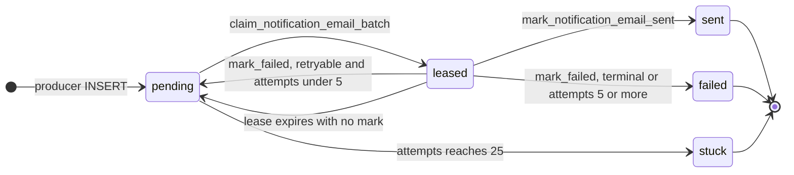
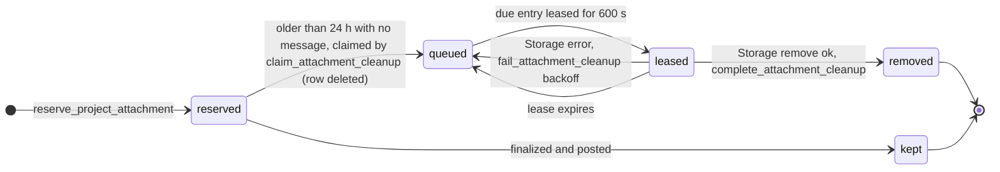

# 01b: Database logic

Final state after migration `0050` (repository head `1c17666`): every SQL function and RPC, every row-level security policy, the Storage bucket, the Realtime topics and the scheduled drain job under `supabase/`. It is read from the SQL itself. Where a function was redefined, the newest `create or replace` wins and earlier definitions are listed as history. Migration `0051` is out of scope.

Companion files: [01-data-dictionary.md](01-data-dictionary.md) (tables, columns, constraints, foreign keys, triggers), [SCHEMA.md](SCHEMA.md) (manifest format and node ownership) and the machine-readable fragment [data/db-logic.json](data/db-logic.json) (functions, bucket, Realtime and cron nodes with their edges).

## 1. How to read this chapter

- Citations: `0031:18` means `supabase/migrations/0031_*.sql` line 18. Each function card gives the full path once. App code is cited as `path#symbol`. **UNVERIFIED** marks anything the repository cannot confirm.
- Each card lists inputs and validation, tables read and written, side-effect rows (outbox, audit, broadcasts), idempotency and every `RAISE EXCEPTION` with its SQLSTATE. Each **Edge:** line gives the trigger condition and the concrete consequence.
- `PLAN.md D1`, `D2`, `D3`, `D4`, `D6` and `D7` refer to the database fixes listed in [PLAN.md](PLAN.md). This chapter documents the behaviour as it stands through `0050`.

| Object | Count | Detail |
| --- | --- | --- |
| SQL functions | 57 | 44 in `public`, 13 in `private`; 58 signatures (`onboard_client_company` has 2 overloads) |
| SECURITY DEFINER | 52 | 53 signatures; all pin `search_path` |
| SECURITY INVOKER | 5 | `public.prevent_unauthorized_profile_changes`, `public.pinned_admin_email`, `private.touch_project_brief`, `public.blog_posts_maintain_timestamps`, `public.blog_tags_are_valid` |
| Trigger functions | 11 | firing 16 triggers (the trigger table is in 01-data-dictionary.md) |
| RLS policies | 71 | 65 on `public` tables, 4 on `storage.objects`, 2 on `realtime.messages` |
| Tables with RLS | 21 | 12 with FORCE ROW LEVEL SECURITY |
| Storage buckets | 1 | `project-files`, private |
| Realtime | 1 publication table, 2 topic patterns, 5 events | `project_messages`; `project:{id}:shared` and `:internal`; presence on `shared` |
| Scheduled work | 1 pg_cron job, 1 `pg_net` call, 1 Vault secret | `drain-crm-outbox`; the Vercel cron backstop lives outside the database |
| Manifest | 62 nodes, 193 edges | `data/db-logic.json` |

### Basis notes

| Topic | What to know | Source |
| --- | --- | --- |
| Repo versus live | `0050` says the live migration table stopped at `0045` on 2026-09-30 and that its objects were applied by hand first. Migrations `0046` to `0049` change function bodies and policies, so the live database may still run earlier definitions. Read this chapter as the repository state. `0049` itself says applying it to production is a separate owner action. Which of `0046` to `0049` are applied is **UNVERIFIED**. | `0050:3-6`, `0049:19-20`, `docs/CRM-OPERATIONS.md` (Migrations) |
| `private` is not an API schema | Only `public` and `graphql_public` are exposed, so no `private.*` function can be called over PostgREST whatever its grants. The grants still matter, because a policy expression runs with the querying role's privileges: a `private.*` helper used in a policy must stay executable by `authenticated` (0027 broke this, 0040 fixed it). | `supabase/config.toml:13`, `0040:1-35`, `docs/CRM-OPERATIONS.md` (RLS helper grants) |
| Definer writes into FORCE-RLS tables | 12 project tables have `FORCE ROW LEVEL SECURITY`, and 11 of them (all but `project_briefs`) have no INSERT or UPDATE policy for `authenticated`. Definer functions write to them only because their owner (`postgres`) bypasses RLS. pgTAP `0049` and `0050` call `create_project` under `set local role authenticated`, which proves it on the local stack; hosted behaviour is **UNVERIFIED** but every live flow depends on it. | `0009:242-255`, `0010:114-121`, `0043:111` |
| `0009b` and `0014b` | Reconciliation files whose names do not match the Supabase CLI `<digits>_name.sql` pattern. A fresh `db reset` probably skips them (**UNVERIFIED**): `legacy_project_messages` and `legacy_project_files` then remain on fresh databases (renamed by `0009:13-41`), and `handle_new_user` comes from `0014:83` (identical body). There is no `0024`. | `0009b`, `0014b`, `0030:1-16` |
| Production-only objects | `public.rls_auto_enable()` and the Stripe foreign table `public."Payments"` are not defined in the repo; `0027` revokes access to them behind existence guards. | `0027:79-105` |
| Postgres version | The local stack runs major version 15; production is on 17.6, so pgTAP results are not a perfect proxy. | `supabase/config.toml:42`, `0004:8` |
| Roles and grants | `service_role` bypasses RLS. Its table and function privileges come from Supabase default privileges except where a migration grants them explicitly (`project_attachment_cleanup`, the worker RPCs). The 0001 tables have no `GRANT` in any migration, so on a stack where new entities are not auto-exposed they may be unreachable. Both points are **UNVERIFIED** on a fresh stack. | `0048:52`, `0033:224-229`, `supabase/config.toml:16-24` (the `auto_expose_new_tables` note: entities created by `postgres` are not auto-exposed unless it is set) |

## 2. Function and RPC catalogue

57 function names (58 signatures) in 10 groups. The overview lists them all; the group sections below hold one card per function. Every function pins its `search_path`. Definer functions run as their owner, normally `postgres` on Supabase.

### 2.0 Overview

| Function | Domain | Security | EXECUTE | Final definition |
| --- | --- | --- | --- | --- |
| `public.handle_new_user` | identity | definer | nobody | 0014b:17 |
| `public.handle_profile_updated` | identity | definer | nobody | 0008:127 |
| `public.prevent_unauthorized_profile_changes` | identity | invoker | nobody | 0046:386 |
| `public.enforce_pinned_admin` | identity | definer | nobody | 0014:50 |
| `public.pinned_admin_email` | identity | invoker | nobody | 0044:14 |
| `public.admin_set_user_role` | identity | definer | authenticated | 0008:143 |
| `public.admin_resolve_staff_request` | identity | definer | authenticated | 0014:112 |
| `public.current_user_must_set_password` | identity | definer | authenticated | 0039:19 |
| `public.create_lead_from_contact` | leads | definer | service_role | 0029:46 |
| `public.onboard_client_company` (2 overloads) | leads | definer | authenticated | 0046:276 |
| `public.create_project` | projects | definer | authenticated | 0031:18 |
| `public.assign_project_user` | projects | definer | authenticated | 0015:614 |
| `public.remove_project_assignment` | projects | definer | authenticated | 0009:665 |
| `public.transition_project_status` | projects | definer | authenticated | 0030:33 |
| `public.post_project_note` | projects | definer | authenticated | 0013:55 |
| `public.create_project_task` | projects | definer | authenticated | 0047:37 |
| `public.update_project_task` | projects | definer | authenticated | 0012:11 |
| `public.create_project_approval` | projects | definer | authenticated | 0010:356 |
| `public.update_project_approval` | projects | definer | authenticated | 0015:442 |
| `public.create_project_deliverable` | projects | definer | authenticated | 0047:128 |
| `public.publish_project_deliverable` | projects | definer | authenticated | 0047:254 |
| `public.project_manager_names` | projects | definer | authenticated | 0049:22 |
| `public.reserve_project_attachment` | messaging | definer | authenticated | 0009:828 |
| `public.finalize_project_attachment` | messaging | definer | authenticated | 0009:1066 |
| `public.post_project_message` | messaging | definer | authenticated | 0032:53 |
| `public.update_project_message` | messaging | definer | authenticated | 0023:211 |
| `public.submit_project_brief` | briefs | definer | authenticated | 0046:87 |
| `private.touch_project_brief` | briefs | invoker | nobody | 0043:88 |
| `private.project_notification_recipients` | notifications | definer | nobody | 0046:48 |
| `public.enqueue_project_notification` | notifications | definer | authenticated | 0046:417 |
| `public.mark_notifications_read` | notifications | definer | authenticated | 0027:32 |
| `public.claim_notification_email_batch` | notifications | definer | service_role | 0033:64 |
| `public.mark_notification_email_sent` | notifications | definer | service_role | 0045:35 |
| `public.mark_notification_email_failed` | notifications | definer | service_role | 0045:66 |
| `public.cleanup_stale_project_attachments` | cleanup | definer | service_role, postgres | 0038:16 |
| `public.claim_attachment_cleanup` | cleanup | definer | service_role | 0048:54 |
| `public.complete_attachment_cleanup` | cleanup | definer | service_role | 0048:108 |
| `public.fail_attachment_cleanup` | cleanup | definer | service_role | 0048:122 |
| `public.blog_posts_maintain_timestamps` | blog | invoker | nobody | 0035:120 |
| `public.blog_tags_are_valid` | blog | invoker | authenticated | 0036:16 |
| `private.broadcast_project_message` | realtime | definer | nobody | 0009:1214 |
| `private.broadcast_project_message_updated` | realtime | definer | nobody | 0032:7 |
| `private.broadcast_project_status_change` | realtime | definer | nobody | 0050:32 |
| `private.broadcast_project_task_change` | realtime | definer | nobody | 0050:57 |
| `private.broadcast_project_approval_change` | realtime | definer | nobody | 0050:102 |
| `private.current_profile_role` | helpers | definer | authenticated | 0009:257 |
| `private.can_access_project` | helpers | definer | authenticated | 0009:269 |
| `private.can_view_internal` | helpers | definer | authenticated | 0009:296 |
| `private.can_subscribe_project_topic` | helpers | definer | authenticated | 0009:315 |
| `private.shares_project_with` | helpers | definer | authenticated | 0018:33 |
| `private.current_profile_company_id` | helpers | definer | authenticated | 0043:25 |
| `public.current_profile_role` | helpers | definer | authenticated | 0008:35 |
| `public.is_admin` | helpers | definer | authenticated | 0008:47 |
| `public.is_pm` | helpers | definer | authenticated | 0008:57 |
| `public.is_staff` | helpers | definer | nobody | 0008:67 |
| `public.is_company_member` | helpers | definer | authenticated | 0008:77 |
| `public.can_access_deal` | helpers | definer | authenticated | 0008:93 |

The authenticated role can call the helpers `current_profile_role()`, `is_admin()`, `is_pm()`, `is_company_member(uuid)` and `can_access_deal(uuid)` directly as RPCs; they only reveal facts about the caller. `public.is_staff()` has no EXECUTE grant for anyone, and the `private` trigger functions are revoked from every API role.

### 2.0.1 Which code calls which RPC

All app calls go through `supabase.rpc(...)`. User-session calls run as the signed-in user, so `auth.uid()` and RLS apply. Service-role calls bypass RLS and can reach only the functions granted to `service_role`.

| RPC | Caller | Client |
| --- | --- | --- |
| `admin_set_user_role` | `app/admin/users/actions.js#changeUserRole`, `#inviteUser` | user session (admin) |
| `admin_resolve_staff_request` | `app/admin/users/actions.js#resolveStaffRequest` | user session (admin) |
| `current_user_must_set_password` | `middleware.js#middleware` | user session (SSR client, portal paths only) |
| `onboard_client_company` (3-arg) | `app/actions/onboarding-actions.js#onboardClientCompany` | user session |
| `submit_project_brief` | `app/actions/brief-actions.js#submitBrief` | user session |
| `create_project` | `app/actions/project-actions.js#createProject` | user session |
| `assign_project_user` | `app/actions/project-actions.js#assignProject`, `app/actions/assignment-actions.js#setLeadProjectManager` | user session |
| `remove_project_assignment` | `app/actions/project-actions.js#removeProjectAssignment`, `app/actions/assignment-actions.js#setLeadProjectManager` | user session |
| `transition_project_status` | `app/actions/project-actions.js#transitionProject`, `app/actions/assignment-actions.js#setLeadProjectManager` | user session |
| `reserve_project_attachment`, `finalize_project_attachment` | `app/actions/project-actions.js#reserveAttachment`, `#finalizeAttachment` | user session |
| `post_project_message`, `update_project_message` | `app/actions/project-actions.js#postProjectMessage`, `#editProjectMessage` | user session |
| `post_project_note` | `app/actions/project-actions.js#postProjectNote` | user session |
| `create_project_task`, `update_project_task` | `app/actions/project-actions.js#createProjectTask`, `#updateProjectTask` | user session |
| `create_project_approval`, `update_project_approval` | `app/actions/project-actions.js#createProjectApproval`, `#updateProjectApproval` | user session |
| `create_project_deliverable`, `publish_project_deliverable` | `app/actions/project-actions.js#createProjectDeliverable`, `#publishDeliverable` | user session |
| `enqueue_project_notification` | `app/actions/project-actions.js#enqueueNotification` | user session (staff) |
| `mark_notifications_read` | `app/actions/project-actions.js#markNotificationsRead` | user session |
| `project_manager_names` | `lib/crm/projects.js#getProjectManagerNames` | caller-supplied user-session client |
| `create_lead_from_contact` | `app/api/contact/route.js#createLeadBestEffort` | service role |
| `claim_notification_email_batch`, `mark_notification_email_sent`, `mark_notification_email_failed` | `app/api/cron/crm-notifications/route.js#drain`, `#markLeaseFailed` | service role |
| `claim_attachment_cleanup`, `complete_attachment_cleanup`, `fail_attachment_cleanup`, `cleanup_stale_project_attachments` | `app/api/cron/crm-notifications/route.js#cleanupStaleAttachments`, `#legacyCleanupStaleAttachments` | service role |

No app code calls `onboard_client_company(p_name, p_email)`, `is_admin`, `is_pm`, `is_company_member`, `can_access_deal`, `current_profile_role` or any `private.*` function: those run only inside other SQL or policies.

### 2.0.2 Error codes the app can see

Custom `RAISE EXCEPTION` calls use these SQLSTATEs consistently. The app mostly collapses them: each server action in `app/actions/project-actions.js` logs only the code (`databaseFailure`) and returns one fixed message. Only `app/actions/brief-actions.js#submitBrief` branches on the code (`SUBMIT_ERRORS`: `P0002`, `22023`, `42501`), and `app/api/cron/crm-notifications/route.js#isMissingFunction` treats `PGRST202` and `42883` as "function not deployed yet".

| SQLSTATE | Meaning in this schema | Typical sources |
| --- | --- | --- |
| `42501` | not allowed: no session, wrong role, not assigned, not the owner, or "Invalid visibility." (visibility errors use this code, not `22023`). Also raised when a role runs a function or policy helper it has no EXECUTE on. | nearly every RPC; `prevent_unauthorized_profile_changes`; `enforce_pinned_admin` |
| `22023` | invalid input or state: length, enum, state-machine step, "no longer pending" | every validating RPC; `transition_project_status`; `update_project_approval` |
| `P0002` | row not found. Several RPCs raise it before the access check, which makes ids probeable. | `transition_project_status`, `update_project_task`, `update_project_approval`, `publish_project_deliverable`, `finalize_project_attachment`, `update_project_message` |
| `23505` | unique violation: already linked to a company; second admin; duplicate contact email; reused `source_deal_id` | `onboard_client_company`, `admin_set_user_role` (index), `create_project` (implicit) |
| `23503` | foreign-key violation: own raise "Source deal does not belong..."; implicit when an admin passes an unknown project or assignee | `create_project`, `create_project_task`, `reserve_project_attachment`, `create_project_deliverable` |
| `23514` | check violation: "The last admin cannot be demoted." (own raise); table CHECKs such as `audit_events_event_type_check`, `blog_posts_*`, `project_tasks_priority_check` | `admin_set_user_role`, blog writes |
| `23502` | not-null: "An account email is required for onboarding." (own raise) | `onboard_client_company` |

CHECK constraints a caller can hit directly: `audit_events_event_type_check` (17 event types, `0043:186-204`; a migration that adds an event type must widen it in the same file), `project_tasks_priority_check` low, medium, high (`0022:35-36`), the `projects_*` checks (`0009:55-72`), the `project_briefs` checks (answers at most 60000 bytes, title at most 120, submission state, `0043:55-73`), the `blog_posts` checks (`0035:72-109`, `0036:39-83`) and the `notifications_outbox` checks (`0010:73-77`, `0011:59-61`, `0033:16-58`).

### 2.1 Identity and roles

#### `public.handle_new_user`

| Field | Value |
| --- | --- |
| Signature | `public.handle_new_user() returns trigger` |
| Security | SECURITY DEFINER, search_path `pg_catalog, public` (pinned); plpgsql |
| EXECUTE | nobody: 0014b:40-42 (also 0014:162-164): revoked from PUBLIC, anon, authenticated; only the trigger and owner run it |
| Final definition | `supabase/migrations/0014b_fix_handle_new_user_coalesce.sql:17`; 0014:83 on a database built only from the CLI-visible migrations (identical body); earlier forms 0001:235, 0008:114. |
| Called by | trigger on_auth_user_created, AFTER INSERT on auth.users (0001:267), fired by GoTrue signup, admin createUser and generateLink |
| Does | Creates the profile row for every new auth user. Always role client; the signup account type only raises a request flag. |
| Inputs and validation | NEW.raw_user_meta_data->>'account_type' (lower-cased, equals employee gives true; any other value, including admin, gives false); NEW.raw_user_meta_data->>'full_name' (stored as typed, no length check). |
| Reads | `auth.users`(id, raw_user_meta_data) (0014b:26) reads the NEW row of the auth.users insert (account_type, full_name) |
| Writes | inserts `profiles`(id, role, full_name, requested_staff_access) (0014b:29): role is the literal 'client' |
| Side-effect rows | trigger function for `auth.users.on_auth_user_created` |
| Idempotency | n/a (one row per auth user; a second INSERT for the same id would hit the profiles primary key). |
| pgTAP | no file names it; indirect only: every fixture inserts into auth.users so the trigger runs, but account_type handling is not asserted |

- **Edge:** Trigger condition: account_type = employee in the signup metadata. Consequence: requested_staff_access = true and the account lands in the admin pending-requests queue; it gets no privilege until admin_resolve_staff_request. Any other value (including admin) degrades to a plain client (0014b:24-27).
- **Edge:** Trigger condition: the profiles INSERT fails for any reason (constraint, grant, missing enum). Consequence: the trigger runs in the same transaction as the auth.users insert, so the signup fails and no auth user is created.
- **Edge:** Trigger condition: a user signs up with a very long or hostile full_name. Consequence: it is stored as typed (no length check) and later appears in notification payloads (author_name), in emails and in the Realtime presence payload (name).
- **Edge:** Trigger condition: a database is built from the CLI-visible migrations only. Consequence: it runs 0014:83 instead of 0014b:17; the bodies are identical, so behaviour does not change. If the Supabase CLI skips the non-numeric 0014b filename (UNVERIFIED) only the history differs.

#### `public.handle_profile_updated`

| Field | Value |
| --- | --- |
| Signature | `public.handle_profile_updated() returns trigger` |
| Security | SECURITY DEFINER, search_path `pg_catalog, public` (pinned); plpgsql |
| EXECUTE | nobody: 0008:587,600,613: revoked from PUBLIC, anon, authenticated |
| Final definition | `supabase/migrations/0008_auth_rbac_repair.sql:127`; first defined 0001:255. |
| Called by | BEFORE UPDATE triggers on profiles, companies, contacts, deals, tasks, notes (0001:271-294) |
| Does | Stamps NEW.updated_at = now() on the six legacy CRM tables. |
| Inputs and validation | none (trigger). |
| Side-effect rows | trigger function for `public.profiles.on_profile_updated`, `public.companies.on_companies_updated`, `public.contacts.on_contacts_updated`, `public.deals.on_deals_updated`, `public.tasks.on_tasks_updated`, `public.notes.on_notes_updated` |
| Idempotency | n/a |
| pgTAP | no file names it |

- **Edge:** Trigger condition: a row in projects, project_tasks, project_approvals, project_deliverables or company_members is updated. Consequence: updated_at moves only where an RPC sets it by hand (transition, task and approval updates); project_deliverables has no updated_at column at all.

#### `public.prevent_unauthorized_profile_changes`

| Field | Value |
| --- | --- |
| Signature | `public.prevent_unauthorized_profile_changes() returns trigger` |
| Security | SECURITY INVOKER, search_path `pg_catalog, public` (pinned); plpgsql |
| EXECUTE | nobody: 0046:413: revoked from PUBLIC, anon, authenticated |
| Final definition | `supabase/migrations/0046_client_notifications_and_hardening.sql:386`; earlier forms 0002:19, 0008:319 (role and company_id only). |
| Called by | BEFORE UPDATE trigger on_profile_role_change_guard on profiles (0008:345-348) |
| Does | Blocks changes to role, company_id, requested_staff_access and created_at unless the statement runs as the owner of admin_set_user_role (the migration role, so inside the definer RPCs). |
| Inputs and validation | OLD/NEW profile rows; catalog lookup of the owner of public.admin_set_user_role(uuid,text) (0046:398-401). This is a catalog read, not a call. |
| Side-effect rows | trigger function for `public.profiles.on_profile_role_change_guard` |
| Idempotency | n/a |
| Raises | `42501` Protected profile fields must be changed through a validated command. (0046:404) |
| pgTAP | no file names it; 0046 asserts that requested_staff_access and created_at changes are rejected and full_name is allowed, test lines 184-200 |

- **Edge:** Trigger condition: any UPDATE on profiles that changes a protected column while current_user is not the owner of admin_set_user_role. Consequence: 42501 "Protected profile fields must be changed through a validated command." This includes service_role, so the Supabase admin API and service-role scripts cannot set role, company_id or the staff flag; only the definer RPCs and migrations (run as postgres) can.
- **Edge:** Trigger condition: the owner of admin_set_user_role changes (ownership transfer or re-creation by another role). Consequence: the guard compares against the new owner and rejects every RPC that runs as the old one, so onboarding, role changes and staff-request resolution all fail with 42501.
- **Edge:** Trigger condition: a profiles row is inserted with a chosen role, company_id or staff flag. Consequence: the guard does not run (UPDATE only), but authenticated has no INSERT policy, so handle_new_user is the only insert path.
- **Edge:** Trigger condition: a user updates their own profile with an oversized or hostile full_name or avatar_url. Consequence: accepted (no WITH CHECK, no length or format limit, 0001:156); the values reach other users.

#### `public.enforce_pinned_admin`

| Field | Value |
| --- | --- |
| Signature | `public.enforce_pinned_admin() returns trigger` |
| Security | SECURITY DEFINER, search_path `pg_catalog, public` (pinned); plpgsql |
| EXECUTE | nobody: 0014:158-160: revoked from PUBLIC, anon, authenticated |
| Final definition | `supabase/migrations/0014_signup_account_type_and_single_admin.sql:50` |
| Called by | BEFORE INSERT OR UPDATE OF role trigger enforce_pinned_admin_trigger on profiles (0014:76-78) |
| Does | Rejects role = admin on any profile whose auth email is not public.pinned_admin_email(). |
| Inputs and validation | NEW.role, NEW.id; the auth email is looked up from auth.users and compared case-insensitively. |
| Reads | `auth.users`(id, email) (0014:64) |
| Side-effect rows | trigger function for `public.profiles.enforce_pinned_admin_trigger` |
| Calls | `public.pinned_admin_email` (0014:67) |
| Idempotency | n/a |
| Raises | `42501` Only % may hold the admin role. (0014:68) |
| pgTAP | files naming it: 0009, 0035; 0044 asserts the pin and the single-admin rule |

- **Edge:** Trigger condition: NEW.role = admin and the account email is not the pin. Consequence: 42501 "Only {pin} may hold the admin role." (the message embeds the current pin).
- **Edge:** Trigger condition: the pinned account later changes its auth email. Consequence: the profile stays admin until its role is next written (the trigger fires on role writes only), while create_lead_from_contact, which finds the admin by email, starts failing with P0002.
- **Edge:** Trigger condition: a promotion to admin is attempted while another admin row exists. Consequence: 23505 from profiles_single_admin_idx (0014:46); the previous admin must be demoted first (0042:120-130 and 0044:44-55 do exactly that).

#### `public.pinned_admin_email`

| Field | Value |
| --- | --- |
| Signature | `public.pinned_admin_email() returns text` |
| Security | SECURITY INVOKER, search_path `'' (empty)` (pinned); sql, immutable |
| EXECUTE | nobody: 0044:27 (also 0027:77, 0042:70): revoked from PUBLIC, anon, authenticated. Callable by the owner and by definer functions; service_role execution comes from Supabase default privileges (UNVERIFIED). |
| Final definition | `supabase/migrations/0044_pin_admin_to_moiz.sql:14`; history: ethan@crystalwebsolution.com (0014:33, search_path pinned 0015:59), ethan@cdsportswearinc.com (0042:55), moizj00@gmail.com (0044:14). |
| Called by | public.enforce_pinned_admin public.create_lead_from_contact pgTAP fixtures (supabase/tests/*.test.sql) SQL: public.enforce_pinned_admin (0014:67) SQL: public.create_lead_from_contact (0029:110) |
| Does | Returns the single address allowed to hold the admin role: moizj00@gmail.com. |
| Inputs and validation | none. |
| Idempotency | immutable |
| pgTAP | files naming it: 0009, 0035, 0041, 0042, 0043, 0044, 0046, 0047, 0048, 0049, 0050; used as a fixture in most files; the value is asserted by 0042 and 0044 |

- **Edge:** Trigger condition: the pin is moved by a new migration. Consequence: until the new address has an auth.users row, create_lead_from_contact raises P0002 on every contact-form submission and no account can be promoted; the migration must also demote and promote the accounts (0044:35-56).

#### `public.admin_set_user_role`

| Field | Value |
| --- | --- |
| Signature | `public.admin_set_user_role(p_user_id uuid, p_role text) returns public.profiles` |
| Security | SECURITY DEFINER, search_path `pg_catalog, public` (pinned); plpgsql |
| EXECUTE | authenticated: 0008:620 (PUBLIC and anon revoked 0008:582,595) |
| Final definition | `supabase/migrations/0008_auth_rbac_repair.sql:143` |
| Called by | app/admin/users/actions.js#changeUserRole app/admin/users/actions.js#inviteUser (promotes the invitee before the email goes out) |
| Does | The only path that changes profiles.role from the app. Admin only. |
| Inputs and validation | p_role must be one of client, project_manager, admin (22023 otherwise). p_user_id must exist. An admin cannot change their own role. Demoting an admin is blocked when it would leave none. |
| Reads | `profiles`(id, role) (0008:168) SELECT * ... FOR UPDATE of the target row, then count(*) of admins |
| Writes | updates `profiles`(role) (0008:191) |
| Calls | `public.is_admin` (0008:158) |
| Idempotency | Idempotent for an unchanged role (the UPDATE writes the same value). Serialized by advisory lock 5607560873324236590 (0008:156). |
| Raises | `42501` Admin access required. (0008:159) `22023` Invalid role. (0008:163) `P0002` Profile not found. (0008:173) `42501` Admins cannot change their own role. (0008:177) `23514` The last admin cannot be demoted. (0008:187) |
| Implicit errors | 23505 profiles_single_admin_idx when a second admin is promoted (after the trigger passes) |
| pgTAP | no file names it |

- **Edge:** Trigger condition: p_role = admin. Consequence: only the pinned address passes enforce_pinned_admin (42501) and only while no other admin row exists (23505 profiles_single_admin_idx). In practice an admin can never be created through the app.
- **Edge:** Trigger condition: demoting a PM to client (or any role change). Consequence: project_assignments, company_id and requested_staff_access are untouched. The old PM keeps their assignment rows, so they stay in private.project_notification_recipients and keep getting in_app rows for the project (email to a project_manager is dropped at drain time only while the profile role is still project_manager, route.js#resolveLiveAssignments).
- **Edge:** Trigger condition: promoting a user who still has requested_staff_access = true. Consequence: the flag is not cleared, so they remain in the admin pending-requests list.
- **Edge:** Trigger condition: any role change. Consequence: no audit_events row (the event_type CHECK list has no role-change event) and no notification to the affected user, so the change leaves no trace beyond profiles.updated_at.

#### `public.admin_resolve_staff_request`

| Field | Value |
| --- | --- |
| Signature | `public.admin_resolve_staff_request(p_user_id uuid, p_approve boolean) returns public.profiles` |
| Security | SECURITY DEFINER, search_path `pg_catalog, public` (pinned); plpgsql |
| EXECUTE | authenticated: 0014:156 (PUBLIC and anon revoked 0014:154-155) |
| Final definition | `supabase/migrations/0014_signup_account_type_and_single_admin.sql:112` |
| Called by | app/admin/users/actions.js#resolveStaffRequest |
| Does | Resolves a signup staff-access request: approve makes the account project_manager, decline leaves the role. Both clear the flag. |
| Inputs and validation | p_approve must be non-null (22023). The target row must have requested_staff_access = true (P0002 otherwise). |
| Writes | updates `profiles`(role, requested_staff_access) (0014:135): role becomes project_manager only when p_approve is true |
| Calls | `public.is_admin` (0014:124) |
| Idempotency | A second call raises P0002 because the flag is already cleared. |
| Raises | `42501` Admin access required. (0014:125) `22023` An approve or decline decision is required. (0014:129) `P0002` No pending staff request for this account. (0014:146) |
| pgTAP | files naming it: 0046 |

- **Edge:** Trigger condition: p_approve = true for a row whose role is already admin (the pinned admin, if its requested_staff_access flag is still set). Consequence: the CASE overwrites role with project_manager, the platform has no admin, and no UI can restore one (promotion needs an admin and the pinned-admin trigger). There is no self-check and no last-admin check here, unlike admin_set_user_role. Tracked as PLAN.md D7.
- **Edge:** Trigger condition: decline. Consequence: the flag is cleared and never set again (it is written only by handle_new_user at signup, and profile updates of it are blocked), so a declined user cannot ask a second time.
- **Edge:** Trigger condition: approve or decline. Consequence: no audit row and no email, so the requester is not told.

#### `public.current_user_must_set_password`

| Field | Value |
| --- | --- |
| Signature | `public.current_user_must_set_password() returns boolean` |
| Security | SECURITY DEFINER, search_path `pg_catalog, public` (pinned); sql, stable |
| EXECUTE | authenticated: 0039:41 (PUBLIC and anon revoked 0039:39-40) |
| Final definition | `supabase/migrations/0039_must_set_password_gate.sql:19` |
| Called by | middleware.js#middleware (portal paths only, after getUser and the role check) |
| Does | True when the caller has no password on auth.users (an admin invitee who has not chosen one). |
| Inputs and validation | none (scoped to auth.uid()). |
| Reads | `auth.users`(id, encrypted_password) (0039:29) |
| Idempotency | read-only |
| pgTAP | no file names it |

- **Edge:** Trigger condition: no auth.users row for auth.uid(), or no session. Consequence: returns false (not an error), so the gate lets the request through; it is a gate after authentication, not a replacement.
- **Edge:** Trigger condition: the RPC errors (for example 0039 not applied). Consequence: middleware logs "must-set-password gate unavailable" and fails open, so invitees can reach the portal without a password.
- **Edge:** Trigger condition: an account whose encrypted_password is empty or null (an invitee, or a magic-link-only user). Consequence: flagged and redirected to /auth/reset-password; the repo configures no OAuth providers (supabase/config.toml), so today this matches invitees only.

### 2.2 Leads and onboarding

#### `public.create_lead_from_contact`

| Field | Value |
| --- | --- |
| Signature | `public.create_lead_from_contact(p_name text, p_email text, p_company text default null, p_brief text default null, p_budget text default null, p_source text default 'website_contact_form') returns jsonb` |
| Security | SECURITY DEFINER, search_path `pg_catalog, public, extensions` (pinned); plpgsql |
| EXECUTE | service_role: 0029:250-252 revokes PUBLIC, anon, authenticated; no explicit GRANT to service_role exists in the repo, so service-role access relies on Supabase default privileges (UNVERIFIED on a fresh local stack; no pgTAP covers this function) |
| Final definition | `supabase/migrations/0029_lead_capture_review_followups.sql:46`; first defined 0026:24; 0029 added the advisory lock, unique email index and length bounds. |
| Called by | app/api/contact/route.js#createLeadBestEffort (service-role client, best effort; a failure never changes the visitor response) |
| Does | The contact form is the only caller. Finds or creates the company and contact for the submitter, then either appends an internal note to the newest open deal or opens a new prospecting deal owned by the pinned admin, and queues one lead.created email. |
| Inputs and validation | p_name 1-100 chars (22023); p_email lower-cased, max 254, regex ^[^\s@]+@[^\s@]+\.[^\s@]+$ (22023); p_company truncated to 160; p_brief truncated to 4000; p_budget truncated to 50; p_source truncated to 50. |
| Reads | `auth.users`(id, email) (0029:109) resolves the pinned admin id by lower(email) `contacts`(id, company_id, email) (0029:133) match by lower(email) `companies`(id, name, email) (0029:141) match by lower(name) when a company was typed, else by email domain (non free-mail); a later lookup reads the attached company name for the deal title and payload `deals`(id, contact_id, stage, created_at) (0029:189) newest open deal (stage not closed_won or closed_lost) of the contact |
| Writes | inserts `companies`(name, email, created_by) (0029:146): only for a new contact; named by typed company, else the email domain, else the person inserts `contacts`(company_id, first_name, last_name, email, created_by) (0029:170): only when no contact has this email inserts `notes`(company_id, contact_id, deal_id, content, created_by, visibility) (0029:202) when an open deal exists: visibility = 'internal'; content = New website inquiry ({source}): {budget, then brief} inserts `deals`(company_id, contact_id, title, description, owner_id, stage) (0029:215) when no open deal exists: stage = prospecting; title = Website inquiry - <company or name>; owner_id = pinned admin |
| Side-effect rows | enqueues `notifications_outbox` (0029:225): event_type = lead.created; channel = email; user_id = pinned admin; project_id = null; payload = {lead_name, lead_email, lead_company, deal_id, note_appended} |
| Calls | `public.pinned_admin_email` (0029:110) |
| Idempotency | Same email serializes on pg_advisory_xact_lock(hashtext('create_lead_from_contact'), hashtext(email)) (0029:106). A repeat submission appends a note to the open deal instead of a new deal. Company match and create is not locked, and companies.name is not unique. |
| Raises | `22023` Invalid lead name. (0029:90) `22023` Invalid lead email. (0029:94) `P0002` No admin profile found for lead attribution. (0029:114) |
| pgTAP | no file names it |

- **Edge:** Trigger condition: the visitor types a company name equal (case-insensitive) to an existing company, or leaves it blank and uses a business-domain address that matches an existing company email domain. Consequence: the new contact is attached to that company, including a real client company, and the client policy "Clients can view company contacts" (0008:431) lets that client's members read the visitor's name and email. Tracked as PLAN.md D4.
- **Edge:** Trigger condition: the email already belongs to a contact (a returning lead, or an onboarded client whose contact row carries the same email). Consequence: no company logic runs; the call adds a note to the open deal, or opens a deal on the contact's existing company (a client company gets an admin-owned "Website inquiry" deal that clients cannot read since 0041:101-102).
- **Edge:** Trigger condition: the pinned address has no auth.users row (account missing, or its email changed). Consequence: P0002 "No admin profile found for lead attribution."; the route logs it and still sends the operations email, so the lead exists only in email.
- **Edge:** Trigger condition: p_name over 100 chars or an email failing the regex. Consequence: 22023; the route swallows it and the visitor still sees success. p_brief, p_budget, p_company and p_source over their caps are truncated silently.
- **Edge:** Trigger condition: two submissions for different emails with the same new company name at the same moment. Consequence: two company rows, because only the email is locked.
- **Edge:** Trigger condition: any lead capture. Consequence: no audit_events row, because actor_id is NOT NULL and there is no human actor; the only traces are the outbox row and the created CRM rows.

#### `public.onboard_client_company`

| Field | Value |
| --- | --- |
| Signature | `public.onboard_client_company(p_company_name text, p_contact_name text, p_phone text default null) returns uuid` `public.onboard_client_company(p_name text, p_email text) returns uuid (compatibility wrapper; p_email is ignored; contact name = profile full_name, else the email local part, else Client; delegates to the 3-arg form with a null phone)` |
| Security | SECURITY DEFINER, search_path `pg_catalog, public` (pinned); plpgsql |
| EXECUTE | authenticated: 3-arg 0046:380-382; 2-arg 0008:584,597,610 revoke and 0008:622 grant (ACL kept across 0016 replacement) |
| Final definition | `supabase/migrations/0046_client_notifications_and_hardening.sql:276`; 3-arg form first 0008:200, replaced 0046:276; 2-arg compatibility wrapper 0008:289, replaced 0016:174 (bare coalesce fix). |
| Called by | app/actions/onboarding-actions.js#onboardClientCompany (3-arg; the 2-arg wrapper has no caller found in app/ lib/ components/) |
| Does | Turns a signed-in client with no company into a company owner: creates the company, a contact, a company_members owner row and sets profiles.company_id, then emails the admin. |
| Inputs and validation | Caller must be a client with company_id null (42501 / 23505). p_company_name and p_contact_name non-blank (22023). The auth email must exist (23502). |
| Reads | `profiles`(id, role, company_id) (0046:299) SELECT * ... FOR UPDATE of the caller row `auth.users`(id, email) (0046:321) company, contact and notification email all come from the auth account email, not from input |
| Writes | inserts `companies`(name, email, phone, created_by) (0046:328) inserts `contacts`(company_id, first_name, last_name, email, phone, status, created_by) (0046:332): status = 'client'; last_name = '' inserts `company_members`(company_id, user_id, role) (0046:351): role = 'owner' updates `profiles`(company_id) (0046:354): allowed past the profile guard because the definer owner runs it |
| Side-effect rows | enqueues `notifications_outbox` (0046:360): event_type = client.onboarded; channel = email; user_id = every profile with role admin; project_id = null; payload = {company_id, company_name, contact_name, client_email, phone} |
| Idempotency | Not idempotent. A double submit is serialized by the FOR UPDATE on the profile, then the second call raises 23505 "You are already linked to a company." It never returns the existing company id. |
| Raises | `42501` Authentication required. (0046:294) `42501` Client profile required. (0046:304) `23505` You are already linked to a company. (0046:308) `22023` Company name is required. (0046:312) `22023` Contact name is required. (0046:316) `23502` An account email is required for onboarding. (0046:325) |
| pgTAP | files naming it: 0046 |

- **Edge:** Trigger condition: the account email is already a contact (for example an earlier website lead, 0029 unique index on lower(email)). Consequence: the contacts INSERT raises 23505 and rolls the whole call back. The same errcode is used by "You are already linked to a company.", and app/actions/onboarding-actions.js#onboardClientCompany logs only the code, so the client sees one generic failure and cannot reach their dashboard projects. Tracked as PLAN.md D6.
- **Edge:** Trigger condition: a second person from an existing client business signs up and onboards. Consequence: a new, separate company is created. profiles.company_id can only come from this function and the profile guard blocks every other writer, service_role included, so they can never reach the first person's projects without SQL.
- **Edge:** Trigger condition: the RPC is called directly with a long phone string. Consequence: stored raw in companies.phone, contacts.phone and the outbox payload; only the app limits it (40 chars).
- **Edge:** Trigger condition: the company row is deleted. Consequence: profiles.company_id (no foreign key, 0001:16) dangles, the client reads as already linked (23505) and can never re-onboard.

### 2.3 Projects and delivery

#### `public.create_project`

| Field | Value |
| --- | --- |
| Signature | `public.create_project(p_company_id uuid, p_category text, p_title text, p_brief text, p_target_date date default null, p_source_deal_id uuid default null, p_client_generated_id uuid default null) returns uuid` |
| Security | SECURITY DEFINER, search_path `pg_catalog, public, private, storage` (pinned); plpgsql |
| EXECUTE | authenticated: 0031:196-198 (PUBLIC and anon revoked) |
| Final definition | `supabase/migrations/0031_idempotent_client_project_intake.sql:18`; replaces the 6-arg form 0009:465 (dropped 0031:16). |
| Called by | app/actions/project-actions.js#createProject (client intake; passes no p_client_generated_id) SQL: public.submit_project_brief (0046:174) |
| Does | Creates a project with its thread and first status-history row. Clients create for their own company; admins for any company. |
| Inputs and validation | Caller role admin, or client whose profile company_id equals p_company_id (42501). p_category in web_design, logo_creation, branding, marketing, ai_automation (22023). p_title 3-120 chars after trimming and collapsing whitespace (22023). p_brief 1-10000 chars (22023). Company must exist (P0002). p_source_deal_id must belong to the company (23503). p_client_generated_id must not be the nil uuid (22023). |
| Reads | `profiles`(role, company_id) (0031:46) `companies`(id) (0031:83) `deals`(id, company_id) (0031:91) `projects`(id, created_by, client_generated_id) (0031:101) idempotency lookup, FOR UPDATE `project_threads`(project_id) (0031:149) |
| Writes | inserts `projects`(company_id, source_deal_id, category, title, brief, target_date, created_by, client_generated_id) (0031:111): status takes its default brief_submitted inserts `project_threads`(project_id) (0031:155) inserts `project_status_history`(project_id, from_status, to_status, visibility, changed_by) (0031:158): from_status null, to_status brief_submitted, visibility shared |
| Side-effect rows | audit_events (0031:173): project.created |
| Idempotency | Only when p_client_generated_id is passed: unique index projects_client_generated_idx(created_by, client_generated_id) (0031:12), an early locked lookup, and ON CONFLICT DO NOTHING; a repeat returns the existing project without a second thread, history row or audit event. Without a key there is no idempotency. |
| Raises | `42501` Authentication required. (0031:41) `42501` Project creation is not allowed. (0031:54) `22023` Invalid project submission key. (0031:64) `22023` Invalid project category. (0031:69) `22023` Project title must be 3 to 120 characters. (0031:74) `22023` Project brief must be 1 to 10000 characters. (0031:79) `P0002` Company not found. (0031:85) `23503` Source deal does not belong to the project company. (0031:95) |
| pgTAP | files naming it: 0046, 0047, 0048, 0049, 0050 |

- **Edge:** Trigger condition: p_source_deal_id already used by another project. Consequence: projects.source_deal_id is UNIQUE (0009:46), so the INSERT raises 23505 (not in the RAISE list). Only the admin path can pass a deal id.
- **Edge:** Trigger condition: a client whose profile has no company (company_id null). Consequence: the role check evaluates to NULL and does not raise; the call fails later with P0002 "Company not found." instead of 42501.
- **Edge:** Trigger condition: a retry with the same p_client_generated_id but a different payload. Consequence: the first project is returned and the new payload is dropped silently. The brief path (submit_project_brief) uses the brief id as the key; the createProject action sends none, so a double submit there creates two projects.
- **Edge:** Trigger condition: a caller bypasses the action and sends a brief of 5001 to 10000 chars. Consequence: accepted (SQL limit 10000); the app caps it at 5000 in project-actions.js#createProject.
- **Edge:** Trigger condition: any direct create_project call. Consequence: no outbox row, so nobody is notified; only the brief path (submit_project_brief) alerts the studio.
- **Edge:** Trigger condition: a project is created. Consequence: the status takes its default and the project_status_changed trigger does not fire on INSERT, so open pages learn of the new project only by re-reading.

#### `public.assign_project_user`

| Field | Value |
| --- | --- |
| Signature | `public.assign_project_user(p_project_id uuid, p_user_id uuid) returns uuid` |
| Security | SECURITY DEFINER, search_path `pg_catalog, public, private, storage` (pinned); plpgsql |
| EXECUTE | authenticated: 0009:1154 (PUBLIC and anon revoked 0009:1140-1141; ACL kept by the 0015 replacement) |
| Final definition | `supabase/migrations/0015_project_notifications_and_message_editing.sql:614`; first defined 0009:593 (no notification). |
| Called by | app/actions/project-actions.js#assignProject app/actions/assignment-actions.js#setLeadProjectManager (skipped when the person already leads) |
| Does | Admin-only. Adds a staff member to a project and tells them. |
| Inputs and validation | Caller must be admin (42501). Project must exist (P0002). Target must be a project_manager or admin profile (22023). |
| Reads | `projects`(id, company_id) (0015:635) `profiles`(id, role) (0015:644) |
| Writes | upserts `project_assignments`(project_id, user_id, assigned_by) (0015:652): ON CONFLICT (project_id, user_id) DO UPDATE SET assigned_by |
| Side-effect rows | audit_events (0015:666): project.user_assigned enqueues `notifications_outbox` (0015:684): event_type = project.user_assigned; channels in_app + email; user_id = the assignee; payload = {role} |
| Calls | `private.current_profile_role` (0015:629) |
| Idempotency | The upsert is idempotent on (project_id, user_id) but every call re-audits and re-notifies the assignee. |
| Raises | `42501` Admin access required. (0015:630) `P0002` Project not found. (0015:639) `22023` Only a project manager or admin may be assigned. (0015:649) |
| pgTAP | files naming it: 0009 |

- **Edge:** Trigger condition: the same user assigned twice. Consequence: a second audit row and a second in_app + email pair for the assignee (the setLeadProjectManager action skips the call when the person already leads).
- **Edge:** Trigger condition: an admin is assigned to a project. Consequence: any assignment row switches off the admin fallback in project_notification_recipients, so client events reach only the assigned people.
- **Edge:** Trigger condition: an assignment is added or removed while pages are open. Consequence: no Realtime event is sent (no trigger on project_assignments); the affected person's open page learns of it only on reload.

#### `public.remove_project_assignment`

| Field | Value |
| --- | --- |
| Signature | `public.remove_project_assignment(p_project_id uuid, p_user_id uuid) returns uuid` |
| Security | SECURITY DEFINER, search_path `pg_catalog, public, private, storage` (pinned); plpgsql |
| EXECUTE | authenticated: 0009:1155 (PUBLIC and anon revoked 0009:1142-1143) |
| Final definition | `supabase/migrations/0009_project_realtime_crm.sql:665` |
| Called by | app/actions/project-actions.js#removeProjectAssignment app/actions/assignment-actions.js#setLeadProjectManager |
| Does | Admin-only. Removes a staff assignment. |
| Inputs and validation | Caller must be admin (42501). Project must exist (P0002). The assignment must exist (P0002). |
| Reads | `projects`(id, company_id) (0009:685) |
| Writes | deletes `project_assignments`(project_id, user_id) (0009:692) |
| Side-effect rows | audit_events (0009:701): project.assignment_removed |
| Calls | `private.current_profile_role` (0009:679) |
| Idempotency | A second call raises P0002 "Project assignment not found." |
| Raises | `42501` Admin access required. (0009:680) `P0002` Project not found. (0009:689) `P0002` Project assignment not found. (0009:698) |
| pgTAP | no file names it |

- **Edge:** Trigger condition: removing the last assignment. Consequence: from then on project_notification_recipients falls back to the admin for new events. Rows already queued for the removed manager stay in the outbox: email is skipped at drain time if the profile is still project_manager (route.js#resolveLiveAssignments), but in_app rows remain readable by that user.
- **Edge:** Trigger condition: an assignment is removed. Consequence: the removed person receives no notification.

#### `public.transition_project_status`

| Field | Value |
| --- | --- |
| Signature | `public.transition_project_status(p_project_id uuid, p_to_status text, p_note text default null, p_visibility text default 'shared') returns uuid (the status_history id)` |
| Security | SECURITY DEFINER, search_path `pg_catalog, public, private, storage` (pinned); plpgsql |
| EXECUTE | authenticated: 0030:169-170 (PUBLIC and anon revoked) |
| Final definition | `supabase/migrations/0030_transition_status_visibility_recipients.sql:33`; history 0009:723, 0011:164, 0015:320, 0020:18 (delivered email), 0030:33 (visibility forwarded). |
| Called by | app/actions/project-actions.js#transitionProject app/actions/assignment-actions.js#setLeadProjectManager (moves brief_submitted to planned) |
| Does | The only writer of projects.status. Staff on the project only. Enforces the state machine, logs history, notifies. |
| Inputs and validation | Caller must be admin or a PM assigned to the project (42501). p_visibility shared or internal (22023). p_note at most 2000 chars (22023). State machine (0030:77-86): brief_submitted to planned or cancelled; planned to in_progress, on_hold, cancelled; in_progress to client_review, on_hold, cancelled; client_review to changes_requested, approved, on_hold, cancelled; changes_requested to in_progress, on_hold, cancelled; approved to delivered, on_hold, cancelled; on_hold to planned, in_progress, cancelled. delivered and cancelled are terminal (22023). |
| Reads | `projects`(id, status, company_id, title) (0030:57) SELECT * ... FOR UPDATE `profiles`(id, company_id) (0030:155) |
| Writes | updates `projects`(status, updated_at) (0030:94): fires trigger broadcast_project_status_changed (0050:191) inserts `project_status_history`(project_id, from_status, to_status, note, visibility, changed_by) (0030:99) |
| Side-effect rows | audit_events (0030:117): project.status_transitioned enqueues `notifications_outbox` (0030:137): event_type = project.status_transitioned; channels in_app + email; recipients = private.project_notification_recipients(project, actor, p_visibility); payload = {from_status, to_status}. When the new status is delivered a second insert (0030:148) queues event_type = project.delivered; channel email; user_id = every profile whose company_id equals the project company; payload = {project_name} |
| Calls | `private.can_view_internal` (0030:65) `private.project_notification_recipients` (0030:144) |
| Idempotency | The FOR UPDATE row lock serializes callers; a repeated call fails the state machine (22023) because the from-state changed. Not idempotent. |
| Raises | `42501` Authentication required. (0030:52) `P0002` Project not found. (0030:62) `42501` Project assignment required. (0030:66) `22023` Invalid visibility. (0030:70) `22023` Status note must be at most 2000 characters. (0030:74) `22023` Invalid project status transition. (0030:89) |
| pgTAP | no file names it; a contract test exists under tests/crm but no pgTAP file |

- **Edge:** Trigger condition: the project id does not exist versus exists. Consequence: P0002 "Project not found." is raised before the access check (0030:61-67), so any authenticated caller can tell whether a project uuid exists (42501 when it does).
- **Edge:** Trigger condition: p_to_status = delivered with p_visibility = internal. Consequence: status_transitioned goes to staff only, but project.delivered still emails every profile in the project company, whatever the visibility and whatever role that profile now holds (0030:147-156).
- **Edge:** Trigger condition: any transition, even with p_visibility = internal. Consequence: projects.status changes and the 0050 trigger broadcasts project_status_changed on both the shared and internal topics, so client pages refresh and show the new status; only the note and history row stay staff-only.
- **Edge:** Trigger condition: staff move a project to approved with no approval row, or decide an approval. Consequence: the two are unlinked: approved can be set with no approval record, deciding an approval never moves the project, and clients cannot transition (can_view_internal), so staff record every client approval by hand.
- **Edge:** Trigger condition: p_note is an empty string. Consequence: it is stored as an empty string, not null, so readers must test for both.

#### `public.post_project_note`

| Field | Value |
| --- | --- |
| Signature | `public.post_project_note(p_project_id uuid, p_note text, p_visibility text default 'shared') returns uuid (the status_history id)` |
| Security | SECURITY DEFINER, search_path `pg_catalog, public, private, storage` (pinned); plpgsql |
| EXECUTE | authenticated: 0013:155 (PUBLIC and anon revoked 0013:153-154) |
| Final definition | `supabase/migrations/0013_project_notes_and_deliverables.sql:55` |
| Called by | app/actions/project-actions.js#postProjectNote |
| Does | Posts a standalone update to the project timeline as a status-history row with from_status = to_status = the current status. Any participant, clients included. |
| Inputs and validation | Caller must pass can_access_project (42501). p_visibility shared or internal; internal needs can_view_internal (42501 "Invalid visibility."). Note 1-2000 chars after trimming (22023). Project must exist (P0002). |
| Reads | `projects`(id, status, company_id) (0013:91) FOR UPDATE `project_assignments`(project_id, user_id) (0013:145) |
| Writes | inserts `project_status_history`(project_id, from_status, to_status, note, visibility, changed_by) (0013:99): from_status = to_status = current status |
| Side-effect rows | audit_events (0013:117): project.note_posted enqueues `notifications_outbox` (0013:132): event_type = project.note_posted; channel in_app only; recipients = every project_assignments row except the caller (no client, no admin fallback); payload = {history_id} |
| Calls | `private.can_access_project` (0013:75) `private.can_view_internal` (0013:81) |
| Idempotency | None: every call adds a row and notifications. |
| Raises | `42501` Authentication required. (0013:72) `42501` Project access required. (0013:76) `42501` Invalid visibility. (0013:82) `22023` Note must be 1 to 2000 characters. (0013:86) `P0002` Project not found. (0013:96) |
| pgTAP | no file names it |

- **Edge:** Trigger condition: a client posts a shared note on a project with no assigned staff. Consequence: nobody is notified; the recipient list is assignment rows only, with no admin fallback and no email.
- **Edge:** Trigger condition: a note is posted. Consequence: no Realtime event is sent (no trigger on project_status_history); other open pages see it on reload or on the next status, task or message event.
- **Edge:** Trigger condition: a reader builds a status timeline from project_status_history. Consequence: note rows (from_status = to_status) look like no-op transitions unless they are filtered on the note.

#### `public.create_project_task`

| Field | Value |
| --- | --- |
| Signature | `public.create_project_task(p_project_id uuid, p_title text, p_description text default '', p_status text default 'todo', p_assignee_id uuid default null, p_due_date date default null, p_priority text default 'medium', p_client_visible boolean default false) returns uuid` |
| Security | SECURITY DEFINER, search_path `pg_catalog, public, private, storage` (pinned); plpgsql |
| EXECUTE | authenticated: 0047:122-124 (PUBLIC revoked again after 0019 recreated it, 0021:22) |
| Final definition | `supabase/migrations/0047_staff_only_task_and_deliverable_rpcs.sql:37`; history 0010:187 (6 args, dropped 0019:28), 0019:30 (8 args), 0047:37 (staff-only). |
| Called by | app/actions/project-actions.js#createProjectTask |
| Does | Staff-only task creation (admin, or a PM assigned to the project). |
| Inputs and validation | Staff check first (42501 'Staff access required.'). Title 1-255 (22023). Description at most 10000 and non-null (22023). Status in todo, in_progress, review, done, blocked (22023). Priority in low, medium, high (22023). |
| Writes | inserts `project_tasks`(project_id, title, description, status, assignee_id, created_by, due_date, priority, client_visible) (0047:81): fires trigger broadcast_project_task_changed (0050:196) |
| Side-effect rows | audit_events (0047:105): project.task_created |
| Calls | `private.can_view_internal` (0047:61) |
| Idempotency | None. |
| Raises | `42501` Authentication required. (0047:57) `42501` Staff access required. (0047:62) `22023` Task title must be 1 to 255 characters. (0047:66) `22023` Task description must be at most 10000 characters. (0047:70) `22023` Invalid task status. (0047:74) `22023` Invalid task priority. (0047:78) |
| Implicit errors | 23503 unknown project or assignee (foreign key) |
| pgTAP | files naming it: 0047 |

- **Edge:** Trigger condition: p_assignee_id names an arbitrary profile (a client, or a PM on another project). Consequence: accepted by the foreign key; a PM not on the project cannot later update that task (update_project_task needs can_access_project); an unknown id raises 23503.
- **Edge:** Trigger condition: p_description is null. Consequence: 22023 "Task description must be at most 10000 characters." (0047:69), a misleading message for a null.
- **Edge:** Trigger condition: an admin passes a project id that does not exist. Consequence: can_view_internal is true for admins, so the INSERT fails on the foreign key with 23503 instead of P0002.
- **Edge:** Trigger condition: a task is created with status done. Consequence: completed_at stays null; no function ever writes it.

#### `public.update_project_task`

| Field | Value |
| --- | --- |
| Signature | `public.update_project_task(p_task_id uuid, p_title text default null, p_description text default null, p_status text default null, p_assignee_id uuid default null, p_due_date date default null) returns uuid` |
| Security | SECURITY DEFINER, search_path `pg_catalog, public, private, storage` (pinned); plpgsql |
| EXECUTE | authenticated: 0012:112 (PUBLIC and anon revoked 0010:636-637) |
| Final definition | `supabase/migrations/0012_project_task_update_fixes.sql:11`; history 0010:261, 0011:65 (maintained completed_at; dropped by 0012). |
| Called by | app/actions/project-actions.js#updateProjectTask |
| Does | Partial update of a task. A null parameter means keep the current value. |
| Inputs and validation | Task must exist (P0002, checked before access). Caller must pass can_access_project (42501). If the task has an assignee, only that assignee may update it (42501). Title 1-255, description at most 10000, status in the five task statuses (22023). |
| Reads | `project_tasks`(id, project_id, title, description, status, assignee_id, due_date) (0012:34) SELECT * ... FOR UPDATE |
| Writes | updates `project_tasks`(title, description, status, assignee_id, due_date, updated_at) (0012:85): fires trigger broadcast_project_task_changed (0050:196) |
| Side-effect rows | audit_events (0012:95): project.task_updated |
| Calls | `private.can_access_project` (0012:42) |
| Idempotency | Last writer wins; no version check. |
| Raises | `42501` Authentication required. (0012:30) `P0002` Task not found. (0012:39) `42501` Project access required. (0012:43) `42501` Only the assignee may update this task. (0012:48) `22023` Task title must be 1 to 255 characters. (0012:57) `22023` Task description must be at most 10000 characters. (0012:64) `22023` Invalid task status. (0012:71) |
| Implicit errors | 23503 unknown assignee (foreign key) |
| pgTAP | no file names it |

- **Edge:** Trigger condition: the task is unassigned (assignee_id null). Consequence: any project participant, a client included, may update it, and may set assignee_id to any profile id (0012:47, 0012:77). The UI never offers this, but supabase.rpc can. A client can therefore edit any unassigned task it can see (client_visible = true). Tracked as PLAN.md D3.
- **Edge:** Trigger condition: update_project_task sets status = done. Consequence: completed_at stays null (the 0011:132 logic was replaced by 0012), so any completion or overdue reporting based on it is empty.
- **Edge:** Trigger condition: a caller wants to clear the assignee or the due date. Consequence: impossible: null means keep, so both can only be replaced, never cleared.
- **Edge:** Trigger condition: an unknown task id versus a known one. Consequence: P0002 is raised before the access check, so the id existence is observable.
- **Edge:** Trigger condition: someone relies on the policy "Assigned project participants can update shared tasks" (0010:129). Consequence: it never grants anything, because UPDATE was revoked from authenticated at 0010:173.

#### `public.create_project_approval`

| Field | Value |
| --- | --- |
| Signature | `public.create_project_approval(p_project_id uuid, p_deliverable_id uuid default null, p_note text default null) returns uuid` |
| Security | SECURITY DEFINER, search_path `pg_catalog, public, private, storage` (pinned); plpgsql |
| EXECUTE | authenticated: 0010:649 (PUBLIC and anon revoked 0010:638-639) |
| Final definition | `supabase/migrations/0010_project_workspace.sql:356` |
| Called by | app/actions/project-actions.js#createProjectApproval |
| Does | Requests an approval, optionally on a deliverable. Any participant, clients included. |
| Inputs and validation | Caller must pass can_access_project (42501). Note at most 2000 chars (22023). A deliverable id must belong to the project (P0002). |
| Reads | `project_deliverables`(id, project_id) (0010:385) |
| Writes | inserts `project_approvals`(project_id, deliverable_id, requested_by, note) (0010:392): fires trigger broadcast_project_approval_changed (0050:201); note is stored as btrim(coalesce(note, '')), so null becomes an empty string |
| Side-effect rows | audit_events (0010:406): project.approval_requested |
| Calls | `private.can_access_project` (0010:374) |
| Idempotency | None; several pending approvals per deliverable are allowed. |
| Raises | `42501` Authentication required. (0010:371) `42501` Project access required. (0010:375) `22023` Approval note must be at most 2000 characters. (0010:379) `P0002` Deliverable not found for project. (0010:389) |
| pgTAP | no file names it |

- **Edge:** Trigger condition: a client or PM requests an approval. Consequence: no outbox row is written, so nobody is notified of the request.
- **Edge:** Trigger condition: a client passes the id of an internal deliverable of its own project. Consequence: the row is created, but the 0041 SELECT policy hides it from that client (project-level and shared-deliverable approvals only). The id is a uuid, so this needs prior knowledge of it.
- **Edge:** Trigger condition: an approval is requested on a draft deliverable. Consequence: accepted; the deliverable status is not checked.

#### `public.update_project_approval`

| Field | Value |
| --- | --- |
| Signature | `public.update_project_approval(p_approval_id uuid, p_status text, p_note text default null) returns uuid` |
| Security | SECURITY DEFINER, search_path `pg_catalog, public, private, storage` (pinned); plpgsql |
| EXECUTE | authenticated: 0010:650 (PUBLIC and anon revoked 0010:640-641) |
| Final definition | `supabase/migrations/0015_project_notifications_and_message_editing.sql:442`; history 0010:423, 0011:287. |
| Called by | app/actions/project-actions.js#updateProjectApproval |
| Does | Records the decision on a pending approval. Staff on the project only. |
| Inputs and validation | p_status approved or rejected (22023). Approval must exist (P0002, before the staff check). Caller must be admin or an assigned PM (42501). Approval must still be pending (22023). Note at most 2000 chars (22023). |
| Reads | `project_approvals`(id, project_id, status, note) (0015:466) SELECT * ... FOR UPDATE |
| Writes | updates `project_approvals`(status, reviewed_by, note, updated_at) (0015:488): fires trigger broadcast_project_approval_changed (0050:201); the reviewer note overwrites the requester note |
| Side-effect rows | audit_events (0015:496): project.approval_updated enqueues `notifications_outbox` (0015:509): event_type = project.approval_updated; channels in_app + email; recipients = project_notification_recipients(project, actor) with the default shared visibility; payload = {approval_id, status, note = the requester note read before the update} |
| Calls | `private.can_view_internal` (0015:474) `private.project_notification_recipients` (0015:516) called with the default visibility shared |
| Idempotency | One decision only; a second call raises 22023 "Approval is no longer pending." |
| Raises | `42501` Authentication required. (0015:458) `22023` Approval status must be approved or rejected. (0015:462) `P0002` Approval not found. (0015:471) `42501` Project assignment required. (0015:475) `22023` Approval is no longer pending. (0015:479) `22023` Approval note must be at most 2000 characters. (0015:483) |
| pgTAP | no file names it |

- **Edge:** Trigger condition: the approval belongs to an internal deliverable. Consequence: the recipient call omits the visibility argument, so client-company profiles still get in_app and email notifications about work that the 0041 policy hides from them. Tracked as PLAN.md D1.
- **Edge:** Trigger condition: any approval decision that carries a reviewer note. Consequence: the notification payload holds v_approval.note, read before the UPDATE, so recipients see the requester's original note, not the reviewer's text.
- **Edge:** Trigger condition: a decision is recorded with p_note null or text. Consequence: the row note is replaced by the reviewer's text (an empty string when null) and the requester's original note is lost.
- **Edge:** Trigger condition: an approval is approved or rejected. Consequence: the deliverable status and the project status stay as they were.

#### `public.create_project_deliverable`

| Field | Value |
| --- | --- |
| Signature | `public.create_project_deliverable(p_project_id uuid, p_title text, p_file_name text, p_mime_type text, p_size_bytes bigint, p_description text default '', p_visibility text default 'shared', p_version text default '1') returns public.project_deliverables` |
| Security | SECURITY DEFINER, search_path `pg_catalog, public, private, storage` (pinned); plpgsql |
| EXECUTE | authenticated: 0047:248-250 (PUBLIC and anon revoked 0047:248-249) |
| Final definition | `supabase/migrations/0047_staff_only_task_and_deliverable_rpcs.sql:128`; first defined 0013:157 (any participant). |
| Called by | app/actions/project-actions.js#createProjectDeliverable |
| Does | Reserves a draft deliverable and its storage path. Staff only. The browser then uploads to the returned path and calls publish_project_deliverable. |
| Inputs and validation | Staff check first (42501). p_visibility shared or internal (42501 "Invalid visibility."). Title 1-255, description at most 10000, file name 1-255, mime 1-255, size 1 byte to 50 MiB, version 1-32 (22023). Path = {project_id}/{deliverable_id}/{safe_filename}. |
| Reads | `projects`(id, company_id) (0047:196) |
| Writes | inserts `project_deliverables`(id, project_id, title, description, file_name, storage_path, mime_type, size_bytes, status, visibility, version, created_by) (0047:199): status = 'draft' |
| Side-effect rows | audit_events (0047:229): project.deliverable_created |
| Calls | `private.can_view_internal` (0047:155) |
| Idempotency | None; each call creates a draft row. Drafts with no upload are never cleaned. |
| Raises | `42501` Authentication required. (0047:151) `42501` Staff access required. (0047:156) `42501` Invalid visibility. (0047:162) `22023` Title must be 1 to 255 characters. (0047:166) `22023` Description must be at most 10000 characters. (0047:170) `22023` File name must be 1 to 255 characters. (0047:174) `22023` MIME type must be 1 to 255 characters. (0047:178) `22023` File size must be between 1 byte and 50 MiB. (0047:182) `22023` Version must be 1 to 32 characters. (0047:186) |
| Implicit errors | 23503 unknown project (foreign key) |
| pgTAP | files naming it: 0047 |

- **Edge:** Trigger condition: the uploaded file differs from the declared size or mime type. Consequence: nothing compares them, and the bucket sets no size or type limit of its own.
- **Edge:** Trigger condition: a staff caller reads the returned row. Consequence: it includes storage_path; the object stays unreadable to others until publish moves the status off draft (storage policy 0013:285).
- **Edge:** Trigger condition: an admin passes an unknown project id. Consequence: 23503 foreign-key error instead of P0002.

#### `public.publish_project_deliverable`

| Field | Value |
| --- | --- |
| Signature | `public.publish_project_deliverable(p_deliverable_id uuid, p_status text default 'submitted') returns uuid` |
| Security | SECURITY DEFINER, search_path `pg_catalog, public, private, storage` (pinned); plpgsql |
| EXECUTE | authenticated: 0047:334-336 (PUBLIC and anon revoked 0047:334-335) |
| Final definition | `supabase/migrations/0047_staff_only_task_and_deliverable_rpcs.sql:254`; history 0010:496, 0011:378, 0015:530, 0023:307 (visibility forwarded). |
| Called by | app/actions/project-actions.js#publishDeliverable |
| Does | Moves a draft deliverable to submitted, approved or rejected and notifies recipients. Staff on the project, and only the creator. |
| Inputs and validation | p_status in submitted, approved, rejected (22023). Deliverable must exist (P0002). Caller must be staff on the project (42501 'Staff access required.', checked before the owner check). Caller must equal created_by (42501 'Only the deliverable owner may publish it.'). |
| Reads | `project_deliverables`(id, project_id, title, version, visibility, created_by, status) (0047:277) SELECT * ... FOR UPDATE |
| Writes | updates `project_deliverables`(status) (0047:298) |
| Side-effect rows | audit_events (0047:302): project.deliverable_published enqueues `notifications_outbox` (0047:315): event_type = project.deliverable_published; channels in_app + email; recipients = project_notification_recipients(project, actor, deliverable visibility); payload = {deliverable_id, status, deliverable_name, version} |
| Calls | `private.can_view_internal` (0047:288) `private.project_notification_recipients` (0047:327) called with the deliverable's own visibility |
| Idempotency | None: every call re-writes the status and re-notifies. |
| Raises | `42501` Authentication required. (0047:269) `22023` Invalid deliverable status. (0047:273) `P0002` Deliverable not found. (0047:282) `42501` Staff access required. (0047:289) `42501` Only the deliverable owner may publish it. (0047:293) |
| pgTAP | files naming it: 0047 |

- **Edge:** Trigger condition: an admin tries to publish a deliverable a PM created, or the creator has since been unassigned. Consequence: 42501; only the creator may publish and only while staff on the project, so the row can stay a draft forever.
- **Edge:** Trigger condition: publish is called when the upload failed or never happened. Consequence: the row becomes submitted and is listed to clients, but the download fails at createSignedUrl; nothing in SQL checks the object (finalize does).
- **Edge:** Trigger condition: publish is called repeatedly or out of order. Consequence: submitted, approved and rejected can follow each other in any order (never back to draft) and every call sends new in_app and email notifications.
- **Edge:** Trigger condition: a deliverable is created or published. Consequence: no Realtime event is sent (no trigger on project_deliverables); open pages see it on reload.

#### `public.project_manager_names`

| Field | Value |
| --- | --- |
| Signature | `public.project_manager_names(p_project_ids uuid[]) returns table (project_id uuid, full_name text)` |
| Security | SECURITY DEFINER, search_path `pg_catalog, public, private` (pinned); sql, stable |
| EXECUTE | authenticated: 0049:42 (PUBLIC and anon revoked 0049:40-41) |
| Final definition | `supabase/migrations/0049_project_manager_names.sql:22` |
| Called by | lib/crm/projects.js#getProjectManagerNames |
| Does | Returns the lead project manager display name for each requested project the caller can access: a name only, never an email or id. |
| Inputs and validation | p_project_ids; null is treated as an empty list; no length cap. Projects the caller cannot access, or with no project_manager assigned, are simply absent. |
| Reads | `project_assignments`(project_id, user_id, created_at, id) (0049:32) `profiles`(id, full_name, role) (0049:33) only role = 'project_manager' |
| Calls | `private.can_access_project` (0049:36) |
| Idempotency | Read-only, stable. |
| pgTAP | files naming it: 0049 |

- **Edge:** Trigger condition: an admin was assigned before a PM. Consequence: the RPC filters to project_manager first and then takes the earliest, so the client sees the PM; the admin-side lead card (lib/crm/projects.js#loadPrimaryAssignees, earliest assignment of any role) shows the admin. The two surfaces then disagree about who leads.
- **Edge:** Trigger condition: 0049 not applied. Consequence: getProjectManagerNames returns available = false and the UI shows no name rather than guessing.
- **Edge:** Trigger condition: a PM edits their own full_name. Consequence: clients see that text as the PM's name (project_manager_names returns profiles.full_name unfiltered).

### 2.4 Messaging and attachments

#### `public.reserve_project_attachment`

| Field | Value |
| --- | --- |
| Signature | `public.reserve_project_attachment(p_project_id uuid, p_visibility text, p_file_name text, p_mime_type text, p_size_bytes bigint) returns public.project_attachments` |
| Security | SECURITY DEFINER, search_path `pg_catalog, public, private, storage` (pinned); plpgsql |
| EXECUTE | authenticated: 0009:1157 (PUBLIC and anon revoked 0009:1146-1147) |
| Final definition | `supabase/migrations/0009_project_realtime_crm.sql:828` |
| Called by | app/actions/project-actions.js#reserveAttachment components/crm/useProjectThread.js#handleFileChange (via the action) |
| Does | Step 1 of an upload: inserts a pending project_attachments row and returns it with the storage path the browser must upload to. |
| Inputs and validation | Caller must pass can_access_project (42501). p_visibility shared or internal; internal needs can_view_internal (42501 "Invalid visibility."). File name 1-255, mime 1-255, size 1 byte to 50 MiB (22023). Path = {project_id}/{attachment_id}/{safe_filename}; safe_filename replaces runs of characters outside A-Za-z0-9._- with an underscore, strips leading dots, and falls back to file. |
| Reads | `projects`(id, company_id) (0009:888) |
| Writes | inserts `project_attachments`(id, project_id, uploaded_by, visibility, file_name, storage_path, mime_type, size_bytes, status) (0009:891): status = 'pending' |
| Side-effect rows | audit_events (0009:915): project.attachment_reserved |
| Calls | `private.can_access_project` (0009:851) `private.can_view_internal` (0009:857) |
| Idempotency | None: each call is a new reservation. There is no per-user or per-project quota. |
| Raises | `42501` Authentication required. (0009:848) `42501` Project access required. (0009:852) `42501` Invalid visibility. (0009:858) `22023` File name must be 1 to 255 characters. (0009:863) `22023` MIME type must be 1 to 255 characters. (0009:868) `22023` File size must be between 1 byte and 50 MiB. (0009:872) |
| Implicit errors | 23503 unknown project (foreign key, admin callers only) |
| pgTAP | no file names it |

- **Edge:** Trigger condition: a participant calls it repeatedly. Consequence: unlimited pending rows, each declaring up to 50 MiB; only pending rows older than 24 hours with no message are reclaimed (claim_attachment_cleanup).
- **Edge:** Trigger condition: the uploaded object differs from the declared size or type. Consequence: nothing compares them, and the bucket sets no limit of its own (the platform limit applies; config.toml:118 sets 50MiB locally, hosted value UNVERIFIED).
- **Edge:** Trigger condition: p_visibility is invalid, or internal for a non-staff caller. Consequence: raised as 42501, not 22023, so callers that map by code treat it as an authorization failure.
- **Edge:** Trigger condition: an admin passes an unknown project id. Consequence: 23503 foreign-key error (can_access_project is true for any uuid for an admin).

#### `public.finalize_project_attachment`

| Field | Value |
| --- | --- |
| Signature | `public.finalize_project_attachment(p_attachment_id uuid) returns uuid` |
| Security | SECURITY DEFINER, search_path `pg_catalog, public, private, storage` (pinned); plpgsql |
| EXECUTE | authenticated: 0009:1159 (PUBLIC and anon revoked 0009:1150-1151) |
| Final definition | `supabase/migrations/0009_project_realtime_crm.sql:1066` |
| Called by | app/actions/project-actions.js#finalizeAttachment |
| Does | Step 3 of an upload: confirms the object exists in Storage, owned by the caller, and marks the reservation ready. |
| Inputs and validation | Reservation must exist (P0002). Caller must be the uploader, the row must still be pending and the caller must still pass can_access_project (42501). A storage.objects row for the path with owner_id = caller must exist (P0002). |
| Reads | `project_attachments`(id, project_id, uploaded_by, status, storage_path) (0009:1085) SELECT * ... FOR UPDATE `storage.objects`(bucket_id, name, owner_id) (0009:1102) bucket_id = 'project-files' and owner_id = the caller `projects`(id, company_id) (0009:1116) |
| Writes | updates `project_attachments`(status) (0009:1110): status = 'ready' |
| Side-effect rows | audit_events (0009:1119): project.attachment_finalized |
| Calls | `private.can_access_project` (0009:1095) |
| Idempotency | Not idempotent: a second call raises 42501 "Only the reservation owner may finalize a pending attachment." because the status is no longer pending. |
| Raises | `42501` Authentication required. (0009:1080) `P0002` Attachment reservation not found. (0009:1090) `42501` Only the reservation owner may finalize a pending attachment. (0009:1096) `P0002` Reserved Storage object not found. (0009:1107) |
| pgTAP | no file names it |

- **Edge:** Trigger condition: the first finalize succeeded but its response was lost, then the client retries. Consequence: 42501 on the retry although the row is ready; useProjectThread#handleFileChange then shows the staged file as failed (the attachment is in fact usable).
- **Edge:** Trigger condition: a caller probes an attachment uuid. Consequence: P0002 means it does not exist and 42501 means it exists; the reservation lookup precedes the access check.
- **Edge:** Trigger condition: an admin finalizes a PM's reservation. Consequence: 42501; only the uploader may finalize (the owner_id comparison uses the caller).
- **Edge:** Trigger condition: the uploaded object's size or type differs from the reservation. Consequence: finalize still succeeds; only existence and owner are checked.

#### `public.post_project_message`

| Field | Value |
| --- | --- |
| Signature | `public.post_project_message(p_project_id uuid, p_body text, p_visibility text, p_client_generated_id uuid, p_attachment_ids uuid[] default '{}') returns uuid` |
| Security | SECURITY DEFINER, search_path `pg_catalog, public, private, storage` (pinned); plpgsql |
| EXECUTE | authenticated: 0023:391-392 (PUBLIC and anon revoked; first 0009:1148-1149,1158) |
| Final definition | `supabase/migrations/0032_project_asset_lifecycle_hardening.sql:53`; history 0009:938, 0015:72, 0016:30 (coalesce fix), 0023:61 (visibility forwarded). |
| Called by | app/actions/project-actions.js#postProjectMessage |
| Does | Posts a message to the project thread, links ready attachments, audits and notifies. Any participant; internal needs staff. |
| Inputs and validation | Caller must pass can_access_project (42501). p_visibility shared or internal; internal needs can_view_internal (42501 "Invalid visibility."). Body 1-10000 chars after trimming (22023). p_client_generated_id required (22023). Attachment ids must be unique (22023). The project thread must exist (P0002). Each attachment must be ready, uploaded by the caller, on this project, same visibility as the message, and not yet linked (42501). |
| Reads | `projects`(id, company_id) (0032:107) `project_threads`(id, project_id) (0032:108) `project_messages`(id, sender_id, client_generated_id, thread_id) (0032:135) retry lookup after a conflict `project_attachments`(id, status, uploaded_by, project_id, message_id, visibility) (0032:149) FOR UPDATE; validation count `profiles`(id, full_name) (0032:195) |
| Writes | inserts `project_messages`(thread_id, sender_id, visibility, body, client_generated_id) (0032:115): fires trigger broadcast_project_message_created (0009:1251) updates `project_attachments`(message_id) (0032:171) when p_attachment_ids is not empty |
| Side-effect rows | audit_events (0032:176): project.message_posted enqueues `notifications_outbox` (0032:197): event_type = project.message_posted; channels in_app + email; recipients = project_notification_recipients(project, author, p_visibility); payload = {author_name, excerpt = first 200 chars of the body} |
| Calls | `private.can_access_project` (0032:79) `private.can_view_internal` (0032:85) `private.project_notification_recipients` (0032:207) called with p_visibility |
| Idempotency | UNIQUE(sender_id, client_generated_id) (0009:98) and ON CONFLICT DO NOTHING. A retry returns the existing message id before attachments are re-checked, re-linked or re-notified. The same key on a different project raises 42501 "Message attempt belongs to another project." |
| Raises | `42501` Authentication required. (0032:76) `42501` Project access required. (0032:80) `42501` Invalid visibility. (0032:86) `22023` Message body must be 1 to 10000 characters. (0032:91) `22023` Client-generated message id is required. (0032:95) `22023` Attachment ids must be unique. (0032:102) `P0002` Project thread not found. (0032:112) `42501` Message attempt belongs to another project. (0032:141) `42501` Attachments must be ready reservations owned by the caller for this project and visibility. (0032:165) |
| pgTAP | no file names it |

- **Edge:** Trigger condition: an attachment fails validation after the message insert. Consequence: the RAISE rolls back the whole call, including the message, its audit and outbox rows and the realtime.send, so there are no partial rows.
- **Edge:** Trigger condition: a ready attachment is never attached to a message. Consequence: it stays ready and unlinked forever (claim_attachment_cleanup handles pending rows only) and its object is never removed.
- **Edge:** Trigger condition: any message that has recipients. Consequence: the first 200 chars of the body are copied into every recipient's outbox payload, readable by them as an in_app row; an internal message goes to staff only, but stale assignments (PLAN.md D2) keep a removed or demoted user in that set.
- **Edge:** Trigger condition: a retry arrives with the same key but different text or attachments. Consequence: the original message is returned and the new content is ignored.
- **Edge:** Trigger condition: the author has no full_name. Consequence: author_name is null in the notification payload.

#### `public.update_project_message`

| Field | Value |
| --- | --- |
| Signature | `public.update_project_message(p_message_id uuid, p_body text) returns uuid` |
| Security | SECURITY DEFINER, search_path `pg_catalog, public, private, storage` (pinned); plpgsql |
| EXECUTE | authenticated: 0023:394-395 (PUBLIC and anon revoked) |
| Final definition | `supabase/migrations/0023_visibility_aware_notification_recipients.sql:211`; first defined 0015:225. |
| Called by | app/actions/project-actions.js#editProjectMessage |
| Does | Lets the author edit a message body; notifies recipients. |
| Inputs and validation | Caller authenticated (42501). Body 1-10000 chars (22023). Message must exist (P0002, before the author check). Caller must be the author (42501). The project thread must exist (P0002). Caller must still pass can_access_project (42501). |
| Reads | `project_messages`(id, sender_id, thread_id, visibility) (0023:237) SELECT ... FOR UPDATE `project_threads`(id, project_id) (0023:251) `profiles`(id, full_name) (0023:283) |
| Writes | updates `project_messages`(body, edited_at, edited_by) (0023:264): fires trigger broadcast_project_message_updated (0032:49) |
| Side-effect rows | audit_events (0023:270): project.message_edited enqueues `notifications_outbox` (0023:285): event_type = project.message_edited; channels in_app + email; recipients = project_notification_recipients(project, author, message visibility); payload = {author_name, excerpt} |
| Calls | `private.can_access_project` (0023:260) `private.project_notification_recipients` (0023:295) called with the message's own visibility |
| Idempotency | None: every call, even with an identical body, bumps edited_at, re-audits and re-notifies. There is no edit window and no history (the body is overwritten). |
| Raises | `42501` Authentication required. (0023:227) `22023` Message body must be 1 to 10000 characters. (0023:232) `P0002` Message not found. (0023:242) `42501` Only the message author may edit it. (0023:246) `P0002` Project thread not found. (0023:255) `42501` Project access required. (0023:261) |
| pgTAP | no file names it |

- **Edge:** Trigger condition: five edits in a minute. Consequence: five audit rows and five in_app + email pairs per recipient; nothing de-duplicates edit notifications.
- **Edge:** Trigger condition: a caller probes a message uuid. Consequence: P0002 means it does not exist and 42501 means it exists but is not theirs.
- **Edge:** Trigger condition: an author edits a message. Consequence: only body, edited_at and edited_by change; visibility and attachment links stay as they were.

### 2.5 Briefs

#### `public.submit_project_brief`

| Field | Value |
| --- | --- |
| Signature | `public.submit_project_brief(p_brief_id uuid, p_summary text, p_project_id uuid default null, p_project_title text default null, p_target_date date default null) returns uuid (the project id)` |
| Security | SECURITY DEFINER, search_path `pg_catalog, public, private, storage` (pinned); plpgsql |
| EXECUTE | authenticated: 0046:270-272 (PUBLIC and anon revoked) |
| Final definition | `supabase/migrations/0046_client_notifications_and_hardening.sql:87`; first defined 0043:208 (no acknowledgement to the client). |
| Called by | app/actions/brief-actions.js#submitBrief |
| Does | The only draft to submitted path for a project brief. Creates a project (brief id as the idempotency key) or attaches the brief to one of the client's existing projects, then alerts the studio and acknowledges the client. |
| Inputs and validation | Caller must be a client with a company (42501). Brief must exist and be the caller's (P0002) and in the caller's company (42501). Summary 1-10000 chars (22023). Brief answers must not be {} (22023). When creating: p_project_title 3-120 chars via create_project (22023). When attaching: the project must be in the caller company and accessible (P0002) and not cancelled (22023). |
| Reads | `profiles`(id, role, company_id) (0046:116) caller role and company; second read (admin ids) for the studio alert `project_briefs`(id, created_by, company_id, status, answers, brief_type, title, project_id) (0046:125) SELECT ... FOR UPDATE `projects`(id, status, company_id, created_by, client_generated_id) (0046:167) `project_assignments`(project_id, user_id) (0046:244) assigned staff for the studio alert |
| Writes | updates `project_briefs`(status, submitted_at, project_id) (0046:200) |
| Side-effect rows | audit_events (0046:206): project.brief_submitted enqueues `notifications_outbox` (0046:226): event_type = project.brief_submitted; channels in_app + email; recipients = every admin profile plus staff assigned to the project, excluding the submitter; payload = {brief_id, brief_type, brief_title, created_project}. A second insert (0046:252) queues event_type = project.brief_received; channels in_app + email; user_id = the submitter; same payload |
| Calls | `public.create_project` (0046:174) brief id passed as p_client_generated_id; category map: logo to logo_creation, website to web_design, seo and ppc to marketing `private.can_access_project` (0046:191) |
| Idempotency | An already-submitted brief returns its project id straight away (0046:138-140), before any validation. A draft whose id collides with an existing project key of the same user raises 22023 "This brief cannot be submitted." instead of attaching to it. |
| Raises | `42501` Authentication required. (0046:111) `42501` Brief submission is not allowed. (0046:120) `P0002` Brief not found. (0046:130) `42501` Brief submission is not allowed. (0046:134) `22023` Brief summary must be 1 to 10000 characters. (0046:144) `22023` Answer the brief before submitting it. (0046:148) `22023` This brief cannot be submitted. (0046:171) `P0002` Project not found. (0046:192) `22023` Briefs cannot be added to a cancelled project. (0046:196) |
| pgTAP | files naming it: 0043, 0046 |

- **Edge:** Trigger condition: a retry after success, even with a changed or invalid payload. Consequence: the project id is returned unchanged and nothing is validated or re-sent.
- **Edge:** Trigger condition: a client picks a brief id that equals an existing project key it owns. Consequence: 22023, so a brief id chosen by the client cannot be pointed at an older (possibly cancelled) project.
- **Edge:** Trigger condition: attaching to a delivered project. Consequence: allowed; only cancelled projects are refused (0046:195).
- **Edge:** Trigger condition: a client submits an seo or ppc brief that creates a project. Consequence: the project category is marketing; branding and ai_automation can never come from a brief.
- **Edge:** Trigger condition: a brief is submitted. Consequence: every admin profile and every assignment row is alerted, stale ones included (PLAN.md D2), and the admin is alerted even when a PM is assigned.
- **Edge:** Trigger condition: a brief is attached to an existing project and a title is supplied. Consequence: the title is ignored; it is required (3-120 chars) only when a project is created.

#### `private.touch_project_brief`

| Field | Value |
| --- | --- |
| Signature | `private.touch_project_brief() returns trigger` |
| Security | SECURITY INVOKER, search_path `pg_catalog, public, private` (pinned); plpgsql |
| EXECUTE | nobody: 0043:101: revoked from PUBLIC, anon, authenticated |
| Final definition | `supabase/migrations/0043_project_briefs.sql:88` |
| Called by | BEFORE UPDATE trigger project_briefs_touch on project_briefs (0043:104-106) |
| Does | Keeps project_briefs.id and created_at immutable and bumps updated_at on every update. |
| Inputs and validation | none (trigger). |
| Side-effect rows | trigger function for `public.project_briefs.project_briefs_touch` |
| Idempotency | n/a |
| pgTAP | no file names it |

- **Edge:** Trigger condition: a client UPDATE tries to change id or created_at. Consequence: the new values are silently reset to the old ones, with no error. The id matters because it doubles as create_project's idempotency key.
- **Edge:** Trigger condition: an UPDATE that changes nothing. Consequence: updated_at still moves, so readers must not infer edits from it.

### 2.6 Notifications and the outbox

#### `private.project_notification_recipients`

| Field | Value |
| --- | --- |
| Signature | `private.project_notification_recipients(p_project_id uuid, p_exclude_user_id uuid, p_visibility text default 'shared') returns table (user_id uuid)` |
| Security | SECURITY DEFINER, search_path `pg_catalog, public, private, storage` (pinned); sql |
| EXECUTE | nobody: 0046:82 (also 0027:73): revoked from PUBLIC, anon, authenticated; callable only by definer functions |
| Final definition | `supabase/migrations/0046_client_notifications_and_hardening.sql:48`; history 0015:33 (2 args, dropped 0023:32), 0023:34 (visibility argument). |
| Called by | public.transition_project_status public.post_project_message public.update_project_message public.update_project_approval public.publish_project_deliverable SQL: public.transition_project_status (0030:144) SQL: public.update_project_approval (0015:516) SQL: public.publish_project_deliverable (0047:327) SQL: public.post_project_message (0032:207) SQL: public.update_project_message (0023:295) |
| Does | The single definition of who hears about a project event: assigned staff, plus the project company's profiles unless the event is internal, plus the admin while nobody is assigned. The actor is excluded. |
| Inputs and validation | p_visibility internal drops the company branch; any other value keeps it. |
| Reads | `project_assignments`(project_id, user_id) (0046:59) every row, whatever the user current role is `projects`(id, company_id) (0046:64) `profiles`(id, company_id, role) (0046:65) company branch (every profile with the project company_id) and the admin fallback |
| Idempotency | Read-only. |
| pgTAP | files naming it: 0046 |

- **Edge:** Trigger condition: a user is demoted or unassigned elsewhere but keeps a project_assignments row. Consequence: they remain a recipient and receive in_app rows with message excerpts; the drain route drops their email only while their profile role is project_manager (route.js#resolveLiveAssignments), so a user demoted to client still gets the email. Tracked as PLAN.md D2.
- **Edge:** Trigger condition: a client later approved as PM keeps profiles.company_id. Consequence: they stay in the company fan-out for every shared event and for project.delivered.
- **Edge:** Trigger condition: any assignment row exists, even to an admin. Consequence: the admin fallback is off, so a client message is delivered to that assignee only.
- **Edge:** Trigger condition: p_exclude_user_id is null. Consequence: the not-equal tests are NULL and no assignment or company rows are returned; every caller passes auth.uid(), which is non-null there.

#### `public.enqueue_project_notification`

| Field | Value |
| --- | --- |
| Signature | `public.enqueue_project_notification(p_project_id uuid, p_channel text, p_event_type text, p_payload jsonb default '{}', p_user_id uuid default null) returns uuid` |
| Security | SECURITY DEFINER, search_path `pg_catalog, public, private, storage` (pinned); plpgsql |
| EXECUTE | authenticated: 0046:512-514 (PUBLIC and anon revoked) |
| Final definition | `supabase/migrations/0046_client_notifications_and_hardening.sql:417`; first defined 0010:560 (any participant, any recipient). |
| Called by | app/actions/project-actions.js#enqueueNotification (staff only in the action) |
| Does | Lets staff queue an ad hoc notification row. |
| Inputs and validation | Caller must be admin or an assigned PM (42501). Channel in email, in_app, realtime (22023). Event type 1-120 chars (22023). If a recipient is given it must be an existing profile (P0002) and be assigned to the project, in the project company, or an admin (42501). p_payload has no size or shape check beyond the jsonb object CHECK. |
| Reads | `profiles`(id, role, company_id) (0046:452) `project_assignments`(project_id, user_id) (0046:461) `projects`(id, company_id) (0046:466) |
| Side-effect rows | enqueues `notifications_outbox` (0046:479): event_type = the caller text (any value); channel = the caller channel; user_id may be null; payload = caller jsonb, unbounded audit_events (0046:495): project.notification_enqueued |
| Calls | `private.can_view_internal` (0046:437) |
| Idempotency | None. |
| Raises | `42501` Authentication required. (0046:434) `42501` Staff access required. (0046:438) `22023` Invalid notification channel. (0046:442) `22023` Event type must be 1 to 120 characters. (0046:446) `P0002` Notification recipient not found. (0046:455) `42501` Notification recipient is not on this project. (0046:476) |
| pgTAP | files naming it: 0046 |

- **Edge:** Trigger condition: an event type with no email template. Consequence: an email row ends failed with failure_code missing_template at the next drain; no email is sent.
- **Edge:** Trigger condition: p_user_id is null. Consequence: an email row fails as missing_recipient; an in_app row belongs to nobody and is invisible to every user.
- **Edge:** Trigger condition: channel = realtime. Consequence: the row is stored and never read; no consumer exists for realtime-channel rows.
- **Edge:** Trigger condition: an admin passes an unknown project id. Consequence: can_view_internal is true for admins, so the outbox INSERT fails on its project foreign key with 23503 instead of P0002.

#### `public.mark_notifications_read`

| Field | Value |
| --- | --- |
| Signature | `public.mark_notifications_read(p_notification_ids uuid[]) returns integer` |
| Security | SECURITY DEFINER, search_path `pg_catalog, public` (pinned); plpgsql |
| EXECUTE | authenticated: 0028:4-6 (PUBLIC, anon, authenticated revoked then authenticated granted; 0027:67-68) |
| Final definition | `supabase/migrations/0027_security_and_notification_hardening.sql:32` |
| Called by | app/actions/project-actions.js#markNotificationsRead |
| Does | Marks the caller's own in_app rows read. |
| Inputs and validation | Caller authenticated (42501). The list must be non-empty with unique ids (22023). Rows not owned by the caller, or not in_app, are ignored. |
| Writes | updates `notifications_outbox`(read_at) (0027:56) |
| Idempotency | Idempotent: read_at = coalesce(read_at, now()) keeps the first read time. The returned count is the number of rows matched, not the number newly read. |
| Raises | `42501` Authentication required. (0027:43) `22023` Notification ids must be a non-empty unique list. (0027:52) |
| pgTAP | no file names it |

- **Edge:** Trigger condition: ids that belong to someone else or are email rows. Consequence: silently skipped; the returned count is smaller than the list.
- **Edge:** Trigger condition: a caller passes a very large id list. Consequence: there is no cap; the update runs for every matching row.

#### `public.claim_notification_email_batch`

| Field | Value |
| --- | --- |
| Signature | `public.claim_notification_email_batch(p_limit integer default 25, p_lease_seconds integer default 300) returns table (id uuid, project_id uuid, user_id uuid, event_type text, payload jsonb, attempts integer, lease_id uuid)` |
| Security | SECURITY DEFINER, search_path `pg_catalog, public` (pinned); plpgsql |
| EXECUTE | service_role: 0033:217-218 revokes PUBLIC, anon, authenticated; 0033:224-225 grants service_role |
| Final definition | `supabase/migrations/0033_notification_claim_leases.sql:64` |
| Called by | app/api/cron/crm-notifications/route.js#drain (BATCH_SIZE 25, LEASE_SECONDS 300) |
| Does | Atomically leases up to 25 due email rows for the drain worker. |
| Inputs and validation | p_limit 1-25 and p_lease_seconds 60-1800 (22023). Candidates: channel email, status pending, available_at <= now, attempts < 25, and lease null or expired, ordered by (available_at, created_at, id), FOR UPDATE SKIP LOCKED. |
| Reads | `notifications_outbox`(channel, status, available_at, attempts, lease_id, lease_expires_at, created_at) (0033:93) email rows only |
| Writes | updates `notifications_outbox`(lease_id, lease_acquired_at, lease_expires_at, last_attempt_at, failure_code, failed_at, last_error, attempts) (0033:106): attempts = attempts + 1; failure fields cleared |
| Idempotency | Concurrency-safe by SKIP LOCKED and the lease. Re-claims after lease expiry; every claim increments attempts. |
| Raises | `22023` Claim limit must be between 1 and 25. (0033:83) `22023` Lease duration must be between 60 and 1800 seconds. (0033:87) |
| pgTAP | files naming it: 0045 |

- **Edge:** Trigger condition: a row reaches attempts = 25 (for example after repeated lease expiries or failed completions). Consequence: it is never claimed again and stays status pending forever; there is no sweeper. Production had four such lead.created rows (0045:21-23). The drain watchdog counts them as exhausted.
- **Edge:** Trigger condition: the worker takes longer than the lease (300 s) or crashes after sending. Consequence: the lease expires, another run claims the row and the email is sent again (at-least-once). Resend's idempotency key outbox-{id} suppresses the repeat for 24 hours only.
- **Edge:** Trigger condition: user_id is null (profile deleted, or enqueued null). Consequence: the worker marks it failed with missing_recipient.

#### `public.mark_notification_email_sent`

| Field | Value |
| --- | --- |
| Signature | `public.mark_notification_email_sent(p_notification_id uuid, p_lease_id uuid) returns integer` |
| Security | SECURITY DEFINER, search_path `pg_catalog, public` (pinned); plpgsql |
| EXECUTE | service_role: 0045:124,129 (PUBLIC, anon, authenticated revoked; service_role granted) |
| Final definition | `supabase/migrations/0045_fix_outbox_mark_coalesce.sql:35`; first defined 0033:128 (broken: schema-qualified coalesce, fixed here). |
| Called by | app/api/cron/crm-notifications/route.js#drain |
| Does | Completes a leased email row as sent (compare-and-set on the lease). |
| Inputs and validation | Matches only id, lease_id, channel = email and status = pending. Returns 1 when it updated, 0 when the lease was lost. |
| Writes | updates `notifications_outbox`(status, sent_at, last_error, failure_code, failed_at, lease_id, lease_acquired_at, lease_expires_at) (0045:47): status = 'sent'; lease cleared |
| Idempotency | A second call returns 0. |
| pgTAP | files naming it: 0045 |

- **Edge:** Trigger condition: the lease expired and another worker re-claimed the row while the first still sent the email. Consequence: the first mark returns 0 (counted as leaseConflicts) although the mail went out, and the second worker sends it again.

#### `public.mark_notification_email_failed`

| Field | Value |
| --- | --- |
| Signature | `public.mark_notification_email_failed(p_notification_id uuid, p_lease_id uuid, p_retryable boolean, p_failure_code text, p_error text default null, p_available_at timestamptz default null) returns integer` |
| Security | SECURITY DEFINER, search_path `pg_catalog, public` (pinned); plpgsql |
| EXECUTE | service_role: 0045:126,131 (PUBLIC, anon, authenticated revoked; service_role granted) |
| Final definition | `supabase/migrations/0045_fix_outbox_mark_coalesce.sql:66`; first defined 0033:159 (broken coalesce, fixed here). |
| Called by | app/api/cron/crm-notifications/route.js#markLeaseFailed |
| Does | Records a delivery failure on a leased row: back to pending with a later available_at when retryable and attempts < 5, otherwise terminal failed. |
| Inputs and validation | p_failure_code must be one of missing_recipient, missing_template, provider_retryable, provider_terminal, lease_conflict, unknown (22023). The error text is cut to 500 chars. Matches only id, lease_id, channel = email, status = pending. |
| Writes | updates `notifications_outbox`(status, available_at, last_error, failure_code, failed_at, lease_id, lease_acquired_at, lease_expires_at) (0045:95) |
| Idempotency | A second call returns 0. |
| Raises | `22023` Invalid notification failure code. (0045:92) |
| pgTAP | files naming it: 0045 |

- **Edge:** Trigger condition: a retryable failure on the fifth claim (attempts is the stored, already incremented count). Consequence: the row becomes terminal failed even if the cause was transient. With the route backoff of 1, 5, 15 and 60 minutes the retry window is about 81 minutes before a row is dead-lettered.
- **Edge:** Trigger condition: p_retryable is null. Consequence: the CASE falls to the else branch and the row is marked failed.

### 2.7 Attachment cleanup

#### `public.cleanup_stale_project_attachments`

| Field | Value |
| --- | --- |
| Signature | `public.cleanup_stale_project_attachments(p_before timestamptz default now() - interval '24 hours') returns table (storage_path text)` |
| Security | SECURITY DEFINER, search_path `pg_catalog, public, private` (pinned); plpgsql |
| EXECUTE | service_role, postgres: 0038:49-52 |
| Final definition | `supabase/migrations/0038_cron_attachment_cleanup_storage_api.sql:16`; history 0032:214, 0034:6 (both deleted storage.objects directly, which Supabase blocks); 0038 drops and recreates it with a table return. |
| Called by | app/api/cron/crm-notifications/route.js#legacyCleanupStaleAttachments (fallback only when claim_attachment_cleanup is missing, error code PGRST202 or 42883) |
| Does | Legacy one-shot cleanup: deletes stale pending, unlinked attachment rows and returns their storage paths for the caller to remove. |
| Inputs and validation | p_before null falls back to now() - 24 hours. |
| Reads | `project_attachments`(id, storage_path, status, message_id, created_at) (0038:30) |
| Writes | deletes `project_attachments`(id) (0038:36) |
| Idempotency | FOR UPDATE SKIP LOCKED prevents double processing; rows are gone after the call. |
| pgTAP | no file names it |

- **Edge:** Trigger condition: the Storage removal after this call fails. Consequence: the row is already deleted, so nothing records the object and it is orphaned permanently. 0048 replaced this with a durable queue; this function stays only so an app deployed before 0048 keeps working.

#### `public.claim_attachment_cleanup`

| Field | Value |
| --- | --- |
| Signature | `public.claim_attachment_cleanup(p_before timestamptz default (now() - interval '24 hours'), p_limit integer default 50, p_lease_seconds integer default 600) returns table (storage_path text, attempts integer)` |
| Security | SECURITY DEFINER, search_path `pg_catalog, public, private` (pinned); plpgsql |
| EXECUTE | service_role: 0048:141,144 |
| Final definition | `supabase/migrations/0048_durable_attachment_cleanup.sql:54` |
| Called by | app/api/cron/crm-notifications/route.js#cleanupStaleAttachments (cutoff 24 h, limit 50, lease 600 s) |
| Does | Moves stale pending, unlinked attachment rows into the durable cleanup queue, deletes the rows, then leases up to p_limit due queue entries and returns them for Storage removal. |
| Inputs and validation | Inputs are clamped, never rejected: limit 1-500, lease 30-3600 s, null p_before becomes now() - 24 hours. |
| Reads | `project_attachments`(id, project_id, storage_path, status, message_id, created_at) (0048:72) status = 'pending', message_id null, created_at < p_before; FOR UPDATE SKIP LOCKED `project_attachment_cleanup`(storage_path, attempts, next_attempt_at) (0048:94) due entries, ordered by next_attempt_at |
| Writes | deletes `project_attachments`(id) (0048:84) updates `project_attachment_cleanup`(next_attempt_at) (0048:100): lease: next_attempt_at = now() + p_lease_seconds |
| Side-effect rows | enqueues `project_attachment_cleanup` (0048:78): ON CONFLICT ON CONSTRAINT project_attachment_cleanup_pkey DO NOTHING |
| Idempotency | Skip-locked claim plus lease: overlapping runs do not double-process. Queue inserts use ON CONFLICT DO NOTHING on the path. |
| pgTAP | files naming it: 0048 |

- **Edge:** Trigger condition: the reservation is older than 24 hours with no message, even if the browser is mid-upload or the user is about to finalize. Consequence: the row is deleted, so finalize_project_attachment raises P0002 and the object is removed.
- **Edge:** Trigger condition: ready attachments never posted, draft deliverables, rejected deliverable objects, or objects behind rows removed by a project cascade. Consequence: never queued, so those objects live forever (no function removes them).
- **Edge:** Trigger condition: the drain route does not run or answers 401 (secret mismatch, no scheduler). Consequence: no cleanup happens, because the claim has no other trigger. It runs before the email-configuration check, so it still runs when email is unconfigured (route.js#drain).
- **Edge:** Trigger condition: a queue entry that can never be removed (for example a malformed path). Consequence: it retries forever with a 24-hour backoff cap; entries are never dropped.

#### `public.complete_attachment_cleanup`

| Field | Value |
| --- | --- |
| Signature | `public.complete_attachment_cleanup(p_storage_paths text[]) returns integer` |
| Security | SECURITY DEFINER, search_path `pg_catalog, public, private` (pinned); sql |
| EXECUTE | service_role: 0048:142,145 |
| Final definition | `supabase/migrations/0048_durable_attachment_cleanup.sql:108` |
| Called by | app/api/cron/crm-notifications/route.js#cleanupStaleAttachments (after a successful Storage remove) |
| Does | Forgets queue entries whose objects were removed. Returns the number deleted. |
| Inputs and validation | null array is treated as empty. |
| Writes | deletes `project_attachment_cleanup`(storage_path) (0048:115) |
| Idempotency | Completing twice is a no-op. |
| pgTAP | files naming it: 0048 |

- **Edge:** Trigger condition: the Storage remove succeeded but this call fails. Consequence: the entries are claimed again after the lease and the objects are removed again, which Storage treats as a no-op.

#### `public.fail_attachment_cleanup`

| Field | Value |
| --- | --- |
| Signature | `public.fail_attachment_cleanup(p_storage_paths text[], p_error text default null) returns integer` |
| Security | SECURITY DEFINER, search_path `pg_catalog, public, private` (pinned); sql |
| EXECUTE | service_role: 0048:143,146 |
| Final definition | `supabase/migrations/0048_durable_attachment_cleanup.sql:122` |
| Called by | app/api/cron/crm-notifications/route.js#cleanupStaleAttachments (after a failed Storage remove) |
| Does | Records a failed removal: attempts + 1, the error (cut to 500 chars) and a retry time. |
| Inputs and validation | Backoff = min(2^(attempts + 1), 1440) minutes with the exponent capped at 11: 2, 4, 8, ... 1024, then 1440 minutes. |
| Writes | updates `project_attachment_cleanup`(attempts, last_attempt_at, last_error, next_attempt_at) (0048:129) |
| Idempotency | Each call increments attempts. |
| pgTAP | files naming it: 0048 |

- **Edge:** Trigger condition: Storage removal keeps failing for a path. Consequence: attempts grow without bound and the entry retries about daily (1440-minute cap); it is never dropped.

### 2.8 Blog

#### `public.blog_posts_maintain_timestamps`

| Field | Value |
| --- | --- |
| Signature | `public.blog_posts_maintain_timestamps() returns trigger` |
| Security | SECURITY INVOKER, search_path `pg_catalog, public` (pinned); plpgsql |
| EXECUTE | nobody: 0035:144-146: revoked from PUBLIC, anon, authenticated |
| Final definition | `supabase/migrations/0035_blog_posts.sql:120` |
| Called by | BEFORE INSERT OR UPDATE trigger blog_posts_maintain_timestamps_trigger on blog_posts (0035:140) |
| Does | Sets updated_at on every write and keeps published_at consistent with status. |
| Inputs and validation | none (trigger). |
| Side-effect rows | trigger function for `public.blog_posts.blog_posts_maintain_timestamps_trigger` |
| Idempotency | n/a |
| pgTAP | no file names it |

- **Edge:** Trigger condition: status = draft. Consequence: published_at is forced to null even if the writer set it, so unpublishing loses the original publish date and a re-publish reads as new.
- **Edge:** Trigger condition: status = published with a null published_at. Consequence: set to now(). A published row with a future published_at is a scheduled post; the public policy hides it until then (0035:153-159).
- **Edge:** Trigger condition: an UPDATE that changes nothing. Consequence: updated_at still moves.

#### `public.blog_tags_are_valid`

| Field | Value |
| --- | --- |
| Signature | `public.blog_tags_are_valid(tags text[]) returns boolean` |
| Security | SECURITY INVOKER, search_path `pg_catalog, public` (pinned); sql, immutable |
| EXECUTE | authenticated: 0036:37 (PUBLIC revoked 0036:36; anon revoked again 0037:13) |
| Final definition | `supabase/migrations/0036_blog_taxonomy.sql:16` |
| Called by | CHECK constraint blog_posts_tags_check on blog_posts (0036:80) |
| Does | Validates the tags array: at most 8 tags, no duplicates, each a lowercase hyphenated slug of at most 40 characters. |
| Inputs and validation | tags text[]. |
| Idempotency | immutable |
| pgTAP | no file names it |

- **Edge:** Trigger condition: an invalid tag set on insert or update. Consequence: 23514 check violation on blog_posts_tags_check; the admin form must pre-validate to show a useful message.

### 2.9 Realtime broadcast triggers

#### `private.broadcast_project_message`

| Field | Value |
| --- | --- |
| Signature | `private.broadcast_project_message() returns trigger` |
| Security | SECURITY DEFINER, search_path `pg_catalog, public, private, storage` (pinned); plpgsql |
| EXECUTE | nobody: 0009:1249: revoked from PUBLIC, anon, authenticated |
| Final definition | `supabase/migrations/0009_project_realtime_crm.sql:1214` |
| Called by | AFTER INSERT trigger broadcast_project_message_created on project_messages (0009:1251) |
| Does | Sends project_message_created to the topic matching the message visibility. |
| Inputs and validation | NEW message row. Sends only when auth.uid() is not null and equals sender_id. |
| Reads | `project_threads`(id, project_id) (0009:1230) |
| Side-effect rows | broadcasts to `project:{id}:shared` (0009:1233) when new.visibility = 'shared': event project_message_created; payload keys message_id, project_id, visibility, created_at broadcasts to `project:{id}:internal` (0009:1233) when new.visibility = 'internal': event project_message_created; payload keys message_id, project_id, visibility, created_at trigger function for `public.project_messages.broadcast_project_message_created` |
| Idempotency | one send per insert |
| pgTAP | no file names it; the message triggers are untested |

- **Edge:** Trigger condition: the insert has no JWT (service role, SQL editor, migration) or the sender differs from auth.uid(). Consequence: nothing is broadcast, so such messages appear to live pages only after a reload or the next event.
- **Edge:** Trigger condition: the writing statement rolls back. Consequence: nothing is broadcast, because realtime.send runs inside the same transaction (Supabase-managed function, so UNVERIFIED in this repo).

#### `private.broadcast_project_message_updated`

| Field | Value |
| --- | --- |
| Signature | `private.broadcast_project_message_updated() returns trigger` |
| Security | SECURITY DEFINER, search_path `pg_catalog, public, private, storage` (pinned); plpgsql |
| EXECUTE | nobody: 0032:46-47: revoked from PUBLIC, anon, authenticated |
| Final definition | `supabase/migrations/0032_project_asset_lifecycle_hardening.sql:7` |
| Called by | AFTER UPDATE OF body, edited_at trigger broadcast_project_message_updated on project_messages (0032:49) |
| Does | Sends project_message_updated to the topic matching the message visibility. |
| Inputs and validation | NEW message row; same sender guard as the created trigger. |
| Reads | `project_threads`(id, project_id) (0032:23) |
| Side-effect rows | broadcasts to `project:{id}:shared` (0032:30) when new.visibility = 'shared': event project_message_updated; payload keys message_id, project_id, visibility, edited_at broadcasts to `project:{id}:internal` (0032:30) when new.visibility = 'internal': event project_message_updated; payload keys message_id, project_id, visibility, edited_at trigger function for `public.project_messages.broadcast_project_message_updated` |
| Idempotency | one send per update |
| pgTAP | no file names it; the message triggers are untested |

- **Edge:** Trigger condition: a message is edited by SQL or the service role (no JWT). Consequence: no project_message_updated is sent, the same sender guard as the created trigger.

#### `private.broadcast_project_status_change`

| Field | Value |
| --- | --- |
| Signature | `private.broadcast_project_status_change() returns trigger` |
| Security | SECURITY DEFINER, search_path `pg_catalog, public, private, storage` (pinned); plpgsql |
| EXECUTE | nobody: 0050:186: revoked from PUBLIC, anon, authenticated (the live copy still had the default PUBLIC grant, 0050 header) |
| Final definition | `supabase/migrations/0050_realtime_project_updates_and_presence.sql:32` |
| Called by | AFTER UPDATE OF status trigger broadcast_project_status_changed on projects (0050:191) |
| Does | Sends project_status_changed to both topics when projects.status changes. |
| Inputs and validation | OLD/NEW project rows; fires only when NEW.status differs from OLD.status. |
| Side-effect rows | broadcasts to `project:{id}:shared` (0050:40): event project_status_changed; payload keys project_id broadcasts to `project:{id}:internal` (0050:46): event project_status_changed; payload keys project_id trigger function for `public.projects.broadcast_project_status_changed` |
| Idempotency | two sends per status change |
| pgTAP | no file names it; 0050 asserts the status change reaches both topics once and a title-only update sends nothing |

- **Edge:** Trigger condition: projects.status is changed by SQL or the service role. Consequence: the broadcast is still sent (no auth.uid() guard; pgTAP 0050 relies on this), unlike the message triggers.
- **Edge:** Trigger condition: a status change while a staff page is open. Consequence: the page receives two project_status_changed events (one per topic); useProjectLive coalesces them (250 ms).
- **Edge:** Trigger condition: a transition made with p_visibility = internal. Consequence: the event still goes to the shared topic, so clients re-read and see the new status; only the note and history row stay staff-only.

#### `private.broadcast_project_task_change`

| Field | Value |
| --- | --- |
| Signature | `private.broadcast_project_task_change() returns trigger` |
| Security | SECURITY DEFINER, search_path `pg_catalog, public, private, storage` (pinned); plpgsql |
| EXECUTE | nobody: 0050:187: revoked from PUBLIC, anon, authenticated |
| Final definition | `supabase/migrations/0050_realtime_project_updates_and_presence.sql:57` |
| Called by | AFTER INSERT OR DELETE OR UPDATE trigger broadcast_project_task_changed on project_tasks (0050:196) |
| Does | Sends project_task_changed with {project_id, task_id} to the staff topic always, and to the client topic when the task is or was client-visible. |
| Inputs and validation | OLD/NEW task rows. Client-visible = NEW.client_visible on insert, OLD.client_visible on delete, OLD or NEW on update. |
| Side-effect rows | broadcasts to `project:{id}:internal` (0050:82): event project_task_changed; always; payload keys project_id, task_id broadcasts to `project:{id}:shared` (0050:90) when the task is or was client_visible: event project_task_changed; payload keys project_id, task_id trigger function for `public.project_tasks.broadcast_project_task_changed` |
| Idempotency | one or two sends per row change |
| pgTAP | no file names it; 0050 asserts internal, made-visible and hidden-again cases; delete is not tested |

- **Edge:** Trigger condition: a task flips from client-visible to staff-only. Consequence: the client topic still gets one event (OLD or NEW visible), so the client page re-reads and drops the task.
- **Edge:** Trigger condition: a project is deleted. Consequence: its tasks cascade-delete, each firing the trigger; the sends reference a project that no longer exists and nothing consumes them.
- **Edge:** Trigger condition: a task changes through SQL or the service role. Consequence: the event is sent anyway (no auth.uid() guard).

#### `private.broadcast_project_approval_change`

| Field | Value |
| --- | --- |
| Signature | `private.broadcast_project_approval_change() returns trigger` |
| Security | SECURITY DEFINER, search_path `pg_catalog, public, private, storage` (pinned); plpgsql |
| EXECUTE | nobody: 0050:188: revoked from PUBLIC, anon, authenticated |
| Final definition | `supabase/migrations/0050_realtime_project_updates_and_presence.sql:102` |
| Called by | AFTER INSERT OR DELETE OR UPDATE trigger broadcast_project_approval_changed on project_approvals (0050:201) |
| Does | Sends project_approval_changed with {project_id, approval_id} to the staff topic always, and to the client topic when the approval is project-level or its deliverable is shared. |
| Inputs and validation | OLD/NEW approval rows. Client-visible = deliverable_id is null, or the deliverable has visibility shared. |
| Reads | `project_deliverables`(id, visibility) (0050:121) |
| Side-effect rows | broadcasts to `project:{id}:internal` (0050:139): event project_approval_changed; always; payload keys project_id, approval_id broadcasts to `project:{id}:shared` (0050:146) when the approval is or was client-visible: event project_approval_changed; payload keys project_id, approval_id trigger function for `public.project_approvals.broadcast_project_approval_changed` |
| Idempotency | one to three sends per row change |
| pgTAP | no file names it; 0050 asserts inserts only, for an internal deliverable and a project-level approval; updates and deletes are not tested |

- **Edge:** Trigger condition: an UPDATE of an approval that was client-visible (for example update_project_approval deciding it). Consequence: the first block sends shared once because OLD was visible, and the ELSIF branch sends it again (first send 0050:146-151, second 0050:171-180), so the client topic receives two identical events and the staff topic one. Consumers debounce, so it is harmless but not minimal. pgTAP 0050 covers inserts only.
- **Edge:** Trigger condition: the deliverable behind an approval is deleted (ON DELETE SET NULL). Consequence: the approval becomes project-level, hence client-visible, and the UPDATE broadcasts to the client topic.
- **Edge:** Trigger condition: an approval changes through SQL or the service role. Consequence: the event is sent anyway (no auth.uid() guard).

### 2.10 RLS helpers

#### `private.current_profile_role`

| Field | Value |
| --- | --- |
| Signature | `private.current_profile_role() returns text` |
| Security | SECURITY DEFINER, search_path `pg_catalog, public, private, storage` (pinned); sql, stable |
| EXECUTE | authenticated: 0009:344 (PUBLIC and anon revoked 0009:340) |
| Final definition | `supabase/migrations/0009_project_realtime_crm.sql:257` |
| Called by | private.can_access_project private.can_view_internal public.assign_project_user RLS: audit_events, project_briefs SQL: public.assign_project_user (0015:629) SQL: public.remove_project_assignment (0009:679) SQL: private.can_access_project (0009:276) SQL: private.can_view_internal (0009:303) |
| Does | The caller's profiles.role as text (null when no profile or no session). |
| Inputs and validation | none. |
| Reads | `profiles`(id, role) (0009:265) |
| Idempotency | stable |
| pgTAP | no file names it |

- **Edge:** Trigger condition: no session or no profile row. Consequence: it returns null, so every comparison is false or null and the policies built on it deny (fail closed).

#### `private.can_access_project`

| Field | Value |
| --- | --- |
| Signature | `private.can_access_project(p_project_id uuid) returns boolean` |
| Security | SECURITY DEFINER, search_path `pg_catalog, public, private, storage` (pinned); sql, stable |
| EXECUTE | authenticated: 0009:345 (PUBLIC and anon revoked 0009:341) |
| Final definition | `supabase/migrations/0009_project_realtime_crm.sql:269` |
| Called by | RLS: projects, project_threads, project_messages, project_attachments, project_status_history, project_tasks, project_deliverables, project_approvals, project_briefs, storage.objects most project RPCs (see their cards) SQL: public.post_project_note (0013:75) SQL: public.update_project_task (0012:42) SQL: public.create_project_approval (0010:374) SQL: public.project_manager_names (0049:36) SQL: public.reserve_project_attachment (0009:851) SQL: public.finalize_project_attachment (0009:1095) SQL: public.post_project_message (0032:79) SQL: public.update_project_message (0023:260) SQL: public.submit_project_brief (0046:191) SQL: private.can_subscribe_project_topic (0009:335) SQL: private.shares_project_with (0018:43) |
| Does | True when the caller may see the project: any admin; a client whose profiles.company_id equals the project company_id; a PM with a project_assignments row. |
| Inputs and validation | project id. |
| Reads | `projects`(id, company_id) (0009:280) `profiles`(id, company_id) (0009:281) `project_assignments`(project_id, user_id) (0009:288) |
| Calls | `private.current_profile_role` (0009:276) |
| Idempotency | stable |
| pgTAP | no file names it; indirect: 0009, 0041 and 0043 assert RLS outcomes that depend on it |

- **Edge:** Trigger condition: an admin passes any uuid, including one with no project. Consequence: true, so admin RPCs on a missing project fail on foreign keys (23503) instead of P0002.
- **Edge:** Trigger condition: a client has a company_members row but profiles.company_id is a different company or null. Consequence: legacy CRM tables show one company while projects show another or nothing; company_members is never consulted here.
- **Edge:** Trigger condition: a PM's assignment row is deleted, or a client's company_id changes. Consequence: new queries lose access immediately; an already joined Realtime socket may keep receiving (UNVERIFIED: depends on Supabase Realtime policy caching).

#### `private.can_view_internal`

| Field | Value |
| --- | --- |
| Signature | `private.can_view_internal(p_project_id uuid) returns boolean` |
| Security | SECURITY DEFINER, search_path `pg_catalog, public, private, storage` (pinned); sql, stable |
| EXECUTE | authenticated: 0009:346 (PUBLIC and anon revoked 0009:342) |
| Final definition | `supabase/migrations/0009_project_realtime_crm.sql:296` |
| Called by | RLS: project_assignments, internal rows of project_messages, project_attachments, project_status_history, project_deliverables, project_tasks, project_approvals, storage.objects staff-only RPCs (see their cards) SQL: public.transition_project_status (0030:65) SQL: public.post_project_note (0013:81) SQL: public.create_project_task (0047:61) SQL: public.update_project_approval (0015:474) SQL: public.create_project_deliverable (0047:155) SQL: public.publish_project_deliverable (0047:288) SQL: public.reserve_project_attachment (0009:857) SQL: public.post_project_message (0032:85) SQL: public.enqueue_project_notification (0046:437) SQL: private.can_subscribe_project_topic (0009:336) |
| Does | True for an admin, or a PM with an assignment row on the project. This is the "staff on this project" test. |
| Inputs and validation | project id. |
| Reads | `project_assignments`(project_id, user_id) (0009:308) |
| Calls | `private.current_profile_role` (0009:303) |
| Idempotency | stable |
| pgTAP | no file names it; indirect: 0009, 0041 and 0043 assert RLS outcomes that depend on it |

- **Edge:** Trigger condition: an admin passes any uuid. Consequence: true even when no such project exists, because the function has no existence check.

#### `private.can_subscribe_project_topic`

| Field | Value |
| --- | --- |
| Signature | `private.can_subscribe_project_topic(p_topic text) returns boolean` |
| Security | SECURITY DEFINER, search_path `pg_catalog, public, private, storage` (pinned); plpgsql, stable |
| EXECUTE | authenticated: 0009:347 (PUBLIC and anon revoked 0009:343) |
| Final definition | `supabase/migrations/0009_project_realtime_crm.sql:315` |
| Called by | RLS: realtime.messages (receive 0050:209, track presence 0050:224) |
| Does | Authorizes a Realtime topic: `project:{lowercase uuid}:shared` needs can_access_project; `:internal` also needs can_view_internal. |
| Inputs and validation | The topic must match ^project:[0-9a-f]{8}-...-[0-9a-f]{12}:(shared\|internal)$ (0009:328) and a session must exist; otherwise false. |
| Calls | `private.can_access_project` (0009:335) `private.can_view_internal` (0009:336) |
| Idempotency | stable |
| pgTAP | files naming it: 0009 |

- **Edge:** Trigger condition: a topic with an upper-case uuid or any other shape. Consequence: false, so the join is refused; project ids are generated lower-case so this only affects hand-built topics.

#### `private.shares_project_with`

| Field | Value |
| --- | --- |
| Signature | `private.shares_project_with(p_target_id uuid) returns boolean` |
| Security | SECURITY DEFINER, search_path `pg_catalog, public, private, storage` (pinned); sql, stable |
| EXECUTE | authenticated: 0040:38 (revoked from all by 0027:75, restored by 0040:37-38) |
| Final definition | `supabase/migrations/0018_profiles_shared_project_visibility.sql:33` |
| Called by | RLS: profiles "Project participants can view co-participant profiles" (0018:61) |
| Does | True when some project the caller can access has the target as an assigned user or a profile of the project company. |
| Inputs and validation | target profile id. |
| Reads | `projects`(id, company_id) (0018:42) `project_assignments`(project_id, user_id) (0018:47) `profiles`(id, company_id) (0018:53) |
| Calls | `private.can_access_project` (0018:43) |
| Idempotency | stable |
| pgTAP | no file names it; indirect: 0046 updates and reads profiles as authenticated |

- **Edge:** Trigger condition: a migration revokes EXECUTE on this helper from authenticated (0027 did). Consequence: every authenticated profiles read fails with 42501 at plan time, which took every login down until 0040 restored the grant; any helper used in a policy must stay executable by authenticated.
- **Edge:** Trigger condition: profiles are read by an admin or by a user with many accessible projects. Consequence: the function scans every accessible project per evaluated profile row (for an admin, every project); whether the planner evaluates it for admin reads is UNVERIFIED.
- **Edge:** Trigger condition: a participant selects a co-participant's profile. Consequence: the whole row is returned, including role, company_id and requested_staff_access.

#### `private.current_profile_company_id`

| Field | Value |
| --- | --- |
| Signature | `private.current_profile_company_id() returns uuid` |
| Security | SECURITY DEFINER, search_path `pg_catalog, public, private, storage` (pinned); sql, stable |
| EXECUTE | authenticated: 0043:38 (PUBLIC and anon revoked 0043:37) |
| Final definition | `supabase/migrations/0043_project_briefs.sql:25` |
| Called by | RLS: project_briefs insert and update checks (0043:130, 0043:145) |
| Does | The caller's profiles.company_id. |
| Inputs and validation | none. |
| Reads | `profiles`(id, company_id) (0043:33) |
| Idempotency | stable |
| pgTAP | no file names it |

- **Edge:** Trigger condition: a client who has not onboarded inserts a draft brief. Consequence: this returns null, so the insert policy (company_id = this) rejects the draft until onboarding.

#### `public.current_profile_role`

| Field | Value |
| --- | --- |
| Signature | `public.current_profile_role() returns text` |
| Security | SECURITY DEFINER, search_path `pg_catalog, public` (pinned); sql, stable |
| EXECUTE | authenticated: 0008:615 (PUBLIC and anon revoked 0008:576,589) |
| Final definition | `supabase/migrations/0008_auth_rbac_repair.sql:35` |
| Called by | public.is_admin public.is_pm public.is_staff public.is_company_member RLS: notes SQL: public.is_admin (0008:54) SQL: public.is_pm (0008:64) SQL: public.is_staff (0008:74) SQL: public.is_company_member (0008:84) |
| Does | The caller's profiles.role as text. profiles.role is the only role authority; JWT metadata is not consulted (0008:34). |
| Inputs and validation | none. |
| Reads | `profiles`(id, role) (0008:43) |
| Idempotency | stable |
| pgTAP | no file names it |

- **Edge:** Trigger condition: a user calls it as an RPC. Consequence: it returns only their own role, so there is nothing to leak.

#### `public.is_admin`

| Field | Value |
| --- | --- |
| Signature | `public.is_admin() returns boolean` |
| Security | SECURITY DEFINER, search_path `pg_catalog, public` (pinned); sql, stable |
| EXECUTE | authenticated: 0008:616 (PUBLIC and anon revoked 0008:577,590) |
| Final definition | `supabase/migrations/0008_auth_rbac_repair.sql:47` |
| Called by | RLS: legacy CRM tables, blog_posts public.can_access_deal public.admin_set_user_role public.admin_resolve_staff_request SQL: public.admin_set_user_role (0008:158) SQL: public.admin_resolve_staff_request (0014:124) SQL: public.can_access_deal (0008:100) |
| Does | True when the caller's profile role is admin. |
| Inputs and validation | none. |
| Calls | `public.current_profile_role` (0008:54) |
| Idempotency | stable |
| pgTAP | no file names it |

- **Edge:** Trigger condition: anon queries a table whose policy applies to anon and calls is_admin(). Consequence: 42501 instead of an empty result (fail closed but noisy); the blog_posts policies are split by role to avoid it (0035:16-27).

#### `public.is_pm`

| Field | Value |
| --- | --- |
| Signature | `public.is_pm() returns boolean` |
| Security | SECURITY DEFINER, search_path `pg_catalog, public` (pinned); sql, stable |
| EXECUTE | authenticated: 0008:617 (PUBLIC and anon revoked 0008:578,591) |
| Final definition | `supabase/migrations/0008_auth_rbac_repair.sql:57` |
| Called by | RLS: deals, companies, contacts, tasks, notes, blog_posts public.can_access_deal SQL: public.can_access_deal (0008:106) |
| Does | True when the caller's profile role is project_manager. |
| Inputs and validation | none. |
| Calls | `public.current_profile_role` (0008:64) |
| Idempotency | stable |
| pgTAP | no file names it |

#### `public.is_staff`

| Field | Value |
| --- | --- |
| Signature | `public.is_staff() returns boolean` |
| Security | SECURITY DEFINER, search_path `pg_catalog, public` (pinned); sql, stable |
| EXECUTE | nobody: 0008:579,592,605: revoked from PUBLIC, anon, authenticated and never granted back |
| Final definition | `supabase/migrations/0008_auth_rbac_repair.sql:67`; earlier 0001:137, 0005:35. |
| Called by | none (no policy or function may call it) |
| Does | Admin or project manager. Nobody can execute it. |
| Inputs and validation | none. |
| Calls | `public.current_profile_role` (0008:74) |
| Idempotency | stable |
| pgTAP | files naming it: 0035 |

- **Edge:** Trigger condition: any new policy that references is_staff(). Consequence: every statement on that table fails with 42501 for every role, the trap 0035:161-175 describes. Spell out is_admin() OR is_pm() instead.

#### `public.is_company_member`

| Field | Value |
| --- | --- |
| Signature | `public.is_company_member(company_id uuid) returns boolean` |
| Security | SECURITY DEFINER, search_path `pg_catalog, public` (pinned); sql, stable |
| EXECUTE | authenticated: 0008:618 (PUBLIC and anon revoked 0008:580,593) |
| Final definition | `supabase/migrations/0008_auth_rbac_repair.sql:77`; earlier 0001:142, 0005:49. |
| Called by | RLS: companies, contacts, tasks, notes, company_members public.can_access_deal SQL: public.can_access_deal (0008:107) |
| Does | True when the caller is a client and has a company_members row for the company. |
| Inputs and validation | company id. |
| Reads | `company_members`(company_id, user_id) (0008:87) |
| Calls | `public.current_profile_role` (0008:84) |
| Idempotency | stable |
| pgTAP | no file names it |

- **Edge:** Trigger condition: a user has a company_members row but profiles.company_id points at another company (or is null). Consequence: the legacy tables show company A while project access and notifications follow company B or nothing.
- **Edge:** Trigger condition: an authenticated user calls it as an RPC with any company id. Consequence: a boolean answer about their own membership only.

#### `public.can_access_deal`

| Field | Value |
| --- | --- |
| Signature | `public.can_access_deal(p_deal_id uuid) returns boolean` |
| Security | SECURITY DEFINER, search_path `pg_catalog, public` (pinned); sql, stable |
| EXECUTE | authenticated: 0008:619 (PUBLIC and anon revoked 0008:581,594) |
| Final definition | `supabase/migrations/0008_auth_rbac_repair.sql:93`; earlier 0003:47, 0005:88. |
| Called by | RLS: profiles "Deal participants can view assigned owner profile" (0008:372) |
| Does | True for an admin, a PM who owns the deal, or a client member of the deal's company. |
| Inputs and validation | deal id. |
| Reads | `deals`(id, owner_id, company_id) (0008:103) |
| Calls | `public.is_admin` (0008:100) `public.is_pm` (0008:106) `public.is_company_member` (0008:107) |
| Idempotency | stable |
| pgTAP | no file names it |

- **Edge:** Trigger condition: a client (or the profiles policy on its behalf) evaluates it for a deal id of their company. Consequence: true although the deal row is hidden (0041:101-102), so the deal owner's profile is readable and the id's existence is confirmed.

## 3. Row-level security

### 3.1 Model

- RLS is enabled on all 21 `public` tables: `profiles`, `companies`, `contacts`, `deals`, `tasks`, `notes`, `company_members` (`0001:123-129`), the 7 project aggregate tables and 4 workspace tables, `project_briefs`, `blog_posts` (`0035:149`) and `project_attachment_cleanup` (`0048:50`). `FORCE ROW LEVEL SECURITY` is set on 12 of them: `projects`, `project_threads`, `project_assignments`, `project_messages`, `project_attachments`, `project_status_history`, `audit_events` (`0009:243-255`), `project_tasks`, `project_approvals`, `project_deliverables`, `notifications_outbox` (`0010:115-121`) and `project_briefs` (`0043:111`).
- The policy list below is the final set after replaying every `create policy` and `drop policy` in migration order: 71 policies, 65 on `public` tables, 4 on `storage.objects` and 2 on `realtime.messages`. The policies the legacy deal-based `project_messages` and `project_files` tables once had are gone (`0009:13-41`).
- Policies in `0001` to `0008`, and the one added in `0018`, have no `TO` clause, so they apply to PUBLIC and therefore to `anon`. Most of them call role helpers that `anon` cannot execute, so an anonymous query fails with `42501` rather than returning no rows.
- The project aggregate and workspace tables have no INSERT, UPDATE or DELETE policy for `authenticated`, and table-level write privileges were revoked (`0009:445-453`, `0010:173-178`). Their writes happen only inside the definer RPCs of section 2. Exceptions: `project_briefs` (the author writes drafts directly, `0043:173-175`) and `blog_posts` (admin, `0035:196-197`).
- Role helpers read `profiles.role` only; JWT metadata is not consulted (`0008:34`). Project access uses `profiles.company_id` for clients and `project_assignments` for project managers (`0009:269-294`). The legacy CRM tables use `company_members` and `deals.owner_id` instead, so two scoping models coexist.

### 3.2 Policies by table

#### `public.profiles`

| Policy | Command | TO | Defined | Plain English |
| --- | --- | --- | --- | --- |
| Project participants can view co-participant profiles | SELECT | PUBLIC (no TO clause) | 0018:61 | Reads profiles of users assigned to, or in the company of, any project the caller can access (private.shares_project_with). Exposes role, company_id, requested_staff_access and avatar_url of those users. |
| Users can view their own profile | SELECT | PUBLIC (no TO clause) | 0001:150 | A user reads their own row. |
| Admin can view all profiles | SELECT | PUBLIC (no TO clause) | 0008:370 | Admin reads every profile. |
| Deal participants can view assigned owner profile | SELECT | PUBLIC (no TO clause) | 0008:372 | Reads the profile of any user who owns a deal the caller can access (can_access_deal: admin, the owning PM, or a client member of the deal company). |
| Users can update their own profile | UPDATE | PUBLIC (no TO clause) | 0001:156 | A user updates their own row. No WITH CHECK, so USING is reused; the guard trigger blocks role, company_id, requested_staff_access and created_at, leaving full_name and avatar_url writable with no length or format limit. |

- **Edge:** Trigger condition: anon queries profiles. Consequence: policies without a TO clause apply to anon and call functions anon cannot execute, so the query fails with 42501 instead of returning no rows (0008:589-595).
- **Edge:** Trigger condition: a user edits their own full_name or avatar_url. Consequence: accepted with no length or format check; both values reach other users (names in messages, emails and presence payloads).

#### `public.companies`

| Policy | Command | TO | Defined | Plain English |
| --- | --- | --- | --- | --- |
| Admin can view all companies | SELECT | PUBLIC (no TO clause) | 0008:392 | Admin reads all. |
| PM can view assigned companies | SELECT | PUBLIC (no TO clause) | 0008:394 | A PM reads companies where the PM owns at least one deal (not companies where the PM is only assigned a project). |
| Clients can view their company | SELECT | PUBLIC (no TO clause) | 0008:404 | A client reads companies where they have a company_members row (is_company_member). |
| Admin can create companies | INSERT | PUBLIC (no TO clause) | 0008:390 | Admin inserts, with created_by = self. |
| Admin can update companies | UPDATE | PUBLIC (no TO clause) | 0008:406 | Admin updates. |
| Admin can delete companies | DELETE | PUBLIC (no TO clause) | 0005:144 | Admin deletes. Fails with an FK error when the company has projects (projects.company_id has no ON DELETE, 0009:45). |

- **Edge:** Trigger condition: admin deletes a company that has projects. Consequence: foreign-key error 23503 (projects.company_id has no ON DELETE); deals, contacts and company_members cascade, so the delete of a project-less company removes them.
- **Edge:** Trigger condition: a PM is assigned to a project but owns no deal for its company. Consequence: the PM cannot read that company, its contacts or its notes, although they can read the project.

#### `public.contacts`

| Policy | Command | TO | Defined | Plain English |
| --- | --- | --- | --- | --- |
| Admin can view all contacts | SELECT | PUBLIC (no TO clause) | 0008:419 | Admin reads all. |
| PM can view assigned contacts | SELECT | PUBLIC (no TO clause) | 0008:421 | A PM reads contacts of companies where the PM owns a deal. |
| Clients can view company contacts | SELECT | PUBLIC (no TO clause) | 0008:431 | A client member reads every contact of their company_members company, including lead contacts attached by create_lead_from_contact. |
| Admin can create contacts | INSERT | PUBLIC (no TO clause) | 0008:417 | Admin inserts, with created_by = self. |
| Admin can update contacts | UPDATE | PUBLIC (no TO clause) | 0008:433 | Admin updates. |
| Admin can delete contacts | DELETE | PUBLIC (no TO clause) | 0005:146 | Admin deletes. |

- **Edge:** Trigger condition: create_lead_from_contact attaches a visitor to an existing client company. Consequence: that client's members can read the lead's name and email through "Clients can view company contacts" (PLAN.md D4).

#### `public.deals`

| Policy | Command | TO | Defined | Plain English |
| --- | --- | --- | --- | --- |
| Admin can view all deals | SELECT | PUBLIC (no TO clause) | 0005:75 | Admin reads all. |
| PM can view assigned deals | SELECT | PUBLIC (no TO clause) | 0005:77 | A PM reads deals whose owner_id is the PM. |
| Admin can create deals | INSERT | PUBLIC (no TO clause) | 0005:70 | Admin inserts; owner_id is unconstrained. |
| Admin can update any deal | UPDATE | PUBLIC (no TO clause) | 0008:439 | Admin updates. |
| Admin can delete deals | DELETE | PUBLIC (no TO clause) | 0005:148 | Admin deletes. |

- **Edge:** Trigger condition: a client queries deals. Consequence: no rows; the client policies were dropped at 0041:101-102 and client intake goes through create_project.

#### `public.tasks`

| Policy | Command | TO | Defined | Plain English |
| --- | --- | --- | --- | --- |
| Admin can view all tasks | SELECT | PUBLIC (no TO clause) | 0008:447 | Admin reads all. |
| PM can view tasks for assigned deals | SELECT | PUBLIC (no TO clause) | 0008:449 | A PM reads tasks tied to a deal the PM owns in the same company. Tasks merely assigned to the PM are not readable (0008:443 dropped "Assigned user can view task"). |
| Clients can view company tasks | SELECT | PUBLIC (no TO clause) | 0008:461 | A client member reads every legacy CRM task of their company (deal_id null, or a deal of the same company), including the studio's internal sales tasks. |
| Admin can create tasks | INSERT | PUBLIC (no TO clause) | 0005:120 | Admin inserts; created_by is not bound to the caller (the 0002 binding was dropped at 0005:119). |
| Admin can update any task | UPDATE | PUBLIC (no TO clause) | 0008:478 | Admin updates. A PM cannot update even a task assigned to them. |
| Admin can delete tasks | DELETE | PUBLIC (no TO clause) | 0005:150 | Admin deletes. |

- **Edge:** Trigger condition: a client queries the legacy tasks table with the browser client. Consequence: the studio's internal CRM tasks for their company are returned (0008:461).

#### `public.notes`

| Policy | Command | TO | Defined | Plain English |
| --- | --- | --- | --- | --- |
| Admin can view all notes | SELECT | PUBLIC (no TO clause) | 0008:494 | Admin reads all. |
| Clients can view client-visible notes | SELECT | PUBLIC (no TO clause) | 0008:496 | A client member reads notes with visibility = client for their company. |
| PM can view notes for assigned companies | SELECT | PUBLIC (no TO clause) | 0008:502 | A PM who owns a deal of the company reads its company-level notes and that deal's notes. |
| Admin can create notes | INSERT | PUBLIC (no TO clause) | 0008:513 | Admin inserts with created_by = self; contact and deal must belong to the company. |
| PM can create notes for assigned companies | INSERT | PUBLIC (no TO clause) | 0008:528 | A PM inserts for a company where they own a deal; same consistency rules; any visibility. |
| Clients can create client-visible notes | INSERT | PUBLIC (no TO clause) | 0008:545 | A client member inserts with visibility = client and created_by = self; same consistency rules. |
| Admin can delete notes | DELETE | PUBLIC (no TO clause) | 0005:152 | Admin deletes. No UPDATE policy exists, so nobody can edit a note. |

- **Edge:** Trigger condition: a user wants to correct a note. Consequence: impossible through the API; only delete (admin) and re-create.

#### `public.company_members`

| Policy | Command | TO | Defined | Plain English |
| --- | --- | --- | --- | --- |
| Admin can view all company members | SELECT | PUBLIC (no TO clause) | 0008:567 | Admin reads all. |
| Clients can view their company members | SELECT | PUBLIC (no TO clause) | 0008:569 | A client reads the membership rows of companies they belong to. |
| Admin can manage members | INSERT | PUBLIC (no TO clause) | 0005:62 | Admin inserts members (the policy name says manage, the command is INSERT). |
| Admin can update members | UPDATE | PUBLIC (no TO clause) | 0005:65 | Admin updates; no WITH CHECK. |
| Admin can delete company_members | DELETE | PUBLIC (no TO clause) | 0005:154 | Admin deletes. |

- **Edge:** Trigger condition: an admin adds someone to company_members. Consequence: that person reads the legacy CRM tables for the company but gets no project access and no notifications (those follow profiles.company_id).

#### `public.projects`

| Policy | Command | TO | Defined | Plain English |
| --- | --- | --- | --- | --- |
| Project participants can view projects | SELECT | authenticated | 0009:349 | can_access_project(id): admin; client of the project company; PM assigned to it. |

#### `public.project_threads`

| Policy | Command | TO | Defined | Plain English |
| --- | --- | --- | --- | --- |
| Project participants can view threads | SELECT | authenticated | 0009:355 | Same as projects. |

#### `public.project_assignments`

| Policy | Command | TO | Defined | Plain English |
| --- | --- | --- | --- | --- |
| Internal project participants can view assignments | SELECT | authenticated | 0009:361 | Staff only (can_view_internal). Clients cannot read assignment rows; the lead PM name reaches them through project_manager_names. |

#### `public.project_messages`

| Policy | Command | TO | Defined | Plain English |
| --- | --- | --- | --- | --- |
| Project participants can view shared messages | SELECT | authenticated | 0009:367 | Shared messages of any project the caller can access. |
| Internal project participants can view internal messages | SELECT | authenticated | 0009:381 | Internal messages for staff on the project. |

#### `public.project_attachments`

| Policy | Command | TO | Defined | Plain English |
| --- | --- | --- | --- | --- |
| Project participants can view shared attachments | SELECT | authenticated | 0009:395 | Shared attachment rows of accessible projects. No status filter, so pending reservations are visible too. |
| Internal project participants can view internal attachments | SELECT | authenticated | 0009:404 | Internal attachment rows for staff on the project. |

- **Edge:** Trigger condition: a participant reserves and never uploads. Consequence: the pending row is visible to the other participants of the same visibility until the 24-hour cleanup removes it.

#### `public.project_status_history`

| Policy | Command | TO | Defined | Plain English |
| --- | --- | --- | --- | --- |
| Project participants can view shared status history | SELECT | authenticated | 0009:413 | Shared history rows (transitions and notes) of accessible projects. |
| Internal project participants can view internal status history | SELECT | authenticated | 0009:422 | Internal history rows for staff on the project. |

#### `public.audit_events`

| Policy | Command | TO | Defined | Plain English |
| --- | --- | --- | --- | --- |
| Admins can view project audit events | SELECT | authenticated | 0009:431 | Admin only. |

#### `public.project_tasks`

| Policy | Command | TO | Defined | Plain English |
| --- | --- | --- | --- | --- |
| Project participants can view visible tasks | SELECT | authenticated | 0027:10 | A participant reads tasks with client_visible = true; staff on the project read all. |
| Assigned project participants can update shared tasks | UPDATE | authenticated | 0010:129 | Inert: UPDATE on the table was revoked from authenticated at 0010:173, so the policy never grants anything. |

- **Edge:** Trigger condition: a client or PM writes project_tasks directly. Consequence: refused; only the RPCs write, and nothing deletes a task except a project cascade.

#### `public.project_approvals`

| Policy | Command | TO | Defined | Plain English |
| --- | --- | --- | --- | --- |
| Project participants can view visible approvals | SELECT | authenticated | 0041:59 | Staff on the project read all. Others read project-level approvals (deliverable_id null) and approvals on shared deliverables. |

- **Edge:** Trigger condition: a client requests an approval on an internal deliverable of its own project. Consequence: the row exists but this policy hides it from them.

#### `public.project_deliverables`

| Policy | Command | TO | Defined | Plain English |
| --- | --- | --- | --- | --- |
| Project participants can view shared deliverables | SELECT | authenticated | 0010:144 | Shared deliverables of accessible projects. No status filter, so clients see draft and rejected deliverable metadata. |
| Internal project participants can view internal deliverables | SELECT | authenticated | 0010:153 | Internal deliverables for staff on the project. |

- **Edge:** Trigger condition: staff create a draft shared deliverable. Consequence: clients can already read its title, file name and description (not the file: the storage policy needs status other than draft).

#### `public.notifications_outbox`

| Policy | Command | TO | Defined | Plain English |
| --- | --- | --- | --- | --- |
| Recipients can view own in-app notifications | SELECT | authenticated | 0041:88 | user_id = caller and channel = in_app. Email and realtime rows are queue state and unreadable by users. |

#### `public.project_briefs`

| Policy | Command | TO | Defined | Plain English |
| --- | --- | --- | --- | --- |
| Authors and project participants can view briefs | SELECT | authenticated | 0043:115 | The author (drafts included), or anyone with project access once the brief is submitted. Admins and PMs never see drafts. |
| Clients can start draft briefs for their company | INSERT | authenticated | 0043:130 | A client inserts a draft: created_by = self, status draft, caller company, project null or accessible. The brief id is client-chosen. |
| Authors can edit their draft briefs | UPDATE | authenticated | 0043:145 | The author updates their own draft rows; the result must stay a draft in the same company. project_id may change to any accessible project. |
| Authors can delete their draft briefs | DELETE | authenticated | 0043:164 | The author deletes their own drafts. |

- **Edge:** Trigger condition: a client edits or deletes a submitted brief. Consequence: refused; submit_project_brief is the only draft-to-submitted path and no policy covers submitted rows.

#### `public.blog_posts`

| Policy | Command | TO | Defined | Plain English |
| --- | --- | --- | --- | --- |
| Anyone can read published posts | SELECT | anon, authenticated | 0035:153 | anon and authenticated read posts with status published and published_at <= now(). |
| Staff can read every post | SELECT | authenticated | 0035:176 | Authenticated admin or PM reads drafts and scheduled posts too (is_admin() OR is_pm(), spelled out because is_staff() has no EXECUTE). |
| Admin can create posts | INSERT | authenticated | 0035:180 | Admin inserts. |
| Admin can update posts | UPDATE | authenticated | 0035:184 | Admin updates. |
| Admin can delete posts | DELETE | authenticated | 0035:189 | Admin deletes. |

- **Edge:** Trigger condition: anon reads blog_posts. Consequence: only the TO anon, authenticated policy applies, so no role helper runs and no 42501 occurs (0035:16-27).

#### `storage.objects`

| Policy | Command | TO | Defined | Plain English |
| --- | --- | --- | --- | --- |
| Project participants can read published deliverables | SELECT | authenticated | 0013:285 | Reads an object whose project_deliverables row has status other than draft (so rejected too), with the same visibility rule as attachments. |
| Project participants can read ready reserved files | SELECT | authenticated | 0009:1173 | Reads an object in project-files at {project}/{attachment}/{file} when a project_attachments row with that path is ready, the caller can access the project, and the attachment is shared or the caller is staff. Does not require message_id, so ready but unposted files are readable. |
| Deliverable owners can upload draft deliverables | INSERT | authenticated | 0013:307 | Inserts an object at the path of a draft deliverable created by the caller, with project access. |
| Reservation owners can upload pending project files | INSERT | authenticated | 0009:1195 | Inserts an object at a path whose project_attachments row is pending and uploaded by the caller, with project access. |

- **Edge:** Trigger condition: a browser overwrites an existing object (upload with upsert true) or calls remove(). Consequence: refused, because no UPDATE or DELETE policy exists (0009:1163-1166 dropped the old delete policies).
- **Edge:** Trigger condition: a storage policy evaluates its EXISTS subquery for a caller. Consequence: it runs as the caller, so the project_attachments and project_deliverables policies also apply; a row the caller cannot see makes the object unreadable.

#### `realtime.messages`

| Policy | Command | TO | Defined | Plain English |
| --- | --- | --- | --- | --- |
| Project participants can receive project broadcasts | SELECT | authenticated | 0050:209 | Receives broadcast and presence messages on `project:{id}:shared` (any participant) and `project:{id}:internal` (staff on the project), via can_subscribe_project_topic. |
| Project participants can track project presence | INSERT | authenticated | 0050:224 | Inserts presence messages (tracking) on a topic the caller may join. Broadcast sends from the browser stay impossible. |

- **Edge:** Trigger condition: a browser sends a broadcast on a project topic. Consequence: refused with 42501, because no INSERT policy covers the broadcast extension (pgTAP 0050 asserts it).
- **Edge:** Trigger condition: a participant tracks presence with an arbitrary payload. Consequence: the check constrains only extension and topic, so a client can publish any userId and name on the shared topic; components/crm/useProjectLive.js#uniqueViewers keeps the first entry per userId, so a forged entry can hide a real viewer or invent one.

### 3.3 Role by table by operation

Cell format: SELECT / INSERT / UPDATE / DELETE. Codes: **A** all rows; **S** scoped (see the policy table); **R** only through a named SECURITY DEFINER RPC; **-** denied; **E** the statement fails with `42501` (a table privilege was revoked from `anon`, or a policy calls a helper `anon` cannot execute). Storage and Realtime policies are `TO authenticated`, so `anon` simply matches none (shown as **-**). `service_role` bypasses RLS on every table.

| Table | anon | client | project_manager | admin | service_role |
| --- | --- | --- | --- | --- | --- |
| `profiles` | E | S own row, co-participants, deal owners / - / own row, full_name and avatar_url only / - | S as client / - / own row / - | A / - / own row; role through R `admin_set_user_role`, `admin_resolve_staff_request` / - | RLS bypassed; the guard trigger still blocks role, company_id, requested_staff_access, created_at |
| `companies` | E | S member companies / R `onboard_client_company` / - / - | S companies where the PM owns a deal / - / - / - | A / A / A / A (delete blocked by FK when projects exist) | bypass; `create_lead_from_contact` inserts as definer |
| `contacts` | E | S member company contacts / R onboard / - / - | S contacts of companies where the PM owns a deal / - / - / - | A / A / A / A | bypass; `create_lead_from_contact` inserts as definer |
| `deals` | E | - | S deals the PM owns / - / - / - | A / A / A / A | bypass |
| `tasks` (legacy CRM) | E | S every task of the company / - / - / - | S tasks of owned deals / - / - / - | A / A / A / A | bypass |
| `notes` | E | S client-visible / S client-visible / - / - | S company notes where the PM owns a deal / S same / - / - | A / A / - / A | bypass; `create_lead_from_contact` inserts as definer |
| `company_members` | E | S own company / R onboard / - / - | - | A / A / A / A | bypass |
| `projects` | E | S company projects / R `create_project` / - / - | S assigned / - / R `transition_project_status` (status only) / - | A / R / R / - | bypass |
| `project_threads` | E | S / R (`create_project`) / - / - | S assigned / - / - / - | A / R / - / - | bypass |
| `project_assignments` | E | - | S rows of assigned projects / - / - / - | A / R `assign_project_user` / R (same upsert) / R `remove_project_assignment` | bypass |
| `project_messages` | E | S shared / R `post_project_message` / R `update_project_message` (own) / - | S all on assigned / R / R / - | A / R / R (own) / - | bypass |
| `project_attachments` | E | S shared, pending included / R `reserve_project_attachment` / R finalize and message link / - | S all on assigned / R / R / - | A / R / R / - (cleanup deletes run as service_role definer RPCs) | bypass |
| `project_status_history` | E | S shared / R `post_project_note` / - / - | S all on assigned / R transition, note / - / - | A / R / - / - | bypass |
| `audit_events` | E | - | - | A / R (side effect of every RPC) / - / - | bypass |
| `project_tasks` | E | S client_visible / - / R `update_project_task` (unassigned or own) / - | S all on assigned / R `create_project_task` / R `update_project_task` / - | A / R / R / - | bypass |
| `project_approvals` | E | S project-level and shared-deliverable / R `create_project_approval` / - / - | S all on assigned / R create / R `update_project_approval` / - | A / R / R / - | bypass |
| `project_deliverables` | E | S shared (drafts and rejected included) / - / - / - | S all on assigned / R `create_project_deliverable` / R `publish_project_deliverable` (own) / - | A / R / R (own only) / - | bypass |
| `notifications_outbox` | E | S own in_app / - / R `mark_notifications_read` / - | S own in_app / - / R / - | S own in_app / - / R / - | A (worker through RPCs; watchdog reads directly) |
| `project_briefs` | E | S own and submitted-on-accessible / S own drafts / S own drafts, R `submit_project_brief` / S own drafts | S submitted on assigned projects / - / - / - | S submitted / - / - / - | bypass |
| `blog_posts` | S published / - / - / - | S published / - / - / - | A / - / - / - | A / A / A / A | bypass |
| `project_attachment_cleanup` | E | E | E | E | A (explicit grant, `0048:52`), and the three cleanup definer RPCs |
| `storage.objects` (`project-files`) | - | S ready shared attachments, published shared deliverables / own pending reservation path / - / - | S the same plus internal, on assigned projects / own pending reservation, own draft deliverable / - / - | S every project / same inserts / - / - | A; the cron route deletes through the Storage API |
| `realtime.messages` | - | receive `project:<id>:shared`; track presence there / no broadcast send | receive shared and internal on assigned projects; track presence | receive any project topic; track presence | n/a (triggers send as definer) |

## 4. Storage

### 4.1 Bucket

| Item | Value | Source |
| --- | --- | --- |
| Bucket | `project-files`, the only bucket | `0003:106`, `0009:1168-1171` |
| Visibility | private (`public = false`). Created by `0003` with `on conflict do nothing`, forced private by `0009` with `on conflict (id) do update set public = false`. | `0009:1168-1171` |
| Size and type limits | None on the bucket: no `file_size_limit` or `allowed_mime_types` in any migration. The platform limit applies: the local stack sets `50MiB`; the hosted value is **UNVERIFIED**. The RPCs cap the declared size at 50 MiB (`52428800` bytes) but never compare it with the real object. | `supabase/config.toml:118`, `0009:871`, `0047:181` |
| Object path | Attachments `{project_id}/{attachment_id}/{safe_filename}` (`0009:908`); deliverables `{project_id}/{deliverable_id}/{safe_filename}` (`0047:219`). `safe_filename`: trim, runs of characters outside `A-Za-z0-9._-` become `_`, leading dots stripped, `file` if empty (`0009:875-884`). The retired `0003` scheme `{deal_id}/{uuid}-{name}` is no longer readable by any policy. | `0009:875-908`, `0047:189-219` |
| Object owner | Storage records the uploader as `storage.objects.owner_id`; `finalize_project_attachment` relies on it (`0009:1105`). | `0009:1100-1108` |

### 4.2 Policies on `storage.objects`

The full rows are in section 3.2. In short: SELECT is allowed for ready attachments and non-draft deliverables the caller may see; INSERT is allowed only at the exact path of a pending reservation (or a draft deliverable the caller created) with exactly two folder levels; UPDATE and DELETE have no policy.

- **Edge:** Trigger condition: a browser overwrites an existing object with `upload(path, file, { upsert: true })`, or calls `remove()`. Consequence: refused, because there is no UPDATE or DELETE policy (`0009:1163-1166` dropped the old admin and staff delete policies). Both upload call sites use `upsert: false` (`components/crm/useProjectThread.js#handleFileChange`, `components/crm/ProjectFiles.jsx#handleUpload`).
- **Edge:** Trigger condition: a ready attachment was never linked to a message. Consequence: the SELECT policy does not require `message_id`, so any participant who can see the row and knows the path can read it (`0009:1173-1193`).
- **Edge:** Trigger condition: a deliverable is `rejected`. Consequence: the policy excludes only `draft` (`0013:298`), so clients can still read rejected shared deliverables.
- **Edge:** Trigger condition: a creator uploads again to a deliverable path after it was published. Consequence: refused, because the INSERT policy requires `status = 'draft'` and `created_by = auth.uid()` (`0013:307-324`), even for the creator.

### 4.3 Upload, download and delete flows

| Step | Who and how | Database or Storage effect | Failure leaves |
| --- | --- | --- | --- |
| Attachment 1: reserve | `reserveAttachment` action calls `reserve_project_attachment` | pending `project_attachments` row with `storage_path`; audit `project.attachment_reserved` | a pending row that the 24-hour cleanup removes |
| Attachment 2: upload | browser, `supabase.storage.from('project-files').upload(path, file, { upsert: false })` in `components/crm/useProjectThread.js#handleFileChange`, authorized by "Reservation owners can upload pending project files" | object written; owner = uploader | an object with a pending row: removed with the row by the cleanup |
| Attachment 3: finalize | `finalizeAttachment` action calls `finalize_project_attachment` | checks the object exists with `owner_id` = caller, sets status `ready`; audit | an uploaded but pending object (cleanup) |
| Attachment 4: post | `postProjectMessage` action calls `post_project_message` with `p_attachment_ids` | `project_attachments.message_id` set | a ready attachment that is never cleaned |
| Deliverable 1: create | `createProjectDeliverable` action calls `create_project_deliverable` (staff only) | draft `project_deliverables` row with `storage_path` | a draft row with no object, never cleaned |
| Deliverable 2: upload | browser in `components/crm/ProjectFiles.jsx#handleUpload`, authorized by "Deliverable owners can upload draft deliverables" | object written | a draft with an object, never cleaned |
| Deliverable 3: publish | `publishDeliverable` action calls `publish_project_deliverable` | status leaves `draft`; the object becomes readable; notifications | n/a |
| Download | `app/actions/project-actions.js#createAttachmentDownloadUrl` reads the row with the user's RLS (attachment `ready`, deliverable not `draft`), then `createSignedUrl(path, 60)` with the user session | no write; 60-second signed URL | n/a |
| Delete | nobody through the API. Only `service_role`: `app/api/cron/crm-notifications/route.js#cleanupStaleAttachments` calls `supabase.storage.from('project-files').remove(paths)` | object removed | see 4.4 |

- **Edge:** Trigger condition: the browser uploads successfully but the user never calls finalize (tab closed). Consequence: the row stays `pending`, the object exists, and the 24-hour cleanup later removes both.
- **Edge:** Trigger condition: a deliverable upload fails after `create_project_deliverable` succeeded. Consequence: `components/crm/ProjectFiles.jsx#handleUpload` shows the error but nothing deletes the draft row; staff create a new one, and the empty draft row remains.
- **Edge:** Trigger condition: `publish_project_deliverable` is called with no object uploaded. Consequence: the row becomes `submitted` and clients see it in the list, but `createSignedUrl` fails; nothing in SQL checks that the object exists.

### 4.4 Cleanup of abandoned uploads (migration 0048)

`claim_attachment_cleanup` moves `pending` attachments with `message_id is null` and `created_at` older than 24 hours into `project_attachment_cleanup`, deletes their `project_attachments` rows (so they can no longer be finalized) and leases up to 50 due queue entries for 600 seconds. The route removes the objects through the Storage API, then calls `complete_attachment_cleanup`, or `fail_attachment_cleanup` on a Storage error. Direct `DELETE FROM storage.objects` is not possible: Supabase blocks it (`0038:2-11`), which is why the `0034` version (and the identical copy in `0032`) failed on nearly every cron call until `0038` replaced it. The queue lifecycle is in section 6.5.

Orphan cases:

| Case | Cleaned? | Why |
| --- | --- | --- |
| pending attachment, never uploaded or never finalized, older than 24 h | yes | claimed, queued, object removed |
| ready attachment never linked to a message | no | eligibility needs `status = 'pending'` (`0048:73-75`) |
| attachment linked to a message | no | by design |
| draft deliverable with or without an object | no | not in the cleanup query; staff-only rows that never reach `published` |
| object behind a deleted project, attachment or deliverable row (`on delete cascade` from `projects`) | no | the rows go, the object has no record |
| rejected or superseded deliverable object | no | stays readable by clients while the row exists |
| queue entry that Storage can never remove (for example a malformed path) | retried for ever | `fail_attachment_cleanup` backs off to 24 h and never drops entries |
| objects left by the retired `{deal_id}/...` scheme | no | unreferenced; whether any exist is **UNVERIFIED** |
| cleanup before 0048 is applied | partial | the route falls back to `cleanup_stale_project_attachments`, which deletes the row first; a failed removal then orphans the object permanently |

- **Edge:** Trigger condition: a user holds a reservation older than 24 hours and then finalizes. Consequence: `P0002` "Attachment reservation not found." because the row was claimed away; the object may already be removed.
- **Edge:** Trigger condition: the cron drain never runs or returns 401. Consequence: no cleanup, because cleanup has no other trigger (it runs inside the drain route, before the email-configuration check).

## 5. Realtime

### 5.1 Publication

| Item | Value | Source |
| --- | --- | --- |
| Publication `supabase_realtime` | contains one table, `public.project_messages`, added by `alter publication supabase_realtime add table` | `0015:700` |
| Replica identity | not changed anywhere, so the primary key default applies (UPDATE events carry the new row and the old primary key only) | `grep -n "replica identity" supabase/migrations` finds nothing |
| Consumers of `postgres_changes` | none found: no `postgres_changes` subscription exists in `app/`, `lib/` or `components/` (grep, 2026-10-01). The live UI uses private broadcasts only, so the publication membership is vestigial. | `lib/crm/projectRealtime.js` |
| Not published | `notifications_outbox` (the in-app feed is not live), `project_tasks`, `project_approvals` and every other table | `0015:700` |

- **Edge:** Trigger condition: a client subscribes to `postgres_changes` on `project_messages`. Consequence: it would receive full rows, message body included, filtered only by the table's SELECT policies (shared versus internal). Nothing does today; the identifier-only broadcasts below are the intended channel.

### 5.2 Private broadcast topics

Topic pattern: `project:{project_id}:shared` and `project:{project_id}:internal`, with `project_id` a lower-case uuid. Both are private (`realtime.send(..., private := true)`), so the Realtime service checks `realtime.messages` policies when a client joins. Payloads carry identifiers only; the client re-reads through the RLS-protected loaders (`lib/crm/projectRealtime.js`, header comment).

| Event | Sent by (trigger) | Payload keys | Topics | Condition |
| --- | --- | --- | --- | --- |
| `project_message_created` | `private.broadcast_project_message` (AFTER INSERT on `project_messages`, `0009:1251`) | `message_id`, `project_id`, `visibility`, `created_at` | the topic named by `new.visibility` | only when `auth.uid()` is not null and equals `sender_id` (`0009:1223-1226`) |
| `project_message_updated` | `private.broadcast_project_message_updated` (AFTER UPDATE OF `body`, `edited_at`, `0032:49`) | `message_id`, `project_id`, `visibility`, `edited_at` | the topic named by `new.visibility` | same sender guard (`0032:16-19`) |
| `project_status_changed` | `private.broadcast_project_status_change` (AFTER UPDATE OF `status` on `projects`, `0050:191`) | `project_id` | `shared` and `internal`, always both | `NEW.status IS DISTINCT FROM OLD.status` (`0050:39`); no `auth.uid()` guard |
| `project_task_changed` | `private.broadcast_project_task_change` (AFTER INSERT OR DELETE OR UPDATE on `project_tasks`, `0050:196`) | `project_id`, `task_id` | `internal` always; `shared` when the task is or was client-visible | no `auth.uid()` guard |
| `project_approval_changed` | `private.broadcast_project_approval_change` (AFTER INSERT OR DELETE OR UPDATE on `project_approvals`, `0050:201`) | `project_id`, `approval_id` | `internal` always; `shared` when the approval is or was project-level or on a shared deliverable | no `auth.uid()` guard |

Which writes cause which events:

| Write | Event |
| --- | --- |
| `post_project_message` | `project_message_created` |
| `update_project_message` | `project_message_updated` |
| `transition_project_status` | `project_status_changed` (two sends) |
| `create_project_task`, `update_project_task` | `project_task_changed` |
| `create_project_approval`, `update_project_approval` | `project_approval_changed` |
| `create_project`, `assign_project_user`, `remove_project_assignment`, `post_project_note`, `create_project_deliverable`, `publish_project_deliverable`, `reserve_project_attachment`, `finalize_project_attachment`, `submit_project_brief`, `mark_notifications_read` | none (no trigger on those tables) |

### 5.3 Who may subscribe and track presence

Both `realtime.messages` policies are `TO authenticated` and call `private.can_subscribe_project_topic(realtime.topic())`:

| Policy | Command | Extension allowed | Source |
| --- | --- | --- | --- |
| Project participants can receive project broadcasts | SELECT | `broadcast` and `presence` | `0050:209-216` |
| Project participants can track project presence | INSERT | `presence` only | `0050:224-230` |

| Caller | `project:{id}:shared` | `project:{id}:internal` |
| --- | --- | --- |
| client of the project company | receive, track presence | refused |
| PM assigned to the project | receive, track presence | receive, track presence |
| PM not assigned | refused | refused |
| admin | any uuid, existing or not | any uuid |
| anon, or no session | refused (`auth.uid()` is null) | refused |

Presence: `components/crm/useProjectLive.js#useProjectLive` tracks `{ userId, name }` on the `shared` topic only (`lib/crm/projectRealtime.js#subscribeProjectTopics` sets `tracks = isShared && presence`), so clients and staff on the same project see each other by name. The policy would also allow tracking on `internal`; the client code never does.

Subscribers in code: `lib/crm/projectRealtime.js#subscribeProjectTopics` (a registry so a topic is joined once per page), `components/crm/useProjectLive.js#useProjectLive` (status, task, approval, message events and presence) and `components/crm/useProjectThread.js` (messages). `useProjectLive` debounces events for 250 ms and calls the page loaders again.

- **Edge:** Trigger condition: the socket drops and reconnects. Consequence: events sent meanwhile are lost; the client emits `resync` and re-reads everything (`lib/crm/projectRealtime.js`, `RESYNC_EVENT`).
- **Edge:** Trigger condition: a status change. Consequence: staff pages receive two `project_status_changed` events (one per topic), which `useProjectLive` coalesces.
- **Edge:** Trigger condition: a message is inserted by SQL, the service role or any statement without the author's JWT. Consequence: no `project_message_created` is sent (`0009:1223-1226`), so live pages show it only after a reload or the next event of another kind. Status, task and approval triggers have no such guard and do send.
- **Edge:** Trigger condition: a participant tracks presence with an arbitrary payload. Consequence: the INSERT check constrains only extension and topic, so a client can publish any `userId` and `name`; `uniqueViewers` keeps the first entry per `userId`, so a forged entry can hide a real viewer or invent one. Names are `profiles.full_name`, which users edit themselves.
- **Edge:** Trigger condition: a PM is unassigned, or a client's `company_id` changes, while a socket is open. Consequence: new joins are refused immediately; whether an already joined channel keeps receiving until the next token refresh is **UNVERIFIED** (Supabase Realtime policy caching is not defined in this repo).
- **Edge:** Trigger condition: a status change made with `p_visibility = 'internal'`. Consequence: the event goes to the `shared` topic as well, and clients re-read and see the new status; the internal note stays hidden by RLS.
- **Edge:** Trigger condition: an UPDATE of a client-visible approval (for example the decision). Consequence: two identical `project_approval_changed` events reach `shared` (see the card of `private.broadcast_project_approval_change`).
- **Edge:** Trigger condition: the writing RPC rolls back. Consequence: nothing is broadcast, because `realtime.send` writes into `realtime.messages` inside the calling transaction. `realtime.send` and the `realtime.messages` retention are Supabase-managed and not defined in this repo, so both are **UNVERIFIED** here.

pgTAP: `supabase/tests/0050_realtime_project_updates_and_presence.test.sql` covers the status, task and approval triggers (inserts only for approvals), presence tracking for a client on both topics, a refused broadcast send, receiving on the client topic and an outsider receiving nothing. The message triggers have no test.

Nodes in the manifest: `realtime:publication.project_messages`, `realtime:project:{id}:shared`, `realtime:project:{id}:internal`.

## 6. Asynchronous work

### 6.1 Schedulers, `pg_net` and Vault

| Item | Value | Source |
| --- | --- | --- |
| pg_cron job | `drain-crm-outbox`, schedule `*/5 * * * *`. Re-created idempotently: the migration unschedules any job with that name first. | `0042:33-51` (`0025:46-64` first created it against the retired host) |
| What it runs | `net.http_post(url := 'https://www.cdsportswearinc.com/api/cron/crm-notifications', headers := {Content-Type: application/json, x-cron-secret: <vault secret>}, body := '{}', timeout_milliseconds := 8000)` | `0042:41-49` |
| Secret | Vault secret `crm_cron_secret`, generated once as 32 random bytes in hex (`extensions.gen_random_bytes(32)`), created only if absent. It must be copied by hand into Vercel `CRM_CRON_SECRET` (Production); until then every call is answered `401`. | `0025:29-42`, `0025:11-17`, `docs/CRM-OPERATIONS.md` (Scheduler and Secrets) |
| Extensions | `pg_cron` is created by the migrations (`0025:23`, `0042:28`) and `GRANT USAGE ON SCHEMA cron TO postgres` is repeated. `pg_net` and `supabase_vault` are assumed to be installed already, not created. On a fresh local stack that assumption is **UNVERIFIED**. | `0025:19-27`, `0042:28-29` |
| Target | `route:POST /api/cron/crm-notifications`, which also answers GET for Vercel Cron. It accepts `Authorization: Bearer <secret>` or `x-cron-secret: <secret>` against `CRM_CRON_SECRET` or `CRON_SECRET`, compared in constant time, and fails closed when neither is set. | `app/api/cron/crm-notifications/route.js#isAuthorised` |
| Backstop outside the database | Vercel Cron `0 13 * * *` on the same path. Both paths may overlap; the row leases provide ownership. | `vercel.json:5-6`, `docs/CRM-OPERATIONS.md` |
| Other outbound calls | none: this is the only `pg_net` call and the only cron job | grep of `supabase/migrations` |

- **Edge:** Trigger condition: any other database (local reset, preview branch, a second project) applies `0042`. Consequence: its cron job POSTs every 5 minutes to the production URL with its own Vault secret and gets `401`; its own outbox never drains from that job. The URL is a literal in the migration (`0042:42`).
- **Edge:** Trigger condition: the Vault secret is missing or renamed. Consequence: the sub-select returns null, the header carries a null value, and every call is `401`. The secret and `CRM_CRON_SECRET` are synchronized only by hand.
- **Edge:** Trigger condition: the drain takes longer than the 8-second `pg_net` timeout (cleanup, then up to 25 recipient lookups and sends). Consequence: `pg_net` records a timeout for that call; how Vercel treats the abandoned request is **UNVERIFIED**. Rows are protected by their 300-second leases either way.
- **Edge:** Trigger condition: an operator looks for the results of the `pg_net` calls. Consequence: nothing in the repo reads `net._http_response` (the route comment says `pnpm livecheck` can, but a grep of `scripts/`, `app/`, `lib/` and `supabase/` finds no query), so a timed-out or `401` call is invisible unless someone queries it by hand.
- The job owner role (normally `postgres`, the migration role) is **UNVERIFIED** from the repo.

### 6.2 What one drain run does

`app/api/cron/crm-notifications/route.js#drain`, in order:

1. Reject with `401` unless the secret matches; build the service-role client (`503` if the service key is missing).
2. `cleanupStaleAttachments`: `claim_attachment_cleanup`, then `storage.from('project-files').remove(paths)`, then `complete_attachment_cleanup` or `fail_attachment_cleanup` (section 6.5). This runs before email.
3. Return `503` if email is not configured.
4. `claim_notification_email_batch(25, 300)` (`BATCH_SIZE`, `LEASE_SECONDS`).
5. Resolve recipients (profile role and name, then the address through `auth.admin.getUserById` per unique user), projects, client context for brief and assignment alerts, lead project managers, and live assignments (`resolveLiveAssignments`).
6. For each row: no address gives a terminal `missing_recipient`; a recipient whose role is `project_manager` but who is no longer assigned to the row's project gives a terminal `missing_recipient`; no template gives a terminal `missing_template`; otherwise send through Resend with idempotency key `outbox-{row id}` and call `mark_notification_email_sent`. On an error that is retryable and with `attempts < MAX_ATTEMPTS (5)` call `mark_notification_email_failed` with `available_at` = now plus `BACKOFF_MINUTES[attempts - 1]` (1, 5, 15, 60 minutes); otherwise a terminal `provider_retryable` or `provider_terminal` failure.
7. `watchOutbox`: counts email rows pending for more than 30 minutes (`STUCK_MINUTES`) and rows with `attempts >= 25` (`exhausted`); any stuck row or failure this run is logged and reported to Sentry as a warning. The response carries counts only.

### 6.3 `notifications_outbox`: producers and consumers

Producers (every one is SQL; the app never inserts into the outbox):

| event_type | Producer | Channels | Recipients | Email template (`lib/email/templates.js#NOTIFICATION_TEMPLATES`) |
| --- | --- | --- | --- | --- |
| `project.message_posted` | `post_project_message` | in_app, email | `project_notification_recipients(visibility)` | `projectMessageEmail` |
| `project.message_edited` | `update_project_message` | in_app, email | recipients for the message visibility | `projectMessageEditedEmail` |
| `project.status_transitioned` | `transition_project_status` | in_app, email | recipients for `p_visibility` | `projectStatusChangedEmail` |
| `project.delivered` | `transition_project_status` (to `delivered`) | email | every profile with the project `company_id` | `projectDeliveredEmail` |
| `project.approval_updated` | `update_project_approval` | in_app, email | recipients, default `shared` | `projectApprovalUpdatedEmail` |
| `project.deliverable_published` | `publish_project_deliverable` | in_app, email | recipients for the deliverable visibility | `deliverablePublishedEmail` |
| `project.user_assigned` | `assign_project_user` | in_app, email | the assignee | `projectAssignedEmail` |
| `project.note_posted` | `post_project_note` | in_app | assigned staff | none (in-app only) |
| `project.brief_submitted` | `submit_project_brief` | in_app, email | every admin plus assigned staff, minus the submitter | `briefSubmittedEmail` |
| `project.brief_received` | `submit_project_brief` | in_app, email | the submitter | `briefReceivedEmail` |
| `client.onboarded` | `onboard_client_company` | email | every admin profile | `clientOnboardedEmail` |
| `lead.created` | `create_lead_from_contact` | email | the pinned admin | `leadCreatedEmail` |
| any text, up to 120 chars | `enqueue_project_notification` | email, in_app or realtime | one recipient on the project, or null | only the 14 registered types |

Templates registered with no SQL producer: `project.approval_requested`, `project.task_created`, `project.task_updated` (`lib/email/templates.js:624-639`). Only a staff call to `enqueue_project_notification` can queue them.

Consumers:

| Channel | Consumer | Lifecycle |
| --- | --- | --- |
| `email` | the drain route through the lease RPCs | `pending`, leased, `sent` or `failed` (6.4) |
| `in_app` | the user, through "Recipients can view own in-app notifications" and `mark_notifications_read` | stays `pending` for ever; `read_at` is its only state |
| `realtime` | none | stored and never read |

### 6.4 Email row lifecycle

`leased` is not a status: it is `status = pending` with `lease_id`, `lease_acquired_at` and `lease_expires_at` set (`0033:8-58`). `stuck` is also not a status.

| Rule | Value | Source |
| --- | --- | --- |
| Claim size and lease | 1 to 25 rows, lease 60 to 1800 s (route uses 25 and 300) | `0033:82-88` |
| Claim filter | `channel = 'email'`, `status = 'pending'`, `available_at <= now()`, `attempts < 25`, lease null or expired; order `available_at, created_at, id`; `FOR UPDATE SKIP LOCKED` | `0033:90-105` |
| On claim | new `lease_id`, `attempts + 1`, `last_attempt_at = now()`, failure fields cleared | `0033:106-115` |
| Completion | compare-and-set on `id`, `lease_id`, `channel = 'email'`, `status = 'pending'`; returns 1 or 0 | `0045:35-64`, `0045:66-122` |
| Retry cap | retryable failure returns the row to `pending` only while stored `attempts < 5`; otherwise `failed` with `failed_at` | `0045:96-110` |
| Failure codes | `missing_recipient`, `missing_template`, `provider_retryable`, `provider_terminal`, `lease_conflict`, `unknown` | `0033:47-54` |
| Delivery guarantee | at least once; Resend suppresses a repeat with the same `outbox-{id}` key for 24 hours only | `docs/CRM-OPERATIONS.md` (Notifications), `route.js#drain` |

Rows that never reach `sent` or `failed`:

- **Edge:** Trigger condition: a row reaches `attempts = 25` by repeated lease expiries or failed completions. Consequence: never claimed again, never marked failed; it stays `pending` and is counted as `exhausted`. There is no sweeper. Production had four such `lead.created` rows (`0045:21-23`).
- **Edge:** Trigger condition: `in_app` rows. Consequence: they stay `pending` by design; do not read them as stuck email.
- **Edge:** Trigger condition: `realtime` rows. Consequence: no consumer exists.
- **Edge:** Trigger condition: `user_id` is null (profile deleted, or enqueued null). Consequence: the worker records `missing_recipient` and the row is `failed`.
- **Edge:** Trigger condition: an `enqueue_project_notification` event type with no template. Consequence: `missing_template`, `failed`.
- **Edge:** Trigger condition: time passes. Consequence: `sent`, `failed` and `in_app` rows are never purged, so the table only grows; `docs/CRM-OPERATIONS.md` forbids bulk replay or deletion without owner approval.
- **Edge:** Trigger condition: a duplicate delivery after the 24-hour Resend window. Consequence: a second email; `mark_notification_email_sent` returns 0 for the loser (`leaseConflicts`).
- **Edge:** Trigger condition: a staff member's role or assignment changes between enqueue and the next drain. Consequence: the row is already queued; email is dropped only for a recipient who is still `project_manager` and no longer assigned (`resolveLiveAssignments`); the lookup fails open (`checked: false`) and then sends.

### 6.5 Attachment cleanup queue

Table `public.project_attachment_cleanup(storage_path pk, attachment_id, project_id, queued_at, attempts, last_attempt_at, last_error <= 500 chars, next_attempt_at)`; RLS enabled and not forced, no policy, privileges only to `service_role` (`0048:36-52`).

| Rule | Value | Source |
| --- | --- | --- |
| Eligibility | `status = 'pending'`, `message_id is null`, `created_at < p_before` (route passes now minus 24 h) | `0048:70-76`, `route.js#cleanupStaleAttachments` |
| Claim | batch limit 1 to 500 (route 50), lease 30 to 3600 s (route 600), clamped | `0048:65-67` |
| Backoff on failure | `attempts + 1`, `next_attempt_at = now() + min(2^min(attempts + 1, 11), 1440)` minutes: 2, 4, 8, ... 1024, then 1440 | `0048:122-139` |
| Dropping entries | never for failing; `complete_attachment_cleanup` only after Storage confirms | `0048:108-120` |
| Pre-0048 fallback | `cleanup_stale_project_attachments` when `claim_attachment_cleanup` is missing (`PGRST202` or `42883`) | `route.js#isMissingFunction` |

## 7. Identity flows inside the database

### 7.1 Who may change which `profiles` column

| Column | Written by | Enforced by |
| --- | --- | --- |
| `id`, `role` (initial), `full_name`, `requested_staff_access` (initial) | `handle_new_user` on the `auth.users` INSERT | trigger `on_auth_user_created` |
| `role` | `admin_set_user_role`, `admin_resolve_staff_request` (definer RPCs, admin only) and migrations | `prevent_unauthorized_profile_changes`: `current_user` must own `admin_set_user_role` (`0046:394-407`); `enforce_pinned_admin` and `profiles_single_admin_idx` for `admin` |
| `company_id` | `onboard_client_company` only | same guard; no foreign key (`0001:16`) |
| `requested_staff_access` | set at signup; cleared by `admin_resolve_staff_request` | same guard |
| `created_at` | nobody after insert | same guard (added `0046`) |
| `full_name`, `avatar_url` | the user, on their own row | policy "Users can update their own profile" (`0001:156`); no limits |
| `updated_at` | `handle_profile_updated` | trigger `on_profile_updated` |

`service_role` is not exempt from the guard: its updates to the four protected columns are rejected too (`current_user` is `service_role`, not the function owner).

### 7.2 Signup and invite

1. GoTrue inserts the `auth.users` row (signup, admin `createUser`, or `generateLink` of type `invite`).
2. `on_auth_user_created` runs `handle_new_user`: profile `role = 'client'`; `requested_staff_access = true` only when the metadata `account_type` is `employee` (`0014b:17-38`). The role is never read from metadata, so a crafted `account_type = admin` buys nothing. Any error aborts the signup.
3. For an invite, `app/admin/users/actions.js#inviteUser` generates the link, then calls `admin_set_user_role(user, role)` as the admin before the email goes out, so the role is in place when the invitee clicks through. If the RPC or the email fails, the action deletes the new auth user.
4. The invitee has no password. `middleware.js#middleware` calls `current_user_must_set_password()` on portal paths and redirects to `/auth/reset-password?reason=invite` while it returns true (`0039:19-35`). It fails open on an RPC error.

### 7.3 Staff-access request

1. At signup, `account_type = employee` sets `requested_staff_access = true`. It grants nothing.
2. The admin lists pending requests (profiles with the flag) and calls `admin_resolve_staff_request(user, approve)`.
3. Approve: `role = 'project_manager'`, flag cleared. Decline: role unchanged, flag cleared. Either way no audit row and no email to the requester.
4. The function never reaches `admin`, but it also never checks the target's current role (card in 2.1; `PLAN.md D7`).

### 7.4 Role changes

`admin_set_user_role(user, role)` (admin only, serialized by advisory lock `5607560873324236590`): validates the role, forbids an admin changing their own role, refuses to demote the last admin (`23514`), and writes `profiles.role`. It leaves `project_assignments`, `company_id` and `requested_staff_access` as they are, writes no audit row and sends no notification (cards in 2.1 and 2.6).

### 7.5 The pinned admin

| Pin | Migration | Notes |
| --- | --- | --- |
| `ethan@crystalwebsolution.com` | `0014:33`, `search_path` pinned `0015:59` | first pin, retired domain |
| `ethan@cdsportswearinc.com` | `0042:55`; auth rename and role realignment `0042:82-131` | owner-approved 2026-09-11 |
| `moizj00@gmail.com` | `0044:14`; demote others and promote `0044:35-56` | owner-approved 2026-09-27; Ethan's account was demoted to `project_manager` |

Enforcement: `profiles_single_admin_idx` allows one `admin` row (`0014:46`); `enforce_pinned_admin_trigger` rejects `role = admin` for any other address on INSERT or UPDATE OF role (`0014:76-78`). `public.pinned_admin_email()` is read by `enforce_pinned_admin` and by `create_lead_from_contact` (to find the admin id by auth email).

- **Edge:** Trigger condition: the sole admin is demoted (for example `PLAN.md D7`) or the pinned account is deleted. Consequence: no UI can create an admin, because promotion needs an existing admin and the pin allows one address. Recovery is SQL run as the migration role, the shape `0044:35-56` uses (demote any other admin, then promote the pinned account); the guard accepts it because `current_user` owns the RPC. This is an inference from `0044`, not a documented runbook.
- **Edge:** Trigger condition: the pinned account changes its auth email. Consequence: the profile stays admin until its role is next written (the trigger fires on role writes only), while `create_lead_from_contact` stops finding the admin by email and fails with `P0002`.
- **Edge:** Trigger condition: the pin is moved. Consequence: it takes a migration plus an account realignment, and the previous admin must be demoted first because of the one-admin index (`0042:120-130`).

### 7.6 Onboarding

A client with no company calls `onboard_client_company`. It creates the company, a contact, a `company_members` owner row, sets `profiles.company_id` (allowed because the definer owner passes the guard) and queues `client.onboarded` for every admin. There is no way to join an existing company: `profiles.company_id` can only come from this function, which always creates a new one. See the card in 2.2 for the duplicate-contact failure (`PLAN.md D6`).

## 8. pgTAP coverage and open items

### 8.1 pgTAP files (`supabase/tests/`)

| File | Tests | What it proves |
| --- | --- | --- |
| `0009_project_realtime_crm.test.sql` | 25 | RLS for projects, threads, messages, attachments and status history across clients, assigned and unassigned PMs and admin; direct internal-message insert denied; `assign_project_user` denied for client and PM; direct project updates denied; `can_subscribe_project_topic` |
| `0035_blog_posts.test.sql` | 31 | blog RLS for anon, client, PM and admin; the publish trigger; constraints; anon grants |
| `0041_client_read_scope.test.sql` | 8 | approval visibility; outbox in_app only; client deals read and insert denied; PM and admin reads |
| `0042_repoint_cron_and_pinned_admin.test.sql` | 1 | the pin is not the retired address |
| `0043_project_briefs.test.sql` | 22 | brief RLS (drafts private, submitted visible, cross-company, unassigned PM, anon); `submit_project_brief` roles, idempotency, attach, id immutability, key collision; the `brief_submitted` outbox rows |
| `0044_pin_admin_to_moiz.test.sql` | 5 | pin value; the previous address cannot hold admin; exactly one admin |
| `0045_fix_outbox_mark_coalesce.test.sql` | 16 | claim; mark sent and failed (lease compare-and-set, retry, terminal, truncation); service-role-only grants |
| `0046_client_notifications_and_hardening.test.sql` | 21 | recipients (admin fallback, internal visibility); `brief_received`; `onboard_client_company` alert and owner row; profile guard; `admin_resolve_staff_request`; `enqueue_project_notification` limits |
| `0047_staff_only_task_and_deliverable_rpcs.test.sql` | 12 | create task, create and publish deliverable are staff only; publish notifies the client once per channel |
| `0048_durable_attachment_cleanup.test.sql` | 16 | claim, complete, fail; backoff and cap; grants and RLS lockout |
| `0049_project_manager_names.test.sql` | 11 | names only for accessible projects, per role; no email or id in the result; anon cannot execute |
| `0050_realtime_project_updates_and_presence.test.sql` | 16 | status, task and approval broadcast topics; client presence; broadcast send refused; outsider receives nothing |

### 8.2 Functions no pgTAP file names, with indirect coverage noted

- Identity and roles: `public.handle_new_user`: indirect only: every fixture inserts into auth.users so the trigger runs, but account_type handling is not asserted; `public.handle_profile_updated`; `public.prevent_unauthorized_profile_changes`: 0046 asserts that requested_staff_access and created_at changes are rejected and full_name is allowed, test lines 184-200; `public.admin_set_user_role`; `public.current_user_must_set_password`
- Leads and onboarding: `public.create_lead_from_contact`
- Projects and delivery: `public.remove_project_assignment`; `public.transition_project_status`: a contract test exists under tests/crm but no pgTAP file; `public.post_project_note`; `public.update_project_task`; `public.create_project_approval`; `public.update_project_approval`
- Messaging and attachments: `public.reserve_project_attachment`; `public.finalize_project_attachment`; `public.post_project_message`; `public.update_project_message`
- Briefs: `private.touch_project_brief`
- Notifications and the outbox: `public.mark_notifications_read`
- Attachment cleanup: `public.cleanup_stale_project_attachments`
- Blog: `public.blog_posts_maintain_timestamps`; `public.blog_tags_are_valid`
- Realtime broadcast triggers: `private.broadcast_project_message`: the message triggers are untested; `private.broadcast_project_message_updated`: the message triggers are untested; `private.broadcast_project_status_change`: 0050 asserts the status change reaches both topics once and a title-only update sends nothing; `private.broadcast_project_task_change`: 0050 asserts internal, made-visible and hidden-again cases; delete is not tested; `private.broadcast_project_approval_change`: 0050 asserts inserts only, for an internal deliverable and a project-level approval; updates and deletes are not tested
- RLS helpers: `private.current_profile_role`; `private.can_access_project`: indirect: 0009, 0041 and 0043 assert RLS outcomes that depend on it; `private.can_view_internal`: indirect: 0009, 0041 and 0043 assert RLS outcomes that depend on it; `private.shares_project_with`: indirect: 0046 updates and reads profiles as authenticated; `private.current_profile_company_id`; `public.current_profile_role`; `public.is_admin`; `public.is_pm`; `public.is_company_member`; `public.can_access_deal`

Also untested at the SQL level: the four `storage.objects` policies, the two message broadcast triggers, the `profiles` co-participant policy beyond `0046`'s reads, and every legacy-table policy (`companies`, `contacts`, `deals`, `tasks`, `notes`, `company_members`).

### 8.3 UNVERIFIED register for this chapter

| Item | Why it cannot be confirmed from the repo |
| --- | --- |
| Which of `0046` to `0049` are applied to the live database | `0050:3-6` says the live ledger stopped at `0045` on 2026-09-30 |
| `service_role` execute on `create_lead_from_contact` and on `pinned_admin_email()` | no explicit GRANT; relies on Supabase default privileges |
| `BYPASSRLS` on the hosted `postgres` role | implied by working flows and local pgTAP, not stated in a migration |
| Whether the Supabase CLI skips `0009b` and `0014b` | filename pattern; behaviour of the CLI not in the repo |
| Hosted Storage size limit | only `config.toml:118` (local) is in the repo |
| Whether a joined Realtime channel keeps receiving after access is revoked | Supabase Realtime policy caching |
| `realtime.messages` retention | Supabase-managed |
| Role that owns the pg_cron job | not stated in `0025` or `0042` |
| How Vercel treats a request that `pg_net` abandons at 8 s | not in the repo |
| Whether the planner evaluates `private.shares_project_with` for admin reads | planner-dependent |
| Existence of objects from the retired `{deal_id}/...` Storage scheme | production data |
