# 05. Lifecycles

State machines for every status-carrying object in the site and CRM. For each one: how a row is born, which transitions exist, who may fire them, where the rule is really enforced, and what each transition writes or sends. Ten lifecycles, then a summary table, then two appendices (corrections to the scoping inventories, and the UNVERIFIED list).

## Baseline and conventions

- **Code baseline.** Commit `1c17666` (v1.117) plus the docs-only commit on top of it. Migrations `0001` to `0050` (there is no `0024`). Migration `0051` (the data-map fix set, plan items D1 to D4, D6 and D7) is out of scope: where a defect is its target, the text says "planned fix D#" and describes behavior without it.
- **Work in flight.** Other agents are changing code while this chapter is written: F2 (task form status), F3 (task due-date display), F4 (project-page action errors, transition pending state, Cancelled confirmation), F5 (thread attachments), F7 (new-post redirect), F10 (app-URL guard for emailed links). This chapter describes committed code. "F# pending" marks a place where committed behavior is being changed.
- **Live database.** `docs/CRM-OPERATIONS.md:113` records the live ledger through `0044` on 2026-09-27. The header of `0050` (written 2026-09-30) says the live ledger stops at `0045` and that the `0050` Realtime objects were applied by hand. So behavior that exists only because of `0046` to `0049` is repo-chain, not confirmed live. Each row that depends on one of them names it.
- **Notation.**
  - Roles: **C** client member of the project's company, **PM** project manager assigned to the project, **A** admin, **SR** service role, **anon** no session.
  - Clients: **US** user-scoped Supabase client (anon key plus the caller's JWT, RLS applies), **SR** service-role client (RLS bypassed).
  - `0030:77-90` means `supabase/migrations/0030_*.sql` lines 77 to 90. App code is cited `path#symbol`.
  - "audit X" is a row in `audit_events` with `event_type = X`. "outbox E (channels)" is rows in `notifications_outbox`.
  - "Enforced" values: **CHECK** (table constraint), **RPC** (checks inside a SECURITY DEFINER function), **trigger**, **RLS**, **app action** (server action code), **UI only**.

## Shared building blocks

### Access helpers

| Helper | True when | Source |
| --- | --- | --- |
| `private.can_access_project(p)` | admin: any uuid, even one that is not a project. client: the caller's `profiles.company_id` equals `projects.company_id`. project_manager: a `project_assignments` row exists for (p, caller). Anyone else: false. | 0009:269-294 |
| `private.can_view_internal(p)` | admin, or a project_manager with an assignment row for p. Never a client. | 0009:296-313 |
| `private.can_subscribe_project_topic(topic)` | topic matches `project:<lowercase uuid>:shared` or `:internal`, the caller can access the project, and (shared, or the caller can view internal). | 0009:315-338 |

A PM's access comes from `project_assignments`; a client's comes from `profiles.company_id`, which has no foreign key (0001:16). They are different keys, and both go stale independently of the role column.

### Recipient resolver, `recipients(v)`

`private.project_notification_recipients(project, actor, visibility)` (0046:48-80) returns the union of:

1. every `project_assignments` user for the project except the actor, **whatever the user's role is now**;
2. when `visibility` is not `internal`: every profile whose `company_id` equals the project's `company_id`, except the actor, **whatever its role is now**;
3. every profile with role `admin` except the actor, **only while the project has no assignment rows**. This branch is new in `0046` (live status UNVERIFIED); before it, a project with no PM notified no staff.

Callers: status transitions, message post and edit, deliverable publish, approval decision. Each caller inserts two outbox rows per recipient (in_app and email). Events that do not use it: `project.note_posted` (assigned staff, in_app only), `project.user_assigned` (the assignee), `project.brief_submitted` (every admin plus assigned staff), `project.brief_received` (the submitter), `project.delivered` (every company profile), `client.onboarded` (every admin), `lead.created` (the pinned admin).

---

## 1. Visitor to lead

A public contact-form submission becomes a CRM contact, company and deal (or a note on an open deal), an email to operations, and an acknowledgement to the visitor. Caller: `components/marketing/ContactForm.jsx` posting to `POST /api/contact`. Fields: name, email, company (optional), budget (four ranges), brief, honeypot `website`, hCaptcha token.

### 1a. Submission pipeline

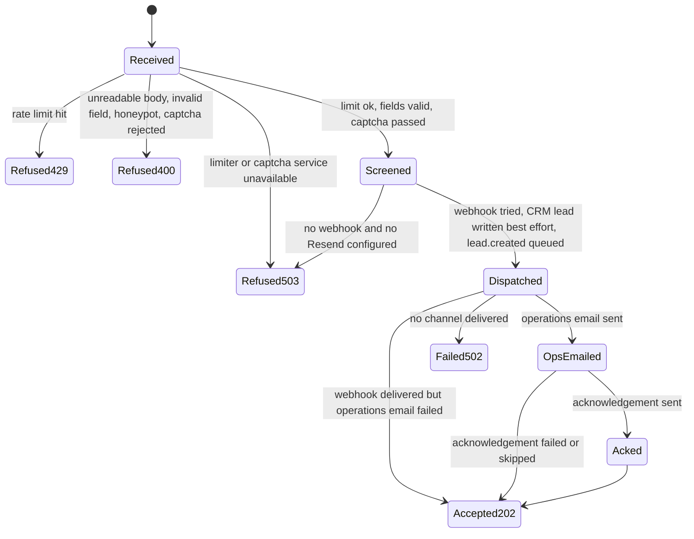
```mermaid
stateDiagram-v2
    [*] --> Received
    Received --> Refused429 : rate limit hit
    Received --> Refused503 : limiter or captcha service unavailable
    Received --> Refused400 : unreadable body, invalid field, honeypot, captcha rejected
    Received --> Screened : limit ok, fields valid, captcha passed
    Screened --> Refused503 : no webhook and no Resend configured
    Screened --> Dispatched : webhook tried, CRM lead written best effort, lead.created queued
    Dispatched --> OpsEmailed : operations email sent
    Dispatched --> Accepted202 : webhook delivered but operations email failed
    Dispatched --> Failed502 : no channel delivered
    OpsEmailed --> Acked : acknowledgement sent
    OpsEmailed --> Accepted202 : acknowledgement failed or skipped
    Acked --> Accepted202
```

| From -> to | Triggered by | Who | Enforced where | Side effects | Source |
| --- | --- | --- | --- | --- | --- |
| `[*] -> Received` | Visitor submits the form | anon | none | none | `app/api/contact/route.js#POST` |
| `Received -> Refused429 / Refused503` | Strict rate limit, 5 per 600 s per trusted client IP, checked before the body is read. Every attempt counts, valid or not. | anon | app action (Upstash through `checkRateLimitStrict`); fails closed in production, 503 with `Retry-After: 120` | none | `lib/rateLimit.mjs#checkRateLimitStrict` |
| `Received -> Refused400` | `validateContactForm`: name 1 to 100 chars, email regex and at most 254, company at most 160 (optional), budget one of `<$5k`, `$5–15k`, `$15–50k`, `$50k+`, brief 1 to 4000. A filled honeypot is rejected as spam. | anon | app action | none. No CRM write for spam. | `lib/contactForm.mjs#validateContactForm` |
| `Received -> Refused400 / Refused503` | hCaptcha siteverify. Missing or rejected token is 400. Secret missing in production or verifier unreachable is 503. | anon | app action | none | `lib/hcaptcha.mjs#verifyHCaptchaToken` |
| `Screened -> Refused503` | Neither `CONTACT_WEBHOOK_URL` nor `RESEND_API_KEY` is set. | anon | app action | none. **No CRM write either.** | `route.js#POST` |
| `Screened -> Dispatched` (webhook) | POST of the normalized JSON (no captcha token) to `CONTACT_WEBHOOK_URL`, aborted and raced at 5 s (500 to 10000 ms by `CONTACT_WEBHOOK_TIMEOUT_MS`). Never throws; delivered means `upstream.ok`. | route | app action | one outbound HTTP call | `route.js#deliverToWebhook` |
| `Screened -> Dispatched` (CRM write) | `rpc('create_lead_from_contact', {p_name, p_email, p_company, p_brief, p_budget, p_source:'website_contact_form'})` through the **SR** client. Never throws; a failure is logged and the CTA link is dropped. | route (SR) | RPC, granted to service_role only (0029:250-252) | see table 1b | `route.js#createLeadBestEffort`; 0029:46-248 |
| `Dispatched -> OpsEmailed` | `contactSubmissionEmail` to `getOperationsAddress()` (`CONTACT_NOTIFICATION_EMAIL`, else `SITE.email`), Reply-To the visitor, tag `contact-form`, no idempotency key. CTA `<APP_URL>/admin/deals/<deal_id>` only when the RPC returned a deal id. | route | app action | one email through Resend | `route.js#POST`; `lib/email/templates.js#contactSubmissionEmail` |
| `OpsEmailed -> Acked` | `contactAckEmail({name})` to the **visitor-supplied address**, tag `contact-ack`. Sent only if the operations email succeeded; its failure is logged only. | route | app action | one email to an arbitrary address | `route.js#POST`; `templates.js#contactAckEmail` |
| `-> Accepted202 / Failed502` | 202 when the webhook or the operations email delivered; 502 when neither did. | route | app action | none | `route.js#POST` |
| `Dispatched -> (later)` | The RPC also queued `lead.created` for the pinned admin; the drain sends it (lifecycle 8). | cron | RPC | outbox email `lead.created` | 0029:225-238 |

**Edge:**

- **Commit before verdict.** The CRM write happens before the delivery verdict. A 502 still leaves the lead and a queued `lead.created`; the visitor's retry (new captcha, still inside 5 per 10 min) appends a note to that deal and queues another `lead.created`.
- **Two notifications per success.** Every success sends the direct operations email and also queues the `lead.created` email to the pinned admin.
- **Mail to arbitrary addresses.** The acknowledgement goes to any address with any 100-char name, through the same Resend account that carries auth mail (CLAUDE.md AUP note). Gate: hCaptcha and 5 per 10 min per IP. No idempotency key on either send.
- **Runs outside the CRM flag.** `/api/contact` is not in the middleware matcher, so `NEXT_PUBLIC_CRM_ENABLED=false` still writes CRM leads.
- **No body-size cap** before `request.json()`; field caps apply after parse.
- **Lost lead.** If `create_lead_from_contact` raises (for example P0002, the pinned admin has no auth user), the lead exists only in the two emails. Nothing retries it.
- **Double submit.** Two requests from one visitor both pass (each counts toward the 5). The per-email advisory lock serializes the two RPC calls, so the second appends a note to the first's deal; the result is two `lead.created` rows, two operations emails and two acknowledgements.

### 1b. What the RPC does to CRM rows

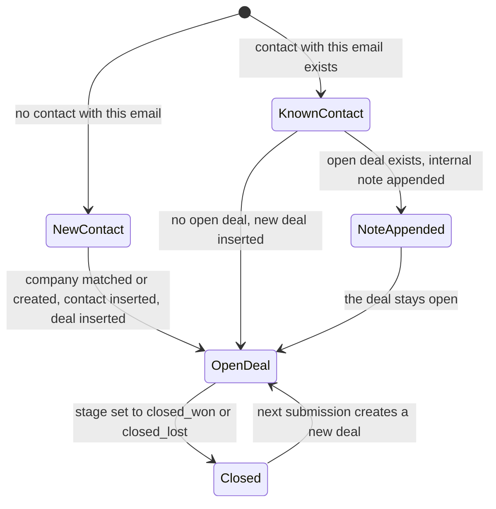
```mermaid
stateDiagram-v2
    [*] --> NewContact : no contact with this email
    [*] --> KnownContact : contact with this email exists
    NewContact --> OpenDeal : company matched or created, contact inserted, deal inserted
    KnownContact --> OpenDeal : no open deal, new deal inserted
    KnownContact --> NoteAppended : open deal exists, internal note appended
    NoteAppended --> OpenDeal : the deal stays open
    OpenDeal --> Closed : stage set to closed_won or closed_lost
    Closed --> OpenDeal : next submission creates a new deal
```

| From -> to | Triggered by | Who | Enforced where | Side effects | Source |
| --- | --- | --- | --- | --- | --- |
| `[*] -> NewContact` | No contact with `lower(email)`. Company: if a company name was given, match `lower(name)` (LIMIT 1, no ORDER BY) else insert; else if the email domain is not one of 13 free-mail domains, match a company whose email has that domain else insert one named after the domain; else (free mail, no company) insert a company named after the person. | SR via RPC | RPC; unique index `contacts_lower_email_unique_idx`; advisory lock per lowercased email | INSERT `companies` (name, email, created_by = pinned admin); INSERT `contacts` (first/last name split at the first space, status default `lead`, created_by = pinned admin) | 0029:130-173, 0029:42-44, 0029:106 |
| `NewContact -> OpenDeal` | Same call, next step | SR via RPC | RPC | INSERT `deals` (title `Website inquiry — <company or name>`, stage `prospecting`, owner = pinned admin, description = budget plus brief) | 0029:213-220 |
| `[*] -> KnownContact -> OpenDeal` | Contact exists and has no open deal (stage not `closed_won` or `closed_lost`) | SR via RPC | RPC | New `deals` row as above. The company field of the form is ignored; the contact is not updated. | 0029:188-193, 0029:213-220 |
| `KnownContact -> NoteAppended` | Contact exists and has an open deal (newest by `created_at`) | SR via RPC | RPC | INSERT `notes` (`visibility 'internal'`, content `New website inquiry (website_contact_form): <budget and brief>`) on company, contact and deal | 0029:201-211 |
| every path | End of the RPC | SR via RPC | RPC | outbox email `lead.created` `{lead_name, lead_email, lead_company, deal_id, note_appended}` to the pinned admin, `project_id` null. **No audit row** (`audit_events.actor_id` is NOT NULL). | 0029:225-238 |
| `OpenDeal -> OpenDeal` (stage moves) | Pipeline card select or the deal edit form | A | RLS on `deals`; `deals.stage` is free text with no CHECK. The UI offers prospecting, qualification, proposal, negotiation, closed_won, closed_lost, any to any. | `deals.stage`; nothing else. No notification, no audit, no project created. | `app/admin/deals/pipeline/page.jsx#STAGES`; 0001:60 |

**Edge:**

- **Strangers land inside client companies.** Company match by name or domain uses LIMIT 1 with no ORDER BY, `companies.name` is not unique, and the free-mail list has only 13 domains (so `proton.me`, `yahoo.co.uk` and others count as company domains). A lead can attach a contact to an existing client company; the "Clients can view company contacts" policy (0008:431) then lets that company's client read the row. Planned fix D4.
- **Duplicate companies under concurrency.** The advisory lock is per email; company match and create is unlocked. Two different addresses naming the same new company can create two companies.
- **Duplicate deals.** The dedupe uses `stage NOT IN (...)`, which is false for a NULL stage, so a deal with NULL stage never counts as open (0029:191).
- **Missing exit: lead to client.** Nothing links a deal to a project (`projects.source_deal_id` is written by no UI; `createProject` passes null), `closed_won` triggers nothing, and onboarding creates a brand-new company plus a contact with the account email. If that email is already a contact (the lead), the insert violates `contacts_lower_email_unique_idx` and raises 23505, the same code as "already linked", so the client is blocked and cannot tell why (0046:332). Planned fix D6.
- **Admin identity differs from other alerts.** The lead is attributed through `auth.users.email = pinned_admin_email()` (0029:108-115), while every other alert uses `profiles.role = 'admin'`. If the pinned account is missing or its email changed, every submission raises P0002.
- **Brief truncation is silent.** The RPC cuts brief to 4000 and budget to 50 chars; the route's validation already caps brief at 4000.

---

## 2. Account

Five sub-flows share the `profiles` row and `auth.users`: signup to onboarding (2a), admin invite (2b), password reset (2c), staff request and role change (2d), and the pinned admin (2e).

### 2a. Signup, confirm, first sign-in, onboarding

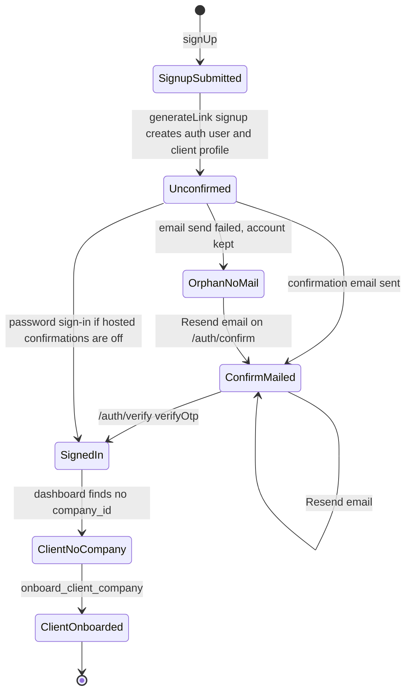
```mermaid
stateDiagram-v2
    [*] --> SignupSubmitted : signUp
    SignupSubmitted --> Unconfirmed : generateLink signup creates auth user and client profile
    Unconfirmed --> ConfirmMailed : confirmation email sent
    Unconfirmed --> OrphanNoMail : email send failed, account kept
    OrphanNoMail --> ConfirmMailed : Resend email on /auth/confirm
    ConfirmMailed --> ConfirmMailed : Resend email
    ConfirmMailed --> SignedIn : /auth/verify verifyOtp
    Unconfirmed --> SignedIn : password sign-in if hosted confirmations are off
    SignedIn --> ClientNoCompany : dashboard finds no company_id
    ClientNoCompany --> ClientOnboarded : onboard_client_company
    ClientOnboarded --> [*]
```

| From -> to | Triggered by | Who | Enforced where | Side effects | Source |
| --- | --- | --- | --- | --- | --- |
| `[*] -> SignupSubmitted` | `/signup` form -> `signUp`. Fields: email, password, fullName, accountType (`client` or `employee`). | anon | app action: presence only, accountType in `SIGNUP_ACCOUNT_TYPES`, rate limit `auth:signup` 5 per 600 s per IP and per email (fails open when Upstash is not configured). No email normalization, no length caps, no password policy beyond GoTrue's. | none | `app/auth/actions.js#signUp`; `lib/auth/roles.mjs#SIGNUP_ACCOUNT_TYPES` |
| `SignupSubmitted -> Unconfirmed` | SR `auth.admin.generateLink({type:'signup', email, password, options.data:{full_name, account_type}})` | anon | GoTrue; trigger `on_auth_user_created` | `auth.users` row; `profiles` row: `role` always `client`, `full_name` from metadata (unbounded), `requested_staff_access` true only when `account_type` is `employee`. A trigger error aborts the signup. No audit, no outbox. | `signUp`; `handle_new_user` 0014b:17-38 (same body as 0014:83-108); trigger 0001:267-269 |
| `Unconfirmed -> ConfirmMailed` | Same action, next step: `confirmSignupEmail` through Resend, tag `signup-confirm`, link `<APP_URL>/auth/verify?token_hash&type&next=/dashboard` | anon | app action. Link origin is the raw `NEXT_PUBLIC_APP_URL` at HEAD (F10 pending: fail-closed `getAppUrl()`). | one email; redirect to `/auth/confirm?email=<enc>` | `signUp`; `lib/supabase/admin.js#buildVerifyUrl` |
| `Unconfirmed -> OrphanNoMail` | Resend send throws | anon | app action | account stays; returns "Account created, but the confirmation email failed to send." | `signUp` |
| `OrphanNoMail / ConfirmMailed -> ConfirmMailed` | "Resend email" on `/auth/confirm` -> `resendConfirmationEmail`, email taken from the URL `?email=` | anyone who knows the address | app action: rate limit `auth:resend` 5 per 600 s; always `{success:true}` (throttled, unknown address, config and send errors are all silent) | new `generateLink(signup)` token plus email | `actions.js#resendConfirmationEmail`; `app/auth/confirm/page.jsx` |
| `ConfirmMailed -> SignedIn` | User opens the emailed link -> `GET /auth/verify` -> `verifyOtp({token_hash, type})` | holder of the one-time token | GoTrue verifies; app passes `next` through `safeAuthNext` (portal paths, `/auth/reset-password`, `/auth/confirm`), default `/dashboard` | email confirmed, session cookies set, 307 to `/dashboard` or `/login?error=auth-callback-failed` | `app/auth/verify/route.js#GET` |
| `Unconfirmed -> SignedIn` | Password sign-in before verifying | the user | hosted Supabase confirmation setting. Local `enable_confirmations = false` (config.toml:249); hosted UNVERIFIED. With confirmations on, GoTrue answers "Email not confirmed" and `friendlyAuthError` shows the confirm-email text. | session | `actions.js#signIn`; `lib/auth-errors.js` |
| `SignedIn -> ClientNoCompany` | Client lands on `/dashboard`; the page effect finds `profiles.company_id` null and does `router.replace('/onboarding')` | client | UI only (middleware lets a client into `/dashboard`) | none | `app/dashboard/page.jsx#loadData` |
| `ClientNoCompany -> ClientOnboarded` | `/onboarding` form -> `onboardClientCompany` -> `rpc('onboard_client_company', {p_company_name, p_contact_name, p_phone})` | C without company | page: `requireRole(['client'])`, redirects away when `company_id` is set. app action: company 1 to 120, contact 1 to 120, phone at most 40. RPC: client role, `FOR UPDATE` on the profile, `company_id` null else 23505, names non-empty, account email present. | INSERT `companies` (email = auth email); INSERT `contacts` (name, `last_name ''`, auth email, status `client`); INSERT `company_members` (role `owner`); UPDATE `profiles.company_id`; outbox **email** `client.onboarded` to every admin profile, `project_id` null; `revalidatePath('/dashboard')`; redirect `/dashboard`. No audit, no in_app. | `app/actions/onboarding-actions.js#onboardClientCompany`; 0046:276-378 |
| `any -> SignedIn` (later sign-ins) | `/login/<portal>` -> `signIn` (portal, email, password, next) | the user | app action: profile role must equal the portal's role, else `signOut()` and redirect `?error=portal` (reveals that the password was correct); `next` through `safeNextForPortal`; no app rate limit | session cookies; redirect to `next` or the role home | `actions.js#signIn`; `lib/auth/roles.mjs` |

**Edge:**

- **Confirmation may not be enforced.** Whether a user must click the link depends on the hosted GoTrue setting (UNVERIFIED). If it is off, the confirmation email is decorative and the account is usable at once.
- **User exists before the mail does.** `generateLink` creates the account first; a send failure leaves an unconfirmed account (recoverable through Resend only if the visitor has the `?email=` URL).
- **Enumeration asymmetry.** `signUp` returns "An account with that email already exists" (`friendlyAuthError`); resend and reset are silent by design. What `generateLink(signup)` does for an existing unconfirmed address (reissue, or overwrite the password) is UNVERIFIED.
- **Token burn.** The verify link is a GET that consumes a single-use token; mail scanners that prefetch it can burn it (UNVERIFIED, standard GET-verify risk). The v1.117 "continue to dashboard" button on `/auth/confirm` cannot tell whether verification happened; an unverified visitor goes to `/dashboard`, then to login with `next`.
- **Onboarding double submit.** The second call raises 23505 "already linked", shown as a generic error although the first call succeeded.
- **Signup double submit.** The second `generateLink(signup)` meets the user the first one created and returns "An account with that email already exists", although the first succeeded. How the uncontrolled React 19 form resets after a server error is UNVERIFIED in a browser (E14 in the UI inventory).
- **Onboarding can be blocked for good.** An existing contact with the same email (lead or admin-created) raises 23505 as well (planned fix D6). `profiles.company_id` has no FK, so an admin deleting the company strands the client: onboarding refuses ("already linked") and `create_project` fails "Company not found".
- **Employee signups go through client onboarding.** A pending staff requester is a client until approved, so they create a company, contact and `company_members` row, and the admin gets a `client.onboarded` email for a person who may become staff. The only on-screen hint that the request is pending is the static note on `/signup`.
- **`/onboarding` is outside the middleware gate.** `portalForPath` does not match it, so the must-set-password check and the role redirect do not run there; the page's own `requireRole` is the only guard.
- **Display copy.** The onboarding form names "Crystal Web Solution" (CLAUDE.md identity rule). F9 pending.

### 2b. Admin invite

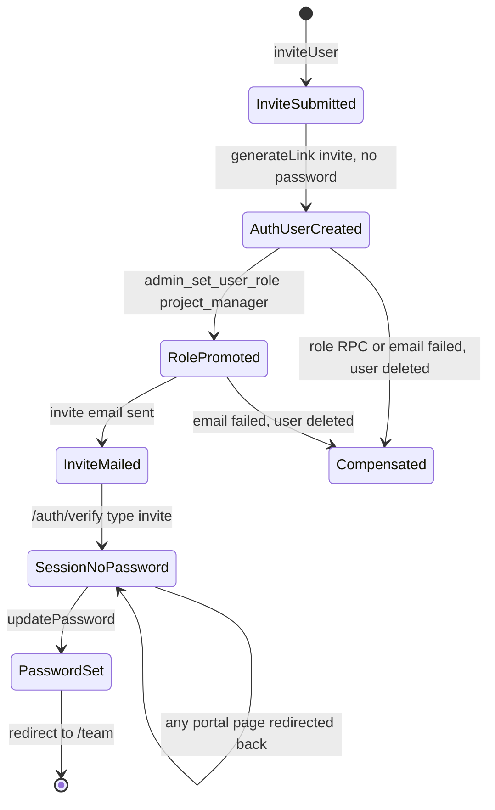
```mermaid
stateDiagram-v2
    [*] --> InviteSubmitted : inviteUser
    InviteSubmitted --> AuthUserCreated : generateLink invite, no password
    AuthUserCreated --> RolePromoted : admin_set_user_role project_manager
    RolePromoted --> InviteMailed : invite email sent
    AuthUserCreated --> Compensated : role RPC or email failed, user deleted
    RolePromoted --> Compensated : email failed, user deleted
    InviteMailed --> SessionNoPassword : /auth/verify type invite
    SessionNoPassword --> SessionNoPassword : any portal page redirected back
    SessionNoPassword --> PasswordSet : updatePassword
    PasswordSet --> [*] : redirect to /team
```

| From -> to | Triggered by | Who | Enforced where | Side effects | Source |
| --- | --- | --- | --- | --- | --- |
| `[*] -> InviteSubmitted` | `/admin/users/invite` -> `inviteUser` (email, fullName, role) | A | `requireRole(['admin'])`; role must be `project_manager` (`INVITABLE_ROLES`); presence checks only | none | `app/admin/users/actions.js#inviteUser` |
| `InviteSubmitted -> AuthUserCreated` | SR `generateLink({type:'invite', options.data.full_name, redirectTo})` | A | GoTrue (fails for an existing email with the raw provider message returned) | `auth.users` row with no password; `profiles` row created as `client` by the trigger | `inviteUser` |
| `AuthUserCreated -> RolePromoted` | US `rpc('admin_set_user_role', {p_user_id, p_role:'project_manager'})` | A | RPC: `is_admin()`, role in set, not self, advisory lock | `profiles.role`. No audit. | 0008:143-198 |
| `RolePromoted -> InviteMailed` | `inviteUserEmail`, tag `invite`, link `next=/auth/reset-password?reason=invite` | A | app action | one email | `lib/email/templates.js#inviteUserEmail` |
| `-> Compensated` | Role RPC or send failed: SR `auth.admin.deleteUser(...).catch(() => null)` | A | app action | auth user and cascaded profile removed; a failed delete is swallowed and leaves an orphan | `inviteUser` |
| `InviteMailed -> SessionNoPassword` | Invitee opens the link -> `/auth/verify` (type `invite`) | token holder | GoTrue; `safeAuthNext` allows `/auth/reset-password` | session cookies; redirect to the set-password page | `app/auth/verify/route.js#GET` |
| `SessionNoPassword -> SessionNoPassword` | Any portal path | invitee | middleware: `rpc('current_user_must_set_password')` true -> 307 `/auth/reset-password?reason=invite`. **Fails open** on RPC error. | none | `middleware.js`; 0039:19-35 |
| `SessionNoPassword -> PasswordSet` | `/auth/reset-password` -> `updatePassword` -> `auth.updateUser({password})` | session holder | app action: presence; client form: confirm match, `minLength` 6 | `auth.users.encrypted_password`; `passwordChangedEmail` (best effort, tag `password-changed`); redirect to role home (`/team`) | `actions.js#updatePassword` |

**Edge:**

- **Three non-atomic writes.** Create, promote, mail. Compensation deletes swallow their own errors; an orphan profile or auth user is possible. Raw provider text is returned to the admin on failure.
- **Not idempotent, and existing accounts cannot be invited.** Use `changeUserRole` for an existing user. Only `project_manager` is invitable.
- **Expired or consumed link.** What the invitee can do next is UNVERIFIED: `/forgot-password` calls `generateLink(recovery)` for a user who never confirmed, and GoTrue's answer is not confirmed here. Hosted OTP expiry is also UNVERIFIED (local is 3600 s, config.toml:255-257).
- **Gate coverage.** The must-set-password gate covers the three portals only. It does not cover `/onboarding` or `/auth/*`, and it fails open if the RPC is missing or errors.
- **Client-side redirect handling.** The invite page swallows `NEXT_REDIRECT` (`return`) where other forms rethrow it; whether navigation still happens is UNVERIFIED (`app/admin/users/invite/page.jsx`).
- **Link origin.** Built from the raw `NEXT_PUBLIC_APP_URL` at HEAD; the working tree carries F10.

### 2c. Password reset

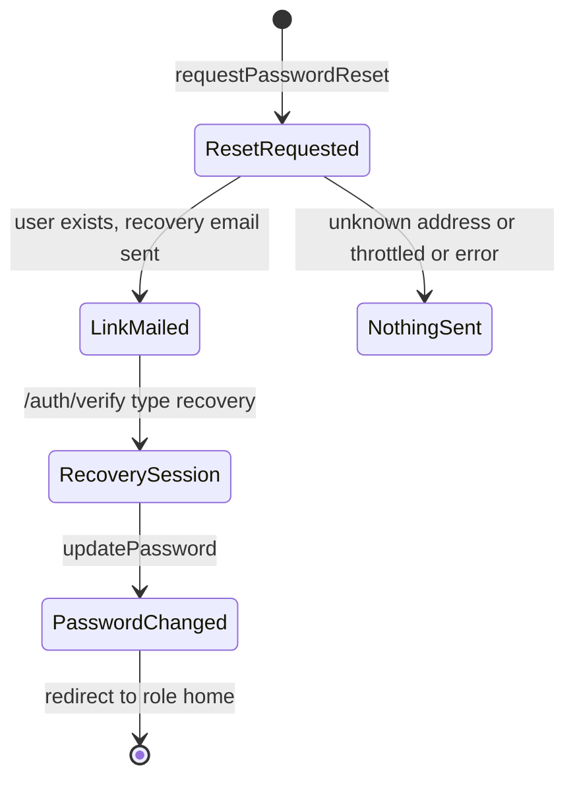
```mermaid
stateDiagram-v2
    [*] --> ResetRequested : requestPasswordReset
    ResetRequested --> LinkMailed : user exists, recovery email sent
    ResetRequested --> NothingSent : unknown address or throttled or error
    LinkMailed --> RecoverySession : /auth/verify type recovery
    RecoverySession --> PasswordChanged : updatePassword
    PasswordChanged --> [*] : redirect to role home
```

| From -> to | Triggered by | Who | Enforced where | Side effects | Source |
| --- | --- | --- | --- | --- | --- |
| `[*] -> ResetRequested` | `/forgot-password` -> `requestPasswordReset(email)` | anon | app action: rate limit `auth:reset` 5 per 600 s; **always returns `{success:true}`** | none | `app/auth/actions.js#requestPasswordReset` |
| `ResetRequested -> LinkMailed` | SR `generateLink({type:'recovery', redirectTo})` succeeds, then `resetPasswordEmail` (tag `password-reset`, `next=/auth/reset-password`) | anon | GoTrue (error means unknown user, silently ignored) | one email | same |
| `LinkMailed -> RecoverySession` | `/auth/verify?type=recovery` | token holder | GoTrue | session cookies | `app/auth/verify/route.js#GET` |
| `RecoverySession -> PasswordChanged` | `/auth/reset-password` -> `updatePassword` | session holder | app action (presence); form checks match and 6 chars | new password; `passwordChangedEmail` (best effort); redirect to `homeForRole(profile.role)`, else `/dashboard` | `actions.js#updatePassword` |

**Edge:**

- **No guard on `updatePassword`.** No rate limit and no re-authentication; any live session (including a recovery session) can change the password, and other sessions are not revoked.
- **Silent on failure.** Throttled, unknown-address and mail-failure cases all look like success to the visitor.

### 2d. Staff request and role changes

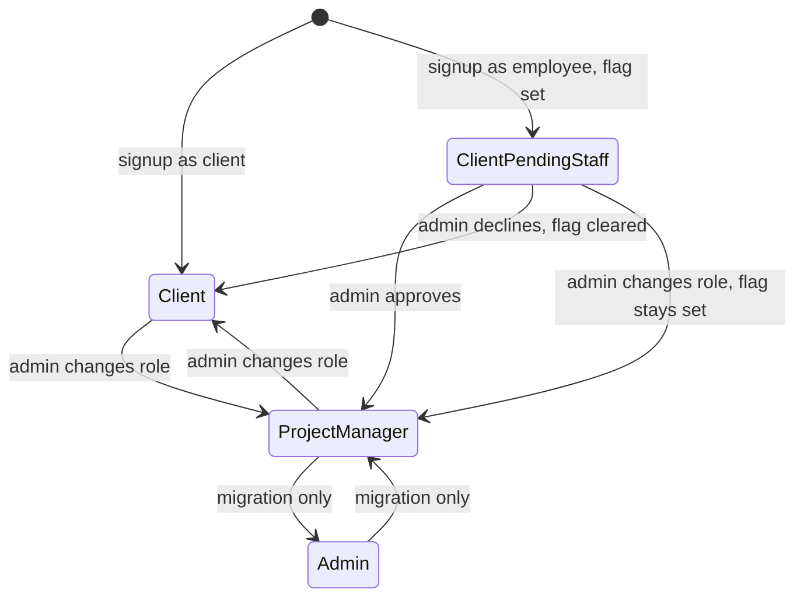
```mermaid
stateDiagram-v2
    [*] --> Client : signup as client
    [*] --> ClientPendingStaff : signup as employee, flag set
    ClientPendingStaff --> ProjectManager : admin approves
    ClientPendingStaff --> Client : admin declines, flag cleared
    Client --> ProjectManager : admin changes role
    ProjectManager --> Client : admin changes role
    ProjectManager --> Admin : migration only
    Admin --> ProjectManager : migration only
    ClientPendingStaff --> ProjectManager : admin changes role, flag stays set
```

| From -> to | Triggered by | Who | Enforced where | Side effects | Source |
| --- | --- | --- | --- | --- | --- |
| `[*] -> Client / ClientPendingStaff` | Insert into `auth.users` | trigger | trigger `handle_new_user`: role hard-coded `client`; the flag is `lower(metadata.account_type) = 'employee'`; role is never read from metadata | `profiles` row | 0014b:17-38 |
| `ClientPendingStaff -> ProjectManager` | `/admin/users` Approve -> `resolveStaffRequest(userId, 'approve')` -> `rpc('admin_resolve_staff_request', {p_user_id, p_approve:true})` | A | RPC: `is_admin()`, row must have the flag else P0002. Profile guard trigger passes because the RPC owner runs it. | `profiles.role = project_manager`, flag false. `company_id`, `company_members`, assignments untouched. **No audit, no notification to the user.** | 0014:112-152; `app/admin/users/actions.js#resolveStaffRequest` |
| `ClientPendingStaff -> Client` | Decline (`p_approve:false`) | A | RPC as above | flag false, role unchanged. The flag can be set only at INSERT and the guard blocks UPDATE, so the account can never re-request. | 0014:112-152 |
| `Client <-> ProjectManager` | `/admin/users` role select -> `changeUserRole` -> `rpc('admin_set_user_role')` | A | app action allow-list `['project_manager','client']`; RPC: `is_admin()`, role in `client, project_manager, admin`, no self-change, last admin cannot be demoted (23514), advisory lock | `profiles.role`. Role-bound rows (assignments, `company_id`, `company_members`, `requested_staff_access`) untouched. No audit. | 0008:143-198; `actions.js#changeUserRole` |
| `-> Admin` | None in the UI or actions. The RPC would accept `admin`, but the trigger accepts it only for the pinned email and `profiles_single_admin_idx` allows one admin row. | SQL owner | trigger `enforce_pinned_admin`; unique index | moving the admin was done by migration DO blocks (0042, 0044) | 0014:46-79 |
| `any -> Client/ProjectManager` (self-escalation attempt) | Direct UPDATE of own profile row | any user | trigger `prevent_unauthorized_profile_changes` blocks role, `company_id`, `requested_staff_access`, `created_at` unless `current_user` owns `admin_set_user_role`. The `requested_staff_access` and `created_at` part is new in 0046 (live status UNVERIFIED). | blocked with 42501 | 0046:386-411 |

**Edge:**

- **Role change leaves relationships behind.** A demoted PM keeps assignments; a promoted client keeps `company_id`. `recipients(v)` has no role filter, so a user demoted from PM to client keeps receiving in_app and email excerpts of internal messages for projects they can no longer open. The drain drops queued email only for recipients whose current role is still `project_manager` and who are no longer assigned (`resolveLiveAssignments`); a demoted user is now a client and is not filtered. A promoted client stays in the company fan-out. Planned fix D2.
- **Self-demotion of the only admin.** `admin_resolve_staff_request` has neither the self-change guard nor the last-admin guard that `admin_set_user_role` has. If the pinned admin's profile has `requested_staff_access = true`, Approve makes them a project manager and leaves zero admins; only a migration recovers. The Users page lists every flagged row, including the admin's. Whether the live flag is set is UNVERIFIED. Planned fix D7.
- **Two paths, one flag.** Changing a pending user's role with the select does not clear the flag, so the user stays in the pending list.
- **Stale sessions.** The app reads `profiles.role` on every request, so a changed user is rerouted on the next navigation; the JWT `app_metadata.role` is stale and unused.
- **Audit gap.** Role changes and staff resolutions write no `audit_events` row.
- **Optimistic UI.** The Users page applies the change locally and rolls back to a whole-list snapshot on error, which can also revert an unrelated concurrent change.

### 2e. Pinned admin

| Fact | Detail | Source |
| --- | --- | --- |
| Pin history | `ethan@crystalwebsolution.com` (0014) -> `ethan@cdsportswearinc.com` (0042) -> `moizj00@gmail.com` (0044). Ethan's account was demoted to project_manager. | 0014:38; 0042:61; 0044:20 |
| One admin row | Partial unique index on `profiles` where role is admin | 0014:46 |
| Only the pinned address may hold admin | `BEFORE INSERT OR UPDATE OF role` trigger reads `auth.users.email`; it does not re-check when the email later changes | 0014:50-79 |
| Moving the pin | By migration only (rename and demote in 0042, demote and promote in 0044); no UI, no RPC path, because promotion requires an existing admin and the last admin cannot be demoted | 0042:82-131; 0044:35-56 |
| Who depends on the pin | `create_lead_from_contact` (lead attribution, `lead.created` recipient, via `auth.users.email`); everything else addressed to "admin" uses `profiles.role = 'admin'` | 0029:108-115; 0046:238-241, 373-374 |
| Live value | Re-check with `select public.pinned_admin_email()`; CLAUDE.md records the 0044 move as applied on 2026-09-27 | CLAUDE.md |

---

## 3. Brief

A client starts a private draft from a service card, answers a guided questionnaire with autosave, and submits it. Submission either creates a new project or attaches the brief to one of the client's existing projects.

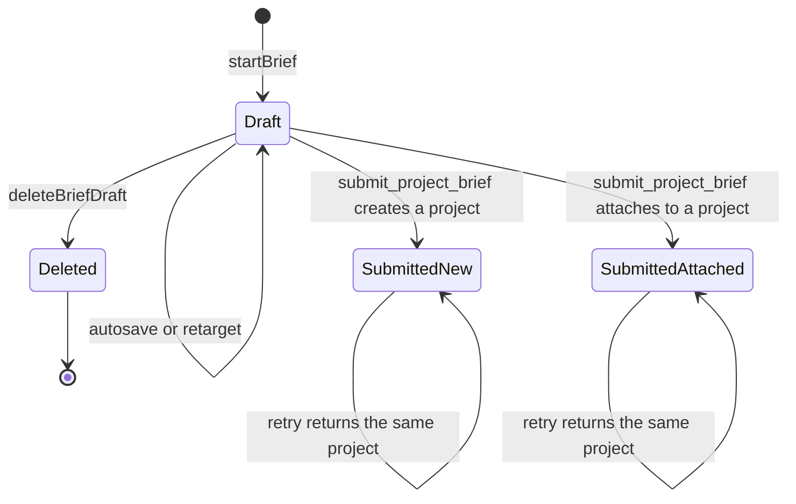
```mermaid
stateDiagram-v2
    [*] --> Draft : startBrief
    Draft --> Draft : autosave or retarget
    Draft --> Deleted : deleteBriefDraft
    Draft --> SubmittedNew : submit_project_brief creates a project
    Draft --> SubmittedAttached : submit_project_brief attaches to a project
    SubmittedNew --> SubmittedNew : retry returns the same project
    SubmittedAttached --> SubmittedAttached : retry returns the same project
    Deleted --> [*]
```

| From -> to | Triggered by | Who | Enforced where | Side effects | Source |
| --- | --- | --- | --- | --- | --- |
| `[*] -> Draft` | Service card on `/dashboard`, or "add brief" on a project's Brief tab -> `startBrief(briefType, projectId?)` | C with `company_id` | app action: `isBriefType` (logo, website, seo, ppc), project id canonical. RLS insert policy: author, status `draft`, role client, own company, project accessible or null. CHECKs on type, status, title length, answers object and at most 60000 bytes. | INSERT `project_briefs` (answers prefilled from `companies.name/website/industry`, title from `briefDisplayTitle`, `template_version` 1). No audit, no outbox. Double click creates two drafts. | `app/actions/brief-actions.js#startBrief`; 0043:130-141 |
| `Draft -> Draft` (autosave) | `BriefWizard` edits, debounced 900 ms -> `saveBriefDraft(briefId, answers)`; flush on step change, unmount and submit; `beforeunload` guard | C author | app action: `sanitizeBriefAnswers`, at most 56000 bytes, `.eq('status','draft')`. RLS update policy (author, draft, own company, project accessible). Trigger forces `id` and `created_at` immutable and bumps `updated_at`. | UPDATE `answers`, `title`. Failures back off up to 60 s; `retryable:false` (RLS, CHECK, validation) stops retries. | `brief-actions.js#saveBriefDraft`; `components/crm/BriefWizard.jsx#flush`; 0043:145-160, 0043:88-106 |
| `Draft -> Draft` (retarget) | `submitBrief` re-points `project_id` before calling the RPC when the chosen destination differs | C author | app action pre-write; RLS with-check `can_access_project` | UPDATE `project_briefs.project_id`. A later RPC failure leaves the draft re-pointed. | `brief-actions.js#submitBrief` |
| `Draft -> Deleted` | Delete button (browser `confirm`) -> `deleteBriefDraft(briefId)` | C author | RLS delete policy: author and draft only; app action asks for the deleted row back to detect a miss, and re-reads status to report `conflict` | row removed. No audit. | `brief-actions.js#deleteBriefDraft`; 0043:164-171 |
| `Draft -> SubmittedNew` | Wizard submit with destination "new project" -> `submitBrief` -> `rpc('submit_project_brief', {p_brief_id, p_summary, p_project_id:null, p_project_title, p_target_date})` | C author | app action: required answers present (`missingRequiredAnswers`), title 3 to 120, date valid. RPC: role client with company, brief owned, same company, not already submitted, summary 1 to 10000, `answers <> {}`, no existing project with `client_generated_id = brief.id`. CHECK `project_briefs_submission_state_check` (submitted needs `submitted_at` and `project_id`). | Calls `create_project` with the brief id as idempotency key: INSERT `projects` (status `brief_submitted`, category by type: logo -> logo_creation, website -> web_design, seo and ppc -> marketing; `brief` = rendered summary), `project_threads`, `project_status_history` (null -> brief_submitted, shared), audit `project.created`. Then UPDATE brief (status `submitted`, `submitted_at`, `project_id`); audit `project.brief_submitted`; outbox in_app and email `project.brief_submitted` to **every admin profile plus assigned staff, minus the submitter**; outbox in_app and email `project.brief_received` to the submitter (0046). Client page shows "Brief received". | 0046:87-268; `brief-actions.js#submitBrief` |
| `Draft -> SubmittedAttached` | Same, destination "add to project" with a project id | C author | RPC: project must belong to the client's company, be accessible, and not be `cancelled` | brief set to submitted with that `project_id`; audit; the same two outbox events with `created_project:false`. **Project status is not changed.** The summary is validated but stored nowhere (the answers stay in `project_briefs`). | 0046:184-198 |
| `Submitted -> Submitted` (retry) | Second `submitBrief` for the same brief | C author | RPC early return | returns the stored `project_id`; no new rows, no re-notification | 0046:137-140 |
| `Submitted -> anything` | None | nobody | RLS: no UPDATE or DELETE policy matches a submitted row | terminal. Removed only by cascade from the project (`project_id` FK cascade) or company. | 0043:145-171 |

**Edge:**

- **Delivered projects accept briefs.** Only `cancelled` is refused (UI list `status !== 'cancelled'`, RPC check at 0046:195). Attaching a brief neither reopens a delivered project nor notifies the client; staff are notified.
- **Required answers are an app rule.** The database only requires `answers <> {}`. A caller using the RPC directly bypasses `missingRequiredAnswers`.
- **Free-form project creation is a parallel path.** `BriefSubmissionForm` -> `createProject` -> `create_project` writes a project but no `brief_*` outbox row and no admin alert, and the action does not pass `p_client_generated_id`, so a double submit makes two projects. The project waits at `brief_submitted` until an admin looks. Categories `branding` and `ai_automation` are reachable only here.
- **Drafts have no TTL and no staff visibility.** Staff never see an unsent draft (0043 header). An abandoned draft stays until the client deletes it.
- **Two tabs overwrite each other.** Autosave has no version check; the last write wins.
- **Date source.** The new-project date defaults to `answers.deadline` or `answers.start_date` (both `date` fields); the wizard cannot clear it back to empty once such an answer exists.
- **Admin alert fan-out ignores assignment.** `brief_submitted` always goes to every admin, unlike `recipients(v)` where the admin drops off once a PM is assigned.
- **Double click on Submit is safe.** The RPC locks the brief row; a second call finds it submitted and returns the same project (the retry row above), so no second project and no second alert.

---

## 4. Project status machine

Nine statuses (`projects_status_check`, 0009:60-72; default `brief_submitted`, 0009:50). Only the RPC `transition_project_status` moves a project after creation. There is no trigger guard: a service-role write bypasses the machine.

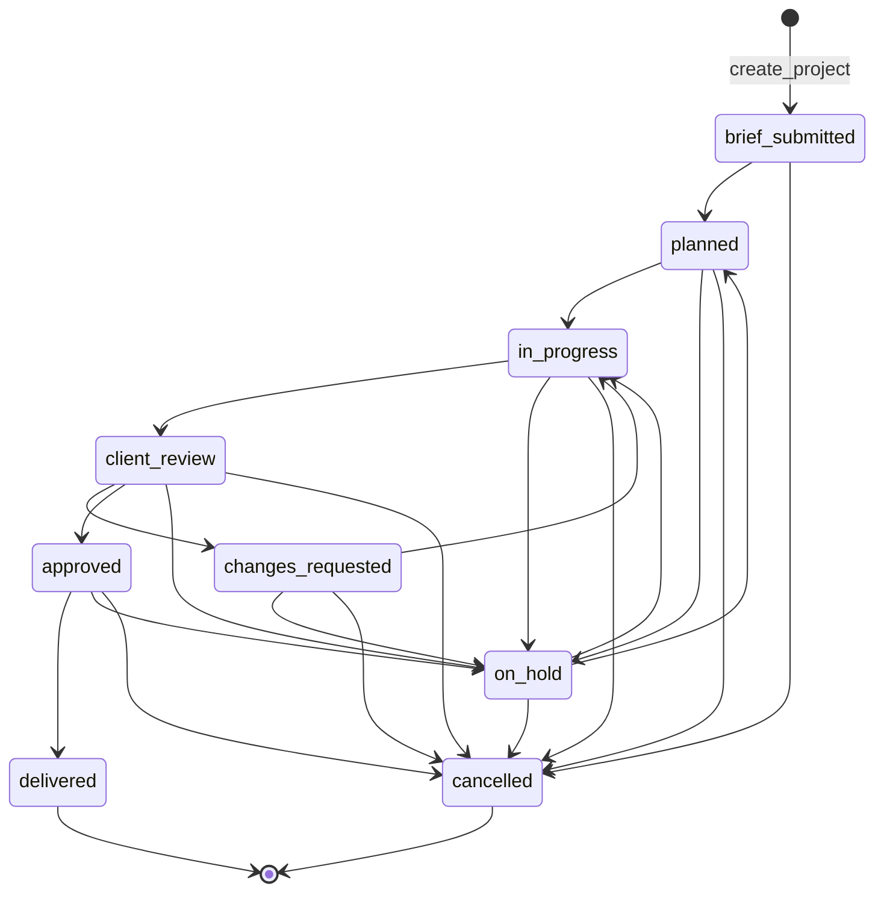
```mermaid
stateDiagram-v2
    [*] --> brief_submitted : create_project
    brief_submitted --> planned
    brief_submitted --> cancelled
    planned --> in_progress
    planned --> on_hold
    planned --> cancelled
    in_progress --> client_review
    in_progress --> on_hold
    in_progress --> cancelled
    client_review --> changes_requested
    client_review --> approved
    client_review --> on_hold
    client_review --> cancelled
    changes_requested --> in_progress
    changes_requested --> on_hold
    changes_requested --> cancelled
    approved --> delivered
    approved --> on_hold
    approved --> cancelled
    on_hold --> planned
    on_hold --> in_progress
    on_hold --> cancelled
    delivered --> [*]
    cancelled --> [*]
```

**Effects shared by every transition (CE):** UPDATE `projects.status` and `updated_at` (0030:94-97); INSERT `project_status_history` (from, to, note, visibility, `changed_by`) (0030:99-115); audit `project.status_transitioned` (0030:117-135); outbox in_app and email `project.status_transitioned` `{from_status, to_status}` to `recipients(visibility)` (0030:137-145); realtime `project_status_changed` on the shared and internal topics (trigger, 0050:32-55 and 190-193); `revalidatePath` on the client, team and admin pages of the project.

| From -> to | Triggered by | Who | Enforced where | Side effects | Source |
| --- | --- | --- | --- | --- | --- |
| `[*] -> brief_submitted` | `create_project` (brief wizard, or the free-form form) | C with company; A through the RPC (no UI) | RPC (role, company match, category, title 3 to 120, brief 1 to 10000); CHECK; unique `(created_by, client_generated_id)` for idempotency | `projects`, `project_threads`, history row, audit `project.created`. No outbox from `create_project` itself. | 0031:18-194 |
| `brief_submitted -> planned` | (a) `setLeadProjectManager` after assigning a PM, with a shared note naming the manager (`managerAssignedNote`); (b) the "Move to planned" button | (a) A; (b) A or PM assigned | RPC state machine (0030:77-86), assignment check (0030:65-67), CHECK on values, row lock `FOR UPDATE`; app action pre-check `canTransition` | CE. This is the client's first "your project is planned" email. | `app/actions/assignment-actions.js#setLeadProjectManager`; `project-actions.js#transitionProject`; 0030:33-161 |
| `brief_submitted -> cancelled` | "Move to cancelled" | A or PM assigned | same | CE | same |
| `planned -> in_progress / on_hold / cancelled` | "Move to ..." buttons | A or PM assigned | same | CE | same |
| `in_progress -> client_review / on_hold / cancelled` | same buttons | A or PM assigned | same | CE. Client dashboard shows "Needs your attention" for `client_review`. | same; `lib/crm/labels.mjs#CLIENT_ACTION_STATUSES` |
| `client_review -> changes_requested / approved / on_hold / cancelled` | same buttons. Staff record the client's decision; the client has no control. | A or PM assigned | same | CE | same |
| `changes_requested -> in_progress / on_hold / cancelled` | same buttons | A or PM assigned | same | CE. `changes_requested -> client_review` is not allowed. | same |
| `approved -> delivered` | "Move to delivered" | A or PM assigned | same | CE **plus** outbox email `project.delivered` `{project_name}` to **every profile with the project's `company_id`**, regardless of visibility, role or actor | 0030:147-157 |
| `approved -> on_hold / cancelled` | same buttons | A or PM assigned | same | CE | same |
| `on_hold -> planned / in_progress / cancelled` | same buttons | A or PM assigned | same | CE. There is no way back to `client_review`, `changes_requested` or `approved`. | same |
| `delivered -> *`, `cancelled -> *` | none | nobody | RPC: no allowed target. App `canTransition` and the contract `ALLOWED_TRANSITIONS` agree (`TERMINAL_PROJECT_STATUSES`). | terminal | `lib/crm/project-contract.mjs#ALLOWED_TRANSITIONS`, `#TERMINAL_PROJECT_STATUSES` |

### Status notes

| Source of the note | Text and visibility | Where it shows | Source |
| --- | --- | --- | --- |
| Team page transition button | Auto text `Status moved to <enum>.` (raw enum, for example `in_progress`), visibility defaults to `shared` | Timeline, to clients too | `app/team/projects/[id]/page.jsx#handleTransition` |
| Admin page transition button | `Status moved to <enum> by admin.`, visibility `shared` | same | `app/admin/projects/[id]/page.jsx#handleTransition` |
| `setLeadProjectManager` | `managerAssignedNote(name, projectId)`, `shared` | same; reused as the wording of the client email | `assignment-actions.js` |
| "Project Updates" panel (`post_project_note`) | Free note 1 to 2000 chars, `shared` (the UI never sends `internal`). History row with `from_status = to_status`; audit `project.note_posted`; outbox **in_app only** `project.note_posted` to assigned staff, never to the client and never to admin | `NotesPanel`, Timeline | `components/crm/NotesPanel.jsx`; 0013:55-151 |

No UI offers a custom status note or an internal one. `internal` status notes and internal notes exist in the database and RPCs but cannot be created from any screen.

**Edge:**

- **Terminal means only the status is frozen.** No RPC gates its write on `projects.status` except `transition_project_status` (the machine) and `submit_project_brief` (refuses `cancelled`). Messages, notes, files, tasks, approvals, assignments and (for `delivered`) briefs can all be added to a delivered or cancelled project, and notifications keep flowing.
- **`on_hold` loses the place.** Leaving it can only reach `planned` or `in_progress`; work that was in `client_review` must pass through `in_progress` again.
- **The client cannot act on `client_review`.** The status text says "Something is ready for you to look at" but the client has no approve or request-changes control. Approval is a staff assertion, entered after a message. Nothing ties it to approvals or deliverables (lifecycle 6).
- **Double click (committed code).** Transition buttons have no pending state. A second click sends a transition that is now illegal; the RPC answers 22023, the action returns a generic error, and the page's `error` state replaces the whole workspace with an error screen. Cancelled (terminal) is one click with no confirmation. F4 pending (pending state, in-place error, `confirm` for Cancelled).
- **`fromStatus` is advisory.** The form sends it, `canTransition` checks it, the RPC never receives it and judges the locked row. A stale page produces a generic failure, not a precise one.
- **Concurrency.** `FOR UPDATE` serializes two callers; the second fails the machine.
- **Existence oracle.** P0002 "Project not found" is raised before the access check (0030:61-67).
- **Fan-out quirks.** `delivered` sends two emails to every company member (`status_transitioned` and `delivered`), ignores note visibility and role, and has no actor exclusion. Planned fix D2 covers the role part.
- **Moves nobody sees.** `projects.updated_at` moves only on transitions, not on messages or tasks. Assignment changes broadcast nothing.
- **Fixed since the inventory.** v1.116 made the admin buttons follow `ALLOWED_TRANSITIONS`, so the admin now has `brief_submitted -> planned` and the `on_hold` exits (Appendix A).

---

## 5. Project task and legacy CRM task

### 5a. Project task (`project_tasks`)

Statuses `todo, in_progress, review, done, blocked` (`project_tasks_status_check`, 0010:15-17); priority `low, medium, high` (0022:34-36); `client_visible` boolean fixed at creation.

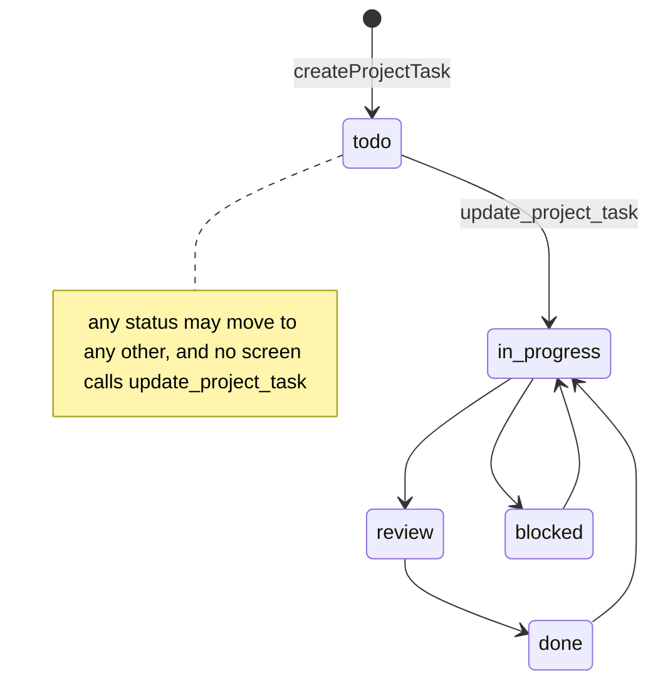
```mermaid
stateDiagram-v2
    [*] --> todo : createProjectTask
    todo --> in_progress : update_project_task
    in_progress --> review
    review --> done
    done --> in_progress
    in_progress --> blocked
    blocked --> in_progress
    note right of todo : any status may move to any other, and no screen calls update_project_task
```

| From -> to | Triggered by | Who | Enforced where | Side effects | Source |
| --- | --- | --- | --- | --- | --- |
| `[*] -> todo` | Team page "Add Task" (title, optional due date, priority, "Visible to client") -> `createProjectTask`. The form never sends status, description or assignee, so status is `todo` and assignee null. **The admin project page has no task form.** | PM assigned; A (RPC only) | app action `authenticatedProfile(['project_manager','admin'])`; RPC `can_view_internal` (0047:61-63), title 1 to 255, description at most 10000, status and priority in sets; CHECKs | INSERT `project_tasks`; audit `project.task_created`; **no outbox** (the `project.task_created` email template exists but nothing emits it); realtime `project_task_changed` on the internal topic, and on the shared topic when `client_visible` (0050:57-100) | `project-actions.js#createProjectTask`; 0047:37-120 |
| `any -> any` | `updateProjectTask` -> `update_project_task`. **No component calls the action**, so the UI cannot change a task after creation. | any project participant when the task is unassigned (clients included); only the assignee when it is assigned | RPC: `can_access_project`, assignee rule (0012:42-49), status in set. No transition rules. Direct UPDATE is not granted (0010 revokes it), so the RPC is the only path. | UPDATE title, description, status, assignee, due date, `updated_at`; audit `project.task_updated`; realtime `project_task_changed`; **no outbox**; `completed_at` is **not** maintained | `project-actions.js#updateProjectTask`; 0012:11-110 |
| `any -> deleted` | None | nobody | no policy, no RPC | removed only by cascade from the project; `assignee_id` becomes NULL when the profile is deleted | 0010:4-20 |

**Edge:**

- **A task never leaves `todo` from the UI.** There is no screen to start, finish or reassign one. `done` and `completed_at` are unreachable and unused.
- **`completed_at` is dead.** `0011:132` computed it; the final `update_project_task` is `0012`, which omits it. The column is still read by the read model (`lib/crm/projects.js`). Planned fix D3.
- **Clients can update tasks.** Through a direct `supabase.rpc`, a client can update any unassigned task they can name and set `assignee_id` to any profile. RLS hides staff-only tasks from clients (0027:10-20), but the RPC is definer. Planned fix D3.
- **Cannot clear fields.** `null` means "no change", so assignee and due date can be set but never cleared; the assignee is not checked to be a participant.
- **Double click creates two tasks.** The Add Task button has no pending state and the RPC takes no idempotency key.
- **Due date shows a day early** west of UTC (`new Date('YYYY-MM-DD')`). F3 pending.
- **Client-visible flag is write-once.** The update RPC ignores it and no UI changes it; a task made visible by mistake stays visible.
- **Task status never affects project status.**

### 5b. Legacy CRM task (`tasks`)

Free-text `status` defaulting to `'open'` (0001:76), no CHECK. The UI reuses the project vocabulary `TASK_STATUSES` for its select, and writes whatever the form holds.

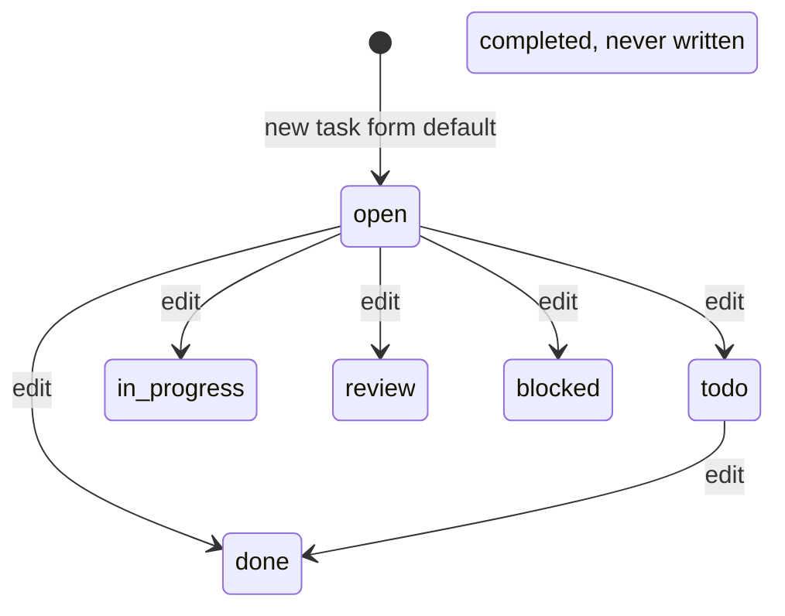
```mermaid
stateDiagram-v2
    [*] --> open : new task form default
    open --> todo : edit
    open --> in_progress : edit
    open --> review : edit
    open --> done : edit
    open --> blocked : edit
    todo --> done : edit
    completed : completed, never written
```

| From -> to | Triggered by | Who | Enforced where | Side effects | Source |
| --- | --- | --- | --- | --- | --- |
| `[*] -> open` | `/admin/tasks/new`. The form state starts at `'open'`, the select offers only `todo, in_progress, review, done, blocked`, so the select shows `todo` while `open` is what is written unless the user changes it. `assigned_to` and `created_by` are the admin's own id (no picker). | A | RLS "Admin can create tasks" (0005:119-121); UI only for the vocabulary | INSERT `tasks`. No notification, no audit. | `app/admin/tasks/new/page.jsx`; 0001:69-83 |
| `any -> any` | `/admin/tasks/[id]/edit` | A | RLS "Admin can update any task". 0008 dropped the assignee and staff update policies, so a PM or assignee cannot update. | UPDATE `tasks` (status, priority, due date, links) | `app/admin/tasks/[id]/edit/page.jsx`; 0008:475-478 |
| `any -> deleted` | `/admin/tasks/[id]` delete | A | RLS "Admin can delete tasks" | row removed | `app/admin/tasks/[id]/page.jsx` |
| read | list and detail | A all; PM only tasks on deals they own; **clients (company members) every task of their company** | RLS (0008:447-473) | none | 0008:447-473 |

**Edge:**

- **Vocabulary drift.** `open` is written but not offered; `completed` is the only value the overdue check treats as closed (`isOverdue`), so a task marked `done` still shows as overdue. F2 pending.
- **No completion record, no reminder, no cron.** Due dates only drive a red label.
- **Clients see internal sales tasks** for their company (0008:461-473); `tasks` has no visibility column.
- **Last write wins.** No `updated_at` check on edit.

---

## 6. Deliverable and approval

Three status columns exist and nothing joins them: `projects.status` (lifecycle 4), `project_deliverables.status` (`draft, submitted, approved, rejected`, 0010:35-37) and `project_approvals.status` (`pending, approved, rejected`, 0010:58-60).

### 6a. Deliverable

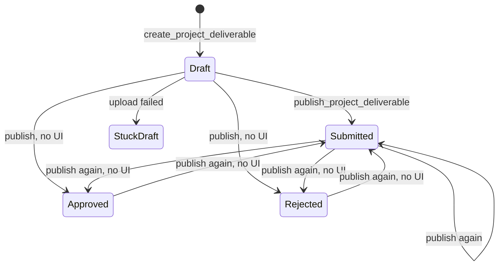
```mermaid
stateDiagram-v2
    [*] --> Draft : create_project_deliverable
    Draft --> Submitted : publish_project_deliverable
    Draft --> Approved : publish, no UI
    Draft --> Rejected : publish, no UI
    Submitted --> Approved : publish again, no UI
    Submitted --> Rejected : publish again, no UI
    Approved --> Submitted : publish again, no UI
    Rejected --> Submitted : publish again, no UI
    Submitted --> Submitted : publish again
    Draft --> StuckDraft : upload failed
```

| From -> to | Triggered by | Who | Enforced where | Side effects | Source |
| --- | --- | --- | --- | --- | --- |
| `[*] -> draft` | Files panel "Upload deliverable" -> `createProjectDeliverable` (title = file name, mime = `file.type` or `application/octet-stream`, size) | PM assigned; A | app action: staff only, mime in {pdf, docx, png, jpeg, txt}, size at most 10 MiB (the DB allows 50 MiB), version 1 to 32. RPC `can_view_internal` (0047:155-157). CHECKs. | INSERT `project_deliverables` (`storage_path = <project>/<id>/<safe name>`, visibility default `shared`, version `'1'`); audit `project.deliverable_created`. No outbox, no realtime. | `project-actions.js#createProjectDeliverable`; 0047:128-246 |
| `draft -> draft` (object uploaded) | Browser `storage.upload(storagePath, file)` | the creator | Storage INSERT policy "Deliverable owners can upload draft deliverables": row is `draft`, `created_by` is the caller, access held (0013:307) | object in `project-files`; no row change | `components/crm/ProjectFiles.jsx#handleUpload` |
| `draft -> submitted` | Same upload handler calls `publishDeliverable(status 'submitted')` right after the upload | the creator, staff | RPC: valid status, row lock, `can_view_internal` before the owner check, `created_by = caller` (so an admin cannot publish a PM's draft) (0047:272-294) | UPDATE status; audit `project.deliverable_published`; outbox in_app and email `project.deliverable_published` `{deliverable_id, status, deliverable_name, version}` to `recipients(deliverable.visibility)`. The RPC does not check the storage object exists. No realtime event for deliverables. | `project-actions.js#publishDeliverable`; 0047:254-332 |
| `any of submitted/approved/rejected -> any of them` | `publish_project_deliverable` called again. **The UI only ever sends `submitted`**, so `approved` and `rejected` are reachable only through a direct RPC call. | creator, staff | RPC: status in the three allowed values; no from-state check | same effects again, **re-notifying everyone each time** | 0047:272-328; `lib/crm/project-contract.mjs#DELIVERABLE_PUBLISH_STATUSES` |
| `any -> draft` | None | nobody | RPC rejects `draft` | none | 0047:272 |
| `any -> deleted` | None | nobody | no RPC, no policy | cascade from project only; approvals keep a NULL `deliverable_id`; the storage object stays | 0010:34-51 |

### 6b. Approval

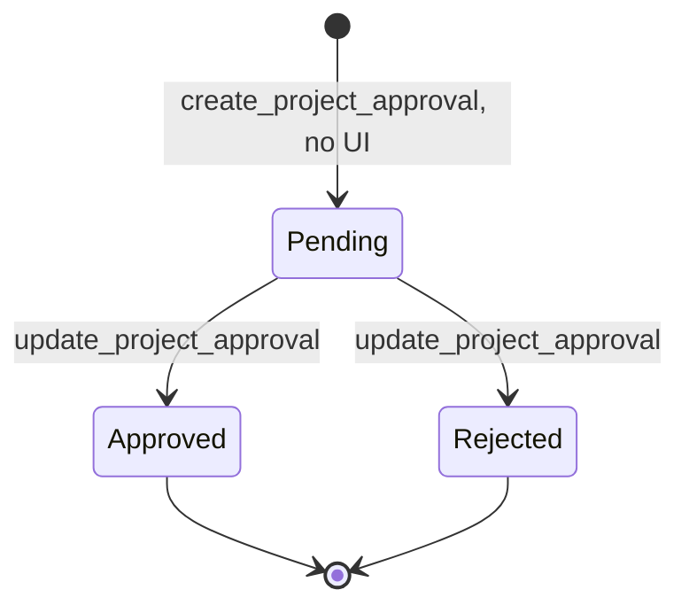
```mermaid
stateDiagram-v2
    [*] --> Pending : create_project_approval, no UI
    Pending --> Approved : update_project_approval
    Pending --> Rejected : update_project_approval
    Approved --> [*]
    Rejected --> [*]
```

| From -> to | Triggered by | Who | Enforced where | Side effects | Source |
| --- | --- | --- | --- | --- | --- |
| `[*] -> pending` | `createProjectApproval` -> `create_project_approval`. **No component calls the action**, so the UI cannot create an approval. | any project participant, **clients included**; accepts an internal deliverable id from a client | RPC `can_access_project`, note at most 2000, deliverable must belong to the project | INSERT `project_approvals`; audit `project.approval_requested`; **no outbox** (copy "Your approval is needed" exists but nothing emits `project.approval_requested`); realtime `project_approval_changed` (shared topic only if no deliverable or the deliverable is shared) | `project-actions.js#createProjectApproval`; 0010:356-421; 0050:102-184 |
| `pending -> approved / rejected` | Approve and Reject buttons on staff project pages (`ProjectApprovals` with `canDecide`) -> `updateProjectApproval(status)`. The UI sends no note. | PM assigned; A | app action: staff, status in `APPROVAL_DECISION_STATUSES`; RPC: `can_view_internal`, status must be `pending` (22023 otherwise), note at most 2000 | UPDATE status, `reviewed_by`, `note`, `updated_at`. **`note` is overwritten with the reviewer's note, which the UI leaves empty, so the requester's original note is erased.** Audit `project.approval_updated`; outbox in_app and email `project.approval_updated` `{approval_id, status, note = the OLD requester note}` to `recipients(default 'shared')`; realtime `project_approval_changed`. | `project-actions.js#updateProjectApproval`; 0015:442-521 |
| `approved / rejected -> *` | None | nobody | RPC: "Approval is no longer pending" | terminal | 0015:477-480 |

### 6c. How the three statuses relate

| Event | `projects.status` | `project_deliverables.status` | `project_approvals.status` |
| --- | --- | --- | --- |
| Staff publishes a deliverable | unchanged | `draft -> submitted` | unchanged |
| Staff decides an approval | unchanged | unchanged | `pending -> approved/rejected` |
| Staff moves project to `client_review`, `approved` or `changes_requested` | changes | unchanged | unchanged |
| Deliverable row removed | unchanged | gone | `deliverable_id` becomes NULL, which makes the row visible to clients under the 0041 policy |
| Project becomes `delivered` or `cancelled` | frozen | unchanged, still publishable | unchanged, still decidable |

**Edge:**

- **The collaboration loop is cut.** Clients can neither request nor decide approvals from any screen, and the staff panel can only decide rows that no screen can create, so the Approvals list is empty in practice. The client page says approvals are "recorded by staff": look at the files, then reply in Messages. Only staff turn that into `approved` on the project.
- **Notification leak and stale text.** Approval decisions fan out with the default `'shared'` visibility, so clients are notified (in_app and email) about decisions on **internal** deliverables; the payload carries the old note. The in-app line is the generic "An approval was updated." Planned fix D1.
- **Deliverable status is unguarded.** Any state to any, repeated, re-notifying, no check that the object exists, no `updated_at`. Only the creator may publish, so an admin cannot rescue a PM's stuck draft.
- **Drafts are visible.** The deliverable SELECT policy has no status filter (0010:144-151). A client sees a draft or rejected deliverable's title with a Download button; the download action refuses `draft` ("Unable to authorize this download").
- **Upload failure leaves a draft forever.** Create, upload and publish run in one handler with no retry. If the upload fails the draft row stays, is shown to clients, and is never swept (cleanup in lifecycle 7 handles `project_attachments` only). The file input is disabled while an upload runs, so concurrent duplicates are blocked in the UI, but the staff member's retry picks the file again and creates a second draft beside the failed one.
- **No live update.** Deliverable publish broadcasts nothing; other open pages see it on their next reload or on an unrelated status, task or approval event.
- **Declared mime and size are never compared with the object.**

---

## 7. Thread message and attachment

### 7a. Attachment

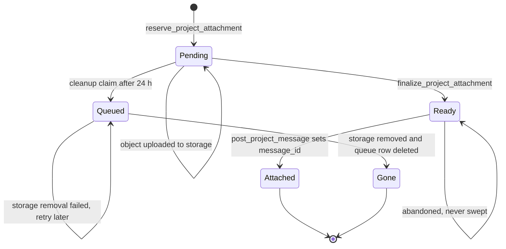
```mermaid
stateDiagram-v2
    [*] --> Pending : reserve_project_attachment
    Pending --> Pending : object uploaded to storage
    Pending --> Ready : finalize_project_attachment
    Ready --> Attached : post_project_message sets message_id
    Pending --> Queued : cleanup claim after 24 h
    Queued --> Queued : storage removal failed, retry later
    Queued --> Gone : storage removed and queue row deleted
    Ready --> Ready : abandoned, never swept
    Attached --> [*]
    Gone --> [*]
```

| From -> to | Triggered by | Who | Enforced where | Side effects | Source |
| --- | --- | --- | --- | --- | --- |
| `[*] -> pending` | Picking a file in the Messages tab -> `handleFileChange` -> `reserveAttachment(projectId, fileName, mimeType, sizeBytes)`; visibility is never sent, so `shared` | C, PM, A on the project | app action: mime in {pdf, docx, png, jpeg, txt}, size 1 B to 10 MiB, name 1 to 255, visibility allowed for the role. RPC: `can_access_project`, name, mime 1 to 255, size at most 50 MiB. CHECK `project_attachments_status_check`. | INSERT `project_attachments` (status `pending`, `storage_path = <project>/<attachment>/<safe name>`, `message_id` null); audit `project.attachment_reserved`. No outbox, no realtime. Every call reserves anew; no quota. | `project-actions.js#reserveAttachment`; 0009:828-936 |
| `pending -> pending` (object) | Browser `storage.from('project-files').upload(path, file, {upsert:false})` | the uploader | Storage INSERT policy: path has two folders, the matching row is `pending` and `uploaded_by` is the caller, access held (0009:1195) | object in the private bucket; row unchanged. No UPDATE or DELETE policy exists, so users can neither overwrite nor remove an object. | `components/crm/useProjectThread.js#handleFileChange` |
| `pending -> ready` | Same handler calls `finalizeAttachment` immediately after the upload (**at file-pick time, before Send**) | the uploader | RPC: row locked, caller is `uploaded_by`, status `pending`, access held, `storage.objects` has the path with `owner_id` = caller. Not idempotent: a second call raises 42501. | UPDATE status; audit `project.attachment_finalized` | `project-actions.js#finalizeAttachment`; 0009:1066-1136 |
| `failed -> pending -> ready` (client state) | "Retry upload" -> `retryStagedAttachment`: re-uploads only when the object was not uploaded, then finalizes | the uploader | as above | as above | `useProjectThread.js#retryStagedAttachment` |
| `ready -> attached` | Send with staged files -> `postProjectMessage(attachmentIds)` | the uploader | RPC (inside message post): each id must be `ready`, owned by the caller, same project, same visibility as the message, `message_id` null; rows locked in id order; ids unique | UPDATE `project_attachments.message_id` | 0032:147-174 |
| `pending -> queued` | Cron drain, step 1: `claim_attachment_cleanup(p_before = now - 24 h, p_limit 50, p_lease_seconds 600)` | SR (drain route) | RPC, service_role only; `FOR UPDATE SKIP LOCKED` | INSERT `project_attachment_cleanup` (path, attachment id, project id); DELETE the `project_attachments` row (so it can no longer be finalized); lease due queue rows | 0048:54-106 |
| `queued -> gone` | Drain: `storage.from('project-files').remove(paths)`, then `complete_attachment_cleanup` | SR | RPC | queue rows deleted. Removing an already-missing key succeeds. | 0048:108-120; `app/api/cron/crm-notifications/route.js#cleanupStaleAttachments` |
| `queued -> queued` | Storage removal error -> `fail_attachment_cleanup` | SR | RPC | `attempts + 1`, `last_error` (500 chars), `next_attempt_at` += `min(2^min(attempts+1,11), 1440)` minutes. Entries are never dropped. | 0048:122-139 |
| fallback | Claim RPC missing (PGRST202 or 42883): `cleanup_stale_project_attachments` | SR | RPC | deletes rows and returns paths; **objects are orphaned if the later removal fails** | 0038:16-47; route `legacyCleanupStaleAttachments` |

### 7b. Message

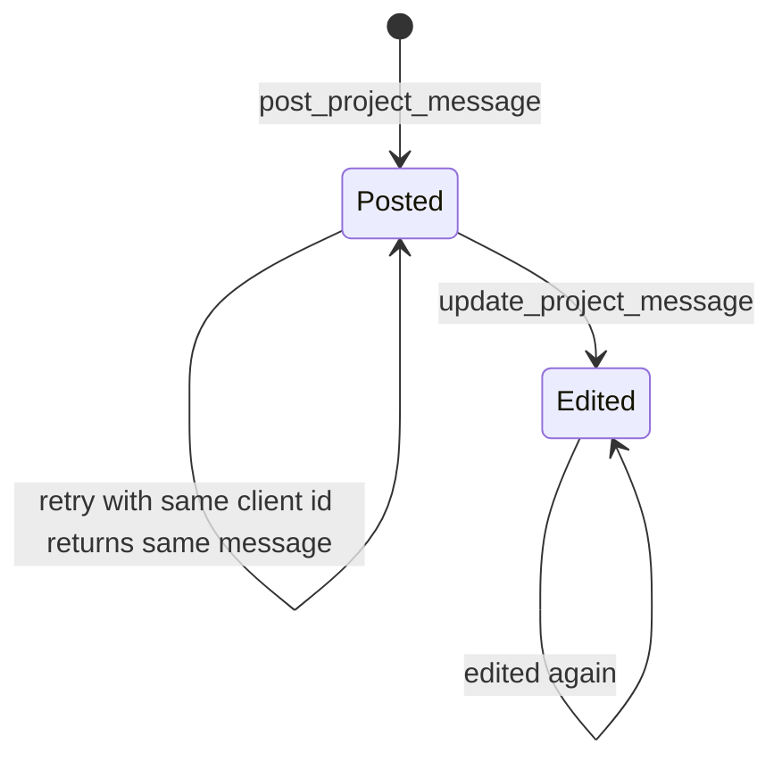
```mermaid
stateDiagram-v2
    [*] --> Posted : post_project_message
    Posted --> Posted : retry with same client id returns same message
    Posted --> Edited : update_project_message
    Edited --> Edited : edited again
```

| From -> to | Triggered by | Who | Enforced where | Side effects | Source |
| --- | --- | --- | --- | --- | --- |
| `[*] -> posted` | Send -> `postProjectMessage(body, clientGeneratedId, attachmentIds)`; the id is created once per draft and reused on retry, reset after success; visibility is never sent, so `shared` | C, PM, A on the project (internal only for staff, not offered by the UI) | app action: body 1 to 10000, canonical ids, unique attachment ids. RPC: access, visibility rule, body 1 to 10000, `UNIQUE(sender_id, client_generated_id)` with `ON CONFLICT DO NOTHING`. | INSERT `project_messages`; link attachments; audit `project.message_posted`; outbox in_app and email `project.message_posted` `{author_name, excerpt first 200 chars}` to `recipients(visibility)`; trigger broadcast `project_message_created` on `project:<id>:<visibility>` (only when `auth.uid()` equals the sender, so service-role inserts are silent) | `project-actions.js#postProjectMessage`; 0032:53-212; 0009:1214-1253 |
| `posted -> posted` (retry) | Same client id again | the sender | unique key; same key on another project raises 42501 | returns the stored id; **attachments are not linked and nobody is re-notified** | 0032:129-145 |
| `posted -> edited` | Edit in the thread -> `editProjectMessage(messageId, body)` | the author only | RPC: row locked, `sender_id = caller`, access re-checked, body 1 to 10000 | UPDATE `body`, `edited_at`, `edited_by`; audit `project.message_edited`; outbox in_app and email `project.message_edited` to `recipients(message.visibility)` **on every edit, even an identical body**; trigger broadcast `project_message_updated`. No history of prior bodies, no edit window. | `project-actions.js#editProjectMessage`; 0023:211-300; 0032:7-51 |
| `posted -> deleted` | None | nobody | no policy, no RPC | removed only by cascade (thread, project) | 0009:90-105 |

**Edge:**

- **Ready but never posted (E3).** Reserve, upload and finalize all run when the file is picked. If the user never sends, or reloads (the `File` lives only in React state), the row stays `ready` with `message_id` null. It appears in every participant's Files list (it is `shared`, and the read model returns every `ready` row) and the cleanup never touches it. Nothing deletes it, ever.
- **Send is blocked by a bad staged file (committed code).** `handleSend` returns early when any staged file is not `ready`; the button stays enabled, there is no reason text and no Remove. F5 pending (reason text, Remove for failed files, specific error beside the file). A removed failed file's reservation stays `pending` and the 24 h sweep reclaims it.
- **Failed finalize.** Leaves a `pending` row plus an uploaded object; swept after 24 h. A finalize that succeeded followed by a failed post leaves a `ready` orphan.
- **Cleanup races.** The claim uses `SKIP LOCKED`; a finalize that arrives while the claim holds the row waits, then finds no row (P0002) although the object exists. The queue then deletes the object.
- **Cleanup only runs from the drain route**, which runs the cleanup before the email-configuration check, so a 503 from a missing `RESEND_API_KEY` still deletes attachments.
- **Never swept:** `ready` attachments never attached to a message, draft deliverables, objects left behind when project rows cascade away.
- **Realtime is a hint.** Any message event makes the client reload the newest 20 messages and replace the list, dropping older pages already loaded. Missed events are recovered by a full reload on re-subscribe (`RESYNC_EVENT`, added after the scoping inventory). Other lifecycles' rows (notes, files, deliverables) are not live.
- **Messages and files stay open on terminal projects.** No status gate.
- **Download.** `createAttachmentDownloadUrl` reads the row under RLS (attachment: `ready`; deliverable: not `draft`) and returns a 60 s signed URL; the browser calls `window.open` after an `await`, which a popup blocker may stop (UNVERIFIED).

---

## 8. Notification outbox row

`notifications_outbox` rows: `channel` in `email, in_app, realtime`, `status` in `pending, sent, failed` (0011:60), `attempts` 0 to 25, lease columns and `failure_code` (0033:8-58), `read_at` (0027:23). `event_type` is free text (1 to 120 chars), so a typo becomes `missing_template` at drain time.

### 8a. Producers (a row is born)

| Event type | Channels | Recipients | Producer | Source |
| --- | --- | --- | --- | --- |
| `project.status_transitioned` | in_app, email | `recipients(visibility)` | `transition_project_status` | 0030:137-145 |
| `project.delivered` | email | every profile with the project's `company_id` | `transition_project_status` when target is `delivered` | 0030:147-157 |
| `project.message_posted` | in_app, email | `recipients(visibility)` | `post_project_message` | 0032:197-208 |
| `project.message_edited` | in_app, email | `recipients(message.visibility)` | `update_project_message` | 0023:285-296 |
| `project.deliverable_published` | in_app, email | `recipients(deliverable.visibility)` | `publish_project_deliverable` | 0047:315-328 |
| `project.approval_updated` | in_app, email | `recipients('shared')` (default) | `update_project_approval` | 0015:509-517 |
| `project.user_assigned` | in_app, email | the assignee only | `assign_project_user` | 0015:614-690 |
| `project.note_posted` | in_app | assigned staff except the author; none when nobody is assigned | `post_project_note` | 0013:131-148 |
| `project.brief_submitted` | in_app, email | every admin profile plus assigned staff, minus the submitter | `submit_project_brief` | 0046:225-248 |
| `project.brief_received` | in_app, email | the submitter | `submit_project_brief` | 0046:250-264 |
| `client.onboarded` | email | every admin profile; `project_id` null | `onboard_client_company` | 0046:358-374 |
| `lead.created` | email | the pinned admin (by `auth.users.email`); `project_id` null | `create_lead_from_contact` | 0029:225-238 |
| any | any of the three | one user on the project (`user_id` may be null) | `enqueue_project_notification`; staff only; **no UI caller** | 0046:417-510 |
| `project.task_created`, `task_updated`, `approval_requested` | none | none | templates and in-app copy exist; **no producer** | `lib/email/templates.js`; `lib/crm/notification-copy.mjs` |

Each fan-out row pair (in_app plus email) is written in the same transaction as the business write, so a rollback leaves nothing. There is no producer-side dedupe key.

### 8b. Email channel

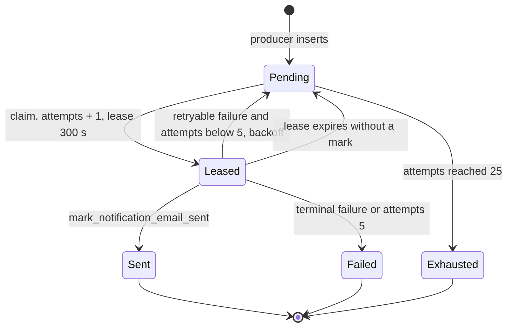
```mermaid
stateDiagram-v2
    [*] --> Pending : producer inserts
    Pending --> Leased : claim, attempts + 1, lease 300 s
    Leased --> Sent : mark_notification_email_sent
    Leased --> Pending : retryable failure and attempts below 5, backoff
    Leased --> Failed : terminal failure or attempts 5
    Leased --> Pending : lease expires without a mark
    Pending --> Exhausted : attempts reached 25
    Sent --> [*]
    Failed --> [*]
    Exhausted --> [*]
```

| From -> to | Triggered by | Who | Enforced where | Side effects | Source |
| --- | --- | --- | --- | --- | --- |
| `[*] -> pending` | Any producer above | the producing RPC | CHECKs on channel, event type length, payload object | row with `status 'pending'`, `attempts 0`, `available_at now()` | 0010:64-78; 0011:53-61 |
| `pending -> leased` | `GET` or `POST /api/cron/crm-notifications`. Schedulers: pg_cron `drain-crm-outbox` every 5 min (`net.http_post`, header `x-cron-secret` from Vault, 8 s timeout, URL hard-coded to production) and Vercel cron `0 13 * * *` (Bearer `CRON_SECRET`). Route steps: attachment cleanup, email-configured check, `claim_notification_email_batch(25, 300)`. | cron (SR) | route: constant-time secret compare, fail closed with no secret. RPC, service_role only; filter `channel='email' AND status='pending' AND available_at <= now() AND attempts < 25 AND (no lease OR lease expired)`, ordered `available_at, created_at, id`, `FOR UPDATE SKIP LOCKED` (0033:90-124). | new `lease_id`, lease window, `last_attempt_at`; **`attempts` + 1 at claim**; failure fields cleared | `route.js#drain`; 0033:64-126; 0042:37-51; `vercel.json` |
| `leased -> sent` | Recipient resolved (`profiles` plus `auth.admin.getUserById`), template rendered, `sendTemplate` with `idempotencyKey: outbox-<id>` returns | drain | RPC compare-and-set on `lease_id`, `status = 'pending'`, channel email | UPDATE `status 'sent'`, `sent_at`, lease cleared. A count other than 1 is a "lease conflict" (mail already out). | `route.js#drain`; 0045:35-64 |
| `leased -> pending` (retry) | `EmailError` retryable (network, 429, 5xx) and `attempts < 5` | drain | app: `canRetry`; RPC `mark_notification_email_failed` re-checks `attempts < 5` | `available_at = now + backoff` (1, 5, 15, 60 min by attempt; the 180 min slot is unreachable), `failure_code provider_retryable`, `last_error` as `Email provider response status N.` (no PII) | `route.js#BACKOFF_MINUTES`; 0045:66-122 |
| `leased -> failed` | Terminal provider error (4xx); `attempts >= 5`; recipient has no email address (`missing_recipient`, which also covers a failed profile or `getUserById` lookup); recipient is a PM no longer assigned (`missing_recipient`); unknown event type (`missing_template`) | drain | same RPC | `status 'failed'`, `failed_at`, `failure_code`; no replay path | `route.js#drain`; 0045:95-117 |
| `leased -> pending` (lease expiry) | Worker died, timed out past 300 s, or the mark call failed | nobody | lease filter in the claim | row is claimed again: **at-least-once delivery**; Resend dedupes by key for 24 h only | 0033:98-101 |
| `pending -> exhausted` | `attempts` reached 25 through repeated lease expiry | nobody | claim filter `attempts < 25`; CHECK `attempts <= 25` | stuck `pending` forever; counted as `exhausted` by the watchdog, no alert for it | 0033:97; `route.js#watchOutbox` |

### 8c. in_app and realtime channels

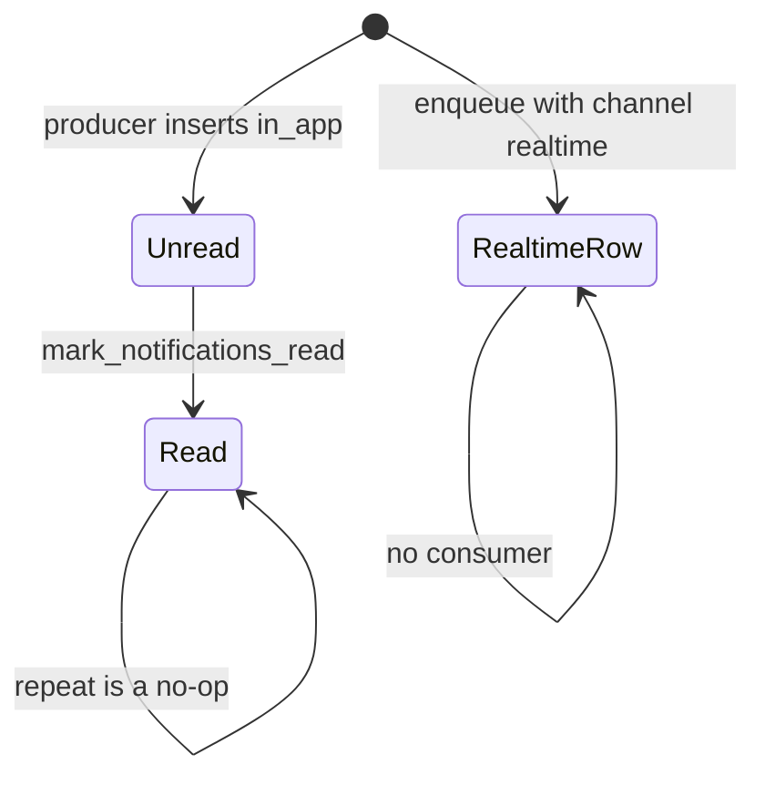
```mermaid
stateDiagram-v2
    [*] --> Unread : producer inserts in_app
    Unread --> Read : mark_notifications_read
    Read --> Read : repeat is a no-op
    [*] --> RealtimeRow : enqueue with channel realtime
    RealtimeRow --> RealtimeRow : no consumer
```

| From -> to | Triggered by | Who | Enforced where | Side effects | Source |
| --- | --- | --- | --- | --- | --- |
| `unread -> read` | "Mark read" or "Mark all as read" in `NotificationsPanel`; on the client project page, opening the Messages or Files tab marks that tab's events read at once | the recipient | RPC: caller owns the rows, `channel = 'in_app'`, ids non-empty and unique; `read_at = coalesce(read_at, now())`; RLS only lets a user read their own `in_app` rows (0041:88-95) | `read_at`; `status` stays `pending` for ever; failure is silent in the UI | `project-actions.js#markNotificationsRead`; 0027:32-65; `app/dashboard/projects/[id]/page.jsx` |
| `realtime row` | `enqueue_project_notification` with channel `realtime` | staff | RPC accepts it | row nobody reads or drains | 0046:441 |

### 8d. Live broadcasts (not outbox rows)

Triggers send private broadcasts inside the writing transaction (a rollback sends nothing). Payloads carry ids only; clients re-read through RLS.

| Event | Emitted by | Topics | Skip rule | Listeners | Source |
| --- | --- | --- | --- | --- | --- |
| `project_message_created` | after insert on `project_messages` | `project:<id>:<visibility>` | not sent when `auth.uid()` is null or not the sender | `useProjectThread`; client page refreshes badges | 0009:1214-1253 |
| `project_message_updated` | after update of `body, edited_at` | same | same | same | 0032:7-51 |
| `project_status_changed` | after update of `projects.status`, any writer | shared and internal | none | team, admin and client pages reload the workspace | 0050:32-55, 190-193 |
| `project_task_changed` | after insert, update, delete on `project_tasks` | internal always; shared only if the task is or was `client_visible` | none | same | 0050:57-100, 195-198 |
| `project_approval_changed` | after insert, update, delete on `project_approvals` | internal always; shared when no deliverable or the deliverable is shared | none | same | 0050:102-184, 200-203 |
| presence | `track` on the shared topic with `{userId, name}` | shared | policy `can_subscribe_project_topic` for insert and select | `ProjectPresence` shows names of other viewers | 0050:205-231; `lib/crm/projectRealtime.js` |

Not live: deliverables, notes, attachments, assignments, briefs, notifications. Listeners: `components/crm/useProjectLive.js#useProjectLive` re-reads on any non-message event and on `resync` after a reconnect.

### 8e. Stuck and undelivered states

| State | How it arises | Exit | Detection |
| --- | --- | --- | --- |
| email, `pending`, `attempts = 25` | repeated lease expiry (worker crash, run longer than 300 s, or the completion RPC failing as in 0033 until 0045). Production had four such rows (0045 header). | none (a manual statement by the owner) | watchdog `exhausted` count, no alert |
| email, `pending`, due more than 30 min ago | Resend down, secret in Vault differs from Vercel's, drain 503, no scheduler | clears once the drain works | watchdog `stuckPending` and `oldestStuckMinutes`; logged and sent to Sentry as a warning |
| in_app, `pending`, never read | **by design**: `status` is never set for in_app. **Staff never see their in_app rows**: `NotificationsPanel` and `listNotifications` are used only on client pages (`/dashboard`, `/dashboard/projects/[id]`), so assignment, brief, status and message alerts to PM and admin exist only as email. | none | none |
| realtime channel row | enqueue only | none | none |
| `failed` | terminal error | none | counted per run |
| rows whose user was deleted | `user_id` is `ON DELETE SET NULL`; the drain then fails them as `missing_recipient` | none | per-run counters |
| rows of a deleted project | `project_id` cascades; **unsent emails vanish** | none | none |

**Edge:**

- **Send then mark is not atomic.** A crash or a failed mark re-sends. Whether `0045` is applied live is UNVERIFIED (CRM-OPERATIONS.md:113 said not applied on 2026-09-27); without it, both mark RPCs raise 42883 and every sent row is re-sent until it exhausts its 25 claims.
- **A transient lookup failure is terminal.** A failed `getUserById` or profile read marks the row `failed` as `missing_recipient`, and the notification is lost.
- **Stale assignees.** The drain drops emails for a PM who is no longer assigned (terminal `missing_recipient`), but not for a demoted ex-PM now holding the client role, and never touches their in_app rows. Planned fix D2.
- **Repeats re-notify.** Every re-assignment upsert, message edit and deliverable publish queues new rows. No dedupe key exists.
- **No retention.** Sent, failed and in_app rows stay for ever and carry PII (message excerpts, lead name and email, client email and phone, 0029:231-237, 0046:366-372); `enqueue_project_notification` accepts an unbounded payload.
- **Ordering of failure modes in the route.** Cleanup runs before the Resend check; a missing `RESEND_API_KEY` is a 503 that leaves the outbox untouched but has already cleaned attachments. With F10 in the working tree, an invalid app URL halts the drain with 503 before the claim, so rows are not leased or counted as attempts.
- **Scheduler coupling.** The pg_cron job posts to the production URL from every database that applies the migrations, with a Vault secret that must be copied by hand to Vercel (`CRM_CRON_SECRET`); 8 s timeout on the caller, no `maxDuration` on the route; responses sit unread in `net._http_response`.
- **Duplicate-looking pair.** Each event produces an in_app row and an email row; clients saw each event twice until 0041 narrowed the SELECT policy to `in_app`.

---

## 9. Project assignment and lead project manager

The database holds any number of `project_assignments` rows per project (`UNIQUE(project_id, user_id)`). "Lead" is derived: the earliest `created_at` (`loadPrimaryAssignees`, `LeadManagerCard`, and `project_manager_names` in 0049 all use that rule).

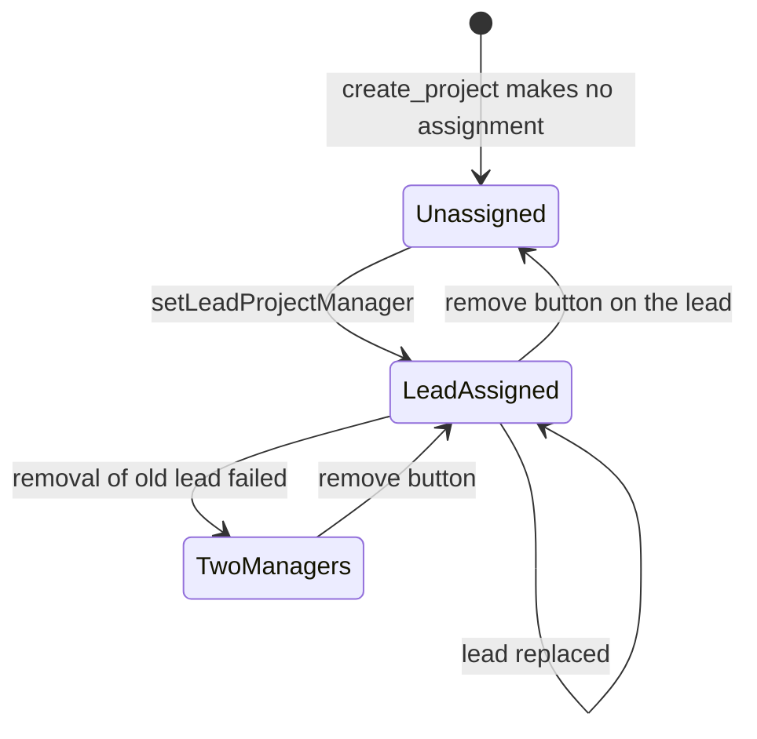
```mermaid
stateDiagram-v2
    [*] --> Unassigned : create_project makes no assignment
    Unassigned --> LeadAssigned : setLeadProjectManager
    LeadAssigned --> LeadAssigned : lead replaced
    LeadAssigned --> TwoManagers : removal of old lead failed
    TwoManagers --> LeadAssigned : remove button
    LeadAssigned --> Unassigned : remove button on the lead
```

`setLeadProjectManager(projectId, userId)` sequence (`app/actions/assignment-actions.js#setLeadProjectManager`):

1. Read (US): project status, target profile (must be role `project_manager`), current assignments ordered by `created_at, id`.
2. If the target is not already the earliest assignee: `assign_project_user` (upsert, audit, outbox to the assignee).
3. For every other assignee: `remove_project_assignment` (delete, audit). Failures become warnings.
4. If the status was `brief_submitted`: `transition_project_status` to `planned` with a shared note. A failure becomes a warning.
5. `revalidatePath` on admin, team and dashboard paths.

| From -> to | Triggered by | Who | Enforced where | Side effects | Source |
| --- | --- | --- | --- | --- | --- |
| `[*] -> unassigned` | `create_project` | system | none | no row | 0031:18-194 |
| `unassigned -> lead assigned` | Admin picks a manager in `LeadManagerCard` and presses Assign | A | app action `adminProfile`; target role `project_manager` (the RPC also accepts `admin`); RPC `private.current_profile_role() = 'admin'`, project exists, target role in `project_manager, admin` | `project_assignments` row (`assigned_by` = admin); audit `project.user_assigned`; outbox in_app and email `project.user_assigned` `{role}` to the assignee, with the client's name, email, company and project count in the email for staff recipients; if status was `brief_submitted`, the transition to `planned` (lifecycle 4 side effects); the client sees the manager's name through `project_manager_names` (0049, live status UNVERIFIED, otherwise no name) | `assignment-actions.js`; 0015:614-690; 0049:22-42 |
| `lead assigned -> lead assigned` (replace) | Assign another manager | A | same | the new row, then removal of the others: audit `project.assignment_removed` per removal, **no notification to the removed PM**; no status change; `notified` is false only when the target already leads | `assignment-actions.js`; 0009:665-721 |
| `lead assigned -> two managers` | A removal in step 3 fails | A | none: the sequence has no rollback | warning text shown after the success sentence; assignment email already queued | `assignment-actions.js#setLeadProjectManager`; `LeadManagerCard.jsx#handleAssign` |
| `two managers -> lead assigned` | "Remove" on the extra manager | A | RPC admin only; a second call for the same pair raises P0002 | audit `project.assignment_removed` | `project-actions.js#removeProjectAssignment`; 0009:665-721 |
| `lead assigned -> unassigned` | "Remove" on the lead, no confirmation | A | same | audit; the project is now without a PM at whatever status it has; admin becomes a notification recipient again (0046) | same |
| loss of access | Any removal | the removed PM | `can_access_project` and `can_view_internal` read the assignment row | PM loses the project at once (RLS), keeps nothing; queued emails to them are dropped by the drain only if they are still role `project_manager` | 0009:269-313; `route.js#resolveLiveAssignments` |
| direct RPC | `assignProject` action (no UI caller) | A | RPC | same as assign without the sequence | `project-actions.js#assignProject` |

**Edge:**

- **The lead is the earliest assignment, not the chosen one.** If removing the old lead fails, the old lead is still earliest, so the project page and the client's `project_manager_names` keep showing the old manager. The success sentence ("X is now leading this project") is built before the warnings, so it can be wrong.
- **Repeats re-notify.** `assign_project_user` upserts and emails every call; promoting an already-assigned co-manager re-sends the email.
- **Double click.** The card disables its buttons while a request runs, but the action itself has no guard; two tabs can interleave.
- **Terminal projects.** No status check: a delivered or cancelled project can be assigned and unassigned. Workload counts exclude terminal projects (`TERMINAL_PROJECT_STATUSES`).
- **Admin as lead.** An admin assigned by direct RPC becomes lead on `LeadManagerCard` (it takes `assignments[0]`) but is skipped by `project_manager_names` (role filter), so staff and client can see different names.
- **No live update.** Assignment changes broadcast nothing.
- **Removed PM's unseen rows.** Their in_app rows stay; PMs have no in_app UI anyway.

---

## 10. Blog post

`blog_posts.status` in `draft, published` (`blog_posts_status_check`, 0035:97). A trigger keeps `published_at` consistent (0035:120-142, CHECK 0035:105): set to `now()` when a row is published with a null date, cleared when set to draft. Public readers see a post only when `status = 'published' AND published_at <= now()` (0035:153); a future `published_at` is a scheduled post. Drafts are visible to admin and PM (0035:176) and a draft URL returns 404.

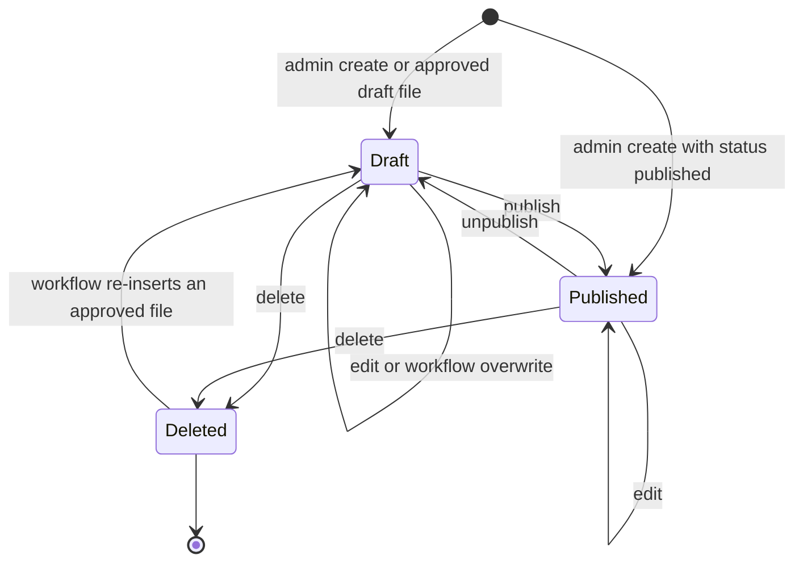
```mermaid
stateDiagram-v2
    [*] --> Draft : admin create or approved draft file
    [*] --> Published : admin create with status published
    Draft --> Draft : edit or workflow overwrite
    Draft --> Published : publish
    Published --> Published : edit
    Published --> Draft : unpublish
    Draft --> Deleted : delete
    Published --> Deleted : delete
    Deleted --> Draft : workflow re-inserts an approved file
    Deleted --> [*]
```

| From -> to | Triggered by | Who | Enforced where | Side effects | Source |
| --- | --- | --- | --- | --- | --- |
| `[*] -> draft` (UI) | `/admin/blog/new` -> `createPostAction`, `status` defaults to `draft` | A | app action `authorProfile` (admin); `validateBlogPost` (title 1 to 200, body 1 to 100000, slug lowercase words at most 80, excerpt at most 320, SEO 70 and 200, cover URL `^https://\S+$`); RLS "Admin can create posts"; CHECKs mirror the contract; unique slug index (23505 becomes a field error) | INSERT with `author_id`; trigger sets `updated_at`; `revalidatePath` `/blog`, `/sitemap.xml`, `/blog/<slug>`, `/admin/blog`. **Committed code returns "Saved." and stays on the new form**; a second submit hits the slug index, or inserts a second post if the slug was changed. F7 pending (redirect to the edit page). | `app/actions/blog-actions.js#createPostAction`; 0035:180 |
| `[*] -> published` (UI) | Same form with status `published` | A | same | trigger sets `published_at = now()`; same revalidation | same |
| `[*] -> draft` (workflow) | Push to `main` touching `docs/seo/drafts/blog/**` or the script -> workflow `seo-publish-blog.yml` -> `scripts/seo/publish-blog-drafts.mjs` (also manual dispatch, default dry run) | the workflow, with the SR key, outside RLS | script: only files with front matter `approved: true`; filename is a valid slug; `target_url` equals `/blog/<slug>`; `target_keywords` present; no H1; cover image `.jpg/.png/.webp`; `validateBlogPost`. **Always writes `status: 'draft'`**; never overwrites a row already `published`. Without the repo secrets it logs and exits 0. | upsert by slug; optional cover upload to the `blog-covers` bucket; `author_id` stays null. No `revalidatePath` (not reachable from CI). | `scripts/seo/publish-blog-drafts.mjs#upsert`; `.github/workflows/seo-publish-blog.yml` |
| `draft -> draft` (edit) | `/admin/blog/[id]` -> `updatePostAction` (whole post including `status` from the form) | A | RLS update policy; same validation | UPDATE; revalidation of the new slug and, on a rename, the old slug. The old URL is not redirected by this code. | `blog-actions.js#updatePostAction`; 0035:184 |
| `draft -> published` | Row action -> `setPostStatusAction('published')`, or the edit form | A | RLS; CHECK consistency; trigger | `published_at = now()` the first time; the post is public immediately; revalidation of the four paths | `blog-actions.js#setPostStatusAction` |
| `published -> published` | edit | A | trigger keeps an existing `published_at` | `updated_at` moves; sitemap `lastmod` follows `updated_at` | `app/sitemap.js` |
| `published -> draft` | `setPostStatusAction('draft')` | A | trigger clears `published_at` | the post leaves `/blog` and the sitemap; re-publishing later gets a new date | 0035:130-133 |
| `draft or published -> deleted` | Row action -> `deletePostAction` | A | RLS delete policy | row removed; revalidation (slug may be undefined when nothing matched, and a no-match still reports `{deleted:true}`) | `blog-actions.js#deletePostAction`; 0035:189 |
| `deleted -> draft` | Next workflow run that processes an approved file with that slug | the workflow | script upserts by slug and finds no row | the post comes back as a draft | `publish-blog-drafts.mjs#upsert` |
| `[*] -> scheduled` | Direct SQL with a future `published_at` | SQL owner | policy `published_at <= now()` | invisible to anon until the time passes; no UI field sets it | 0035:153 |

Public read path: `/blog` and `/blog/[slug]` are `force-dynamic`; `app/sitemap.js` is `revalidate = 3600` and also revalidated by the admin actions. A post published through SQL or the workflow reaches the sitemap within an hour; the comment in `app/sitemap.js` says seven "redeploy to refresh sitemap" commits are why the hourly bound exists.

**Edge:**

- **Delete is not sticky.** The workflow reprocesses every approved file on each run, so a post deleted in `/admin/blog` returns as a draft the next time any draft file or the script changes and the workflow runs. Deleting a published post this way also brings back its draft.
- **The file overwrites UI edits.** While a row is still `draft`, each workflow run rewrites it from the file; unpublishing a post makes the file the source of truth again.
- **Whole-form updates.** `updatePostAction` writes `status` from the form, so a stale open form can publish or unpublish a post.
- **Cover images fail.** The default bucket `blog-covers` does not exist in the Supabase project (docs/seo/OPERATIONS-MANUAL.md:270). The first approved draft with a `cover_image` throws and the run exits 1.
- **Scheduling has no UI.** The model supports it; no screen shows or sets it.
- **Rename leaves a dead URL.** The old slug is revalidated, which makes it 404; no redirect is written.
- **No audit and no notification** for any blog transition.
- **`author_name` and tags/category** (0036) are never written by the app.

---

## Summary

| Lifecycle | States | Enforcement point | Biggest gap |
| --- | --- | --- | --- |
| 1. Visitor to lead | Received, Screened, Dispatched, Accepted/Refused; contact and deal created or noted | route (rate limit, validation, captcha) then RPC `create_lead_from_contact` (service role only) | The lead is written before the delivery verdict and can attach a stranger to an existing client company; lead to client conversion has no path and collides with onboarding (D4, D6) |
| 2. Account | unconfirmed, signed in, client without company, onboarded; invited; pending staff, PM, admin | triggers (`handle_new_user`, `enforce_pinned_admin`, profile guard), RPCs, middleware gate | Role changes leave assignments and company ties behind (D2); the pinned admin can approve their own request and remove the only admin (D7); onboarding can be blocked for good |
| 3. Brief | draft, submitted (new or attached), deleted | RLS plus RPC `submit_project_brief` | Free-form project creation bypasses the brief path (no alert, no idempotency); delivered projects accept briefs silently |
| 4. Project status | 9 statuses, 21 legal transitions, 2 terminal | RPC `transition_project_status` (no trigger guard) | Terminal states freeze only the status; the client cannot act on `client_review`; double-click error replaces the workspace (F4) |
| 5. Tasks | project: 5 statuses any to any; legacy: free text | project: RPC; legacy: RLS admin-only plus UI vocabulary | Project tasks cannot be changed after creation from any screen and `completed_at` is dead; legacy `open`/`completed` drift (F2) |
| 6. Deliverable and approval | deliverable 4 statuses; approval 3 | RPC only, no transition rules on deliverables | Approvals cannot be created from any screen; deliverable, approval and project status are never linked; decisions leak internal work and erase the requester's note (D1) |
| 7. Message and attachment | attachment pending, ready, attached, queued, gone; message posted, edited | RPCs, Storage RLS, durable cleanup queue (0048) | `ready` unposted attachments and draft deliverables are never cleaned; Send blocked by a bad staged file (F5) |
| 8. Outbox | email pending, leased, sent, failed, exhausted; in_app unread, read; realtime | service-role RPCs with leases, route worker | in_app rows for staff are never shown; send then mark can duplicate; rows stick at 25 claims; 0045 apply status unverified |
| 9. Assignment | unassigned, lead, two managers | RPC `assign_project_user` and `remove_project_assignment` (admin) | Non-atomic three-call sequence; the lead is the earliest assignment, so a failed removal keeps the old lead |
| 10. Blog post | draft, published, scheduled, deleted | CHECK, trigger, RLS, script | A deleted post is re-created by the workflow; the file overwrites UI edits to drafts |

---

## Appendix A. Corrections to the scoping inventories

Inventories were written against `95f02c8`; HEAD is `1c17666`.

| Inventory claim | Current state |
| --- | --- |
| 04 section 6a and E16: the admin status UI shows a hand-picked subset and has no exit from `on_hold` | v1.116 derives the admin buttons from `ALLOWED_TRANSITIONS`; the admin has `brief_submitted -> planned` and every `on_hold` exit. |
| 02 section 4 and 04 section 5: broadcasts are only message create and update; no reconnect handling (the `supabase_realtime` publication is still only `project_messages`, unchanged) | `0050` adds `project_status_changed`, `project_task_changed`, `project_approval_changed` and presence (three more triggers, 13 to 16); `lib/crm/projectRealtime.js` resyncs on re-subscribe (`RESYNC_EVENT`); all three portals' project pages listen through `useProjectLive`. Deliverables, notes, attachments, assignments and briefs are still not live. |
| 03 section 8: the recipient of `client.onboarded` is "assumed pinned admin" | Every profile with role `admin` (0046:373-374). `lead.created` is the one that uses the pinned email. |
| 04 section 7a and 04 E18: notifications load once; mark-read is manual | The client project page marks Messages and Files tab events read when the tab opens, refreshes notifications on message events, and reloads the workspace on status, task and approval events. |
| 04 section 1b: `/dashboard` is a plain project list | Reworked (v1.109 to v1.117): a "Needs your attention" strip driven by `CLIENT_ACTION_STATUSES` and unread counts, tabbed project page, `getProjectManagerNames` (0049), arrival tour. |
| 04 E7 transition buttons have no pending state | Still true at HEAD; F4 is in the working tree, not committed. |
| 01 and 02 counts: 49 migration files (0001 to 0048), 13 triggers | 51 files through `0050` (49 numbered, since there is no `0024`, plus `0009b` and `0014b`); 16 triggers through `0050`. A 52nd file, `0051`, is in progress and not covered. |
| 02 section 8 item 1 and plan D1: approval notifications carry the old note | Verified (0015:515, `v_approval.note` is read before the update). Additionally the UI never sends a note, so the update also erases the requester's note. |
| Plan F7: the new-post form "creates a duplicate post" | Committed code: the second submit of the same form reuses the same derived slug and fails on the unique slug index; a duplicate row appears only if the slug is edited. |
| 04 E9: no UI creates approvals | Still true; also no UI changes a project task after creation, and no UI sends `approved` or `rejected` for a deliverable. |

## Appendix B. UNVERIFIED items

- Whether the hosted Supabase project requires email confirmation, and its OTP expiry (local config is off and 3600 s).
- What `generateLink(signup)` does for an existing unconfirmed address, and whether `generateLink(recovery)` works for an invited user who never confirmed.
- Whether mail scanners consume the single-use verify link before the user does.
- Whether the invite page's swallowed `NEXT_REDIRECT` still navigates.
- Live apply status of `0045` to `0049` (CRM-OPERATIONS.md:113 and the `0050` header disagree about where the ledger stops; both predate this chapter's reading).
- Whether the live pinned admin's profile has `requested_staff_access = true`.
- Whether `window.open` after an `await` is blocked by popup blockers for downloads.
- Bucket-level size and MIME limits on `project-files` (the app trusts client-declared values).
- Behavior of the drain function on Vercel after pg_net gives up at 8 s (no `maxDuration` is set).
- Whether Next.js lets the five unreferenced server actions (`getUser`, `assignProject`, `updateProjectTask`, `createProjectApproval`, `enqueueNotification`) be invoked, and whether `NEXT_PUBLIC_CRM_ENABLED=false` stops POSTs to non-matched paths.
