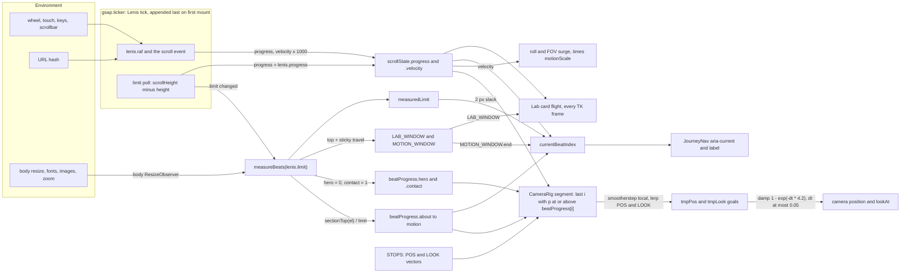
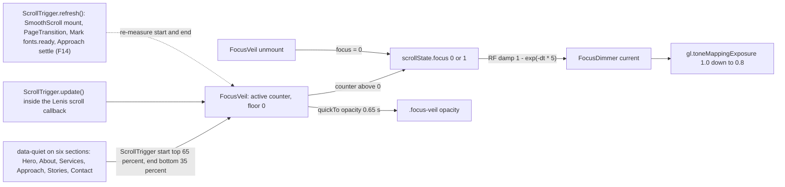
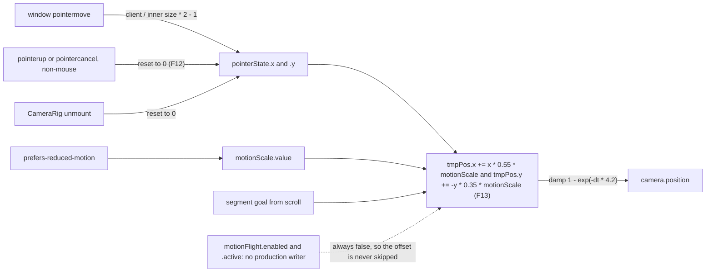
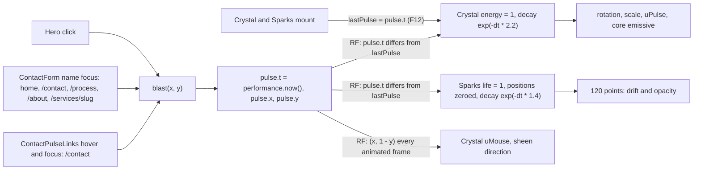
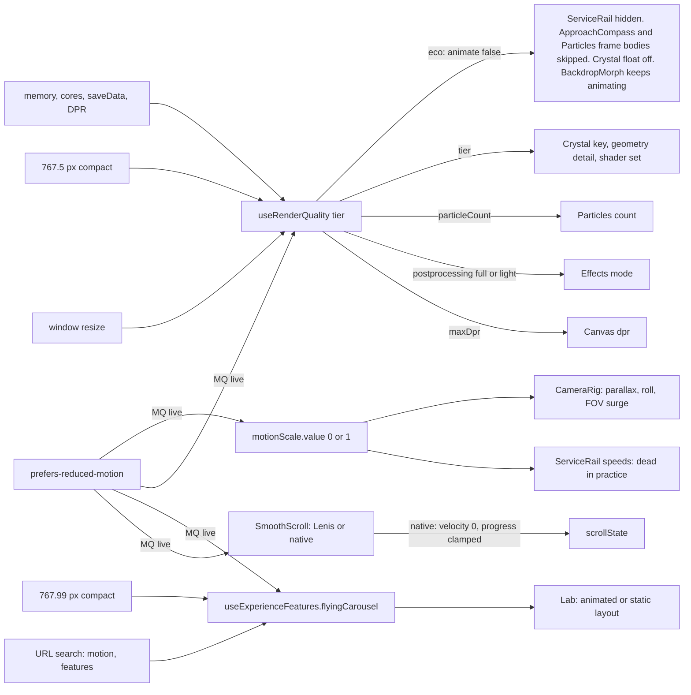
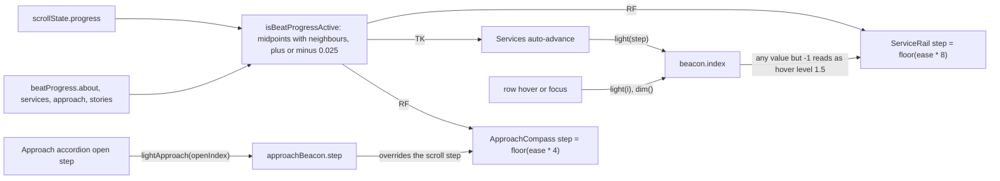

# 08. Frame pipeline

Scope: the per-frame and interaction data of the homepage. Lenis runs on `gsap.ticker`, writes module-level singletons in `lib/`, and the React Three Fiber actors and DOM tickers read them. This chapter maps every field, who writes it on which clock, who reads it, what in the environment moves it, and what happens on mount, teardown and route change. The machine-readable twin is `docs/data-map/data/frame.json` (domain `frame`).

## 0. State of the code this chapter describes

| Item | Value |
| --- | --- |
| Branch head read | `1c17666`. `git diff --stat 95f02c8 HEAD -- components lib` touches only `components/crm/*` and `lib/crm/*`, so the scope inventory (written at `95f02c8`) still describes the frame pipeline. |
| Working tree | Plan items F12, F13 and F14 were being applied while this chapter was written. Five files differ from `HEAD`: `components/Scene.jsx`, `components/three/CameraRig.jsx`, `components/three/Crystal.jsx`, `components/three/Sparks.jsx`, `components/sections/Approach.jsx`. Three new test files accompany them: `tests/frameLifecycle.test.mjs`, `tests/marketing/cameraRigLifecycle.test.jsx`, `tests/marketing/approachRefresh.test.jsx`. This chapter documents the **working tree**, and marks each affected row "(F12)", "(F13)" or "(F14)". |
| Not readable here | `node_modules/` (so Lenis, GSAP and R3F internals are UNVERIFIED) and the network (unpkg and GitHub source were blocked). Every claim about those libraries is marked UNVERIFIED with a way to confirm. |

Conventions. Code is cited as `path#symbol` (the symbol is literally present in the file); there are no line numbers. Clock codes used in every table:

| Code | Clock | Meaning |
| --- | --- | --- |
| TK | `gsap.ticker` | gsap's own rAF; Lenis, ScrollProgress, JourneyNav, Services, Marquee and Lab tick here |
| RF | R3F render loop | the Canvas's own rAF; every `useFrame` body |
| ST | ScrollTrigger callback | fired from `ScrollTrigger.update()` or ScrollTrigger's own listeners |
| EV | DOM event | pointer, click, focus, native scroll |
| RO | ResizeObserver | body, Lab stage, Marquee track |
| MQ | `matchMedia` change | reduced motion, compact breakpoints |
| FX | React effect | mount, unmount, dependency change |
| TL | gsap timeline callback | Loader `onComplete` |

### 0.1 Manifest conventions (`data/frame.json`)

| Item | Convention |
| --- | --- |
| Node kinds | `singleton:<module>.<field>` for every field (38). `input:` for each environment source (15). `actor:` is the part of a file that **reads** singletons: a WebGL `useFrame` body or a DOM ticker (16). `component:` is the file as a **writer or mount owner** (18). A file that does both has both nodes (`CameraRig`, `Services`). `lib:path#symbol` for per-frame functions, hooks and static data (26) |
| Edge kinds | `writes`: input to singleton, component to singleton, lib function to singleton. `feeds`: singleton to actor or lib, input to lib, and lib to actor. `calls`: component to lib function. 224 edges in all, each citing `path#symbol` |
| Writer in `notes` | Where an input writes a singleton through a component (for example `input:browser.pointer` to `singleton:pointerState.x`), the writer component is named in `notes` and in `source` |
| Traversal | `scripts/data-map.mjs` stops at a `component:` node reached partway. So chains are routed through `lib:` and `actor:` nodes (for example render quality goes `lib:...#useRenderQuality` to each actor, with `components/Scene.jsx#quality` as the source), and `component:` nodes are entries (writers) or leaves |
| Intentional orphan | `input:browser.visibility`: no handler exists in the homepage pipeline, and that absence is the finding |
| Nodes with no reader | `motionFlight.progress`, `motionFlight.prewarm`, `MOTION_WINDOW.start` (no production reader) |
| Cross-fragment ids | None. Every endpoint is defined in this fragment. The session storage key is described in `attrs.storageNode` (`storage:session:cws:intro-seen`, owned by `external.json`) rather than linked |

## 1. Topology

### 1.1 What mounts where

| Surface | Tree | Pipeline pieces mounted |
| --- | --- | --- |
| `/` | `app/page.jsx` renders `components/Experience.jsx#Experience` | `SmoothScroll` (parent of everything), `Loader`, `Scene` (`next/dynamic`, `ssr: false`), `FocusVeil`, `Nav`, `ScrollProgress`, `.page` with the nine beats (About, Services and Stories wrapped in `SectionHandoff`), then `JourneyNav` after `.page` |
| 14 marketing routes: `/services`, `/services/[slug]`, `/process`, `/blog`, `/blog/[slug]`, `/reviews`, `/hire/shopify-developer`, `/work`, `/work/[slug]`, `/contact`, `/terms`, `/embroidery-screen-printing-web-design`, `/privacy`, `/about` | `components/marketing/SubpageExperience.jsx#SubpageExperience` | `SmoothScroll`, `FocusVeil`, `ScrollProgress`. No `Scene`, `JourneyNav`, `Loader` or `Nav`. No homepage beat id exists on these pages (grep), so `measureBeats` finds nothing to measure. `FocusVeil` is inert there: `data-quiet` appears only on the six homepage sections |
| Every route | `app/layout.jsx#RootLayout` | Pre-hydration inline script (sets `html[data-scroll-unlocked]` and `html[data-cws-intro-seen]`), `PageTransition` |
| CRM and auth routes | none of the above | No `SmoothScroll`. Singletons keep whatever the last marketing page left (section 5.3) |
| `/services/[slug]` hero | `components/three/ServiceEmblem3D.jsx` | A **second, separate Canvas** with its own R3F loop. It reads no singleton: hover state is local and reduced motion is a local ref. Its geometry comes from `lib/serviceSignalGeometry.mjs`, **not** from the homepage rail (R28) |
| Subpage hero stages | `components/ui/*-background.jsx` (seven modules), `components/marketing/ShapeWaves.jsx` (WebGPU, `ProcessHero`) | Own rAF loops and own pointer listeners. None imports a `lib/` singleton (grep). `dot-field-background.jsx` also runs a 20 ms `setInterval` |

Mount order matters. React runs passive effects children first, siblings in order, parent last. On `/` the order is: `Loader`, `FocusVeil`, `Nav`, `ScrollProgress`, `Hero`, About (`SectionHandoff`), `Marquee` then `Services`, `Approach`, `Stories`, `Mark`, `Lab`, `Motion`, `Contact`, `JourneyNav`, and finally `SmoothScroll`. `Scene` loads later (dynamic import), so `CameraRig`'s listener attaches after `SmoothScroll` has already started.

### 1.2 Clocks

| Clock | Owner | What runs on it | Source |
| --- | --- | --- | --- |
| TK `gsap.ticker` | gsap | Lenis tick, ScrollProgress, JourneyNav, Services auto-advance, Marquee, Lab `syncProgress`, and every gsap tween and timeline (Loader, FocusVeil `quickTo`, reveals) | `components/SmoothScroll.jsx#tick` |
| RF | `@react-three/fiber` Canvas, `frameloop` left at its default `always` | CameraRig, FocusDimmer, Crystal, Sparks, ServiceRail, ApproachCompass, Particles, BackdropMorph; the Effects composer renders after them | `components/Scene.jsx#Canvas` |
| ST | gsap ScrollTrigger | FocusVeil `onToggle`. Fed by `ScrollTrigger.update()` inside the Lenis scroll callback; ScrollTrigger also has its own scroll and resize listeners (UNVERIFIED, GSAP source unreadable) | `components/SmoothScroll.jsx#onScroll` |
| Other timers (not part of the singleton pipeline) | various | `DecodeText` rAF (one-shot per heading), `CardHoverReveal` rAF (event coalescing), `Menu` focus rAF, `SmoothScroll` `hashFrame` rAF (one-shot), `PageTransition` rAF (one-shot) and 5000 ms stuck-guard `setTimeout`, `Approach` 560 ms `setTimeout` (F14), `HoverScramble` `setInterval` | `components/DecodeText.jsx#scramble`, `components/PageTransition.jsx#STUCK_TIMEOUT_MS`, `components/sections/Approach.jsx#APPROACH_SETTLE_MS` |

**Edge:** trigger: always. Consequence: two independent rAF clocks drive one pipeline and read the same singletons with no ordering contract between them (R6).

### 1.3 Per-frame ordering

| # | Fact | Basis | Confidence |
| --- | --- | --- | --- |
| 1 | gsap ticker listener order after first mount on `/`: ScrollProgress, Marquee, Services, Lab, JourneyNav, then the Lenis tick last. `gsap.ticker.add` appends, and the parent's effect runs after its children's | Reading order of effects in `components/Experience.jsx#Experience`; `components/SmoothScroll.jsx#tick` has no `prioritize` argument | Derived. Confirm by logging `performance.now()` and a counter in each tick |
| 2 | So every TK reader sees the previous frame's `scrollState` (R5) | Follows from 1 | Derived |
| 3 | Inside the Lenis tick: `lenis.raf` runs, the Lenis `scroll` event calls `onScroll` (writes progress and velocity, then `ScrollTrigger.update()`, which may toggle FocusVeil and write `focus`), then the limit poll runs `remeasure` and resyncs `progress` | `components/SmoothScroll.jsx#tick`, `#onScroll` | Confirmed in code |
| 4 | The order can change mid-session. Lab's effect re-runs when `flyingCarousel` changes (its tick is re-added after the Lenis tick). A reduced-motion toggle rebuilds the scroll driver and re-adds the Lenis tick at the end | `components/sections/Lab.jsx#useExperienceFeatures`, `components/SmoothScroll.jsx#configureScroll` | Confirmed in code |
| 5 | RF versus TK order within one browser frame is not defined by any code here. Either way the canvas is at most one frame off Lenis | Both clocks call `requestAnimationFrame` | UNVERIFIED. Confirm with a performance trace, or log `performance.now()` in `CameraRig` `useFrame` and in `SmoothScroll#tick` |
| 6 | `useFrame` subscriber order follows layout-effect order: CameraRig, FocusDimmer, Crystal (drei `Float` subscribes just before it), Sparks, ServiceRail, ApproachCompass, Particles, BackdropMorph. The `EffectComposer` renders after the priority-0 actors by library default | `components/Scene.jsx#Canvas` child order | Derived; composer priority UNVERIFIED |
| 7 | No actor reads another actor's output; the only shared per-frame object is the camera, which the composer reads when it renders | Reading all `useFrame` bodies | Confirmed in code |

## 2. Data-point catalogue

Writer and reader columns name the clock. "Initial" is the value at module evaluation.

### 2.1 `scrollState` (`lib/scrollState.js#scrollState`)

| Field | Type or range | Initial | Writer(s) and clock | Reader(s) and clock |
| --- | --- | --- | --- | --- |
| `progress` | number, nominally 0..1. Lenis: `scroll / limit`. Native: clamped | 0 | `components/SmoothScroll.jsx#onScroll` (TK, inside `lenis.raf`; whether Lenis also emits on native or touch scroll is UNVERIFIED). `components/SmoothScroll.jsx#tick` resyncs `lenis.progress` on the frame Lenis's limit changes (TK). `components/SmoothScroll.jsx#updateNativeScroll` (EV scroll, RO body, hash align; native mode) | `components/three/CameraRig.jsx#scrollState` (RF, clamped). `components/three/BackdropMorph.jsx#scrollState` (RF, unclamped, skipped when `animate` is false). `components/three/Crystal.jsx#uScrollProgress` (RF, only while animating). `components/three/ServiceRail.jsx#scrollState` and `components/three/ApproachCompass.jsx#scrollState` (RF). `components/sections/Services.jsx#scrollState` and `components/sections/Lab.jsx#syncProgress` (TK). `components/JourneyNav.jsx#currentBeatIndex` (TK, plus once at mount). `components/ScrollProgress.jsx#scaleX` (TK, unclamped) |
| `velocity` | number. Lenis `velocity * 1000`; native mode always 0. Units UNVERIFIED (R10) | 0 | `components/SmoothScroll.jsx#onScroll` (TK). `components/SmoothScroll.jsx#updateNativeScroll` writes 0 (EV) | `components/three/CameraRig.jsx#velocity` (RF: roll and FOV surge). `components/three/Particles.jsx#uVelocity` (RF, skipped when `animate` is false). `components/three/Crystal.jsx#uScrollVelocity` (RF: the `rotation.y` term is live, the uniform is dead, R23). `components/Marquee.jsx#velocity` (TK) |
| `focus` | 0 or 1 (binary, although the header comment says 0..1) | 0 | `components/FocusVeil.jsx#apply` (ST on `onToggle`, once at mount, and 0 at unmount) | `components/three/FocusDimmer.jsx#scrollState` (RF, damped) |

**Edge:** trigger: a page no taller than the viewport (`limit == 0`). Consequence: native mode floors the limit at 1 and reports 0, while Lenis's `progress` is believed to be 1 (UNVERIFIED, from memory of Lenis source), so the bar and the camera can disagree between modes. `ScrollProgress` does not clamp; `currentBeatIndex` coerces NaN to 0 (R21). Confirm on any short marketing page: log `scrollState.progress` in `SmoothScroll#onScroll`.

### 2.2 `pulse` (`lib/pulse.js#pulse`, written only by `lib/pulse.js#blast`)

| Field | Type or range | Initial | Writer(s) and clock | Reader(s) and clock |
| --- | --- | --- | --- | --- |
| `t` | ms timestamp from `performance.now()` | 0 | `components/sections/Hero.jsx#onBlast` (EV click anywhere in the hero). `components/marketing/ContactForm.jsx#blast` (EV focus on the name field: homepage Contact, `/contact`, `/process`, `/about`, `/services/[slug]` via `components/marketing/ServicePage.jsx#ContactForm`). `components/marketing/ContactPulseLinks.jsx#blast` (EV hover and focus, `/contact` only) | `components/three/Crystal.jsx#lastPulse` and `components/three/Sparks.jsx#lastPulse` (RF). Both compare against a ref now **seeded from `pulse.t` at mount** (F12) |
| `x`, `y` | 0..1 viewport fractions. Keyboard clicks give 0,0. The contact writers use fixed values (0.5, 0.4, 0.6) | 0, 0 | same as `t` | `components/three/Crystal.jsx#uMouse` (RF, `(x, 1 - y)` every animated frame) |

**Edge:** trigger: a contact control is focused on a page where Crystal and Sparks are not mounted, or the visitor returns to `/` afterwards (R8). Consequence: `pulse` is never reset. Before F12 the stale `pulse.t` replayed as a burst on return; after F12 only blasts that land while Crystal and Sparks are mounted burst. Residual: `uMouse` still takes the last blast's coordinates on return.

### 2.3 `motionScale` (`lib/motionScale.js#motionScale`)

| Field | Type | Initial | Writer and clock | Reader(s) and clock |
| --- | --- | --- | --- | --- |
| `value` | 0 (reduced) or 1 | set once at module evaluation by `apply` | `lib/motionScale.js#apply` (MQ, module-lifetime listener, never removed) | `components/three/CameraRig.jsx#motionScale` (RF: parallax (F13), roll, FOV surge). `components/three/ServiceRail.jsx#motionScale` (RF; effectively dead, R7) |

### 2.4 `motionFlight` (`lib/motionFlight.mjs#motionFlight`)

| Field | Type | Initial | Writer(s) | Reader(s) |
| --- | --- | --- | --- | --- |
| `progress` | number | 0 | **none in production.** `lib/motionFlight.mjs#updateMotionFlight` is called only from `tests/latestFeatures.test.mjs` | none |
| `active`, `enabled` | boolean | false | none in production | `components/three/CameraRig.jsx#motionLocked` (RF). `components/three/Effects.jsx#useMotionEffectMode` (FX subscriber) |
| `ready` | boolean | false | none in production. `lib/motionFlight.mjs#setMotionReady` lost its last caller when the `FlyingCarousel` component (components/three/FlyingCarousel.jsx, now deleted) was removed in `7a7fd5f` (v1.69, 2026-09-27) | `components/three/Effects.jsx#useMotionEffectMode` |
| `prewarm` | boolean | false | none in production | none (`getMotionLifecycle` has no production caller) |
| listeners `Set` | `Set<fn>` | empty | `components/three/Effects.jsx#subscribeMotionFlight` adds (FX) and removes on unmount | `lib/motionFlight.mjs#notifyListeners`, which never fires in production |

**Edge:** trigger: always (R2). Consequence: with no writer, `motionLocked` is always false, the camera's "Motion hold" branch and `Effects`' DepthOfField branch are dead code, and the comment "The Motion section owns 400% of pinned scroll" is stale: no `pin:` exists anywhere in `components` or `app` (R2). The git history is shallow (grafted at `dd5d97c`), so the removal of the `updateMotionFlight` caller predates what can be inspected.

### 2.5 `pointerState` (`lib/pointerState.js#pointerState`)

| Field | Type | Initial | Writer and clock | Reader |
| --- | --- | --- | --- | --- |
| `x`, `y` | -1..1, `y` grows downward | 0, 0 | `components/three/CameraRig.jsx#onMove` (EV window `pointermove`). Reset to 0 by `components/three/CameraRig.jsx#onRelease` on `pointerup` and `pointercancel` for non-mouse pointers (F12), and on unmount | `components/three/CameraRig.jsx#pointerState` (RF, scaled by `motionScale` (F13); skipped only when `motionLocked`, which is always false) |

**Edge:** trigger: the mouse leaves the window or the tab loses focus. Consequence: the camera keeps the last cursor offset (no `pointerleave` or `blur` reset), by design per the F12 comment. Touch and pen now reset on release, which fixes the old touch-drag offset (R19, dropped).

### 2.6 `beacon` and `approachBeacon` (`lib/beacon.js`)

| Field | Type | Initial | Writer(s) and clock | Reader(s) and clock |
| --- | --- | --- | --- | --- |
| `beacon.index` | -1 or 0..7 | -1 | `lib/beacon.js#light` from `components/sections/Services.jsx#activateRow`, reached from the TK auto-advance **and** from EV pointerenter and focus (`#focusRow`). `lib/beacon.js#dim` from row `pointerleave` and `blur`. **No unmount reset** | `components/three/ServiceRail.jsx#beacon` (RF) |
| `approachBeacon.step` | -1 or 0..3 | -1 | `lib/beacon.js#lightApproach` from `components/sections/Approach.jsx#lightApproach` (FX on `openIndex`; writes -1 at mount). `lib/beacon.js#dimApproach` (FX unmount) | `components/three/ApproachCompass.jsx#approachBeacon` (RF, only while `animate` and inside the activity window) |

**Edge:** two writers share `beacon.index`, and ServiceRail treats any non -1 value as hover (R4). Trigger: scroll through Services with a fine pointer. Consequence: the auto-advance writes the step into `beacon.index`, so the scroll-active emblem gets `LEVEL_HOVER` (1.5), not `LEVEL_ACTIVE` (1.05). After a hover ends, `dim` sets -1 while `autoIndexRef` is unchanged, so auto-advance does not re-light the row until the step changes; this contradicts the comment in `components/sections/Services.jsx#onPointerLeave`.

### 2.7 `scrollLock` and the DOM flags

| Field | Type | Initial | Writer(s) and clock | Reader(s) |
| --- | --- | --- | --- | --- |
| `scrollLock.locked` | boolean | false | `lib/scrollLock.js#lockScroll` from `components/Loader.jsx#lockScroll` (FX mount, first visit this session, motion allowed). `lib/scrollLock.js#unlockScroll` from `components/Loader.jsx#unlockScroll` (FX seen or reduced, TL `onComplete`, FX unmount) | `lib/scrollLock.js#registerScrollApi` |
| `scrollLock.api` | `{stop, start}` or null | null | `lib/scrollLock.js#registerScrollApi` from `components/SmoothScroll.jsx#registerScrollApi` (FX, Lenis mode only). Set to null at Lenis teardown (`components/SmoothScroll.jsx#scrollLock`) | `lockScroll` and `unlockScroll` |
| `html[data-scroll-unlocked]` | `'1'` or absent | set pre-hydration when the intro was seen or reduced motion is on | `app/layout.jsx#scrollUnlocked` (inline script). `lockScroll` deletes it, `unlockScroll` sets it | `app/styles/loader.css` rule `html:has(.loader):not([data-scroll-unlocked='1'])` locks native overflow |
| `html[data-cws-intro-seen]` | `'1'` or absent | set pre-hydration only when `cws:intro-seen` is `'1'` | `app/layout.jsx#cwsIntroSeen`. `components/Loader.jsx#SESSION_KEY` path sets it on seen, reduced and intro-complete | `app/styles/loader.css` (hides `.loader`). `components/sections/Hero.jsx#introSeen` (render time: `introDelay` 0.15 versus 2.6) |

**Edge:** trigger: first load with reduced motion on. Consequence: the pre-hydration script sets `data-scroll-unlocked` for reduced motion but sets `data-cws-intro-seen` only for a seen session; `Loader` adds the flag at mount. Hero reads the flag at render, so it renders with `introDelay` 2.6, but under reduced motion the reveals skip their delay, so there is no visible effect.

**Edge:** trigger: opening the overlay menu in Lenis mode. Consequence: the menu does not use `scrollLock`. `components/Menu.jsx#overflow` sets `document.body.style.overflow = 'hidden'` and adds no `data-lenis-prevent`. Lenis scrolls programmatically from wheel events, so the page, `progress` and the camera likely keep moving under the open menu (R17, UNVERIFIED in a browser).

### 2.8 `beatProgress` and `measuredLimit` (`lib/beatProgress.js`)

| Field | Type | Initial | Writer and clock | Reader(s) |
| --- | --- | --- | --- | --- |
| `hero` | 0 | 0 | `lib/beatProgress.js#measureBeats`, then forced to 0 after the loop | CameraRig (RF) |
| `about`, `services`, `approach`, `stories`, `mark`, `lab`, `motion` | 0..1, `clamp01(sectionTop(el) / limit)`; skipped when the element is absent | `i / 8` (even spacing) | `lib/beatProgress.js#measureBeats` | CameraRig (RF, segment lookup). ServiceRail (RF: `services`, `approach`). ApproachCompass (RF: `approach`, `stories`). Services (TK: `services`, `approach`). `lib/sceneActivity.mjs#isBeatProgressActive` (neighbour midpoints). `lib/beatProgress.js#currentBeatIndex` (TK via JourneyNav). `measureStickyWindow` (lab, motion) |
| `contact` | forced 1 | 1 | `measureBeats`, last statement | CameraRig (last segment end), `measureStickyWindow` fallback |
| `measuredLimit` (module `let`) | px | 0 | `measureBeats` | `currentBeatIndex` (2 px boundary slack) |

`measureBeats(limit)` call sites, all in `components/SmoothScroll.jsx`: `#updateNativeScroll` (native mode: every scroll event, body RO and hash align), and `#remeasure` (Lenis mode: mount, the TK limit poll when `scrollHeight - height` changes, and the body RO).

**Edge:** trigger: any route to a marketing page. Consequence: on a subpage `measureBeats` still runs against absent elements. Every beat is skipped, but `hero = 0`, `contact = 1`, both windows (from stale fractions and fallbacks) and `measuredLimit = subpageLimit` are rewritten (R14).

### 2.9 `LAB_WINDOW` and `MOTION_WINDOW` (`lib/journey.js`)

| Field | Initial | Writer | Reader |
| --- | --- | --- | --- |
| `LAB_WINDOW.start`, `.end` | 6/8, 7/8 | `lib/beatProgress.js#measureStickyWindow` (via `measureBeats`) | `components/sections/Lab.jsx#LAB_WINDOW` (TK `syncProgress`, only while `flyingCarousel`) |
| `MOTION_WINDOW.end` | 1 | same | `lib/beatProgress.js#MOTION_WINDOW` (`currentBeatIndex`: the Contact boundary) |
| `MOTION_WINDOW.start` | 7/8 | same | none |

Formula: `start = beatProgress[id]`; `end = min(1, max((top + max(offsetHeight - innerHeight, 1)) / limit, start + 1e-4))`, or `max(fallbackEnd, start + 1e-4)` if the element is missing.

**Edge:** trigger: Motion no taller than the viewport, or a jump to `#motion`. Consequence: `.motion` is a normal-flow section (`app/styles/motion.css`), not a sticky stage, so `MOTION_WINDOW.end` is the progress at which Contact's top reaches the viewport **bottom**. If Motion is no taller than the viewport, the travel floors at 1 px, the window end sits at Motion's top, and a jump to `#motion` leaves `aria-current` on Contact (R3). Lab is the sticky one (`app/styles/lab.css`: 340svh with a 100svh sticky stage), and it is measured with `innerHeight`, which can differ from `100svh` on touch devices with a collapsing URL bar (R20).

### 2.10 Other module-level and hook-held state

| State | Where | Writer | Reader | Note |
| --- | --- | --- | --- | --- |
| `curLook` (Vector3, camera look target) | `components/three/CameraRig.jsx#curLook` | RF damped lerp; `useLayoutEffect` resets it to (0,0,0) on mount (F12) | same frame body | Module-level so no allocation inside `useFrame`; value survives unmount but is now reset at the next mount |
| `webglSupport` cache | `lib/webglSupport.mjs#cached` | first `canUseWebGL` call | same function | Real context probe; cached for the document lifetime; `resetWebGLProbe` is test-only |
| `gsap.ticker.lagSmoothing(0)` | `components/SmoothScroll.jsx#lagSmoothing` | every Lenis setup | gsap core, so every ticker consumer | Process-global, never restored |
| `quality` (frozen `RENDER_QUALITY.high`, `.balanced`, `.eco`) | `lib/useRenderQuality.js#useRenderQuality` | MQ compact 767.5 px and reduced motion, connection change, window resize | `components/Scene.jsx#quality` and its props to Crystal, ServiceRail, ApproachCompass, Particles, BackdropMorph, Effects; `components/marketing/ProcessHero.jsx#useRenderQuality` | React state, not a singleton. Policy: `lib/renderQuality.mjs#resolveRenderQuality` |
| `features.flyingCarousel` | `lib/useExperienceFeatures.js#useExperienceFeatures` | MQ compact 767.99 px, MQ reduced motion; URL `features`, `latestFeatures`, `motion` read only when recomputed | `components/sections/Lab.jsx#useExperienceFeatures` | Policy: `lib/experienceFeatures.mjs#resolveExperienceFeatures` |
| `webgl` | `components/Scene.jsx#canUseWebGL` | `useState` initializer | `Scene` returns null when false | With no Scene, `CameraRig` never mounts, so `pointerState` is never written; every DOM writer still runs |
| `motionMode` | `components/three/Effects.jsx#useMotionEffectMode` | `motionFlight` notify (never in production) | Effects branches | always false |

### 2.11 Static journey data (read-only, part of the lineage)

| Constant | Defined | Readers |
| --- | --- | --- |
| `STOPS` | `lib/journey.js#STOPS` | `components/three/CameraRig.jsx#STOPS` (pre-built `POS` and `LOOK` vectors) |
| `CLUSTERS` | `lib/journey.js#CLUSTERS` | `components/Scene.jsx#CLUSTERS` (actor z), `components/three/Lights.jsx#CLUSTERS` |
| `VOLUME` | `lib/journey.js#VOLUME` | `components/three/Particles.jsx#VOLUME` |
| `BEAT_IDS` | `lib/beatProgress.js#BEAT_IDS` | `measureBeats`, `currentBeatIndex`, `components/three/CameraRig.jsx#BEAT_IDS`, `components/SmoothScroll.jsx#BEAT_IDS` (anchor jumps), `lib/journeyNav.mjs#BEAT_IDS` |
| `JOURNEY_NAV` | `lib/journeyNav.mjs#JOURNEY_NAV` | `components/JourneyNav.jsx#JOURNEY_NAV` |

Adding or reordering a beat moves five things together (`CLAUDE.md`): `STOPS` and `CLUSTERS`, `BEAT_IDS`, the section's DOM `id`, its `LABELS` entry in `lib/journeyNav.mjs`, and its actor in `Scene.jsx`.

### 2.12 Sinks: where each chain ends

| Sink | Written by (clock) | Reads |
| --- | --- | --- |
| camera position, lookAt, `rotation.z`, `fov` | `components/three/CameraRig.jsx#useFrame` (RF) | progress, beatProgress, STOPS, pointerState, velocity, motionScale, motionFlight |
| `gl.toneMappingExposure` | `components/three/FocusDimmer.jsx#useFrame` (RF) | focus |
| Crystal uniforms, rotation, scale, core emissive | `components/three/Crystal.jsx#useFrame` (RF) | pulse, progress, velocity, quality |
| Sparks positions and opacity | `components/three/Sparks.jsx#useFrame` (RF) | pulse |
| Particles uniforms | `components/three/Particles.jsx#useFrame` (RF) | velocity, clock |
| Backdrop colour, rotation, z | `components/three/BackdropMorph.jsx#useFrame` (RF) | progress |
| ServiceRail emissive, scale, z, actor meshes, rail y | `components/three/ServiceRail.jsx#useFrame` (RF) | progress, beatProgress, beacon, motionScale, `state.size.width` |
| ApproachCompass marker emissive | `components/three/ApproachCompass.jsx#useFrame` (RF) | progress, beatProgress, approachBeacon |
| `.scroll-progress-bar` transform | `components/ScrollProgress.jsx#scaleX` (TK) | progress |
| JourneyNav `aria-current`, index and label text | `components/JourneyNav.jsx#currentBeatIndex` (TK, only when the index changes) | progress, beatProgress, MOTION_WINDOW, measuredLimit |
| Services row `.is-active`, `aria-current`, ghost marker | `components/sections/Services.jsx#activateRow` (TK and EV) | progress, beatProgress |
| Lab card transform, opacity, pointer-events, tabIndex | `components/sections/Lab.jsx#applyProgress` (TK, every frame) | progress, LAB_WINDOW |
| Marquee track transform | `components/Marquee.jsx#velocity` (TK) | velocity |
| Focus veil opacity | `components/FocusVeil.jsx#apply` (`quickTo`, TK) | quiet-section ScrollTriggers |
| Nav glass class | `components/Nav.jsx#onScroll` (EV, local React state) | `window.scrollY`; not a singleton |

## 3. Environment inputs and the fields they change

| Input | Captured at | Clock | Fields changed (forward) |
| --- | --- | --- | --- |
| Scroll: wheel, touch, keys, scrollbar | Lenis (`components/SmoothScroll.jsx#setupLenisScroll`) or the native listener (`#setupNativeScroll`) | TK or EV | `scrollState.progress`, `.velocity`. Through ScrollTrigger: `scrollState.focus`. Through Services' auto-advance: `beacon.index`. Native mode also rewrites `beatProgress.*`, both windows and `measuredLimit` on every scroll event (R11). `Nav` local state |
| Pointer move, up, cancel | `components/three/CameraRig.jsx#onMove` (window) | EV | `pointerState.x`, `.y` only. `Magnetic` and `CardHoverReveal` write local CSS, not singletons |
| Click | Hero `onBlast`; Approach step `onToggle`; anchor handler `components/SmoothScroll.jsx#onClick` (Lenis mode, on `/` only); `PageTransition` capture handler; `Menu` toggle | EV | `pulse.*`; `approachBeacon.step`; `scrollState.progress` and `.velocity` (through Lenis); route change; `body.style.overflow` |
| Hover and focus | Services rows `#focusRow`; `ContactForm` name field; `ContactPulseLinks` | EV | `beacon.index`; `pulse.*` |
| Resize, body size, fonts, images, zoom, accordion growth | `components/SmoothScroll.jsx#remeasure` (body RO, and the TK limit poll); `lib/useRenderQuality.js#resize`; Lab stage RO; Marquee RO; R3F internal size | RO, TK, EV | `beatProgress.*`, `LAB_WINDOW`, `MOTION_WINDOW`, `measuredLimit`, `scrollState.progress` resync; `quality` tier (R26) |
| Tab visibility | **No handler in the homepage pipeline.** Only `acid-squares-background.jsx`, `liquid-ether-background.jsx` and `ShapeWaves.jsx` listen; Lenis, R3F and the tickers do not | none | rAF pauses; on resume `lagSmoothing(0)` hands the full gap to Lenis (settles instantly) and each RF actor clamps `dt` to 0.05. GSAP's default auto-refresh events include `visibilitychange` (UNVERIFIED here), which would run `ScrollTrigger.refresh()` (R25) |
| `prefers-reduced-motion` | Live: `lib/motionScale.js#apply`, `components/SmoothScroll.jsx#configureScroll`, `lib/useRenderQuality.js#reduced`, `lib/useExperienceFeatures.js#reduced`, `components/sections/Lab.jsx#STATIC_QUERY`, `components/three/ServiceEmblem3D.jsx#reduceRef`. One-shot: `app/layout.jsx#scrollUnlocked`, `Loader`, `Hero`, `SectionHandoff`, `Marquee`, `lib/interactionGuards.mjs#skipsPointerAnimation` (Services), `DecodeText`, `Magnetic`, `Menu`, `PageTransition` (per click), `Reveal` family | MQ or FX | `motionScale.value`; native scroll with `velocity = 0`; `quality = eco` (`animate: false`); `flyingCarousel = false`; `scrollLock.api = null`; Services guard only at mount |
| `(pointer: coarse)` | `lib/interactionGuards.mjs#skipsPointerAnimation`, `Hero`, `SectionHandoff`, `Magnetic` (one-shot) | FX | Services auto-advance and marker disabled, so `beacon.index` is never written by scroll |
| Viewport width | `lib/renderQuality.mjs#readRenderQuality` (767.5 px), `lib/experienceFeatures.mjs#COMPACT_QUERY` (767.99 px), `components/ui/dark-page-background.jsx#STAGE_OFF_QUERY` (767 px), `components/three/ServiceRail.jsx#canShow` (900 px, per frame), `components/sections/Lab.jsx#MOBILE_GRID_BREAKPOINT` (700 px) | MQ, RF, RO | `quality` tier, `flyingCarousel`, rail visibility, Lab grid columns (R18) |
| Device capability: `deviceMemory`, `hardwareConcurrency`, `devicePixelRatio`, `saveData`, `connection` | `lib/renderQuality.mjs#readRenderQuality` | FX, EV | `quality`: eco if reduced motion, saveData, memory 4 or less, or cores 4 or less; balanced if compact, memory 6 or less, cores 6 or less, or DPR 2 or more; else high |
| WebGL availability | `lib/webglSupport.mjs#canUseWebGL` (context probe); `lib/experienceFeatures.mjs#readExperienceFeatures` only checks `typeof WebGLRenderingContext` | FX once | `Scene` renders or returns null; `flyingCarousel` |
| URL hash | `components/SmoothScroll.jsx#alignHash` (one rAF after setup, once per mount); `components/PageTransition.jsx#scrollTo` skips the scroll-to-top when a hash is present | rAF once | scroll position, hence `progress` and `velocity` |
| URL search | `lib/experienceFeatures.mjs#resolveExperienceFeatures` (`features=legacy`, `latestFeatures=off`, `motion=full` or `legacy`) | on hook init and MQ change | `flyingCarousel` (R24) |
| Route change | `components/PageTransition.jsx`, the App Router | FX | mount and teardown of every writer (section 5) |
| `sessionStorage['cws:intro-seen']` | `app/layout.jsx#cwsIntroSeen`, `components/Loader.jsx#SESSION_KEY` | FX | `scrollLock.locked`, both `html` flags |

## 4. Derived chains

### 4.1 Scroll to progress to beat breakpoints to camera segment

### 4.2 `data-quiet` to FocusVeil to focus to FocusDimmer

### 4.3 Pointer to parallax

### 4.4 Pulse to Crystal and Sparks

### 4.5 Reduced motion and render quality to `motionScale` to actors

### 4.6 Services and Approach step chain

### 4.7 Derivation rules

| Derived value | Formula | Source |
| --- | --- | --- |
| Beat breakpoint | `clamp01(sectionTop(el) / lenis.limit)`; hero forced 0, contact forced 1. `sectionTop` sums `offsetTop` up the `offsetParent` chain and ignores transforms | `lib/beatProgress.js#measureBeats`, `#sectionTop` |
| Camera segment | `seg` = last `i < 8` with `p >= beatProgress[BEAT_IDS[i]]`; `local = smootherstep(clamp((p - start) / max(end - start, 1e-4)))` | `components/three/CameraRig.jsx#smootherstep` |
| Camera damping | `k = 1 - exp(-dt * 4.2)`, `dt <= 0.05`. FOV uses `1 - exp(-dt * 3)` | `components/three/CameraRig.jsx#useFrame` |
| Parallax offset | `x += pointer.x * 0.55 * motionScale`; `y += -pointer.y * 0.35 * motionScale` | `components/three/CameraRig.jsx#pointerState` |
| Roll, FOV surge | `roll = clamp(velocity * 0.00035, -0.06, 0.06) * motionScale`; `surge = min(abs(velocity) * 0.004, 1) * 4.5 * motionScale` | `components/three/CameraRig.jsx#FOV_SURGE_MAX` |
| Current nav beat | `p = clamp01(progress) + 2 / measuredLimit`; Contact when `p >= MOTION_WINDOW.end`; else a reverse threshold walk over `beatProgress` | `lib/beatProgress.js#currentBeatIndex` |
| Beat activity window | `[(prev + cur) / 2 - 0.025, (cur + next) / 2 + 0.025]`, hero starts at 0 and contact ends at 1 | `lib/sceneActivity.mjs#isBeatProgressActive` |
| Services and rail step | `floor(clamp01((p - services) / (approach - services)) * 8)` | `components/three/ServiceRail.jsx#activeStep`, `components/sections/Services.jsx#step` |
| Compass step | `floor(clamp01((p - approach) / (stories - approach)) * 4)`, overridden by `approachBeacon.step` when it is 0..3 | `components/three/ApproachCompass.jsx#scrollStep` |
| Exposure | `1.0 + (0.8 - 1.0) * damped(focus)`, damp `1 - exp(-dt * 5)` | `components/three/FocusDimmer.jsx#EXPOSURE_QUIET` |
| Lab flight progress | `clamp01((p - LAB.start) / max(LAB.end - LAB.start, 1e-4))` | `components/sections/Lab.jsx#syncProgress` |
| Render tier | eco if reduced motion, saveData, memory 4 or less, cores 4 or less; balanced if compact, memory 6 or less, cores 6 or less, DPR 2 or more; else high | `lib/renderQuality.mjs#resolveRenderQuality` |

## 5. Lifecycle

### 5.1 Mount and teardown per writer

| Writer | Mount | Teardown | Resets its singleton on unmount? |
| --- | --- | --- | --- |
| SmoothScroll, Lenis mode | `components/SmoothScroll.jsx#setupLenisScroll`: new Lenis, `registerScrollApi`, Lenis tick on the ticker, `lagSmoothing(0)`, document click handler, `remeasure()`, body RO | click listener, ticker listener, `lenis.off`, `lenis.destroy`, RO, `scrollLock.api = null` | **No.** `progress`, `velocity`, `beatProgress`, both windows and `measuredLimit` persist |
| SmoothScroll, native mode | `#setupNativeScroll`: scroll listener, body RO, immediate `updateNativeScroll` | listener and RO removed; `api` untouched | No |
| SmoothScroll mode swap | `#configureScroll`: tears down, rebuilds, `ScrollTrigger.refresh()`, one-shot `hashFrame` | cancels `hashFrame` | n/a |
| FocusVeil | `components/FocusVeil.jsx#FocusVeil`: one ScrollTrigger per `[data-quiet]`, then `apply()` | kills triggers, `focus = 0` | **Yes** |
| CameraRig | pointer listeners; `useLayoutEffect` sets `curLook` to (0,0,0) (F12) | removes listeners, `pointerState = 0` | **Yes** for pointer. `curLook` is reset at the next mount instead |
| Services | marker tween (fine pointer only); TK auto-advance (fine pointer, no reduced motion) | removes ticker, kills marker tween | **No**: `beacon.index` keeps its last value |
| Approach | `lightApproach(-1)` at mount; refresh timer after the first toggle (F14) | `dimApproach()`; timer cleared | **Yes** |
| Loader | `lockScroll()` (first visit), timeline | `tl.kill()`, `unlockScroll()` | **Yes** (unlocks) |
| Lab | RO on the stage, MQ listener, TK `syncProgress` when animated | removes all three | n/a (reads only) |
| JourneyNav, ScrollProgress, Marquee | ticker listener | removed | n/a |
| Effects | `subscribeMotionFlight` | returned unsubscribe | n/a |
| `motionScale` | module evaluation | never | n/a (app lifetime by design) |
| Pulse writers (Hero, ContactForm, ContactPulseLinks) | React event handlers | none | **No**: `pulse` is never reset; readers seed instead (F12) |
| ServiceRail GPU resources | local `createSignalGeometries`, `useMemo` | disposes its **own** geometries and materials | n/a (not shared with `ServiceEmblem3D`, see R28) |
| Crystal, Sparks, Particles, BackdropMorph, ApproachCompass, FocusDimmer | refs per mount | R3F disposes the scene on Canvas unmount | n/a |

### 5.2 Route-change sequences

| Transition | What happens | Values that carry over |
| --- | --- | --- |
| `/` to a subpage (link click) | `PageTransition` capture handler fades `#main-content` out (0.45 s), then `router.push`. In one commit React runs every passive cleanup of the homepage tree (SmoothScroll teardown, FocusVeil `focus = 0`, CameraRig pointer reset, Approach `dimApproach`, Loader `unlockScroll`, ticker removals), the Canvas is destroyed, then the subpage mounts a new `SmoothScroll` (new Lenis). Its `remeasure` runs `measureBeats` against absent elements (R14). `FocusVeil` creates zero triggers. Then `PageTransition`'s pathname effect runs `window.scrollTo(0, 0)` and, in a rAF, `ScrollTrigger.refresh()` and the fade-in | `scrollState.progress` and `.velocity` until the new Lenis's first tick resyncs progress (velocity until the next scroll emit, UNVERIFIED); `beacon.index`; `pulse.*`; `lagSmoothing(0)`; `html` flags |
| subpage to `/` | Homepage writers mount; Loader sees the session flag and unlocks. The first mount-time reads (`JourneyNav` initial `tick`, `Lab` initial `syncProgress`) run **before** `SmoothScroll` remeasures, so they use the subpage's overwritten windows for one pass. The first TK frame runs the DOM tickers before the Lenis tick resyncs `progress` | `pulse.t` is non-zero but Crystal and Sparks now seed from it (F12); `curLook` reset on mount (F12); `beacon.index` stale until the first Services tick (never on coarse or reduced devices); `velocity` stale until the first scroll emit |
| `/` to `/#contact` (same page) | No route change. The anchor handler runs `lenis.scrollTo(sectionTop(target))`, sets `tabindex=-1` and focuses the target | none |
| subpage to `/#section` | Route change, then the one-shot `hashFrame` aligns the hash, then `PageTransition`'s rAF runs `ScrollTrigger.refresh()` | The alignment never repeats, so a later layout shift is not re-aligned (R15) |
| subpage to subpage | `SubpageExperience` is rebuilt per route segment, so Lenis remounts. UNVERIFIED (assumed from App Router segment keying) | as the first row |
| Back or forward | `PageTransition`'s pathname effect returns early (no click started it): no `scrollTo(0, 0)`, no fade, no extra refresh. `SmoothScroll` still refreshes at mount, and the mount-time resync corrects `progress` | UNVERIFIED how Next restores scroll relative to a fresh Lenis |
| Reduced motion toggled mid-session | `configureScroll` swaps Lenis and native scroll and refreshes ScrollTrigger. `motionScale`, `quality` and `features` update live. One-shot gates (Hero, SectionHandoff, Marquee, DecodeText, Magnetic, Services guard) do **not** | Lenis `velocity` stays at its last value until the first native scroll event |

### 5.3 Values that survive navigation

| Value | Survives a route change? | Reset by | Consequence |
| --- | --- | --- | --- |
| `scrollState.progress`, `.velocity` | Yes | Next Lenis tick (progress), next scroll emit (velocity) | one stale frame |
| `scrollState.focus` | No | `FocusVeil` unmount | none |
| `beatProgress.*`, `LAB_WINDOW`, `MOTION_WINDOW`, `measuredLimit` | Yes, then overwritten by the subpage's `measureBeats` | next `measureBeats` on `/` | one-frame readers use fallbacks (R14) |
| `pulse.*` | Yes, never reset | nothing | harmless after F12; `uMouse` takes the old coordinates |
| `beacon.index` | Yes | next `activateRow` or `dim` | stale until a Services tick |
| `approachBeacon.step` | No | `dimApproach` | none |
| `pointerState` | No | CameraRig cleanup | none |
| `motionScale.value` | Yes, by design | the MQ listener | none |
| `scrollLock.locked` and `data-scroll-unlocked` | No | `Loader` unmount calls `unlockScroll` | none |
| `data-cws-intro-seen` | Yes (same document) | never | later visits skip the loader and use `introDelay` 0.15 |
| `curLook` | Value yes | reset at next CameraRig mount (F12) | none |
| `gsap.ticker.lagSmoothing(0)` | Yes, process-global | never | every later gsap consumer in the document runs with lag smoothing off |
| `webglSupport` cache | Yes | never | none |

### 5.4 Mid-session changes that are not route changes

| Trigger | Effect |
| --- | --- |
| Reduced-motion turned on | `motionScale = 0` (camera roll, FOV surge and pointer parallax go to 0 after damping); tier becomes eco, so Particles and ApproachCompass freeze at their last values, BackdropMorph stops spinning (its rotation is scaled by `motionScale`) but keeps its scroll-driven hue and depth, ServiceRail hides, Crystal stops floating; `flyingCarousel` false, so Lab re-runs its effect and switches to the static grid; Lenis is swapped for native scroll |
| Compact breakpoint crossed | `quality` and `flyingCarousel` recompute (different thresholds, R18); Lab re-adds its ticker (after the Lenis tick) or detaches it |
| Zoom or display change that moves `devicePixelRatio` across 2 | tier flips; `Crystal` remounts (its mesh `key` is the tier) with a new geometry detail and shader set, Particles regenerates its buffer, Effects switches mode (R26) |
| Tab hidden and shown | rAF stops; on resume the gap is handed to Lenis and `dt` is clamped to 0.05 in every RF actor; `ScrollTrigger.refresh()` may run (UNVERIFIED) |
| WebGL context lost | No handler anywhere in the app (grep for `webglcontextlost`). Whether R3F recovers is UNVERIFIED |
| Canvas child throws | `components/three/CanvasFeatureBoundary.jsx#CanvasFeatureBoundary` replaces the Canvas with null; `Scene` passes no `resetKey`, so it stays gone until the next route remount (R27) |

## 6. Edge cases

Severity: **H** a user-visible defect likely today. **M** a correctness or accessibility gap under a common condition. **L** latent or minor. "Derived" means it follows from the code and needs a browser check; "confirmed" means read directly in code. R-numbers come from the scope inventory; gaps in the numbering are in the second table.

| # | Sev | Edge case: trigger, then consequence | Evidence | Status |
| --- | --- | --- | --- | --- |
| R1 | **H** | **Scroll-driven Services and Approach steps cannot reach their last items.** Trigger: scrolling through either beat. The activity window ends at the midpoint to the next beat plus 0.025, but the step math spans the whole beat, so the largest reachable `ease` is `0.5 + 0.025 / span`. Step `k` of `N` is reachable only if `k / N <= 0.5 + 0.025 / span`. Rail (N = 8): steps 0 to 4 always, step 5 needs `span <= 0.2`, step 6 `<= 0.1`, step 7 (AI and Workflow rows) `<= 0.067`. Compass (N = 4): steps 0 to 2 always, step 3 (Launch) needs `span <= 0.1`. Consequence: the DOM marker, the row shine and the rail all stop early and agree with each other; the last rows light only on hover. The rail's `position.y` also stops at `ease * 7`, short of the end | `components/three/ServiceRail.jsx#activeStep`, `components/sections/Services.jsx#step`, `components/three/ApproachCompass.jsx#scrollStep`, `lib/sceneActivity.mjs#isBeatProgressActive` | Derived. Confirm in the console on `/`: `const st = el => { let t = 0; for (let n = el; n; n = n.offsetParent) t += n.offsetTop; return t; }; const lim = document.documentElement.scrollHeight - innerHeight;` then `(st(document.getElementById('approach')) - st(document.getElementById('services'))) / lim` and the same for `stories` minus `approach` |
| R2 | L | **`motionFlight` has no production writer.** Trigger: always. Consequence: `motionLocked` is always false, CameraRig's Motion hold and Effects' DepthOfField branch never run, and two comments are stale ("Motion owns 400% of pinned scroll"; Lab's header calling Motion a WebGL scene). No homepage section is pinned. Re-rated from H: no user-visible effect | `components/three/CameraRig.jsx#motionLocked`, `components/three/Effects.jsx#useMotionEffectMode`, `lib/motionFlight.mjs#updateMotionFlight` (test-only callers); `FlyingCarousel` component deleted in `7a7fd5f` | Confirmed |
| R3 | M | **`MOTION_WINDOW` assumes a sticky Motion stage that does not exist.** Trigger: Motion section no taller than the viewport. Consequence: sticky travel floors at 1 px, the Contact boundary sits at Motion's top, and a jump to `#motion` lands with `aria-current` on Contact. For taller Motion, the nav flips to Contact when Contact's top reaches the viewport bottom, not its top. `tests/beatProgress.test.mjs` and `tests/sectionArchitecture.test.mjs` both stub Motion as a 2800 px sticky section and Lab as non-sticky (asserting `LAB_WINDOW.end` is about 0.6001), the inverse of reality | `lib/beatProgress.js#measureStickyWindow`, `lib/beatProgress.js#MOTION_WINDOW`, `app/styles/motion.css`, `tests/sectionArchitecture.test.mjs` | Logic confirmed; height-dependent outcome derived. Confirm: `document.getElementById('motion').offsetHeight` against `innerHeight` |
| R4 | M | **Two writers, one field: `beacon.index`.** Trigger: scrolling through Services with a fine pointer, then hovering a row. Consequence: the scroll-active emblem is lit at hover level; after the hover `dim()` leaves -1 and auto-advance does not re-light until the step changes. Contradicts the comment in `onPointerLeave` | `components/sections/Services.jsx#activateRow`, `components/three/ServiceRail.jsx#beacon`, `lib/beacon.js#dim` | Confirmed |
| R5 | M | **Every TK reader lags Lenis by one frame.** Trigger: any scroll. Consequence: Lab writes card transforms from last frame's progress while Lenis moves the page in the same tick (possible jitter on the sticky stage); JourneyNav, ScrollProgress, Services and Marquee lag too. After a Lab effect re-run or a reduced-motion toggle the order changes again | `components/ScrollProgress.jsx#scaleX`, `components/sections/Lab.jsx#syncProgress`, `components/SmoothScroll.jsx#tick` | Derived. Confirm with a trace (section 1.3 row 1) |
| R6 | M | **A second rAF clock.** Trigger: always. Consequence: the Canvas loop and `gsap.ticker` read the same singletons with no ordering contract. Further independent loops: `DecodeText`, `CardHoverReveal`, `ServiceEmblem3D`, the subpage stages, `ShapeWaves` | `components/Scene.jsx#Canvas`, `components/SmoothScroll.jsx#tick` | Confirmed. Whether to unify is an owner decision |
| R7 | M | **Reduced-motion gating is split across 3 live sources and about 10 one-shot checks, and they disagree.** After F13: pointer parallax and the `BackdropMorph` spin are both scaled by `motionScale`. Still true: (a) `ServiceRail`'s `motionScale` multipliers are dead because reduced motion forces eco, `animate: false`, and the rail is hidden; (b) Services' guard is one-shot and ignores a mid-session toggle; (c) Hero's click blast and the Sparks burst ignore reduced motion (user-initiated); (d) scroll-linked camera flight is not removed under reduced motion | `components/three/CameraRig.jsx#motionScale`, `components/three/BackdropMorph.jsx#motionScale`, `components/three/ServiceRail.jsx#canShow`, `lib/interactionGuards.mjs#skipsPointerAnimation` | Confirmed; partly fixed by F13 |
| R8 | L | **`pulse` is written where nothing reads it.** Trigger: focusing the Contact name field on `/` (the crystal is about 120 units behind the camera) or any contact control on a subpage. Consequence: no visible burst; the stale-burst-on-return part is fixed (F12). `uMouse` still takes the last blast's coordinates. Re-rated from M | `components/marketing/ContactForm.jsx#blast`, `components/three/Crystal.jsx#lastPulse` | Confirmed; mostly fixed by F12 |
| R9 | L | **ScrollTrigger refresh is still event-specific.** F14 refreshes 560 ms after an Approach step toggles. Other height changes (late images or video in `WorkMarquee`, font swap) still rely on GSAP's own auto-refresh events (UNVERIFIED which, from GSAP docs: `visibilitychange`, `DOMContentLoaded`, `load`, `resize`). Also unverified: whether `ScrollTrigger.refresh()` during an active Lenis glide causes a visible nudge. Re-rated from M | `components/sections/Approach.jsx#APPROACH_SETTLE_MS`, `components/FocusVeil.jsx#ScrollTrigger`, `components/sections/Mark.jsx#refresh` | Code confirmed; GSAP behaviour UNVERIFIED. Confirm: log `ScrollTrigger.getAll().map(t => [t.start, t.end])` before and after a layout shift |
| R10 | M | **`velocity` units and staleness.** If Lenis reports px per frame, `velocity * 1000` saturates every consumer on any scroll (roll cap at 171, FOV cap at 250, Particles cap at 750, Marquee cap at 2000) and the effect depends on refresh rate. `velocity` is only written on scroll emits, so a teardown mid-scroll can leave a non-zero value that CameraRig, Particles, Crystal and Marquee keep reading | `components/SmoothScroll.jsx#onScroll`, `components/three/CameraRig.jsx#velocity`, `components/Marquee.jsx#velocity` | UNVERIFIED. Confirm: temporarily log `velocity` in `onScroll` during a wheel flick and look at magnitude and whether a final 0 arrives |
| R11 | L | **Native (reduced-motion) mode re-measures every beat on every scroll event.** Trigger: scrolling with reduced motion on. Consequence: about eleven element lookups and `offsetTop` chains per event. Scrolling does not dirty layout, so these reads are cheap; thrash only if something else dirties layout in the same frame. Re-rated from M | `components/SmoothScroll.jsx#updateNativeScroll` | Confirmed code; cost unmeasured |
| R14 | L | **A subpage `measureBeats` overwrites the homepage singletons** (`hero`, `contact`, both windows, `measuredLimit`) using the stale fractions of absent elements. Trigger: any route to a marketing page. Consequence: on return, readers that run before `SmoothScroll` remeasures (JourneyNav's initial tick, Lab's initial sync) see fallback windows for one pass | `lib/beatProgress.js#measureBeats`, `components/marketing/SubpageExperience.jsx#SubpageExperience` | Confirmed |
| R15 | L | **Initial hash alignment is one-shot and bypasses `sectionTop`.** Trigger: landing on `/#section`. `alignHash` hands Lenis the element (Lenis measure UNVERIFIED, likely rect-based, so up to 16 px past the layout top for sections `SectionHandoff` holds low; harmless for beat detection, which only needs `p >= top`). The `data-anchor-progress` pin lookup is dead: no ScrollTrigger uses Lab or Motion as its trigger. A later layout shift is not re-aligned | `components/SmoothScroll.jsx#alignHash`, `components/sections/Lab.jsx#ANCHOR_PROGRESS`, `components/sections/Motion.jsx#DEEP_LINK_PROGRESS` | Confirmed code |
| R16 | L | **Lab does full DOM writes every frame, even off-screen.** Trigger: always while `flyingCarousel`. Consequence: 8 cards, each transform, opacity, pointer-events and tabIndex, with string building, on every TK frame. A skip when progress is unchanged or the section is off-screen would remove it | `components/sections/Lab.jsx#applyProgress` | Confirmed |
| R17 | L | **The menu does not use `scrollLock`.** Trigger: opening the overlay menu in Lenis mode. Consequence: `body.style.overflow = 'hidden'` may not stop Lenis's programmatic wheel scroll, so the page, `progress` and the camera move under the menu | `components/Menu.jsx#overflow`, `lib/scrollLock.js#lockScroll` | UNVERIFIED. Confirm in a browser: open the menu and wheel |
| R18 | L | **Inconsistent breakpoints and capability checks.** Compact is 767.5 (quality), 767.99 (features), 767 (stage backgrounds), 900 (rail), 700 (Lab). WebGL is a real probe in `Scene` but `typeof WebGLRenderingContext` in features. A width of 767.7 gives full features but compact quality | `lib/renderQuality.mjs#readRenderQuality`, `lib/experienceFeatures.mjs#COMPACT_QUERY`, `lib/webglSupport.mjs#canUseWebGL` | Confirmed |
| R20 | L | **Lab sticky travel uses `innerHeight`** while the stage is `100svh`. Trigger: a non-compact touch device with a collapsing URL bar. Consequence: `LAB_WINDOW.end` is off by `(lvh - svh) / limit` | `lib/beatProgress.js#measureStickyWindow`, `app/styles/lab.css` | Derived |
| R21 | L | **Short pages.** Trigger: a document no taller than the viewport. Lenis `progress` may be 1 or NaN, native mode gives 0; `ScrollProgress` does not clamp | `components/ScrollProgress.jsx#scaleX`, `lib/beatProgress.js#currentBeatIndex` | UNVERIFIED |
| R22 | Resolved | **F13 first froze the whole BackdropMorph frame on every eco device.** The working tree had passed `animate={quality.animate}`, which would also have stopped the hue drift and the depth recession on 4-core, low-memory and save-data devices, not only for reduced-motion users. Review changed F13 to scale only the shell's spin by `motionScale.value`; eco devices look as before, and the scroll-driven hue and depth stay for everyone, so the camera never leaves the shell | `components/three/BackdropMorph.jsx#motionScale`, `tests/frameLifecycle.test.mjs` | Fixed in review |
| R23 | L | **`uScrollVelocity` is a dead uniform.** The vertex shader declares it but nothing references it; only the `rotation.y` term uses velocity | `components/three/Crystal.jsx#uScrollVelocity` | Confirmed (grep) |
| R24 | L | **`?motion=full` overrides reduced motion for Lab.** Trigger: that query string with the OS setting on. Consequence: `flyingCarousel` is true and `shouldUseStaticMotionLayout` ignores its `reducedMotion` argument, so the animated flight runs | `lib/experienceFeatures.mjs#forceFullMotion`, `lib/motionLayout.mjs#shouldUseStaticMotionLayout` | Confirmed; may be intended as a debug switch |
| R25 | L | **FocusVeil's counter may desync on `ScrollTrigger.refresh()`.** The counter adds 1 per `isActive` toggle and floors at 0 but has no ceiling. If a refresh re-fires `onToggle(isActive: true)` for an already-active trigger, `focus` and the veil stay on after leaving the quiet section. Refresh runs at SmoothScroll mount, `PageTransition`, Mark's `fonts.ready`, and now Approach | `components/FocusVeil.jsx#onToggle`, `components/sections/Approach.jsx#APPROACH_SETTLE_MS` | UNVERIFIED (GSAP source unreadable). Confirm: call `ScrollTrigger.refresh()` while Hero is active, scroll to Mark, check `.focus-veil` computed opacity is 0 |
| R26 | L | **A DPR crossing flips the tier mid-session.** Trigger: browser zoom that takes `devicePixelRatio` from below 2 to 2 or more. Consequence: high becomes balanced, `Crystal` remounts (its mesh `key` is the tier) with a lower geometry detail and the mobile shader pair, Particles regenerates 650 to 420 points, Effects drops mipmap blur. A visible pop | `lib/useRenderQuality.js#resize`, `components/three/Crystal.jsx#tier` | Derived |
| R27 | L | **`CanvasFeatureBoundary` never resets.** Trigger: any render-time throw below the Canvas. Consequence: the Canvas is replaced with null for the rest of the route; DOM sections keep writing singletons that nothing reads | `components/Scene.jsx#CanvasFeatureBoundary`, `components/three/CanvasFeatureBoundary.jsx#resetKey` | Confirmed code |
| R28 | L | **Two copies of the service-signal geometry.** `ServiceRail` builds its own with a local `createSignalGeometries`; `ServiceEmblem3D` uses `lib/serviceSignalGeometry.mjs`. The header comments and `tests/serviceEmblem3D.test.mjs` both claim a single shared source, but the test only compares the lib module with itself, so the rail and the inner-page emblems can drift unnoticed. Replaces R13 | `components/three/ServiceRail.jsx#createSignalGeometries`, `components/three/ServiceEmblem3D.jsx#getSignalGeometry`, `tests/serviceEmblem3D.test.mjs` | Confirmed |

### Dropped, merged or re-rated since the inventory

| # | Disposition | Reason |
| --- | --- | --- |
| R12 | Dropped | Fixed in the working tree (F12): `components/three/CameraRig.jsx#curLook` is reset in a `useLayoutEffect` on mount |
| R13 | Dropped as stated | Wrong: `ServiceRail` does not use the shared cache. It builds its own geometries and disposes only those. The real issue is the duplication (R28) |
| R19 | Dropped | Fixed in the working tree (F12): `components/three/CameraRig.jsx#onRelease` zeroes `pointerState` on `pointerup` and `pointercancel` for touch and pen. Mouse behaviour is intentional |
| R2, R8, R9, R11 | Re-rated | See the table; R2 and R11 had no user-visible consequence, R8 and R9 are mostly fixed |
| R7, R8, R9 | Partly fixed | F13 and F14 (and F12 for R8) change them; the residual is described in each row |

### UNVERIFIED register: how to confirm

| Item | Why unverified | Confirm by |
| --- | --- | --- |
| Lenis `velocity` units, whether it returns to 0 and emits on settle | `node_modules` unreadable, network blocked | Log in `SmoothScroll#onScroll` during a wheel flick |
| Lenis `progress` at `limit == 0`; emit at init and on resize; emit on native or touch scroll | same | Log `lenis.progress` and the emit count on a short page and on a touch device |
| Lenis `scrollTo(element)` measurement; reaction to `window.scrollTo(0, 0)` after remount | same | Jump to `/#services` from a subpage and compare `scrollY` with `sectionTop` |
| RF versus TK order in a frame | no code orders them | Performance trace, or timestamps in both callbacks |
| GSAP auto-refresh events and `onToggle` on refresh | GSAP source unreadable | R25 and R9 recipes above |
| Menu scroll under Lenis | needs a browser | R17 recipe |
| Subpage to subpage remount of `SmoothScroll` | App Router behaviour | Log in the mount effect while navigating `/about` to `/services` |
| `EffectComposer` render priority | library default | Read `@react-three/postprocessing` in an installed checkout |
| R3F behaviour on `webglcontextlost` | library | `WEBGL_lose_context.loseContext()` in the console |
