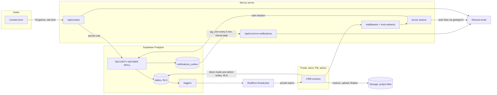

# Data map

Where every piece of data in the site and CRM comes from, what writes it,
what reads it, where it goes next, and what can go wrong on the way. Built
2026-09-30 to 2026-10-01 against `main` at `1c17666` plus this branch's fixes,
with migrations through `0051`.

## The two questions it answers

| Question | Where to look |
| --- | --- |
| "If this input changes, what does it touch?" (a form field, an action, a cron run, an env var) | [04 — Externalities](04-externalities.md), part 1: every entry point and everything downstream of it, following writes, RPCs, triggers, outbox rows, emails and broadcasts. |
| "Where does this value come from, and who else writes it?" (a column, an email, a cookie) | [01 — Data dictionary](01-data-dictionary.md) "written by" and "read by" columns, or [04](04-externalities.md) part 2. |

## Chapters

| File | What it covers |
| --- | --- |
| [01-data-dictionary.md](01-data-dictionary.md) | Every table and column: type, constraints, writers, readers. Foreign keys and what a delete reaches. Triggers. Status columns. ER diagram. |
| [01b-database-logic.md](01b-database-logic.md) | Every SQL function and RPC: security, grants, reads, writes, side effects, the errors it raises. RLS matrix, storage, realtime, pg_cron, pg_net, Vault. |
| [02-entry-points.md](02-entry-points.md) | Every server action, route handler and middleware branch: inputs, validation, auth gate, client used, writes, outbound calls, outputs, failure paths. |
| [03-screens.md](03-screens.md) | Every CRM screen: what it loads, what it writes, realtime and presence, browser storage, URL-carried data. |
| [04-externalities.md](04-externalities.md) | Generated. Input to data point, and data point to input. |
| [05-lifecycles.md](05-lifecycles.md) | State machines: lead, account, brief, project, task, deliverable and approval, attachment, outbox row, assignment, blog post. |
| [06-edge-cases.md](06-edge-cases.md) | The register: every finding with severity and status, the live-state check, and the owner checklist. **Start here if you are acting on this.** |
| [07-external-services.md](07-external-services.md) | Env vars, Resend, hCaptcha, Upstash, Sentry, GA4 and GTM, Trustpilot, cron, CI workflows, scripts, cookies, static content sources. |
| [08-frame-pipeline.md](08-frame-pipeline.md) | The homepage: scroll, pointer and media inputs, `lib/` singletons, WebGL actors, per-frame order. |
| [SCHEMA.md](SCHEMA.md) | The manifest format behind 04 and the drift test. |
| [PLAN.md](PLAN.md) | How the map was scoped and built, and the fix list. |

## The main flows in one picture



## How to read a row

- Node ids follow [SCHEMA.md](SCHEMA.md): `table:public.projects`,
  `fn:public.create_project`,
  `action:app/actions/project-actions.js#createProject`, `route:POST /api/contact`,
  `env:NEXT_PUBLIC_APP_URL`, `singleton:scrollState.progress`.
- Edges point the way data moves. A write is `writer -> table`; a read is
  `table -> reader`; a foreign key is `parent -> child`, because a delete
  travels that way.
- **Edge:** notes sit next to the item they affect. They give the trigger
  condition and the consequence. The register collects them.
- Sources: app code as `path#symbol` (survives line moves), migrations as
  `path:line` (migrations never change after they ship).
- UNVERIFIED marks anything the repo alone cannot prove (dashboard values,
  library internals, browser behaviour). The register says how to check each.

## Keeping it current

`pnpm test` runs [`tests/data-map.test.mjs`](../../tests/data-map.test.mjs),
which fails when:

- a server action, route handler, page, table, SQL function, trigger, env
  var, `.from()` table or `.rpc()` name in the code has no node in the
  manifest;
- an edge points at a node that does not exist, or cites a file, symbol or
  line that does not exist;
- `04-externalities.md` or `data-map.json` differ from a fresh render.

After a change that adds or moves data, update the fragment that owns it
under `data/` (ownership table in [SCHEMA.md](SCHEMA.md)) and the matching
chapter, then run:

```bash
node scripts/data-map.mjs --write   # regenerate 04 and data-map.json, print problems
node scripts/data-map.mjs --check   # what CI asserts
```
