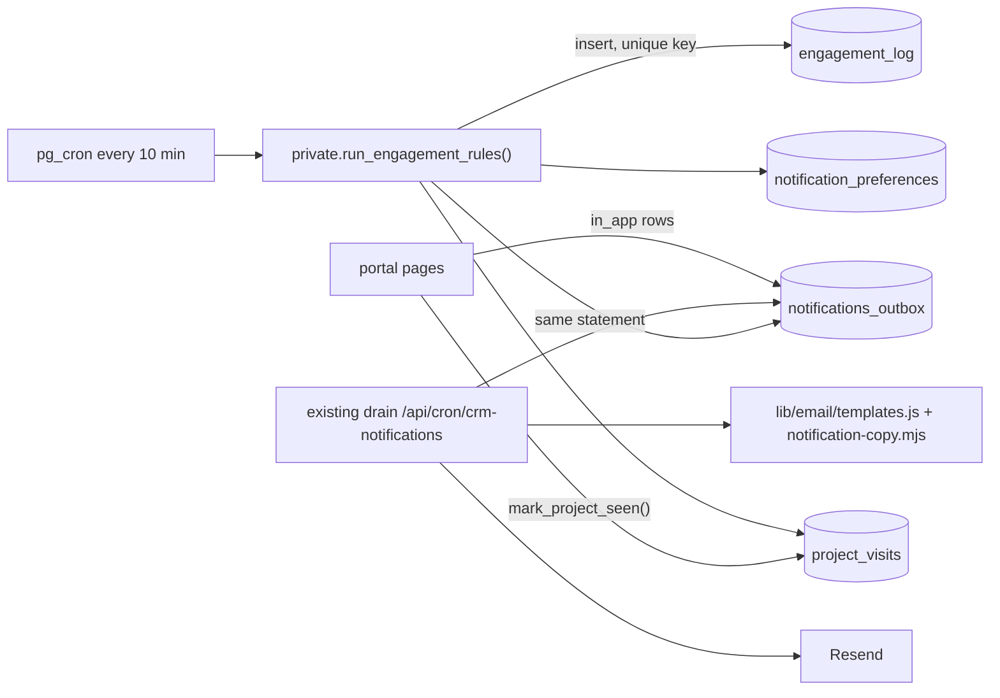

# CRM engagement engine: design

**Date:** 2026-09-29
**Status:** Design approved section by section by the owner. Awaiting review of this written spec.
**Next step:** an implementation plan (writing-plans), then separate versioned PRs.

## 1. Purpose

Give clients a reason to come back to the portal without anyone on the team
having to remember to chase them. The software does the engaging, by rules and
schedules. People step in only for calls and for the project's message thread.

Success means:

1. **Clients follow progress themselves.** They open the portal instead of
   emailing "any update?".
2. **Clients respond faster.** Reviews, answers and files arrive sooner, so
   projects finish sooner.
3. **Delivery turns into reviews and referrals.** Happy clients leave a
   Trustpilot or Google review and refer friends.

And it must never feel like spam: **just the right amount, not too little,
not too much** (owner, 2026-09-29).

### Owner decisions

| Question | Decision |
|---|---|
| Goals | Progress self-service, faster client responses, reviews and referrals |
| Who does the work | The software. Humans only for calls and the thread |
| Intelligence | Rules and schedules only, with pre-written copy. No AI. |
| Email cadence | Weekly digest (only weeks with activity) plus instant emails when the client is needed or at big moments |
| Thread | Client and lead project manager write; admin reads (internal notes allowed) |
| After delivery | Trustpilot review, Google review, referral link |
| Referral reward | "Share us with someone who needs anything digital done and we will animate the life out of your logo so it talks at first sight." One talking logo per client company. |
| Engine architecture | Database rules feeding the existing notification outbox (approach A) |

### Out of scope

- AI-written updates or a portal chat assistant (rejected: rules only).
- SMS, browser push, and native apps.
- Streaks, points and other gamification.
- A shareable launch card (not chosen).
- Approval nudges ("your approval is waiting"). Clients cannot approve in the
  portal today: only staff can mark approvals. This rule is added when
  client approvals ship (portal plan phase C3, PR #259).

## 2. Relationship to work in flight

- **Phase 1, lead project manager assignment (PR #266, v1.91).** It adds
  the one-lead-manager rule, the
  "assign a project manager" admin email, the stale-assignment guard in the
  drain, and `lib/crm/notification-copy.mjs`. That module holds the playful
  voice: rotating manager-intro lines ("AJ will reach out shortly; if it takes
  a little while, AJ is probably wrapping up with another client, or sneaking
  in a well-earned nap"). **All engine copy lives in that module and follows
  its rules:**
  - names only, never a project manager's email address;
  - no pronouns for people, so every line fits Ethan, Alex or AJ;
  - warm, not flippant, and the joke never replaces the information;
  - nothing playful on bad news (on hold, cancelled, changes requested).
- **PR #262 (shared dark, flat portal frame).** New portal screens use its
  `app/styles/crm.css` tokens and primitives.
- **PR #259 (portal workings plan).** The "You're up" card, the notification
  bell and the progress journey deliver parts of its phases C3 and C4.
  Migration numbers are taken at build time, after checking open PRs:
  - #259 reserves 0046 and 0047;
  - #233 carries a second, colliding 0044 that needs renumbering.

## 3. Architecture

- **One rules function, scheduled.** `private.run_engagement_rules(p_now
  timestamptz default now(), p_dry_run boolean default false)` runs every 10
  minutes from pg_cron.
  - Each rule is one `insert ... select` that finds matching recipients.
  - It returns one row per rule: queued, deferred, dropped.
- **Idempotency by ledger.**
  - `engagement_log` holds one row per (rule, project, recipient, period).
    The period is the ISO week for the digest, the triggering message id for
    "you were asked something", and `once` for one-time moments.
  - A unique constraint (`nulls not distinct`) makes a second row impossible.
  - The ledger insert and the outbox insert happen in one statement: a CTE
    inserts into the ledger `on conflict do nothing returning`, and only
    returned rows are queued.
  - Re-runs, cron overlaps and retries cannot double-send.
- **Delivery is unchanged.** The existing drain claims outbox rows, renders
  them, retries, leases, and skips managers no longer on the project. Rules
  decide only who gets what and when.
- **Digest content is decided in SQL, written at send time.**
  - The rule queues a digest only if the project had qualifying activity in
    the last 7 days.
  - The drain builds the digest body from the actual events at send time.
  - Qualifying activity: a status change, a shared message, a shared file or
    deliverable, or a completed client-visible task.
- **Kill switches.** An `engagement_settings` table holds one row for the
  engine and one per rule. Everything **ships off**.
  - `p_dry_run => true` records `dry_run` ledger rows and queues nothing.
    Those rows are cleared before go-live.
  - The owner reads the dry-run list, then enables rules one at a time.
- **Isolation.** Each rule runs in its own `begin ... exception` block. A
  failing rule is logged and skipped; the others still run.

## 4. Rules

Every rule writes an **in-app** notification. Whether it also **emails**
depends on the noise budget (section 5).

Quiet hours: automated emails send Monday to Friday, 9:00 to 18:00
America/New_York. "Brief received" is exempt, because it answers the
client's own action. "Working hours" below means the same window.

### To the client

| Key | Trigger | Cap | Sample copy |
|---|---|---|---|
| `brief_received` | A brief is submitted | once per brief | "Got it! Your Website brief is safely with us. Next: we pick your project manager, usually within one business day." |
| `start_first_project` | Onboarded client, no brief 24h after onboarding | 2 (24h, 5 days) | "Your project space is ready and a little lonely. Pick a service; the brief takes about 10 minutes." |
| `finish_brief` | Draft brief untouched 48h | 1 per draft | "Your Website brief is 60% done. The last few questions are the fun ones." |
| `review_waiting` | Status `client_review` for 2 days, no client message since | 2 (2 and 5 days) | "Something is ready for you to look at. Your eyes are the only thing between this project and the next step." |
| `question_waiting` | The latest shared message in the thread is from staff, is 48h old, and has no client reply | 1 per staff message | "AJ asked you something 2 days ago: '…can you send the logo files?' AJ is patiently refreshing the inbox." |
| `weekly_digest` | Friday 16:00 ET, qualifying activity that week | 1 per ISO week | "Your week on Website — Acme: 2 new files, status moved to In progress, 3 tasks done. Next up: homepage draft." |
| `review_ask` | 3 days after `delivered` | 1 | "Loving the new site? 30 seconds on Trustpilot or Google makes our whole week." |
| `review_reminder` | 10 days after `delivered` | 1 | Gentler version of `review_ask`. |
| `referral_invite` | 14 days after `delivered` | 1 | "Know someone who needs anything digital done? Share your link, and we'll animate the life out of your logo so it talks at first sight." |
| `referral_converted` | A referral converts (section 7) | 1 per referral | "Your friend just started a project with us. Your talking logo is officially in production." |

Status emails (planned, in progress, client review, delivered, on hold,
cancelled) and real messages from the project manager keep sending
instantly, as today.

### To the team

| Key | Trigger | To | Sample copy |
|---|---|---|---|
| `manager_needed` | Project at `brief_submitted` with no assignment after 4 working hours, again at 24h | Admin | "Anjolie Rojas has been waiting 4 hours for a project manager. Two clicks fixes that." |
| `client_waiting` | Latest shared message is from the client, unanswered for 1 working day | Lead project manager; admin too after 2 working days | "Jane replied yesterday and is waiting on you. A quick hello keeps the magic going." |
| `referral_reward_due` | A referral converts | Admin, via the new reward project (section 7) | "Referral reward: animate Acme's logo." |

Team rules are not subject to the client noise budget, and staff cannot
switch them off.

## 5. Noise budget

Email is the scarce channel. The portal gets everything.

1. **Ceiling.** At most **1 automated email per client per day** and **3 per
   rolling 7 days**. Automated means every `engagement.*` client email.
   Status emails and project manager messages do not count toward the
   ceiling.
2. **Priority when rules compete:**
   1. `brief_received`
   2. `question_waiting`
   3. `review_waiting`
   4. `finish_brief`
   5. `start_first_project`
   6. `review_ask`, `review_reminder`, `referral_invite`, `referral_converted`
   7. `weekly_digest`
3. **Over budget.** The rule's ledger row is marked `deferred` and it tries
   again on the next run.
   - A one-time ask that cannot find a slot within 3 working days is marked
     `dropped`.
   - A digest that cannot find a slot is dropped for that week.
4. **Smart skips:**
   - No automated email on a day the client already got a project manager
     message email. `brief_received` is exempt, because it answers the
     client's own action.
   - Reminders stop when the client acts: replies, submits the brief, or
     posts in the thread.
   - No digest if the client opened the project in the last 2 days
     (`project_visits`).
   - No digest for projects that are on hold, cancelled or delivered.
5. **Message bursts are merged (drain change).** A `project.message_posted`
   email waits until the thread has been quiet for 3 minutes, or until its
   oldest pending sibling is 15 minutes old. The drain then sends **one**
   email per client per project ("4 new messages from AJ") and marks the
   siblings as sent-merged.
6. **After delivery,** at most 3 emails (`review_ask`, `review_reminder`,
   `referral_invite`), never two within 48 hours.
7. **Client control.** "Fewer emails" switches off the digest and reminders
   (section 8). Project manager messages and status moments always send.

Expected volume for a typical 4-week website project: 2 to 4 emails a week,
about half of them real messages from the project manager, and never more
than one automated email in a day.

## 6. Portal ("why clients open it")

These are built into the client dashboard and the project page's Overview
tab (the portal improvements), in #262's style.

- **"You're up" card.** Shown when the client is needed, with one clear
  action: review waiting, a question from AJ, or finish the brief (with
  percent done). When nothing is needed it shows a calm line from the copy
  module ("Nothing needed from you right now. AJ is on it."). It uses the
  same signals as the rules, from one shared SQL view.
- **"New since your last visit."** A per-project summary of shared events
  since `project_visits.last_seen_at`. The client page calls
  `mark_project_seen(project_id)` on load.
- **Progress journey.** Brief → Planned → In progress → Review → Approved →
  Delivered, with the date each step was reached, a "next up" line, and
  "Your project manager: AJ" (name only).
- **Notification bell.** In-app notifications across all projects:
  - text from `notificationText()` in the copy module;
  - an unread count and "mark all read";
  - each item links to its project.
- **Delivery moment.** A quiet animated checkmark, with a static version when
  reduced motion is on, the final files, and the review and referral
  buttons.
- **Referral panel.** The client's link with a copy button, how many people
  joined, and the reward status.
- **Team side.** A "Clients waiting on you" list on `/team`, from the
  `client_waiting` signal.

## 7. Referral programme

- **Codes.** Each client company gets a code: `referral_codes(company_id pk,
  code unique)`. The link is `app.cdsportswearinc.com/signup?ref=<code>`.
  - It is also accepted on the marketing site and kept in a first-party
    cookie for 30 days.
  - The contact form passes the code into the lead it creates.
- **Tracking.** `referrals(id, code, referrer_company_id,
  referred_profile_id, referred_company_id, referred_deal_id, status,
  created_at, converted_at, voided_at)`. Status runs `signed_up` →
  `project_started` → `rewarded`, or `void`.
- **Conversion.** A referral converts when the referred company's first
  project reaches `planned` (it has a project manager). A signup alone does
  not count.
- **Reward.** One talking logo per referrer company. On the first
  conversion, the engine:
  1. queues `referral_converted` to the referrer;
  2. creates a project in the **referrer's** portal, "Talking logo: our
     thank-you for the referral" (category `logo_creation`, status
     `brief_submitted`). The engine inserts it directly, because
     `create_project` only accepts a client caller. How `created_by` and the
     project thread are set is settled in the implementation plan, against
     the live column constraints.
  
  The normal flow then takes over: `manager_needed` alerts the admin, a
  manager is assigned, and the animation is delivered as a deliverable. Later
  conversions get a thank-you email and no second reward.
- **Abuse limits:**
  - no self-referral (same company, or the same email domain for
    non-freemail domains);
  - a code works only for brand-new accounts;
  - each referred company counts once;
  - the admin can void a referral.

## 8. Thread rule and email preferences

- **Thread.** `post_project_message` (and shared attachment reservation) is
  redefined:
  - A **shared** message is accepted only from the client company's members
    or from staff assigned to the project.
  - An admin who is not assigned may post **internal** messages only. That is
    how the admin steps in: "AJ, can you chase the logo files?"
  - The admin page's composer becomes "Internal note to <lead manager>".
  - Routing does not change: client messages already notify only the
    assigned staff.
- **Preferences.** `notification_preferences(user_id pk, weekly_digest bool
  default true, reminders bool default true, updated_at)`.
  - **Settings → Email preferences** has two switches, plus a line saying
    that project manager messages and project moments always send.
- **One-click "fewer emails".** Every automated email carries:
  - a signed link to `/api/email-preferences?token=…` (HMAC with a server
    secret, no login needed) that turns both switches off and shows a
    confirmation page with **Undo**;
  - `List-Unsubscribe` and `List-Unsubscribe-Post: List-Unsubscribe=One-Click`
    headers (RFC 8058). Gmail and Yahoo expect them, and the domain's DMARC
    policy is `p=reject`, so its reputation matters.

## 9. Data model summary

New tables:

- `engagement_settings`
- `engagement_log`
- `notification_preferences`
- `project_visits`
- `referral_codes`
- `referrals`

New functions:

- `private.run_engagement_rules`
- `public.mark_project_seen`
- `public.set_email_preferences`
- a shared "client needs to act" view or function used by both the rules and
  the "You're up" card

Changed:

- `post_project_message` and shared attachment reservation (the thread rule)
- `pg_cron`: a new `run-engagement-rules` job every 10 minutes

New outbox event types:

- client emails: `engagement.brief_received`,
  `engagement.start_first_project`, `engagement.finish_brief`,
  `engagement.review_waiting`, `engagement.question_waiting`,
  `engagement.weekly_digest`, `engagement.review_ask`,
  `engagement.review_reminder`, `engagement.referral_invite`,
  `engagement.referral_converted`
- team emails: `engagement.manager_needed`, `engagement.client_waiting`

Each gets a template in `lib/email/templates.js` and copy in
`notification-copy.mjs`. The outbox `event_type` has no enum, so no
constraint change is needed.

Conventions:

- `private` schema helpers with a pinned `search_path`;
- execute revoked from `public` and `anon`;
- never schema-qualify `coalesce` or `nullif`;
- a `tests/crm/migration-00NN-*` contract plus a pgTAP file for every
  migration.

## 10. Safety and testing

- **Database tests** (pgTAP, run locally with PGlite):
  - each rule fires once per period;
  - the budget holds (1 a day, 3 a week) and deferral and dropping work;
  - quiet hours;
  - reminders stop after the client acts;
  - dry run queues nothing;
  - the kill switches work;
  - the thread rejects shared posts from unassigned admins and accepts
    internal ones;
  - the referral abuse limits hold, and a conversion creates exactly one
    reward project.
- **Template tests.** Every `engagement.*` email renders with no
  `undefined` or `null`, shows names only, has no jokes on bad-news
  statuses, and includes the unsubscribe link and headers where required.
- **Component tests.** The "You're up" card, the journey, the bell, the
  settings switches and the referral panel.
- **Browser check.** Every new screen at 1280px and 375px, keyboard focus
  visible, and reduced motion respected.
- **Monitoring.**
  - Rule failures go to Sentry.
  - The drain's JSON counts include merged and deferred.
  - `engagement_log` is the audit trail of every automated send.

## 11. Rollout

1. Phase 1, lead project manager assignment (PR #266, v1.91).
2. #262, the shared portal frame (owner merges).
3. **Engine, thread rule and email preferences.** One migration plus drain,
   template, settings and unsubscribe code. It ships switched off. Run the
   dry run, the owner reviews it, then enable rules one at a time, starting
   with `brief_received` and `manager_needed`.
4. **Portal "come back" screens,** with the dashboard improvements.
5. **Referral programme.** Its own migration.

Each step is a normal versioned PR (`vX.NN`), and each migration is applied
by the owner.

## 12. Owner actions

- Apply each migration in Supabase after its PR merges.
- Provide the Google Business Profile review link. The Trustpilot link is
  `https://trstp.lt/_Kyci6Z0BC` (PR #263).
- Add `EMAIL_PREFS_SECRET` in Vercel (Production and Preview) to sign
  "fewer emails" links.
- Review the dry-run list and enable the rules.

## 13. Open details (defaults chosen, owner may change)

- Digest time: Friday 16:00 ET.
- Quiet hours: Monday to Friday, 9:00 to 18:00 ET.
- The "manager needed" first alert comes after 4 working hours.
- Self-referral check: freemail domains (gmail.com, outlook.com and similar)
  are not treated as a shared company domain.

## 14. Follow-on: contextual offers (brainstorm in progress, not yet designed)

The owner wants the CRM to double as a subtle marketing tool (2026-09-29).
This is its own sub-project with its own design and spec. It is recorded
here so the decisions made so far are not lost.

- **Principle.** An offer appears only when the client has just told us they
  need the thing. That keeps it helpful rather than salesy. Offers never
  block the form, can always be dismissed, and never appear next to bad
  news.
- **First offer: domains.** On the Website brief's *Domain (if you have one)*
  question, a client without a domain sees: register a domain for one year
  and get the second year free.
- **Decided: live search, team registers.**
  1. The client types a name and sees at once whether it is available.
  2. "Claim" adds a domain add-on to their project.
  3. The team registers the domain for two years, billed with the project.
  
  There are no payments in the portal. This needs a domain-lookup API key
  (for example Vercel Domains or a registrar), which is an owner action.
- **Candidate offers triggered by other brief answers** (not yet decided):
  - "We need a logo" → a website + logo bundle.
  - "We need a photoshoot" → a photography add-on.
  - "We need hosting" → a managed hosting and care plan.
  - "Ongoing maintenance: No" → a care-plan offer at delivery.
- **Still to decide:**
  - how the offer appears (an inline card beside the question, or a pop-up
    with a 3D element that respects reduced motion);
  - the full offer catalogue and who edits it;
  - frequency caps, which should share the noise budget in section 5;
  - claim tracking and reporting.
